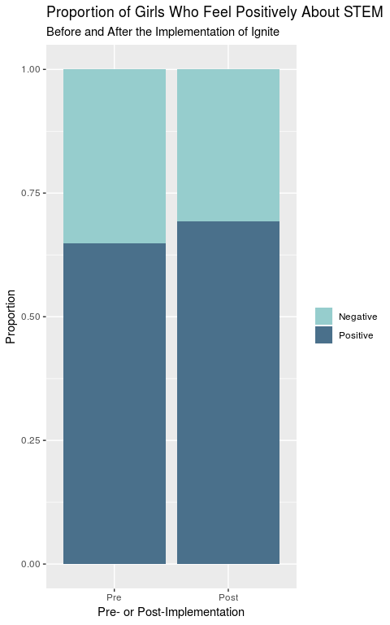
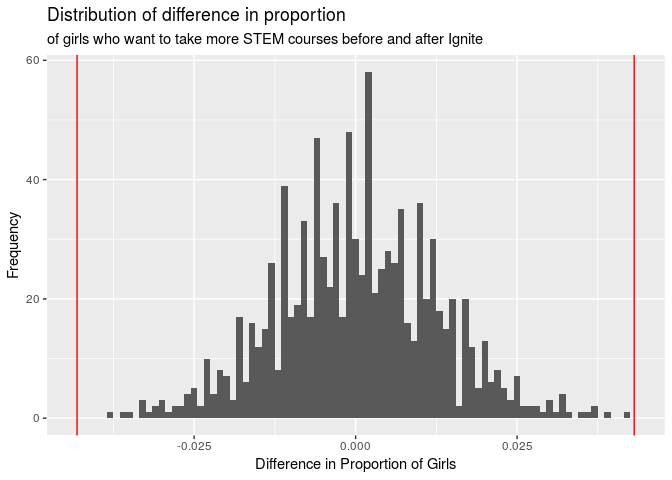
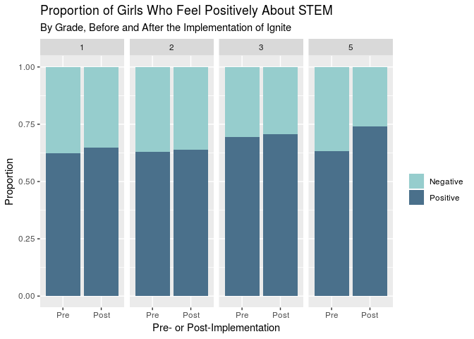
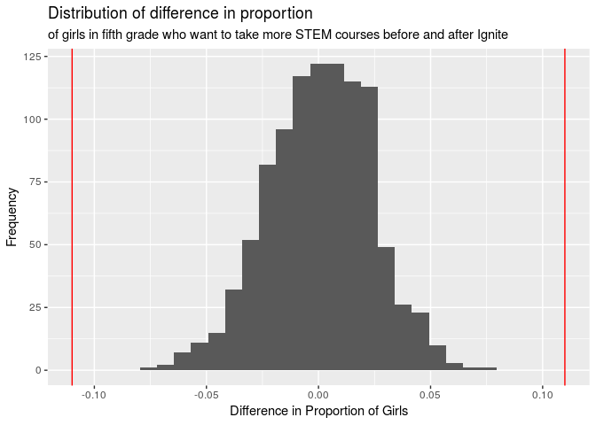
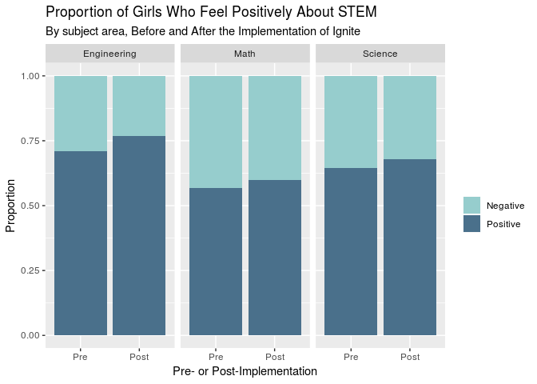

Simulations
================

# Load packages

``` r
library(tidyverse)
library(ggplot2)
library(shiny)
library(infer)
```

# Load data

``` r
pre_empower <- read.csv("data/PRE_Empowerment.csv",
                    sep = ";")
post_empower <- read.csv("data/POST_Empowerment.csv",
                    sep = ";")
pre_2019 <- read.csv("data/PRE2019.csv",
                    sep = ";")
post_2019 <- read.csv("data/POST2019.csv",
                    sep = ";")
```

## Include columns that indicate whether responses are from pre- or post-implementation surveys, and what year they were collected

``` r
pre_empower <- pre_empower %>%
  mutate(pre_or_post = "Pre") %>%
  mutate(year = "2018")
post_empower <- post_empower %>%
  mutate(pre_or_post = "Post") %>%
  mutate(year = "2018")
pre_2019 <- pre_2019 %>%
  mutate(pre_or_post = "Pre") %>%
  mutate(year = "2019")
post_2019 <- post_2019 %>%
  mutate(pre_or_post = "Post") %>%
  mutate(year = "2019")
```

## Count how many students took the pre- and post-implementation surveys in 2018 and 2019

``` r
count(pre_empower)
```

    ## # A tibble: 1 x 1
    ##       n
    ##   <int>
    ## 1    79

``` r
count(post_empower)
```

    ## # A tibble: 1 x 1
    ##       n
    ##   <int>
    ## 1    64

``` r
count(pre_2019)
```

    ## # A tibble: 1 x 1
    ##       n
    ##   <int>
    ## 1    39

``` r
count(post_2019)
```

    ## # A tibble: 1 x 1
    ##       n
    ##   <int>
    ## 1    39

## Join pre- and post-implementation data into one dataset. Then join data from 2018 and 2019 into one dataset

``` r
empower_2018 <- full_join(pre_empower, post_empower) %>%
  select(-c(other_plan_afterschool))
```

    ## Joining, by = c("grade", "city_birth", "parents_stem", "which_parent_stem", "parent_profession", "number_science_classes", "number_math_classes", "number_tech_classes", "number_egr_classes", "math_worst", "math_career", "not_enjoy_math", "good_at_math", "decentschool_badmath", "higherlevel_math", "good_math_grades", "interesting_math", "future_math", "math_courses", "sure_science", "science_career", "science_outsideofschool", "science_pay", "science_job", "good_science", "decentschool_badscience", "higherlevel_science", "science_courses", "new_products", "engineering_everyday", "enjoy_building", "interested_machines", "career_design", "curiosity_tech", "future_innovation", "mathscience_useful", "success_engineering", "i_can_build", "opportunity_engineering", "prediction_literature", "prediction_math", "prediction_science", "future_math_classes", "future_science_classes", "future_egr_classes", "college", "what_major", "why_not_college", "plan_after_school", "other_plan_afterschool", "frequency_learning_stem", "why_no_chances", "opportunities_women_stem", "reason_opportunities_stem", "contribute_community", "resolve_problems_community", "external_help", "leader_community", "contribute_community.1", "pre_or_post", "year")

    ## Warning: Column `parent_profession` joining factors with different levels,
    ## coercing to character vector

    ## Warning: Column `math_courses` joining factors with different levels,
    ## coercing to character vector

    ## Warning: Column `science_job` joining factors with different levels,
    ## coercing to character vector

    ## Warning: Column `good_science` joining factors with different levels,
    ## coercing to character vector

    ## Warning: Column `new_products` joining factors with different levels,
    ## coercing to character vector

    ## Warning: Column `engineering_everyday` joining factors with different
    ## levels, coercing to character vector

    ## Warning: Column `enjoy_building` joining factors with different levels,
    ## coercing to character vector

    ## Warning: Column `curiosity_tech` joining factors with different levels,
    ## coercing to character vector

    ## Warning: Column `future_innovation` joining factors with different levels,
    ## coercing to character vector

    ## Warning: Column `mathscience_useful` joining factors with different levels,
    ## coercing to character vector

    ## Warning: Column `prediction_math` joining factors with different levels,
    ## coercing to character vector

    ## Warning: Column `college` joining factors with different levels, coercing
    ## to character vector

    ## Warning: Column `what_major` joining factors with different levels,
    ## coercing to character vector

    ## Warning: Column `why_not_college` joining factors with different levels,
    ## coercing to character vector

    ## Warning: Column `plan_after_school` joining factors with different levels,
    ## coercing to character vector

    ## Warning: Column `other_plan_afterschool` joining factors with different
    ## levels, coercing to character vector

    ## Warning: Column `why_no_chances` joining factors with different levels,
    ## coercing to character vector

    ## Warning: Column `opportunities_women_stem` joining factors with different
    ## levels, coercing to character vector

    ## Warning: Column `reason_opportunities_stem` joining factors with different
    ## levels, coercing to character vector

    ## Warning: Column `resolve_problems_community` joining factors with different
    ## levels, coercing to character vector

    ## Warning: Column `leader_community` joining factors with different levels,
    ## coercing to character vector

``` r
empower_2019 <- full_join(pre_2019, post_2019) %>%
  select(-c(other_plan_afterschool))
```

    ## Joining, by = c("grade", "city_birth", "parents_stem", "which_parent_stem", "parent_profession", "number_science_classes", "number_math_classes", "number_tech_classes", "number_egr_classes", "math_worst", "math_career", "not_enjoy_math", "good_at_math", "decentschool_badmath", "higherlevel_math", "good_math_grades", "interesting_math", "future_math", "math_courses", "sure_science", "science_career", "science_outsideofschool", "science_pay", "science_job", "good_science", "decentschool_badscience", "higherlevel_science", "science_courses", "new_products", "engineering_everyday", "enjoy_building", "interested_machines", "career_design", "curiosity_tech", "future_innovation", "mathscience_useful", "success_engineering", "i_can_build", "opportunity_engineering", "prediction_literature", "prediction_math", "prediction_science", "future_math_classes", "future_science_classes", "future_egr_classes", "college", "what_major", "why_not_college", "plan_after_school", "other_plan_afterschool", "frequency_learning_stem", "why_no_chances", "opportunities_women_stem", "reason_opportunities_stem", "contribute_community", "resolve_problems_community", "external_help", "leader_community", "contribute_community.1", "pre_or_post", "year")

``` r
empower_2019$grade <- as.factor(empower_2019$grade)
empower <- full_join(empower_2018, empower_2019)
```

    ## Joining, by = c("grade", "city_birth", "parents_stem", "which_parent_stem", "parent_profession", "number_science_classes", "number_math_classes", "number_tech_classes", "number_egr_classes", "math_worst", "math_career", "not_enjoy_math", "good_at_math", "decentschool_badmath", "higherlevel_math", "good_math_grades", "interesting_math", "future_math", "math_courses", "sure_science", "science_career", "science_outsideofschool", "science_pay", "science_job", "good_science", "decentschool_badscience", "higherlevel_science", "science_courses", "new_products", "engineering_everyday", "enjoy_building", "interested_machines", "career_design", "curiosity_tech", "future_innovation", "mathscience_useful", "success_engineering", "i_can_build", "opportunity_engineering", "prediction_literature", "prediction_math", "prediction_science", "future_math_classes", "future_science_classes", "future_egr_classes", "college", "what_major", "why_not_college", "plan_after_school", "frequency_learning_stem", "why_no_chances", "opportunities_women_stem", "reason_opportunities_stem", "contribute_community", "resolve_problems_community", "external_help", "leader_community", "contribute_community.1", "pre_or_post", "year")

    ## Warning: Column `grade` joining factors with different levels, coercing to
    ## character vector

    ## Warning: Column `city_birth` joining factors with different levels,
    ## coercing to character vector

    ## Warning: Column `which_parent_stem` joining factors with different levels,
    ## coercing to character vector

    ## Warning: Column `parent_profession` joining character vector and factor,
    ## coercing into character vector

    ## Warning: Column `math_courses` joining character vector and factor,
    ## coercing into character vector

    ## Warning: Column `science_job` joining character vector and factor, coercing
    ## into character vector

    ## Warning: Column `good_science` joining character vector and factor,
    ## coercing into character vector

    ## Warning: Column `new_products` joining character vector and factor,
    ## coercing into character vector

    ## Warning: Column `engineering_everyday` joining character vector and factor,
    ## coercing into character vector

    ## Warning: Column `enjoy_building` joining character vector and factor,
    ## coercing into character vector

    ## Warning: Column `curiosity_tech` joining character vector and factor,
    ## coercing into character vector

    ## Warning: Column `future_innovation` joining character vector and factor,
    ## coercing into character vector

    ## Warning: Column `mathscience_useful` joining character vector and factor,
    ## coercing into character vector

    ## Warning: Column `prediction_literature` joining factors with different
    ## levels, coercing to character vector

    ## Warning: Column `prediction_math` joining character vector and factor,
    ## coercing into character vector

    ## Warning: Column `future_math_classes` joining factors with different
    ## levels, coercing to character vector

    ## Warning: Column `future_science_classes` joining factors with different
    ## levels, coercing to character vector

    ## Warning: Column `future_egr_classes` joining factors with different levels,
    ## coercing to character vector

    ## Warning: Column `college` joining character vector and factor, coercing
    ## into character vector

    ## Warning: Column `what_major` joining character vector and factor, coercing
    ## into character vector

    ## Warning: Column `why_not_college` joining character vector and factor,
    ## coercing into character vector

    ## Warning: Column `plan_after_school` joining character vector and factor,
    ## coercing into character vector

    ## Warning: Column `why_no_chances` joining character vector and factor,
    ## coercing into character vector

    ## Warning: Column `opportunities_women_stem` joining character vector and
    ## factor, coercing into character vector

    ## Warning: Column `reason_opportunities_stem` joining character vector and
    ## factor, coercing into character vector

    ## Warning: Column `resolve_problems_community` joining character vector and
    ## factor, coercing into character vector

    ## Warning: Column `leader_community` joining character vector and factor,
    ## coercing into character vector

## Rename to positive vs. negative feelings from A, B, C, D, E (as they were on the survey) to “negative” or “positive”

``` r
change_names <- function(naming){
naming %>%
  str_replace("A", "negative") %>%
  str_replace("B", "negative") %>%
  str_replace("C", "negative") %>%
  str_replace("D", "positive") %>%
  str_replace("E", "positive")
}

empower$math_worst <- change_names(empower$math_worst)
empower$math_career <- change_names(empower$math_career)
empower$not_enjoy_math <- change_names(empower$not_enjoy_math)
empower$good_at_math <- change_names(empower$good_at_math)
empower$decentschool_badmath <- change_names(empower$decentschool_badmath)
empower$higherlevel_math <- change_names(empower$higherlevel_math)
empower$good_math_grades <- change_names(empower$good_math_grades)
empower$interesting_math <- change_names(empower$interesting_math)
empower$future_math <- change_names(empower$future_math)
empower$math_courses <- change_names(empower$math_courses)
empower$sure_science <- change_names(empower$sure_science)
empower$science_career <- change_names(empower$science_career)
empower$science_outsideofschool <- change_names(empower$science_outsideofschool)
empower$science_pay <- change_names(empower$science_pay)
empower$science_job <- change_names(empower$science_job)
empower$good_science <- change_names(empower$good_science)
empower$decentschool_badscience <- change_names(empower$decentschool_badscience)
empower$higherlevel_science <- change_names(empower$higherlevel_science)
empower$science_courses <- change_names(empower$science_courses)
empower$new_products <- change_names(empower$new_products)
empower$engineering_everyday <- change_names(empower$engineering_everyday)
empower$enjoy_building <- change_names(empower$enjoy_building)
empower$interested_machines <- change_names(empower$interested_machines)
empower$career_design <- change_names(empower$career_design)
empower$curiosity_tech <- change_names(empower$curiosity_tech)
empower$future_innovation <- change_names(empower$future_innovation)
empower$mathscience_useful <- change_names(empower$mathscience_useful)
empower$success_engineering <- change_names(empower$success_engineering)
empower$i_can_build <- change_names(empower$i_can_build)
empower$opportunity_engineering <- change_names(empower$opportunity_engineering)
```

## Create different datasets for each question that will be analyzed. Each dataset should have the variables: “pre\_or\_post”, “all” (the response - whether students feel positively or negatively towards the question), “grade” (the respondent’s grade level), and “class” (which classifies which course the question refers to - EGR, math, or science)

### EGR

``` r
new_products <- empower %>%
  select(pre_or_post, new_products, grade) %>%
  mutate(class = "Engineering")
names(new_products) <- c("pre_or_post", "all", "grade", "class")

engineering_everyday <- empower %>%
  select(pre_or_post, engineering_everyday, grade) %>%
  mutate(class = "Engineering")
names(engineering_everyday) <- c("pre_or_post", "all", "grade", "class")

enjoy_building <- empower %>%
  select(pre_or_post, enjoy_building, grade) %>%
  mutate(class = "Engineering")
names(enjoy_building) <- c("pre_or_post", "all", "grade", "class")

interested_machines <- empower %>%
  select(pre_or_post, interested_machines, grade) %>%
  mutate(class = "Engineering")
names(interested_machines) <- c("pre_or_post", "all", "grade", "class")

career_design <- empower %>%
  select(pre_or_post, career_design, grade) %>%
  mutate(class = "Engineering")
names(career_design) <- c("pre_or_post", "all", "grade", "class")

curiosity_tech <- empower %>%
  select(pre_or_post, curiosity_tech, grade) %>%
  mutate(class = "Engineering")
names(curiosity_tech) <- c("pre_or_post", "all", "grade", "class")

future_innovation <- empower %>%
  select(pre_or_post, future_innovation, grade) %>%
  mutate(class = "Engineering")
names(future_innovation) <- c("pre_or_post", "all", "grade", "class")

mathscience_useful <- empower %>%
  select(pre_or_post, mathscience_useful, grade) %>%
  mutate(class = "Engineering")
names(mathscience_useful) <- c("pre_or_post", "all", "grade", "class")

success_engineering <- empower %>%
  select(pre_or_post, success_engineering, grade) %>%
  mutate(class = "Engineering")
names(success_engineering) <- c("pre_or_post", "all", "grade", "class")

i_can_build <- empower %>%
  select(pre_or_post, i_can_build, grade) %>%
  mutate(class = "Engineering")
names(i_can_build) <- c("pre_or_post", "all", "grade", "class")

opportunity_engineering <- empower %>%
  select(pre_or_post, opportunity_engineering, grade) %>%
  mutate(class = "Engineering")
names(opportunity_engineering) <- c("pre_or_post", "all", "grade", "class")
```

### Science

``` r
sure_science <- empower %>%
  select(pre_or_post, sure_science, grade) %>%
  mutate(class = "Science")
names(sure_science) <- c("pre_or_post", "all", "grade", "class")

science_career <- empower %>%
  select(pre_or_post, science_career, grade) %>%
  mutate(class = "Science")
names(science_career) <- c("pre_or_post", "all", "grade", "class")

science_outsideofschool <- empower %>%
  select(pre_or_post, science_outsideofschool, grade) %>%
  mutate(class = "Science")
names(science_outsideofschool) <- c("pre_or_post", "all", "grade", "class")

science_pay <- empower %>%
  select(pre_or_post, science_pay, grade) %>%
  mutate(class = "Science")
names(science_pay) <- c("pre_or_post", "all", "grade", "class")

science_job <- empower %>%
  select(pre_or_post, science_job, grade) %>%
  mutate(class = "Science")
names(science_job) <- c("pre_or_post", "all", "grade", "class")

good_science <- empower %>%
  select(pre_or_post, good_science, grade) %>%
  mutate(class = "Science")
names(good_science) <- c("pre_or_post", "all", "grade", "class")

higherlevel_science <- empower %>%
  select(pre_or_post, higherlevel_science, grade) %>%
  mutate(class = "Science")
names(higherlevel_science) <- c("pre_or_post", "all", "grade", "class")

science_courses <- empower %>%
  select(pre_or_post, science_courses, grade) %>%
  mutate(class = "Science")
names(science_courses) <- c("pre_or_post", "all", "grade", "class")
```

### Math

``` r
math_career <- empower %>%
  select(pre_or_post, math_career, grade) %>%
  mutate(class = "Math")
names(math_career) <- c("pre_or_post", "all", "grade", "class")

good_at_math <- empower %>%
  select(pre_or_post, good_at_math, grade) %>%
  mutate(class = "Math")
names(good_at_math) <- c("pre_or_post", "all", "grade", "class")

higherlevel_math <- empower %>%
  select(pre_or_post, higherlevel_math, grade) %>%
  mutate(class = "Math")
names(higherlevel_math) <- c("pre_or_post", "all", "grade", "class")

good_math_grades <- empower %>%
  select(pre_or_post, good_math_grades, grade) %>%
  mutate(class = "Math")
names(good_math_grades) <- c("pre_or_post", "all", "grade", "class")

interesting_math <- empower %>%
  select(pre_or_post, interesting_math, grade) %>%
  mutate(class = "Math")
names(interesting_math) <- c("pre_or_post", "all", "grade", "class")

future_math <- empower %>%
  select(pre_or_post, future_math, grade) %>%
  mutate(class = "Math")
names(future_math) <- c("pre_or_post", "all", "grade", "class")

math_courses <- empower %>%
  select(pre_or_post, math_courses, grade) %>%
  mutate(class = "Math")
names(math_courses) <- c("pre_or_post", "all", "grade", "class")
```

## Binding all the variables to one data set, in order to conduct simulations

``` r
all <- rbind(new_products,
             engineering_everyday,
             enjoy_building,
             interested_machines,
             career_design,
             curiosity_tech,
             future_innovation,
             mathscience_useful,
             success_engineering,
             i_can_build,
             opportunity_engineering, 
             sure_science,
             science_career, 
             science_outsideofschool,
             science_pay,
             science_job,
             good_science,
             higherlevel_science,
             science_courses,
             math_career,
             good_at_math,
             higherlevel_math,
             good_math_grades,
             interesting_math,
             future_math,
             math_courses)
```

## Renaming the responses in preparation for the simulation.

``` r
all$all <- all$all %>%
  str_replace("negative", "Negative") %>%
  str_replace("positive", "Positive")
all <- all %>%
  filter(!is.na(all))
all$grade <- all$grade %>%
  str_replace("5 bach", "5") %>%
  str_replace("5 mag", "5")
```

# Proportion of Girls Who Feel Positively about STEM

In the following section, the sample statistic will be visualized and
the permute and bootstrap simulations will be conducted, pertinent to
the proportion of girls who feel positively about STEM.

## Visualizing sample statistic

``` r
all$pre_or_post <- factor(all$pre_or_post, levels = c("Pre", "Post"))
all$all <- factor(all$all, levels = c("Negative", "Positive"))

ggplot(data = all, mapping = aes(x = pre_or_post, fill = all)) +
  geom_bar(position = "fill") +
  labs(title = "Proportion of Girls Who Feel Positively About STEM", subtitle = "Before and After the Implementation of Ignite", x = "Pre- or Post-Implementation", y = "Proportion", fill = " ") +
  scale_fill_manual(values=c("paleturquoise3", "skyblue4"))
```

<!-- -->

## Calculating sample statistic

``` r
sampling <- all %>%
  group_by(pre_or_post) %>%
  count(all) %>%
  mutate(prop = (n / sum(n))) %>%
  ungroup(pre_or_post) %>%
  group_by(all) %>%
  mutate(diff(prop)) %>%
  filter(pre_or_post == "Pre") %>%
  filter(all == "Positive") %>%
  select(-pre_or_post, -all, -n, -prop) %>%
  pull()
```

    ## Adding missing grouping variables: `all`

``` r
sampling
```

    ## [1] 0.04312676

## Permute simulation

``` r
set.seed(2019)
permute_all <- all %>%
  specify(response = all, explanatory = pre_or_post, success = "Positive") %>%
  hypothesize(null = "independence") %>%
  generate(reps = 1000, type = "permute") %>%
  calculate(stat = "diff in props", order = c("Post", "Pre"))
```

## Permute visualization

``` r
ggplot(data = permute_all, 
       mapping = aes(x = stat)) +
  geom_histogram(binwidth = 0.001) +
  labs(title = "Distribution of difference in proportion", subtitle = "of girls who want to take more STEM courses before and after Ignite", x = "Difference in Proportion of Girls", y = "Frequency") +
    geom_vline(xintercept = 0.04312676, color = "red") +
  geom_vline(xintercept = -0.04312676, color = "red")
```

<!-- -->

## P-value

``` r
permute_all %>%
  filter(stat >= 0.04312676) %>%
  summarise(p_value = (n()/1000))
```

    ## # A tibble: 1 x 1
    ##   p_value
    ##     <dbl>
    ## 1       0

``` r
permute_all %>%
  filter(stat <= -sampling) %>%
  summarise(p_value = (n()/1000))
```

    ## # A tibble: 1 x 1
    ##   p_value
    ##     <dbl>
    ## 1       0

## Bootstrap simulation

``` r
set.seed(2019)
boot_all <- all %>%
  specify(response = all, explanatory = pre_or_post, success = "Positive") %>%
  generate(1000, type = "bootstrap") %>%
  calculate(stat = "diff in props", 
            order = c("Post", "Pre"))
```

## 95% Bootstrap

``` r
boot_all %>%
  summarize(lower_bound = quantile(stat, 0.025),
            upper_bound = quantile(stat, 0.975))
```

    ## # A tibble: 1 x 2
    ##   lower_bound upper_bound
    ##         <dbl>       <dbl>
    ## 1      0.0181      0.0679

# Proportion of Girls Who Feel Positively about STEM BY GRADE

In the following section, the sample statistic will be visualized and
the permute and bootstrap simulations will be conducted, pertinent to
the proportion of girls who feel positively about STEM, by grade.

## Visualizing sample statistic

``` r
all$pre_or_post <- factor(all$pre_or_post, levels = c("Pre", "Post"))
all$all <- factor(all$all, levels = c("Negative", "Positive"))
all <- all %>%
  filter(!is.na(grade))

ggplot(data = all, mapping = aes(x = pre_or_post, fill = all)) +
  geom_bar(position = "fill") +
  facet_grid(~ grade) +
  labs(title = "Proportion of Girls Who Feel Positively About STEM", subtitle = "By Grade, Before and After the Implementation of Ignite", x = "Pre- or Post-Implementation", y = "Proportion", fill = " ") +
  scale_fill_manual(values=c("paleturquoise3", "skyblue4"))
```

<!-- -->

## Sample statistic - grade 1

``` r
sample_grade1 <- all %>%
  filter(grade == "1") %>%
  group_by(pre_or_post) %>%
  count(all) %>%
  mutate(prop = (n / sum(n))) %>%
  ungroup(pre_or_post) %>%
  group_by(all) %>%
  mutate(diff(prop)) %>%
  filter(pre_or_post == "Pre") %>%
  filter(all == "Positive") %>%
  select(-pre_or_post, -all, -n, -prop) %>%
  pull()
```

    ## Adding missing grouping variables: `all`

``` r
sample_grade1
```

    ## [1] 0.02422213

## Sample statistic - grade 2

``` r
sample_grade2 <- all %>%
  filter(grade == "2") %>%
  group_by(pre_or_post) %>%
  count(all) %>%
  mutate(prop = (n / sum(n))) %>%
  ungroup(pre_or_post) %>%
  group_by(all) %>%
  mutate(diff(prop)) %>%
  filter(pre_or_post == "Pre") %>%
  filter(all == "Positive") %>%
  select(-pre_or_post, -all, -n, -prop) %>%
  pull()
```

    ## Adding missing grouping variables: `all`

``` r
sample_grade2
```

    ## [1] 0.0119468

## Sample statistic - grade 3

``` r
sample_grade3 <- all %>%
  filter(grade == "3") %>%
  group_by(pre_or_post) %>%
  count(all) %>%
  mutate(prop = (n / sum(n))) %>%
  ungroup(pre_or_post) %>%
  group_by(all) %>%
  mutate(diff(prop)) %>%
  filter(pre_or_post == "Pre") %>%
  filter(all == "Positive") %>%
  select(-pre_or_post, -all, -n, -prop) %>%
  pull()
```

    ## Adding missing grouping variables: `all`

``` r
sample_grade3
```

    ## [1] 0.0136393

## Sample statistic - grade 5

``` r
sample_grade5 <- all %>%
  filter(grade == "5") %>%
  group_by(pre_or_post) %>%
  count(all) %>%
  mutate(prop = (n / sum(n))) %>%
  ungroup(pre_or_post) %>%
  group_by(all) %>%
  mutate(diff(prop)) %>%
  filter(pre_or_post == "Pre") %>%
  filter(all == "Positive") %>%
  select(-pre_or_post, -all, -n, -prop) %>%
  pull()
```

    ## Adding missing grouping variables: `all`

``` r
sample_grade5
```

    ## [1] 0.109921

## Permute simulations

### 1st grade permute

``` r
set.seed(2019)
permute_first <- all %>%
  filter(grade == "1") %>%
  specify(response = all, explanatory = pre_or_post, success = "Positive") %>%
  hypothesize(null = "independence") %>%
  generate(reps = 1000, type = "permute") %>%
  calculate(stat = "diff in props", order = c("Post", "Pre"))
```

``` r
permute_first %>%
  filter(stat >= sample_grade1) %>%
  summarise((p_value = n()/1000) * 2)
```

    ## # A tibble: 1 x 1
    ##   `(p_value = n()/1000) * 2`
    ##                        <dbl>
    ## 1                      0.454

### 2nd grade permute

``` r
set.seed(2019)
permute_second <- all %>%
  filter(grade == "2") %>%
  specify(response = all, explanatory = pre_or_post, success = "Positive") %>%
  hypothesize(null = "independence") %>%
  generate(reps = 1000, type = "permute") %>%
  calculate(stat = "diff in props", order = c("Post", "Pre"))
```

``` r
permute_second %>%
  filter(stat >= sample_grade2) %>%
  summarise((p_value = n()/1000) * 2)
```

    ## # A tibble: 1 x 1
    ##   `(p_value = n()/1000) * 2`
    ##                        <dbl>
    ## 1                      0.722

### 3rd grade permute

``` r
set.seed(2019)
permute_third <- all %>%
  filter(grade == "3") %>%
  specify(response = all, explanatory = pre_or_post, success = "Positive") %>%
  hypothesize(null = "independence") %>%
  generate(reps = 1000, type = "permute") %>%
  calculate(stat = "diff in props", order = c("Post", "Pre"))
```

``` r
permute_third %>%
  filter(stat >= sample_grade3) %>%
  summarise((p_value = n()/1000) * 2)
```

    ## # A tibble: 1 x 1
    ##   `(p_value = n()/1000) * 2`
    ##                        <dbl>
    ## 1                      0.558

### 5th grade permute

``` r
set.seed(2019)
permute_fifth <- all %>%
  filter(grade == "5") %>%
  specify(response = all, explanatory = pre_or_post, success = "Positive") %>%
  hypothesize(null = "independence") %>%
  generate(reps = 1000, type = "permute") %>%
  calculate(stat = "diff in props", order = c("Post", "Pre"))
```

``` r
ggplot(data = permute_fifth, 
       mapping = aes(x = stat)) +
  geom_histogram() +
  labs(title = "Distribution of difference in proportion", subtitle = "of girls in fifth grade who want to take more STEM courses before and after Ignite", x = "Difference in Proportion of Girls", y = "Frequency") +
  geom_vline(xintercept = sample_grade5, color = "red") +
  geom_vline(xintercept = -sample_grade5, color = "red")
```

    ## `stat_bin()` using `bins = 30`. Pick better value with `binwidth`.

<!-- -->

``` r
permute_fifth %>%
  filter(stat >= sample_grade5) %>%
  summarise((p_value = n()/1000) * 2)
```

    ## # A tibble: 1 x 1
    ##   `(p_value = n()/1000) * 2`
    ##                        <dbl>
    ## 1                          0

### Because 5th grade demonstrated a significant difference in attitudes towards STEM, a bootstrap simulation was conducted.

``` r
set.seed(2019)
boot_fifth <- all %>%
  filter(grade == "5") %>%
  specify(response = all, explanatory = pre_or_post, success = "Positive") %>%
  generate(1000, type = "bootstrap") %>%
  calculate(stat = "diff in props", 
            order = c("Post", "Pre"))
```

### 95% bootstrap

``` r
boot_fifth %>%
  summarize(lower_bound = quantile(stat, 0.025),
            upper_bound = quantile(stat, 0.975))
```

    ## # A tibble: 1 x 2
    ##   lower_bound upper_bound
    ##         <dbl>       <dbl>
    ## 1      0.0650       0.155

# Proportion of Girls Who Feel Positively about STEM BY SUBJECT MATTER

In the following section, the sample statistic will be visualized and
the permute and bootstrap simulations will be conducted, pertinent to
the proportion of girls who feel positively about STEM, by subject
matter.

## Visualizing sample statistic

``` r
all$pre_or_post <- factor(all$pre_or_post, levels = c("Pre", "Post"))
all$all <- factor(all$all, levels = c("Negative", "Positive"))
all <- all %>%
  filter(!is.na(grade))

ggplot(data = all, mapping = aes(x = pre_or_post, fill = all)) +
  geom_bar(position = "fill") +
  facet_grid(~ class) +
  labs(title = "Proportion of Girls Who Feel Positively About STEM", subtitle = "By subject area, Before and After the Implementation of Ignite", x = "Pre- or Post-Implementation", y = "Proportion", fill = " ") +
  scale_fill_manual(values=c("paleturquoise3", "skyblue4"))
```

<!-- -->

## Sample statistic EGR

``` r
sample_egr <- all %>%
  filter(class == "Engineering") %>%
  group_by(pre_or_post) %>%
  count(all) %>%
  mutate(prop = (n / sum(n))) %>%
  ungroup(pre_or_post) %>%
  group_by(all) %>%
  mutate(diff(prop)) %>%
  filter(pre_or_post == "Pre") %>%
  filter(all == "Positive") %>%
  select(-pre_or_post, -all, -n, -prop) %>%
  pull()
```

    ## Adding missing grouping variables: `all`

``` r
sample_egr
```

    ## [1] 0.05860625

## Sample statistic math

``` r
sample_math <- all %>%
  filter(class == "Math") %>%
  group_by(pre_or_post) %>%
  count(all) %>%
  mutate(prop = (n / sum(n))) %>%
  ungroup(pre_or_post) %>%
  group_by(all) %>%
  mutate(diff(prop)) %>%
  filter(pre_or_post == "Pre") %>%
  filter(all == "Positive") %>%
  select(-pre_or_post, -all, -n, -prop) %>%
  pull()
```

    ## Adding missing grouping variables: `all`

``` r
sample_math
```

    ## [1] 0.0308642

## Sample statistic science

``` r
sample_science <- all %>%
  filter(class == "Science") %>%
  group_by(pre_or_post) %>%
  count(all) %>%
  mutate(prop = (n / sum(n))) %>%
  ungroup(pre_or_post) %>%
  group_by(all) %>%
  mutate(diff(prop)) %>%
  filter(pre_or_post == "Pre") %>%
  filter(all == "Positive") %>%
  select(-pre_or_post, -all, -n, -prop) %>%
  pull()
```

    ## Adding missing grouping variables: `all`

``` r
sample_science
```

    ## [1] 0.03245806

## Permute simulations

### Math Permute

``` r
set.seed(2019)
permute_math <- all %>%
  filter(class == "Math") %>%
  specify(response = all, explanatory = pre_or_post, success = "Positive") %>%
  hypothesize(null = "independence") %>%
  generate(reps = 1000, type = "permute") %>%
  calculate(stat = "diff in props", order = c("Post", "Pre"))
```

``` r
permute_math %>%
  filter(stat >= sample_math) %>%
  summarise((p_value = n()/1000) * 2)
```

    ## # A tibble: 1 x 1
    ##   `(p_value = n()/1000) * 2`
    ##                        <dbl>
    ## 1                       0.24

### Science permute

``` r
set.seed(2019)
permute_science <- all %>%
  filter(class == "Science") %>%
  specify(response = all, explanatory = pre_or_post, success = "Positive") %>%
  hypothesize(null = "independence") %>%
  generate(reps = 1000, type = "permute") %>%
  calculate(stat = "diff in props", order = c("Post", "Pre"))
```

``` r
permute_science %>%
  filter(stat >= sample_science) %>%
  summarise((p_value = n()/1000) * 2)
```

    ## # A tibble: 1 x 1
    ##   `(p_value = n()/1000) * 2`
    ##                        <dbl>
    ## 1                       0.16

### EGR permute

``` r
set.seed(2019)
permute_egr <- all %>%
  filter(class == "Engineering") %>%
  specify(response = all, explanatory = pre_or_post, success = "Positive") %>%
  hypothesize(null = "independence") %>%
  generate(reps = 1000, type = "permute") %>%
  calculate(stat = "diff in props", order = c("Post", "Pre"))
```

``` r
permute_egr %>%
  filter(stat >= sample_egr) %>%
  summarise((p_value = n()/1000) * 2)
```

    ## # A tibble: 1 x 1
    ##   `(p_value = n()/1000) * 2`
    ##                        <dbl>
    ## 1                          0

## Bootstrap EGR

``` r
set.seed(2019)
boot_egr <- all %>%
  filter(class == "Engineering") %>%
  specify(response = all, explanatory = pre_or_post, success = "Positive") %>%
  generate(1000, type = "bootstrap") %>%
  calculate(stat = "diff in props", 
            order = c("Post", "Pre"))
```

``` r
boot_egr %>%
  summarize(lower_bound = quantile(stat, 0.025),
            upper_bound = quantile(stat, 0.975))
```

    ## # A tibble: 1 x 2
    ##   lower_bound upper_bound
    ##         <dbl>       <dbl>
    ## 1      0.0225      0.0908
