### Load packages

``` r
library(tidyverse)
library(broom)
library(infer)
library(ggplot2)
```

### Background Information

This survey was conducted on 143 girls in an all-girl boarding school in
Guatemala before and after a pair of Duke students conducted
STEM-focused courses. Grade 1 would be equivalent to 7th grade in the
American school system. We taught girls in grades 1, 2, and 3 the same
curriculum, and girls in grades 5 magisterio (mag) and 5 bachillerato
(bach) another curriculum. In 2017, the girls in 5 magisterio and 5
bachillerato took the curriculum that grades 1, 2, and 3 took in 2018.
The girls in 5 magisterio are on a program specifically to become school
teachers. The girls in 5 bachillerato usually pursue careers other than
teaching.

### Purpose

The purpose of the course is to give girls the chance to explore
STEM-related courses and help them realize that they are capable of
pursuing STEM-related careers, if they want to.

Thus, the purpose of the survey is to evaluate the girls’ attitudes
towards STEM and STEM-related careers before and after the course.

### A note for Professor Tackett

I feel like a have a lot of interesting data and visualizations, but I
am unsure about what direction to take the statistical research in order
to come to important conclusions about the curriculum.

I am thinking that some of the important takeaways could be observations
about how the program’s effect differs: - Between older and younger
girls (middle vs. high school) - Between different grade levels (more
specific than just saying younger vs. older) - Between girls who are on
the teaching-specific program (5 magisterio) vs. those who might have
time to decide on their career path (5 bach and grades 1-3) - Between
girls who took the course last year and those who did not

However, I am stuck on how to decide which of these paths to pursue.

Furthermore, the lab through which I am doing this investigation failed
to send me the Post-Implementation survey for 2017, so I only have the
Pre-Implementation survey for 2017. The survey in 2017 was much shorter.
However, we might be able to draw some comparisons between 2017 and
2018, once I get all the 2017 data.

Also, how do I factor in things that were not directly addressed in the
survey? For example, at lunch we talked about how the girls might have
felt inclined to answer the post-implementation survey more positively
because they liked their teachers, not necessarily because they liked
the subject.

### Load data

``` r
pre_empower <- read.csv("data/PRE_Empowerment.csv",
                    sep = ";")
post_empower <- read.csv("data/POST_Empowerment.csv",
                    sep = ";")
```

### Classifying and joining pre and post responses

``` r
pre_empower <- pre_empower %>%
  mutate(pre_or_post = "pre")
post_empower <- post_empower %>%
  mutate(pre_or_post = "post")
```

``` r
empower <- full_join(pre_empower, post_empower)
```

    ## Joining, by = c("grade", "city_birth", "parents_stem", "which_parent_stem", "parent_profession", "number_science_classes", "number_math_classes", "number_tech_classes", "number_egr_classes", "math_worst", "math_career", "not_enjoy_math", "good_at_math", "decentschool_badmath", "higherlevel_math", "good_math_grades", "interesting_math", "future_math", "math_courses", "sure_science", "science_career", "science_outsideofschool", "science_pay", "science_job", "good_science", "decentschool_badscience", "higherlevel_science", "science_courses", "new_products", "engineering_everyday", "enjoy_building", "interested_machines", "career_design", "curiosity_tech", "future_innovation", "mathscience_useful", "success_engineering", "i_can_build", "opportunity_engineering", "prediction_literature", "prediction_math", "prediction_science", "future_math_classes", "future_science_classes", "future_egr_classes", "college", "what_major", "why_not_college", "plan_after_school", "other_plan_afterschool", "frequency_learning_stem", "why_no_chances", "opportunities_women_stem", "reason_opportunities_stem", "contribute_community", "resolve_problems_community", "external_help", "leader_community", "contribute_community.1", "pre_or_post")

    ## Warning: Column `parent_profession` joining factors with different levels,
    ## coercing to character vector

    ## Warning: Column `math_courses` joining factors with different levels,
    ## coercing to character vector

    ## Warning: Column `science_job` joining factors with different levels,
    ## coercing to character vector

    ## Warning: Column `good_science` joining factors with different levels,
    ## coercing to character vector

    ## Warning: Column `new_products` joining factors with different levels,
    ## coercing to character vector

    ## Warning: Column `engineering_everyday` joining factors with different
    ## levels, coercing to character vector

    ## Warning: Column `enjoy_building` joining factors with different levels,
    ## coercing to character vector

    ## Warning: Column `curiosity_tech` joining factors with different levels,
    ## coercing to character vector

    ## Warning: Column `future_innovation` joining factors with different levels,
    ## coercing to character vector

    ## Warning: Column `mathscience_useful` joining factors with different levels,
    ## coercing to character vector

    ## Warning: Column `prediction_math` joining factors with different levels,
    ## coercing to character vector

    ## Warning: Column `college` joining factors with different levels, coercing
    ## to character vector

    ## Warning: Column `what_major` joining factors with different levels,
    ## coercing to character vector

    ## Warning: Column `why_not_college` joining factors with different levels,
    ## coercing to character vector

    ## Warning: Column `plan_after_school` joining factors with different levels,
    ## coercing to character vector

    ## Warning: Column `other_plan_afterschool` joining factors with different
    ## levels, coercing to character vector

    ## Warning: Column `why_no_chances` joining factors with different levels,
    ## coercing to character vector

    ## Warning: Column `opportunities_women_stem` joining factors with different
    ## levels, coercing to character vector

    ## Warning: Column `reason_opportunities_stem` joining factors with different
    ## levels, coercing to character vector

    ## Warning: Column `resolve_problems_community` joining factors with different
    ## levels, coercing to character vector

    ## Warning: Column `leader_community` joining factors with different levels,
    ## coercing to character vector

``` r
empower
```

    ##      grade city_birth parents_stem which_parent_stem
    ## 1        1       <NA>           no              <NA>
    ## 2        1      rural           no              <NA>
    ## 3        1     urbano           no              <NA>
    ## 4        1     urbano           si             padre
    ## 5        1  suburbano           si             madre
    ## 6        1       <NA>           no              <NA>
    ## 7        1       <NA>           no              <NA>
    ## 8        1  suburbano           si             madre
    ## 9        1      rural           si             madre
    ## 10       1      rural           si             madre
    ## 11       1      rural           no              <NA>
    ## 12       1  suburbano           si             madre
    ## 13       1     urbano           si             padre
    ## 14       1  suburbano           si             padre
    ## 15       2      rural           no              <NA>
    ## 16       2  suburbano           si              <NA>
    ## 17       2  suburbano           no              <NA>
    ## 18       2     urbano           no              <NA>
    ## 19       2      rural           no              <NA>
    ## 20       2  suburbano           no              <NA>
    ## 21       2     urbano           no              <NA>
    ## 22       2       <NA>           no              <NA>
    ## 23       2      rural           no              <NA>
    ## 24       2      rural           si             padre
    ## 25       2     urbano           no              <NA>
    ## 26       3       <NA>           no              <NA>
    ## 27       3     urbano           no              <NA>
    ## 28       3      rural           si             madre
    ## 29       3      rural           no              <NA>
    ## 30       3      rural           no              <NA>
    ## 31       3     urbano           no              <NA>
    ## 32       3     urbano           no              <NA>
    ## 33       3      rural           no              <NA>
    ## 34       3     urbano           si     madre y padre
    ## 35       3      rural           si             madre
    ## 36       3     urbano           no              <NA>
    ## 37       3     urbano           no              <NA>
    ## 38       3       <NA>           no              <NA>
    ## 39       3     urbano         <NA>              <NA>
    ## 40       3     urbano           no              <NA>
    ## 41       3     urbano           no              <NA>
    ## 42       3     urbano         <NA>              <NA>
    ## 43       3       <NA>         <NA>             padre
    ## 44       3      rural           no              <NA>
    ## 45   5 mag     urbano           no              <NA>
    ## 46   5 mag      rural           no              <NA>
    ## 47   5 mag     urbano           no              <NA>
    ## 48   5 mag       <NA>         <NA>              <NA>
    ## 49   5 mag     urbano         <NA>              <NA>
    ## 50   5 mag     urbano           no              <NA>
    ## 51   5 mag     urbano           no              <NA>
    ## 52   5 mag      rural           no              <NA>
    ## 53   5 mag      rural           no              <NA>
    ## 54   5 mag     urbano           no              <NA>
    ## 55   5 mag     urbano         <NA>              <NA>
    ## 56   5 mag     urbano           si             padre
    ## 57   5 mag  suburbano           no              <NA>
    ## 58   5 mag      rural         <NA>              <NA>
    ## 59   5 mag     urbano           si             padre
    ## 60   5 mag      rural           si             padre
    ## 61   5 mag      rural           si             padre
    ## 62  5 bach     urbano           no              <NA>
    ## 63  5 bach      rural           no              <NA>
    ## 64  5 bach      rural           no              <NA>
    ## 65  5 bach     urbano           no              <NA>
    ## 66  5 bach      rural           no              <NA>
    ## 67  5 bach      rural           no              <NA>
    ## 68  5 bach      rural           no              <NA>
    ## 69  5 bach      rural           no              <NA>
    ## 70  5 bach      rural           no              <NA>
    ## 71  5 bach      rural           no              <NA>
    ## 72  5 bach      rural           no              <NA>
    ## 73  5 bach     urbano           no              <NA>
    ## 74  5 bach      rural           si             padre
    ## 75  5 bach      rural           no     madre y padre
    ## 76  5 bach     urbano           no             madre
    ## 77  5 bach     urbano           no              <NA>
    ## 78  5 bach     urbano           si             padre
    ## 79  5 bach     urbano           si             padre
    ## 80       1       <NA>           no              <NA>
    ## 81       1     urbano           si             padre
    ## 82       1     urbano           si              <NA>
    ## 83       1      rural           si             madre
    ## 84       1      rural           no              <NA>
    ## 85       1       <NA>           si             madre
    ## 86       1  suburbano           si             padre
    ## 87       1      rural           no              <NA>
    ## 88       1       <NA>           no              <NA>
    ## 89       2     urbano           no              <NA>
    ## 90       2      rural           no              <NA>
    ## 91       2      rural           no              <NA>
    ## 92       2     urbano           no              <NA>
    ## 93       2       <NA>         <NA>              <NA>
    ## 94       2      rural           si             padre
    ## 95       2      rural           si             madre
    ## 96       2     urbano           no              <NA>
    ## 97       2     urbano           no              <NA>
    ## 98       2       <NA>         <NA>             padre
    ## 99       3      rural           no              <NA>
    ## 100      3      rural           si             madre
    ## 101      3     urbano           no     madre y padre
    ## 102      3      rural           no              <NA>
    ## 103      3     urbano           no              <NA>
    ## 104      3  suburbano           no              <NA>
    ## 105      3     urbano           no              <NA>
    ## 106      3  suburbano           no              <NA>
    ## 107      3      rural           si             padre
    ## 108      3      rural           no              <NA>
    ## 109      3  suburbano           si     madre y padre
    ## 110      3      rural           si             padre
    ## 111      3     urbano           no              <NA>
    ## 112      3     urbano           no              <NA>
    ## 113      3      rural           no              <NA>
    ## 114      3      rural           no              <NA>
    ## 115  5 mag     urbano           no              <NA>
    ## 116  5 mag     urbano         <NA>              <NA>
    ## 117  5 mag     urbano           no              <NA>
    ## 118  5 mag      rural         <NA>              <NA>
    ## 119  5 mag      rural         <NA>              <NA>
    ## 120  5 mag     urbano         <NA>              <NA>
    ## 121  5 mag     urbano           si             padre
    ## 122  5 mag     urbano           no              <NA>
    ## 123  5 mag     urbano           si             padre
    ## 124  5 mag     urbano           si             padre
    ## 125  5 mag     urbano           si             padre
    ## 126 5 bach  suburbano           no              <NA>
    ## 127 5 bach       <NA>           no              <NA>
    ## 128 5 bach     urbano           no              <NA>
    ## 129 5 bach      rural           no              <NA>
    ## 130 5 bach       <NA>           si             madre
    ## 131 5 bach     urbano           si             padre
    ## 132 5 bach     urbano         <NA>              <NA>
    ## 133 5 bach      rural           no              <NA>
    ## 134 5 bach      rural         <NA>              <NA>
    ## 135 5 bach     urbano         <NA>              <NA>
    ## 136 5 bach      rural           no              <NA>
    ## 137 5 bach      rural           no              <NA>
    ## 138 5 bach      rural           no              <NA>
    ## 139 5 bach     urbano           si             padre
    ## 140 5 bach      rural           no              <NA>
    ## 141 5 bach      rural           no              <NA>
    ## 142 5 bach     urbano         <NA>              <NA>
    ## 143 5 bach       <NA>           no              <NA>
    ##                                         parent_profession
    ## 1                                                    <NA>
    ## 2                                                    <NA>
    ## 3                                                    <NA>
    ## 4                                               ingeniero
    ## 5                                                 ciencia
    ## 6                                                    <NA>
    ## 7                                                    <NA>
    ## 8                                         perito contador
    ## 9                                               ingeniera
    ## 10  madre administrador de empresas padre electromecanico
    ## 11                            maestro de educacion fisica
    ## 12                                             licenciada
    ## 13                          madre maestra padre ingeniero
    ## 14                                             ingenieria
    ## 15                                                   <NA>
    ## 16                                     ingeniero agronomo
    ## 17                                                   <NA>
    ## 18                                                   <NA>
    ## 19                                                   <NA>
    ## 20                                                   <NA>
    ## 21                                                   <NA>
    ## 22                                                   <NA>
    ## 23                                                   <NA>
    ## 24                                            albanileria
    ## 25                                                   <NA>
    ## 26                                                   <NA>
    ## 27                                                   <NA>
    ## 28                                                maestra
    ## 29                                                   <NA>
    ## 30                                                   <NA>
    ## 31                                                   <NA>
    ## 32                                                   <NA>
    ## 33                                                   <NA>
    ## 34                 madre licensiada padre perito contador
    ## 35                                                maestra
    ## 36                                                   <NA>
    ## 37                                                   <NA>
    ## 38                                                   <NA>
    ## 39                                                   <NA>
    ## 40                                                   <NA>
    ## 41                                                   <NA>
    ## 42                                                   <NA>
    ## 43                                             ingenieria
    ## 44                      mama ama de casa papa comerciante
    ## 45                                 docente nivel primario
    ## 46                                    trabaja como sastre
    ## 47                                  secretaria oficinista
    ## 48                                                   <NA>
    ## 49                                                   <NA>
    ## 50                 docente del nivel medio nivel primario
    ## 51                                                maestro
    ## 52                                                   <NA>
    ## 53                                   sastre y ama de casa
    ## 54                                     ama de casa piloto
    ## 55                                                   <NA>
    ## 56                                               tesorero
    ## 57                       padre es mecanico y electricista
    ## 58                                             agricultor
    ## 59                                        perito contador
    ## 60                                               agronomo
    ## 61                      bachillerato en ciencias y letras
    ## 62                                                   <NA>
    ## 63                                                   <NA>
    ## 64                                                   <NA>
    ## 65                                                   <NA>
    ## 66                                                   <NA>
    ## 67                                                   <NA>
    ## 68                                                   <NA>
    ## 69                                                   <NA>
    ## 70                                                   <NA>
    ## 71                                                   <NA>
    ## 72                               agricultores y artesanos
    ## 73                                           comerciantes
    ## 74                               hermanos son matematicos
    ## 75                                           comerciantes
    ## 76                                                       
    ## 77                                                   <NA>
    ## 78                                               contador
    ## 79                                                   <NA>
    ## 80                                                   <NA>
    ## 81                                             ingenieria
    ## 82                                             ingenieria
    ## 83                                bachiyen en conputacion
    ## 84                                                   <NA>
    ## 85                                             licenciada
    ## 86                                              ingeniero
    ## 87                                                   <NA>
    ## 88                                                   <NA>
    ## 89                                                   <NA>
    ## 90                       ama de casa maestro y agricultor
    ## 91                                                   <NA>
    ## 92                 madre enfermera auxiliar padre maestro
    ## 93                                      madre ama de casa
    ## 94                                         alba<f1>ileria
    ## 95                               maestra tecnica en salud
    ## 96                      mama jefa en ventas papa agronomo
    ## 97                                   abogado y ginecoloca
    ## 98                                     ingeniero agronomo
    ## 99                                                   <NA>
    ## 100                                               maestra
    ## 101                                       perito contador
    ## 102                                                  <NA>
    ## 103                                                  <NA>
    ## 104                                                  <NA>
    ## 105                                                  <NA>
    ## 106                                                  <NA>
    ## 107                                             ingeneria
    ## 108                                                  <NA>
    ## 109        madre trabajadora social padre perito contador
    ## 110                                           comerciante
    ## 111                                                  <NA>
    ## 112                                                  <NA>
    ## 113                                                  <NA>
    ## 114                                                  <NA>
    ## 115                        padre piloto madre ama de casa
    ## 116                                                  <NA>
    ## 117                          papa secretario mama maestra
    ## 118                                                  <NA>
    ## 119                                                  <NA>
    ## 120                           padre maestro madre doctora
    ## 121                                              contador
    ## 122                                                  <NA>
    ## 123                                maestro agronomia etc.
    ## 124                                              tesorero
    ## 125                                              agronomo
    ## 126                                                  <NA>
    ## 127                                                  <NA>
    ## 128                                                  <NA>
    ## 129                                                  <NA>
    ## 130                                                  <NA>
    ## 131                                            agricultor
    ## 132                                                  <NA>
    ## 133                                                  <NA>
    ## 134                                                  <NA>
    ## 135                                                  <NA>
    ## 136                                                  <NA>
    ## 137                                                  <NA>
    ## 138                                                  <NA>
    ## 139                                        administracion
    ## 140                                                  <NA>
    ## 141                                                  <NA>
    ## 142                                                  <NA>
    ## 143                                                  <NA>
    ##     number_science_classes number_math_classes number_tech_classes
    ## 1                       NA                  NA                  NA
    ## 2                        7                   5                   0
    ## 3                        3                   4                   9
    ## 4                        5                   6                   5
    ## 5                        7                  10                   4
    ## 6                       NA                  NA                  NA
    ## 7                       NA                  NA                  NA
    ## 8                        4                   7                   9
    ## 9                       10                  10                  10
    ## 10                       7                   8                   8
    ## 11                       2                   2                   6
    ## 12                       8                  10                  10
    ## 13                       1                   2                   1
    ## 14                       4                   6                   4
    ## 15                       2                   2                   1
    ## 16                       2                   2                   2
    ## 17                       2                   2                   2
    ## 18                       4                   2                   2
    ## 19                       4                   2                   2
    ## 20                       1                   1                   2
    ## 21                       2                   2                   1
    ## 22                       2                   2                   2
    ## 23                       2                   2                   2
    ## 24                       2                   2                   2
    ## 25                       2                   2                   2
    ## 26                       2                   2                   2
    ## 27                       2                   3                   3
    ## 28                       4                   2                   2
    ## 29                       4                   2                   2
    ## 30                       2                   3                   3
    ## 31                      10                  10                  10
    ## 32                      10                  10                  10
    ## 33                       2                   2                   2
    ## 34                       2                   3                   3
    ## 35                       4                   3                   2
    ## 36                       2                   3                   3
    ## 37                       2                   2                   2
    ## 38                       2                   2                   3
    ## 39                       2                   2                   2
    ## 40                       2                   2                   2
    ## 41                       2                   3                   3
    ## 42                       1                   2                   3
    ## 43                       2                   3                   3
    ## 44                       2                   3                   4
    ## 45                      NA                  NA                  NA
    ## 46                      NA                  NA                  NA
    ## 47                      NA                  NA                  NA
    ## 48                      NA                  NA                  NA
    ## 49                       2                   2                   1
    ## 50                      NA                  NA                  NA
    ## 51                      NA                  NA                  NA
    ## 52                      NA                  NA                  NA
    ## 53                       5                   7                   4
    ## 54                      NA                  NA                  NA
    ## 55                       6                   6                   3
    ## 56                       5                   4                   6
    ## 57                       4                  NA                  NA
    ## 58                      NA                  NA                  NA
    ## 59                       8                   9                  10
    ## 60                       7                   8                   9
    ## 61                       8                  10                  10
    ## 62                       9                   7                   2
    ## 63                       5                   4                   2
    ## 64                       7                   8                   9
    ## 65                       9                   6                   2
    ## 66                       9                   7                   2
    ## 67                       3                   3                   3
    ## 68                       9                   6                   2
    ## 69                       9                   5                   7
    ## 70                       9                   7                   2
    ## 71                       9                   7                   2
    ## 72                       9                   7                   2
    ## 73                       9                   7                   2
    ## 74                       5                   7                   4
    ## 75                       9                   7                   2
    ## 76                       9                   5                   2
    ## 77                       2                   7                   2
    ## 78                       2                   7                   2
    ## 79                      NA                   7                   2
    ## 80                       5                   7                   5
    ## 81                       5                   5                   4
    ## 82                       7                   3                   2
    ## 83                       5                   7                   4
    ## 84                      NA                   3                   4
    ## 85                      10                   8                  10
    ## 86                       3                   5                   2
    ## 87                       4                   3                   7
    ## 88                      NA                  NA                  NA
    ## 89                       2                   2                   2
    ## 90                       8                   8                   3
    ## 91                       1                   2                   2
    ## 92                       2                   2                   2
    ## 93                       9                   8                   9
    ## 94                       2                   2                   2
    ## 95                       2                   2                   2
    ## 96                       2                   2                   2
    ## 97                       4                  10                   4
    ## 98                       2                   2                   2
    ## 99                       4                   3                   3
    ## 100                     NA                   2                  NA
    ## 101                      2                   3                   3
    ## 102                      4                   2                   2
    ## 103                     10                  10                  10
    ## 104                     10                  10                  10
    ## 105                      2                   3                   3
    ## 106                      2                   3                   3
    ## 107                      2                   3                   3
    ## 108                      1                   3                   2
    ## 109                      3                   3                   3
    ## 110                      2                   2                   3
    ## 111                      5                   3                   4
    ## 112                      2                   3                   3
    ## 113                      2                   4                   2
    ## 114                      2                   2                   3
    ## 115                      5                   4                   6
    ## 116                      1                   1                   2
    ## 117                      4                   3                   5
    ## 118                      6                  NA                   1
    ## 119                      6                  NA                   1
    ## 120                      6                  NA                   1
    ## 121                      6                  NA                   1
    ## 122                      4                   5                   6
    ## 123                      7                  10                   2
    ## 124                      6                  10                   7
    ## 125                      5                  10                   8
    ## 126                      2                   5                   2
    ## 127                      8                   8                   4
    ## 128                      7                   7                   2
    ## 129                     10                   7                   2
    ## 130                      8                   3                   2
    ## 131                      5                   5                   4
    ## 132                      7                   7                   2
    ## 133                      7                   3                   2
    ## 134                      8                   8                   8
    ## 135                      7                   8                  NA
    ## 136                      7                   5                   2
    ## 137                      5                   5                   2
    ## 138                      5                   5                   2
    ## 139                      2                   5                   2
    ## 140                     10                   5                   2
    ## 141                     NA                   4                   4
    ## 142                     10                   7                   2
    ## 143                      4                   5                   3
    ##     number_egr_classes math_worst math_career not_enjoy_math good_at_math
    ## 1                   NA          E           B              E            B
    ## 2                    0          C           B              B            D
    ## 3                    0          C           D              C            B
    ## 4                    6          A           E              E            E
    ## 5                    0          B        <NA>              D            B
    ## 6                   NA          E           D              E            C
    ## 7                   NA          E           C              E            B
    ## 8                   NA          A           E              D            D
    ## 9                   NA          B           C              D            C
    ## 10                  NA          A           E              A            E
    ## 11                   1          B           B              D            C
    ## 12                   6          C           A              E            C
    ## 13                   0          B           B              E            A
    ## 14                  NA          A           D              E            D
    ## 15                   0          E           A              A            B
    ## 16                   0          D           B              B            C
    ## 17                   0          B           D              C            B
    ## 18                   0          A           B              D            D
    ## 19                   0          B           A              B            B
    ## 20                   0          D           A              D            E
    ## 21                   0          B           A              B            D
    ## 22                   0          D           E              C            E
    ## 23                   0          A           E              A            E
    ## 24                   0          B           E           <NA>            D
    ## 25                   0          E           A              E            B
    ## 26                  NA          C           A              C            D
    ## 27                  NA          A           B              A            C
    ## 28                  NA          C           A              C            B
    ## 29                  NA          A           D              A            D
    ## 30                  NA          B           D              C            C
    ## 31                  NA          B           C              A            B
    ## 32                  NA          A           D              E            E
    ## 33                  NA          B           B              A            B
    ## 34                  NA          A           B              A            D
    ## 35                  NA          C           A              C            D
    ## 36                  NA          B           A              C            D
    ## 37                  NA          B           B              C            D
    ## 38                  NA          A           B              B            A
    ## 39                  NA          A           B              C            B
    ## 40                  NA          A           B              C            D
    ## 41                  NA          B           A              B            B
    ## 42                  NA          A           B              C            C
    ## 43                  NA          A           D              A            B
    ## 44                  NA          A           E              A            A
    ## 45                  NA          C           B              B            C
    ## 46                  NA          A           D              A            E
    ## 47                  NA          C           A              C            B
    ## 48                  NA          C           A              B            B
    ## 49                  NA          E           A           <NA>            A
    ## 50                  NA          C           B              D            C
    ## 51                  NA       <NA>           B              B            B
    ## 52                  NA          C           B              C            B
    ## 53                  NA          B           D              C            B
    ## 54                  NA          D           A              B            B
    ## 55                   1          D           A              D            B
    ## 56                  NA          A           B              A            B
    ## 57                  NA          A           B              B            D
    ## 58                  NA          A           B              A            D
    ## 59                  NA          D           C              C            B
    ## 60                  NA          D           C              D            B
    ## 61                  NA          A           C              B            A
    ## 62                  NA          C        <NA>              B            C
    ## 63                  NA          B           B              D            D
    ## 64                  NA          B           C              C            D
    ## 65                  NA          B           A              C            D
    ## 66                  NA          C           B              C            B
    ## 67                  NA          B           D              D            D
    ## 68                  NA          B           C              B            D
    ## 69                  NA          C           D              D            D
    ## 70                  NA          A           D              A            B
    ## 71                  NA          C           B              C            C
    ## 72                  NA          C           B              C            B
    ## 73                   2          B           C              B            C
    ## 74                  NA          B           D              A            D
    ## 75                  NA          A           D              D            E
    ## 76                  NA          A           D              A            E
    ## 77                  NA          C           C              D            B
    ## 78                  NA          B           D              B            A
    ## 79                  NA          B           A              B            B
    ## 80                   1          B           D           <NA>            B
    ## 81                   1          B           D              D            D
    ## 82                   1          D           B              C            B
    ## 83                  NA          A           D              C            D
    ## 84                  NA          D           C              D            C
    ## 85                   7          E           E              E            A
    ## 86                   1          A           D              E            A
    ## 87                  NA          E           C              A            C
    ## 88                  NA       <NA>           B              D            A
    ## 89                   1          C           D              A         <NA>
    ## 90                  NA          C           A              D            B
    ## 91                   1          E           A              A            A
    ## 92                   1          A           B              D            E
    ## 93                  NA          A           D              D            D
    ## 94                   1          B           A              A            D
    ## 95                   1          C           B              C            C
    ## 96                   1          E           A              A            A
    ## 97                   1          B           A              B            B
    ## 98                   1          E           B              B            B
    ## 99                   1          D           C              C            B
    ## 100                 NA          C           B              B            B
    ## 101                  1          B           B              C            D
    ## 102                  1          A           D              A            D
    ## 103                  8          B           D              B            B
    ## 104                  8          A           D              E            D
    ## 105                  1          B           A              C            D
    ## 106                  1          B           D              C            C
    ## 107                 NA          A           E              A            C
    ## 108                  1          A           D              D            D
    ## 109                  1          A           D              A            D
    ## 110                  1          C           D              C            C
    ## 111                  1          C           E              A            B
    ## 112                  1          A           B              B            B
    ## 113                  1          A           E              A            E
    ## 114                  1          C           A              C            D
    ## 115                  4          D           E              B            B
    ## 116                 NA          D           B              B            A
    ## 117                  3          D           E              D            C
    ## 118                 NA          C           B              C            A
    ## 119                 NA          B           B              B            D
    ## 120                 NA          B           B              B            D
    ## 121                 NA          C           B              C            C
    ## 122                  2          A           A              D            D
    ## 123                  1          D           B              A            B
    ## 124                  2          C           C              B            C
    ## 125                  2          D           B              B            A
    ## 126                 NA          B           D              D            C
    ## 127                 NA          C           B              C            C
    ## 128                  1          B           A              C            C
    ## 129                  1          A           B              B            D
    ## 130                 NA          A           E              A            E
    ## 131                 NA          B           D              A            D
    ## 132                  1          B           A              C            C
    ## 133                  1          A           C              D            D
    ## 134                  1          A           C              C            C
    ## 135                 NA          A           C              C            B
    ## 136                 NA          C           B              C            C
    ## 137                 NA          B           B              D            D
    ## 138                 NA          B           E              D            C
    ## 139                 NA          A           D              D            B
    ## 140                  2          B           D              B            E
    ## 141                 NA          B           C              B            D
    ## 142                  1          B        <NA>              B            D
    ## 143                  1          C           C              D            D
    ##     decentschool_badmath higherlevel_math good_math_grades
    ## 1                      E                C                B
    ## 2                      B                B                D
    ## 3                      E                E                C
    ## 4                      D                D                D
    ## 5                      B                D                B
    ## 6                      E                E                E
    ## 7                      B                C                B
    ## 8                      A                E                D
    ## 9                      B                C                E
    ## 10                     A                E                D
    ## 11                     C                D                C
    ## 12                     E                A                E
    ## 13                     E                E                B
    ## 14                     B                E                D
    ## 15                     D                A                B
    ## 16                     E                E                E
    ## 17                     E                D                A
    ## 18                     B                C                D
    ## 19                     D                C                D
    ## 20                     E                E                D
    ## 21                     C                D                C
    ## 22                     D                B                D
    ## 23                     E                E                A
    ## 24                     D                B                D
    ## 25                     E                E                D
    ## 26                  <NA>                D                D
    ## 27                     D                D                B
    ## 28                     C                D                D
    ## 29                     B                E                D
    ## 30                     D                D                D
    ## 31                     D                D                C
    ## 32                     A                E                E
    ## 33                     E                E                B
    ## 34                     D                E                D
    ## 35                     C                E                D
    ## 36                     C                B                D
    ## 37                     C                C                D
    ## 38                     A                B                D
    ## 39                     E                D                C
    ## 40                     C                C                E
    ## 41                     A                E                D
    ## 42                     D                B                C
    ## 43                     D                E                D
    ## 44                     A                E                E
    ## 45                     C                B                C
    ## 46                     A                D                E
    ## 47                     C                B                C
    ## 48                     D                B                B
    ## 49                     E                A                A
    ## 50                     B                D                D
    ## 51                     D                D                B
    ## 52                     D                C                B
    ## 53                     D                B                A
    ## 54                     D                E                B
    ## 55                     D             <NA>                E
    ## 56                     B                C                B
    ## 57                     B                B                E
    ## 58                     D                D                A
    ## 59                     E                D                C
    ## 60                     D                C                B
    ## 61                     B                E                D
    ## 62                     C                C                D
    ## 63                     B                D                D
    ## 64                     D                D                C
    ## 65                     B                C                D
    ## 66                     D                C                C
    ## 67                     A                E                D
    ## 68                     A                D                E
    ## 69                     D                E                D
    ## 70                     B                D                D
    ## 71                     C                C                C
    ## 72                     D                C                C
    ## 73                     B                A                B
    ## 74                     D                E                D
    ## 75                     B                E                E
    ## 76                     A                E                E
    ## 77                     D                E                B
    ## 78                     D                A                D
    ## 79                     B                C                B
    ## 80                     B                B             <NA>
    ## 81                     B                D                D
    ## 82                     B                B                B
    ## 83                     A                E                D
    ## 84                     C                B                D
    ## 85                     D                D                C
    ## 86                     E                D                E
    ## 87                     E                E                C
    ## 88                     D                E                E
    ## 89                     E                E                B
    ## 90                     E                D                A
    ## 91                     D                D                B
    ## 92                     B                D                D
    ## 93                     A                D                D
    ## 94                     B                C                D
    ## 95                     D                C                B
    ## 96                     B                E                D
    ## 97                     D                E                B
    ## 98                     D                D                D
    ## 99                     D                C                A
    ## 100                    D                D                D
    ## 101                    B                D                D
    ## 102                    A                E                D
    ## 103                    C                D                C
    ## 104                    A                E                E
    ## 105                    D             <NA>                C
    ## 106                    D                D                D
    ## 107                    C                E                C
    ## 108                    E                E                B
    ## 109                    B                D                D
    ## 110                    D                D                C
    ## 111                    B                D                C
    ## 112                    C                B                D
    ## 113                    A                E                E
    ## 114                    C                D                D
    ## 115                    E                E                B
    ## 116                    E                B                B
    ## 117                    D                E                B
    ## 118                    D                A                B
    ## 119                    C                D                C
    ## 120                    B                B                D
    ## 121                    D                D                B
    ## 122                    E                A                D
    ## 123                    D                B                D
    ## 124                    C                D                B
    ## 125                    D                B                D
    ## 126                    B                E                C
    ## 127                    D                C                C
    ## 128                    C                B                C
    ## 129                    B                D                D
    ## 130                    A                E                E
    ## 131                    D                D                D
    ## 132                    C                B                B
    ## 133                    A                D                E
    ## 134                    D                E                C
    ## 135                    D                E                D
    ## 136                    D                C                C
    ## 137                    B                D                D
    ## 138                    C                D                C
    ## 139                    A                E                E
    ## 140                    B                D                E
    ## 141                    B                D                D
    ## 142                    B                D                D
    ## 143                    D                E                D
    ##     interesting_math future_math math_courses sure_science science_career
    ## 1                  D           C            C            D              C
    ## 2                  B           B            E            E              D
    ## 3                  E           C            E            E              D
    ## 4                  E           E            E            D              D
    ## 5                  D           D            D            D              D
    ## 6                  D           D            E            B              C
    ## 7                  C           C            C            D              C
    ## 8                  E           E            D            E              E
    ## 9                  D           D         <NA>            D           <NA>
    ## 10                 E           E            E            D              E
    ## 11                 D           D            E            B              B
    ## 12                 E           E            E            E              E
    ## 13                 D           B            E            E              E
    ## 14                 E           D            E            C              A
    ## 15                 D           E            D            E              D
    ## 16                 E           E            B            E              E
    ## 17                 D           D            E            E              E
    ## 18                 D           E            D            C              B
    ## 19                 E           D            C            C              C
    ## 20                 E           D            D            E              E
    ## 21                 E           C            B            D              D
    ## 22                 E           D            D            E              D
    ## 23                 E           E            E            E              E
    ## 24                 D           E            D            B              D
    ## 25                 E           C            E            E              E
    ## 26                 C           C            D            D              D
    ## 27                 D           D            D            C              D
    ## 28                 D           D            C            C              C
    ## 29                 E           E            E            D              D
    ## 30                 D           E            D            D              D
    ## 31                 E           D            E            B              C
    ## 32                 E           D            E            D              D
    ## 33                 E           E            E            D              E
    ## 34                 E           E            E            E              E
    ## 35                 D           C            E            C              C
    ## 36                 E           D            E            B              B
    ## 37                 D           E            D            D              D
    ## 38                 E           B            B            C              C
    ## 39                 D           D            E            E              C
    ## 40                 D           D            D            D              E
    ## 41                 E           E            D            E              E
    ## 42                 E           E            D            D              E
    ## 43                 D           E            E            D              D
    ## 44                 E           E            E            D              A
    ## 45                 B           C            B            B              A
    ## 46                 D           E            E            A              E
    ## 47                 A           C            C            D              D
    ## 48                 D           B            C            C              C
    ## 49                 D           A            E            A              D
    ## 50                 D           D            D            C              D
    ## 51                 B           D            D            B              D
    ## 52                 C           C            C            C              B
    ## 53                 D           E            C            D              D
    ## 54                 D           D            E            A              A
    ## 55                 E           D            D            E              E
    ## 56                 C           C            C            C              C
    ## 57                 E           D            D            C              D
    ## 58                 D           A            B            D              D
    ## 59                 C           D            D            C              D
    ## 60                 D           A            A            C              B
    ## 61                 E           E            E            D              D
    ## 62                 D           E            D            D              D
    ## 63                 D           D            E            D              D
    ## 64                 E           D            D            C              D
    ## 65                 D           C            B            D              D
    ## 66                 D           E            D            C              C
    ## 67                 D           E            E            D              D
    ## 68                 D           D            E            E              D
    ## 69                 E           E            E            E              E
    ## 70                 C           C            A            A              D
    ## 71                 D           D            D            E              D
    ## 72                 C           D            E            C              C
    ## 73                 A           A            A            A              A
    ## 74                 E           E            D            D              D
    ## 75                 D           E            E            C              C
    ## 76                 D           E            D            E              E
    ## 77                 D           E            E            C              D
    ## 78                 E           D            E            A              B
    ## 79                 D           D            D            D              C
    ## 80                 D           D            D            D              D
    ## 81                 D           D            D            D              D
    ## 82                 E           B            C            C              C
    ## 83                 E           E            E            E              D
    ## 84                 E           D            D            A              A
    ## 85                 A           D            D            E              E
    ## 86                 E           E            D            E              D
    ## 87                 E           C            E            C              C
    ## 88                 D           A            D            B              C
    ## 89                 D           E            E            D              D
    ## 90                 E           E            B            E              E
    ## 91                 D           E            D            D              D
    ## 92                 E           D            D            C              B
    ## 93                 D           E            E            D              D
    ## 94                 D           A            D            D              A
    ## 95                 E           C            C            D              D
    ## 96                 E           E            E            E              E
    ## 97                 D           C            D            B              D
    ## 98                 D           D            D            D              D
    ## 99                 C           C            C            D              C
    ## 100                D           D            C            C              D
    ## 101                D           D            E            D              D
    ## 102                E           E            E            D              D
    ## 103                E           E            D            C              D
    ## 104                E           D            E            D              C
    ## 105                E           E            E            E              D
    ## 106                D           D            D            D              D
    ## 107                E           E            E            D              D
    ## 108                E           E            E            E              E
    ## 109                E           E            D            E              E
    ## 110                C           C            D            D              D
    ## 111                E           E            E            B              E
    ## 112                D           D            B            B              A
    ## 113                E           E            E            D              D
    ## 114                D           D            C            C              D
    ## 115                E           D            E            B              D
    ## 116                D           C            E            B              D
    ## 117                D           D            E            B              C
    ## 118                B           D            C            C              C
    ## 119                D           E            E            C              E
    ## 120                D           D            D            D              D
    ## 121                C           D            D            C              B
    ## 122                E           E            E            D              E
    ## 123                D           D            B            D              C
    ## 124                C           D            C            C              D
    ## 125                D           D            B            D              B
    ## 126                D           E            E            C              B
    ## 127                C           D            D            C              C
    ## 128                E           E            B            D              E
    ## 129                D           D            D            D              D
    ## 130                E           E            E            E              E
    ## 131                D           D            D            B              D
    ## 132                D           E            D            E              D
    ## 133                E           D            D            D              E
    ## 134                E           E            E            E              E
    ## 135                E           C            E            D              D
    ## 136                D           D            D            C              D
    ## 137                D           D            E            D              D
    ## 138                E           E            E            D              E
    ## 139                E           E            E            A              E
    ## 140                D           E            D            D              D
    ## 141                D           D            D            C              C
    ## 142                D           D            D            D              D
    ## 143                E           E            E            D              E
    ##     science_outsideofschool science_pay science_job good_science
    ## 1                         C           C           E            D
    ## 2                         D           C           C            C
    ## 3                         E           E           C            E
    ## 4                         D           D           D            D
    ## 5                         D           D           B            D
    ## 6                         D           D           D            E
    ## 7                         D           C           C         <NA>
    ## 8                         D           E           E            E
    ## 9                         D           B        <NA>            D
    ## 10                        E           E           E            E
    ## 11                        C           D           C            B
    ## 12                        E           E           E            D
    ## 13                        E           D           C            E
    ## 14                        B           C           B            C
    ## 15                        E           C           E            D
    ## 16                        E           E           E            E
    ## 17                        D           D           E            E
    ## 18                        E           C           D            D
    ## 19                        C           D           E            D
    ## 20                        D           A           B            A
    ## 21                        C           C           C            E
    ## 22                        B           C           D            D
    ## 23                        E           E           E            E
    ## 24                        D           D           D            D
    ## 25                        E           B           B            E
    ## 26                        D           C           D            D
    ## 27                        D           D           D            D
    ## 28                        D           D           C            D
    ## 29                        E           E           D            D
    ## 30                        D           D           D            D
    ## 31                        E           D           D            C
    ## 32                        D           D           D         <NA>
    ## 33                        E           E           E            D
    ## 34                        E           D           E            E
    ## 35                        D           D           C            E
    ## 36                        D           C           D            B
    ## 37                        D           D           D            D
    ## 38                        A           C           E            C
    ## 39                        E           E           D            E
    ## 40                        C           D           E            D
    ## 41                        E           E           D            C
    ## 42                        E           E           C            C
    ## 43                        E           C           E            E
    ## 44                        B           B           A            A
    ## 45                        C           C           C            D
    ## 46                        E           E           E            E
    ## 47                        D           C           D            D
    ## 48                        C           C           C            C
    ## 49                        D           E           E            A
    ## 50                        D           D           C            D
    ## 51                        D           D           D            E
    ## 52                        C           C        <NA>            C
    ## 53                        D           C           D            C
    ## 54                        D           E           E            D
    ## 55                        E           E           E            E
    ## 56                        C           C           C            C
    ## 57                        D           E           E            E
    ## 58                        D        <NA>        <NA>         <NA>
    ## 59                        D           E           D            C
    ## 60                        C           D           D            C
    ## 61                        E           E           E            E
    ## 62                        E           E           D            D
    ## 63                        D           E           E            D
    ## 64                        E           D           E            E
    ## 65                        D           E           E            D
    ## 66                        E           C           E            E
    ## 67                        E           D           D            D
    ## 68                        D           E           D            D
    ## 69                        E           E           E            E
    ## 70                        D           D           D            D
    ## 71                        D           D           D            D
    ## 72                        E           D           E            C
    ## 73                        A           A           A            A
    ## 74                        D           D           D            E
    ## 75                        D           E           E            C
    ## 76                        E           E           E            E
    ## 77                        D           E           E            C
    ## 78                        D           E           E            E
    ## 79                        D           E           D            C
    ## 80                        D           D        <NA>            D
    ## 81                        C           D           D            C
    ## 82                        B           D           C            C
    ## 83                        E           E           E            E
    ## 84                        A           C           B            B
    ## 85                        E           E           E            E
    ## 86                        D           D           C            D
    ## 87                        C           E           C            D
    ## 88                        D           D           B            B
    ## 89                        E           E           E            D
    ## 90                        E           E           E            E
    ## 91                        E           E           E            D
    ## 92                        D           C           C            D
    ## 93                        E           D           E            D
    ## 94                        B           B           B            D
    ## 95                        D           D           D            D
    ## 96                        E           B           C            E
    ## 97                        C           C           C            E
    ## 98                        D           D           D            D
    ## 99                        D           D           E            C
    ## 100                       C           C           C            D
    ## 101                       D           D           D            D
    ## 102                       E           E           D            D
    ## 103                       E           C           D            D
    ## 104                       C           D           C            D
    ## 105                       E           E           E            E
    ## 106                       D           D           D            D
    ## 107                       E           E           E            E
    ## 108                       E           E           E            D
    ## 109                       E           E           E            E
    ## 110                    <NA>           D           D            D
    ## 111                       D           D           C            C
    ## 112                       C           C           D            B
    ## 113                       D           D           E            E
    ## 114                       C           C           C            D
    ## 115                       D           E           D            D
    ## 116                       D           D           D            C
    ## 117                       D           D           D            E
    ## 118                       B           C           D            D
    ## 119                       E           C           D            D
    ## 120                       D           D           D            E
    ## 121                       C           D           C            C
    ## 122                       E           E           E            D
    ## 123                       D           D           D            D
    ## 124                       D           D           D            D
    ## 125                       D           D           D            D
    ## 126                       C           E           D            D
    ## 127                       C           C           C            C
    ## 128                       E           C           E            D
    ## 129                       D           D           D            D
    ## 130                       E           E           E            E
    ## 131                       D           D           B            D
    ## 132                       E           E           D            D
    ## 133                       E           E           D         <NA>
    ## 134                       E           E           E            E
    ## 135                       E           E           C            B
    ## 136                       D           D           D            D
    ## 137                       D           E           D            D
    ## 138                       D           A           C            D
    ## 139                       E           E           E            E
    ## 140                       D           D           D            D
    ## 141                       D           D           D            D
    ## 142                       D           D           D            D
    ## 143                       E           E           E            E
    ##     decentschool_badscience higherlevel_science science_courses
    ## 1                         C                   A               C
    ## 2                         C                   C               C
    ## 3                         B                   E               E
    ## 4                         D                   C               D
    ## 5                         B                   D               D
    ## 6                         E                   D               E
    ## 7                         E                   C               E
    ## 8                         A                   D               E
    ## 9                         A                <NA>               D
    ## 10                        D                   A               C
    ## 11                        A                   B               D
    ## 12                        D                   D               D
    ## 13                        D                   C               D
    ## 14                        A                   B               C
    ## 15                        D                   A               D
    ## 16                        E                   D               E
    ## 17                        B                   E               E
    ## 18                        B                   C               D
    ## 19                        A                   E               E
    ## 20                        E                   B               A
    ## 21                        A                   B               C
    ## 22                        C                   D               D
    ## 23                        A                   A               A
    ## 24                        C                   C               D
    ## 25                        A                   E               E
    ## 26                        B                   C               D
    ## 27                        B                   B               D
    ## 28                        A                   D               D
    ## 29                        A                   D               E
    ## 30                        B                   D               D
    ## 31                        B                   C               E
    ## 32                        A                   B               D
    ## 33                        A                   E               E
    ## 34                        B                   E               E
    ## 35                        A                   E               E
    ## 36                        A                   B               C
    ## 37                        B                   D               E
    ## 38                        A                   A               A
    ## 39                        A                   C               E
    ## 40                        B                   C               D
    ## 41                        B                   E               E
    ## 42                        E                   E            <NA>
    ## 43                        C                   D               E
    ## 44                        E                   B               B
    ## 45                        C                   C               C
    ## 46                        A                   E               D
    ## 47                        C                   C               C
    ## 48                        C                   C               C
    ## 49                        E                <NA>               E
    ## 50                        B                   C               D
    ## 51                        D                   D               D
    ## 52                        B                   B               C
    ## 53                        C                   B               D
    ## 54                        D                   D               D
    ## 55                        B                   D               E
    ## 56                        C                   C               C
    ## 57                        D                   E               E
    ## 58                     <NA>                <NA>            <NA>
    ## 59                        C                   D               D
    ## 60                        C                   B               B
    ## 61                        D                   E               E
    ## 62                        B                   D               D
    ## 63                        D                   E               E
    ## 64                        D                   C               D
    ## 65                        B                   C               C
    ## 66                        D                   D               D
    ## 67                        B                   B               D
    ## 68                        A                   D               E
    ## 69                        D                   E               E
    ## 70                        B                   C               C
    ## 71                        C                   D               D
    ## 72                        D                   C               D
    ## 73                        B                   A               A
    ## 74                        A                   A               D
    ## 75                        D                   D               D
    ## 76                        A                   D               D
    ## 77                        C                   C               E
    ## 78                        E                   A               E
    ## 79                        C                   D               E
    ## 80                        B                   D               D
    ## 81                        D                   C               D
    ## 82                        B                   C               D
    ## 83                        C                   E               E
    ## 84                        D                   B               A
    ## 85                        E                   E               E
    ## 86                        D                   B               C
    ## 87                        C                   D               E
    ## 88                        D                   C               A
    ## 89                        B                   E               E
    ## 90                        A                   D               E
    ## 91                        B                   D               D
    ## 92                        B                   C               E
    ## 93                        A                   D               E
    ## 94                        A                   C               B
    ## 95                        A                   E               E
    ## 96                        A                   B               E
    ## 97                        B                   D               D
    ## 98                        D                   D               D
    ## 99                        C                   A               D
    ## 100                       B                   D               C
    ## 101                       B                   C               D
    ## 102                       B                   D               E
    ## 103                       C                   D               D
    ## 104                       B                   B               D
    ## 105                       B                   E               E
    ## 106                       B                   D               D
    ## 107                       C                   E               E
    ## 108                       D                   E               E
    ## 109                       A                   E               E
    ## 110                       B                   D               D
    ## 111                       C                   E               E
    ## 112                       D                   D               D
    ## 113                       A                   D               D
    ## 114                       B                   C               C
    ## 115                       E                   D               E
    ## 116                       D                   D               E
    ## 117                       D                   C               E
    ## 118                       C                   B               C
    ## 119                       C                   D               E
    ## 120                       B                   C               E
    ## 121                       C                   B               B
    ## 122                       D                   A               E
    ## 123                       B                   D               D
    ## 124                       D                   D               D
    ## 125                       C                   D               D
    ## 126                       E                   D               E
    ## 127                       C                   B               D
    ## 128                       B                   D               E
    ## 129                       B                   D               D
    ## 130                       A                   E               E
    ## 131                       D                   B               D
    ## 132                       B                   C               D
    ## 133                       A                   C               C
    ## 134                       D                   C               E
    ## 135                       B                   E               E
    ## 136                       C                   C               D
    ## 137                       B                   E               D
    ## 138                       C                   E               E
    ## 139                       D                   D               D
    ## 140                       B                   C               C
    ## 141                       C                   D               D
    ## 142                       B                   D               D
    ## 143                       E                   E               E
    ##     new_products engineering_everyday enjoy_building interested_machines
    ## 1              C                    E              C                   B
    ## 2              E                    D              D                   C
    ## 3              E                    C              E                   E
    ## 4              D                    D              D                   C
    ## 5              D                    D              D                   D
    ## 6              D                    D              D                   E
    ## 7              C                    D              A                   D
    ## 8              E                    D              D                   B
    ## 9              D                 <NA>              D                   A
    ## 10             A                    E              A                   D
    ## 11             D                    D              D                   D
    ## 12             D                    E              E                   B
    ## 13             E                    E              E                   E
    ## 14             D                    E              C                   D
    ## 15             E                    D              E                   E
    ## 16             E                    E              D                   D
    ## 17             E                    E              D                   E
    ## 18          <NA>                 <NA>           <NA>                <NA>
    ## 19          <NA>                 <NA>           <NA>                <NA>
    ## 20             A                    B              E                   B
    ## 21             E                    E              B                   D
    ## 22             D                    D              D                   E
    ## 23             E                    E              E                   D
    ## 24             D                    C              D                   D
    ## 25             E                    C              E                   E
    ## 26             D                    D              D                   D
    ## 27             D                    E              D                   D
    ## 28             D                    C              D                   D
    ## 29             E                    D              E                   E
    ## 30             D                    D              D                   E
    ## 31             E                    E              E                   E
    ## 32             E                    E              D                   E
    ## 33             E                    E              D                   E
    ## 34             E                    E              E                   E
    ## 35             D                    E              B                   E
    ## 36             E                    E              D                   B
    ## 37             D                    E              D                   E
    ## 38             A                    C              B                   A
    ## 39             E                    E              C                   D
    ## 40             E                    D              E                   E
    ## 41             E                    B              E                   E
    ## 42             E                    E           <NA>                   E
    ## 43             E                    D              D                   E
    ## 44             E                    E              E                   E
    ## 45             E                    D              C                   C
    ## 46             E                    D              E                   E
    ## 47             D                    C              C                   D
    ## 48             C                    C              B                   D
    ## 49             E                    E              E                   E
    ## 50             E                    E              D                   D
    ## 51             D                    C              C                   C
    ## 52             D                    C              B                   D
    ## 53             D                    C              D                   E
    ## 54             D                    D              D                   D
    ## 55             E                    E              E                   E
    ## 56             C                    D              D                   D
    ## 57             E                    C           <NA>                   B
    ## 58          <NA>                 <NA>           <NA>                <NA>
    ## 59             D                    D              C                   E
    ## 60             B                    C              D                   D
    ## 61             E                    D              E                   E
    ## 62             E                    D              D                   D
    ## 63             D                    D              C                   D
    ## 64             E                    D              C                   D
    ## 65             C                    D              B                   D
    ## 66             E                    D              E                   E
    ## 67             D                    D              D                   E
    ## 68             D                    D              E                   D
    ## 69             E                    E              E                   E
    ## 70             D                    D              D                   D
    ## 71             D                    C              B                   D
    ## 72             D                    D              D                   D
    ## 73             A                    A              A                   A
    ## 74             E                    E              D                   D
    ## 75             D                    D              C                   C
    ## 76             D                    E              C                   E
    ## 77             D                    D              C                   D
    ## 78             E                    E              D                   D
    ## 79             E                    D              C                   E
    ## 80             D                    D              D                   D
    ## 81             D                    C              D                   C
    ## 82             D                    D              D                   D
    ## 83             E                    D              E                   E
    ## 84             E                    E              E                   E
    ## 85             E                    E              E                   E
    ## 86             D                    E              E                   E
    ## 87             E                    D              D                   E
    ## 88             C                    E              D                   D
    ## 89             E                    E              D                   E
    ## 90             C                    E              B                   E
    ## 91             B                    C              B                   E
    ## 92             D                    D              D                   D
    ## 93             E                    E              E                   E
    ## 94             E                    D              D                   E
    ## 95             D                    E              E                   E
    ## 96             E                    E              E                   E
    ## 97             E                    E              E                   D
    ## 98             D                    D              C                   D
    ## 99             D                    D              D                   D
    ## 100            D                    D              E                   D
    ## 101            D                    D              D                   D
    ## 102            D                    D              E                   E
    ## 103            E                    E              E                   E
    ## 104            E                    E              E                   E
    ## 105            E                    E              C                   E
    ## 106            D                    D              D                   D
    ## 107            E                    E              E                   E
    ## 108            E                    E              E                   E
    ## 109            E                    E              E                   E
    ## 110            D                    D              D                   D
    ## 111            D                    E              D                   E
    ## 112            D                    E              C                   D
    ## 113            D                    E              D                   D
    ## 114            E                    E              E                   D
    ## 115            D                    E              E                   E
    ## 116            E                    D              D                   D
    ## 117            D                    E              D                   D
    ## 118            D                    C              D                   C
    ## 119            E                    E              E                   E
    ## 120            E                    D              D                   E
    ## 121            D                    D              C                   B
    ## 122            E                    E              D                   A
    ## 123            D                    C              D                   D
    ## 124            D                    D              D                   D
    ## 125            D                    D              D                   D
    ## 126            E                    D              D                   C
    ## 127            D                    D              C                   D
    ## 128            D                    D              B                   C
    ## 129            D                    D              D                   D
    ## 130            E                    E              E                   D
    ## 131            D                    D              D                   D
    ## 132            E                    E              D                   D
    ## 133            E                    E              E                   D
    ## 134            E                    D              D                   E
    ## 135            E                    E              E                   E
    ## 136            C                    D              C                   D
    ## 137            D                    D              D                   D
    ## 138            E                    C              D                   E
    ## 139            E                    E              E                   E
    ## 140            D                    E              D                   D
    ## 141            C                    D              C                   D
    ## 142            D                    D              D                   D
    ## 143            E                    E              E                   E
    ##     career_design curiosity_tech future_innovation mathscience_useful
    ## 1               C              B                 C                  C
    ## 2               C              D                 D                  B
    ## 3               C              E                 D                  E
    ## 4               D              D                 D                  D
    ## 5               D              D                 D                  D
    ## 6               D              E                 D                  E
    ## 7               C              D                 D                  C
    ## 8               C              E                 E                  E
    ## 9               D              E              <NA>                  C
    ## 10              E              B                 E                  E
    ## 11              D              C                 D                  D
    ## 12              D              E                 E                  E
    ## 13              D              C              <NA>                  C
    ## 14              E              D                 D                  E
    ## 15              D              D                 E                  E
    ## 16              D              E                 E                  D
    ## 17              E              E                 D                  E
    ## 18           <NA>           <NA>              <NA>               <NA>
    ## 19           <NA>           <NA>              <NA>               <NA>
    ## 20              B              A                 A                  B
    ## 21              B              E                 E                  D
    ## 22              E              E                 D                  D
    ## 23              E              E                 E                  E
    ## 24              D              D                 D                  C
    ## 25              A              E                 E                  E
    ## 26              C              D                 D                  D
    ## 27              D              D                 D                  E
    ## 28              C              D                 D                  C
    ## 29              E              E                 E                  E
    ## 30              B              E                 D                  E
    ## 31              C              E                 E                  E
    ## 32              D              E                 E                  E
    ## 33              B              E                 E                  E
    ## 34              D              D                 D                  D
    ## 35              D              E                 E                  E
    ## 36              E              B                 E                  C
    ## 37              E              E                 E                  E
    ## 38              C              A                 D                  C
    ## 39              B              C                 E                  E
    ## 40              D              E                 C                  D
    ## 41              D              E                 E                  E
    ## 42              E              D                 D                  C
    ## 43              E              E                 D                  E
    ## 44              D              E                 E                  E
    ## 45              C              C                 D                  C
    ## 46              E              E                 D                  E
    ## 47              A              D                 C                  C
    ## 48              C              D                 C                  C
    ## 49              E              E                 E                  E
    ## 50              E              D                 E                  E
    ## 51              D              D                 D                  C
    ## 52              C              D                 C                  C
    ## 53              E              E                 E                  E
    ## 54              D              D                 D                  D
    ## 55              E              E                 E                  E
    ## 56              C              D                 D                  D
    ## 57              B              E                 E                  B
    ## 58           <NA>           <NA>              <NA>               <NA>
    ## 59              C              E                 E                  D
    ## 60              C              D                 C                  D
    ## 61              D              E                 E                  E
    ## 62              E              E                 E                  E
    ## 63              E              D                 E                  E
    ## 64              D              E                 E                  D
    ## 65              B              D                 C                  C
    ## 66              C              D                 E                  C
    ## 67              D              D                 D                  D
    ## 68              C              D                 D                  E
    ## 69              E              E                 E                  E
    ## 70              D              D                 C                  D
    ## 71              D              C              <NA>                  D
    ## 72              D              D                 E                  D
    ## 73              A              A                 A                  A
    ## 74              E              D                 E                  E
    ## 75              D              D                 D                  D
    ## 76              E              E                 E                  E
    ## 77              B              C                 B                  D
    ## 78              E              A                 E                  E
    ## 79              C              E                 E                  C
    ## 80              D              D              <NA>                  B
    ## 81              D              D              <NA>                  C
    ## 82              D              D                 D                  C
    ## 83              D              E                 E                  E
    ## 84              D              E                 D                  D
    ## 85              E              E                 E                  E
    ## 86              D              D                 D                  E
    ## 87              C              E                 D                  C
    ## 88              D              C                 C                  B
    ## 89              D              E                 D                  D
    ## 90              C              E                 D                  E
    ## 91              E              E                 E                  E
    ## 92              B              E                 C                  D
    ## 93              E              E                 E                  E
    ## 94              E              E                 E                  D
    ## 95              D              E                 C                  D
    ## 96              E              E                 E                  E
    ## 97              C              E                 D                  C
    ## 98              D              D                 D                  D
    ## 99              C           <NA>                 E                  E
    ## 100             C              D                 C                  C
    ## 101             D              D                 D                  D
    ## 102             E              E                 E                  E
    ## 103             C              E                 E                  E
    ## 104             D              E                 D                  E
    ## 105             E              E                 E                  E
    ## 106             B              D                 C                  D
    ## 107             D              E                 D                  E
    ## 108             B              E                 E                  E
    ## 109             E              E                 E                  E
    ## 110             D              D                 D                  D
    ## 111             C              E                 E                  D
    ## 112             C              D                 D                  C
    ## 113             A              D                 D                  E
    ## 114             C              E                 D                  C
    ## 115             B              E                 E                  E
    ## 116             B              E                 E                  E
    ## 117             D              E                 E                  D
    ## 118             C              C                 B                  D
    ## 119             E              E                 E                  D
    ## 120             D              E                 E                  E
    ## 121             C              D                 D                  D
    ## 122             E              E                 E                  D
    ## 123             B              D                 D                  D
    ## 124             D              D                 D                  D
    ## 125             D              D                 D                  D
    ## 126             B              C                 E                  D
    ## 127             D              D                 D                  D
    ## 128             C              D                 D                  C
    ## 129             D              D                 D                  D
    ## 130             E              D                 E                  E
    ## 131             B              D                 B                  D
    ## 132             E              D                 E                  E
    ## 133             E              E                 E                  E
    ## 134             C              E                 E                  D
    ## 135             C              E                 E                  C
    ## 136             C              C                 D                  D
    ## 137             D              D                 E                  E
    ## 138             C              D                 E                  C
    ## 139             E              E                 E                  E
    ## 140             C              D                 D                  E
    ## 141             D              D                 D                  C
    ## 142             D              D                 D                  D
    ## 143             E              E                 E                  E
    ##     success_engineering i_can_build opportunity_engineering
    ## 1                     D           B                       E
    ## 2                     B           D                       C
    ## 3                     C           E                       C
    ## 4                     E           D                       D
    ## 5                     D           D                       D
    ## 6                     D           D                       D
    ## 7                     C           C                       C
    ## 8                     B           C                       B
    ## 9                     D           B                       E
    ## 10                    D           A                       A
    ## 11                    C           D                       A
    ## 12                    E           E                       E
    ## 13                    C           D                       C
    ## 14                    D           C                       A
    ## 15                    D           E                       E
    ## 16                    D           D                       D
    ## 17                    D           C                       E
    ## 18                 <NA>        <NA>                    <NA>
    ## 19                 <NA>        <NA>                    <NA>
    ## 20                    B           E                       C
    ## 21                    E           C                       D
    ## 22                    D           E                       E
    ## 23                    D           D                       E
    ## 24                    C           D                       C
    ## 25                    E           E                       E
    ## 26                    D           C                       D
    ## 27                    D           B                       D
    ## 28                    C           C                       D
    ## 29                    D           D                       E
    ## 30                    D           B                       E
    ## 31                    D           D                       E
    ## 32                    E           D                       E
    ## 33                    B           B                       E
    ## 34                    D           D                       D
    ## 35                    E           C                       E
    ## 36                    C           D                       D
    ## 37                    D           D                       D
    ## 38                    A           B                       C
    ## 39                    C           E                       E
    ## 40                    D           E                       E
    ## 41                    E           D                       E
    ## 42                    D        <NA>                    <NA>
    ## 43                    E           D                       E
    ## 44                    D           D                       E
    ## 45                    B           C                       B
    ## 46                    E           D                       E
    ## 47                    C           C                       C
    ## 48                    C           C                       D
    ## 49                    E           A                       E
    ## 50                    E           D                       D
    ## 51                    C           B                       D
    ## 52                    B           C                       C
    ## 53                    D           C                       E
    ## 54                    D           B                       D
    ## 55                    E           D                       D
    ## 56                    C           C                       D
    ## 57                    C           C                       C
    ## 58                 <NA>        <NA>                    <NA>
    ## 59                    C           C                       E
    ## 60                    B           D                       A
    ## 61                    E           D                       E
    ## 62                    D           D                       D
    ## 63                    E           C                       D
    ## 64                    C           C                       D
    ## 65                    B           B                       A
    ## 66                    D           D                       C
    ## 67                    D           B                       B
    ## 68                    D           E                       E
    ## 69                    E           D                       E
    ## 70                    D           C                       A
    ## 71                    B           B                       D
    ## 72                    C           C                       D
    ## 73                    A           A                       A
    ## 74                    D           D                       E
    ## 75                    C           C                       C
    ## 76                    E           D                       E
    ## 77                    B           B                       B
    ## 78                    A           D                       E
    ## 79                    D           B                       C
    ## 80                    D           D                       D
    ## 81                    D           D                       D
    ## 82                    D           C                       D
    ## 83                    E           E                       E
    ## 84                    D           E                       C
    ## 85                    E           E                       E
    ## 86                    D           D                       E
    ## 87                    E           E                       C
    ## 88                    D           D                       D
    ## 89                    E           B                       E
    ## 90                    C           B                       E
    ## 91                    D           D                       E
    ## 92                    D           C                       D
    ## 93                    E           D                       E
    ## 94                    D           E                       D
    ## 95                    C           C                       D
    ## 96                    E           E                       E
    ## 97                    E           C                       E
    ## 98                    D           C                       D
    ## 99                    C           C                       E
    ## 100                   D           C                       D
    ## 101                   D           D                       D
    ## 102                   D           D                       E
    ## 103                   D           D                       E
    ## 104                   D           C                       E
    ## 105                   E           C                       E
    ## 106                   D           B                       D
    ## 107                   E           D                       E
    ## 108                   D           D                       E
    ## 109                   D           D                       E
    ## 110                   D           C                       D
    ## 111                   D           D                       E
    ## 112                   D           B                       C
    ## 113                   E           D                       E
    ## 114                   E           D                       E
    ## 115                   D           D                       E
    ## 116                   B           B                       E
    ## 117                   C           D                       E
    ## 118                   C           C                       C
    ## 119                   D           D                       E
    ## 120                   C           D                       D
    ## 121                   B           C                       C
    ## 122                   A           D                       D
    ## 123                   D           D                       B
    ## 124                   D           D                       D
    ## 125                <NA>           B                       B
    ## 126                   B           C                       D
    ## 127                   C           C                       C
    ## 128                   D           A                       A
    ## 129                   D           D                       D
    ## 130                   E           E                       E
    ## 131                   B           D                       D
    ## 132                   D           D                       D
    ## 133                   E           E                       E
    ## 134                   C           D                       C
    ## 135                   D           D                       E
    ## 136                   C           C                       C
    ## 137                   D           D                       D
    ## 138                   E           E                       E
    ## 139                   D           E                       D
    ## 140                   E           D                       D
    ## 141                   C           B                       C
    ## 142                   D           D                       D
    ## 143                   E           E                       E
    ##     prediction_literature prediction_math prediction_science
    ## 1                       A            <NA>               <NA>
    ## 2                       A            <NA>                  A
    ## 3                       A               B                  A
    ## 4                       A               A                  B
    ## 5                    <NA>               B                  B
    ## 6                       A               B                  B
    ## 7                       A            <NA>                  A
    ## 8                       B               A                  A
    ## 9                       A               A                  A
    ## 10                      A               A                  B
    ## 11                      A               A                  B
    ## 12                      B               A                  A
    ## 13                      A               A                  A
    ## 14                      B               A                  A
    ## 15                      A               B                  A
    ## 16                      A               B                  A
    ## 17                      A               A                  A
    ## 18                      A            <NA>               <NA>
    ## 19                      A               B                  A
    ## 20                      A               B                  A
    ## 21                      A               A                  A
    ## 22                   <NA>               A               <NA>
    ## 23                      A               A                  A
    ## 24                      A               A                  A
    ## 25                      A               B                  A
    ## 26                      B               B                  B
    ## 27                      A               B                  A
    ## 28                   <NA>            <NA>               <NA>
    ## 29                      A               B                  B
    ## 30                      A               A                  A
    ## 31                      A               A                  A
    ## 32                      A               A                  A
    ## 33                      A               A                  A
    ## 34                      B               B                  A
    ## 35                      A               B                  B
    ## 36                      A               A                  A
    ## 37                      A               B                  A
    ## 38                      B               A               <NA>
    ## 39                      A               A                  A
    ## 40                      B               B                  A
    ## 41                      A               A                  A
    ## 42                      B               A               <NA>
    ## 43                      A               A               <NA>
    ## 44                      A               A               <NA>
    ## 45                      A               B                  B
    ## 46                      A               A                  A
    ## 47                      A               A               <NA>
    ## 48                      B               C                  C
    ## 49                      A               A                  A
    ## 50                      A               B                  A
    ## 51                      A               B                  C
    ## 52                      A               B                  A
    ## 53                      B               A                  B
    ## 54                      B               B                  B
    ## 55                   <NA>            <NA>                  C
    ## 56                      B               B                  B
    ## 57                   <NA>            <NA>                  A
    ## 58                      B               B                  B
    ## 59                      B               B                  B
    ## 60                      B               B                  B
    ## 61                      B               A                  B
    ## 62                      A               A                  A
    ## 63                      A               A                  A
    ## 64                      A               A                  A
    ## 65                      A               A                  A
    ## 66                      A               A                  A
    ## 67                      B               B                  B
    ## 68                      A               A                  A
    ## 69                      B               B                  B
    ## 70                      A               A               <NA>
    ## 71                      B               B               <NA>
    ## 72                      A               A               <NA>
    ## 73                      A               A               <NA>
    ## 74                      A               A               <NA>
    ## 75                      A               B               <NA>
    ## 76                      A               A               <NA>
    ## 77                      A               B               <NA>
    ## 78                      B               B               <NA>
    ## 79                      B               A               <NA>
    ## 80                      B               B                  B
    ## 81                      A               A                  B
    ## 82                      A               A                  B
    ## 83                      A               A                  A
    ## 84                      A               A                  C
    ## 85                      A            <NA>               <NA>
    ## 86                      A               A                  B
    ## 87                      B               B                  A
    ## 88                      B               B                  B
    ## 89                      A               A               <NA>
    ## 90                      B               A               <NA>
    ## 91                      A               A               <NA>
    ## 92                      A               A               <NA>
    ## 93                      B               A               <NA>
    ## 94                      A               A               <NA>
    ## 95                      A               A               <NA>
    ## 96                      B               A               <NA>
    ## 97                      B               A               <NA>
    ## 98                      B               A               <NA>
    ## 99                      A               A                  A
    ## 100                     B               B                  A
    ## 101                     A               B                  A
    ## 102                     B               B                  B
    ## 103                     A               A                  A
    ## 104                     B               A                  A
    ## 105                     A               A                  A
    ## 106                     A               A                  A
    ## 107                     B               A                  A
    ## 108                     A               A                  A
    ## 109                     A               B                  A
    ## 110                     A               A                  A
    ## 111                     A               B                  B
    ## 112                  <NA>            <NA>               <NA>
    ## 113                     A               A                  A
    ## 114                     A               A                  A
    ## 115                     B               B               <NA>
    ## 116                     B               B               <NA>
    ## 117                     B               B               <NA>
    ## 118                     B               B               <NA>
    ## 119                     B               B               <NA>
    ## 120                     A               A               <NA>
    ## 121                     B               B               <NA>
    ## 122                  <NA>            <NA>               <NA>
    ## 123                     B            <NA>               <NA>
    ## 124                     B               A               <NA>
    ## 125                     B               B               <NA>
    ## 126                     A               A                  A
    ## 127                     A               A                  A
    ## 128                     A               B                  B
    ## 129                     A               A                  A
    ## 130                     A               A                  A
    ## 131                     A               A                  A
    ## 132                     A               B                  A
    ## 133                     A               A                  A
    ## 134                     A               A                  A
    ## 135                     B               B                  A
    ## 136                     B               B                  A
    ## 137                     A               A                  A
    ## 138                     A               B                  A
    ## 139                     A               B                  B
    ## 140                     A               A                  A
    ## 141                     A               B                  B
    ## 142                     A               A                  A
    ## 143                     A               A                  A
    ##     future_math_classes future_science_classes future_egr_classes
    ## 1                  <NA>                      C               <NA>
    ## 2                  <NA>                      C               <NA>
    ## 3                     A                      A                  C
    ## 4                     A                      B                  A
    ## 5                  <NA>                   <NA>               <NA>
    ## 6                     A                      C                  A
    ## 7                  <NA>                      A               <NA>
    ## 8                     B                      A                  C
    ## 9                     B                      A                  A
    ## 10                    A                      B                  B
    ## 11                    A                      B                  C
    ## 12                    A                      A                  A
    ## 13                    A                      A                  A
    ## 14                    A                      B                  B
    ## 15                 <NA>                      A                  A
    ## 16                    A                      A                  A
    ## 17                    A                      A                  A
    ## 18                    A                   <NA>               <NA>
    ## 19                    B                      A                  A
    ## 20                    A                      A                  A
    ## 21                    C                      A                  C
    ## 22                    A                   <NA>               <NA>
    ## 23                    A                      A                  A
    ## 24                    C                      A                  C
    ## 25                    C                      A                  A
    ## 26                    C                      A                  A
    ## 27                    C                      C                  C
    ## 28                 <NA>                   <NA>               <NA>
    ## 29                    C                      C                  C
    ## 30                    A                      A                  A
    ## 31                    A                      A                  A
    ## 32                    A                      C                  A
    ## 33                    A                      A                  C
    ## 34                    C                      A                  C
    ## 35                    C                      C                  A
    ## 36                    C                      C                  B
    ## 37                    C                      A                  C
    ## 38                    C                      C                  C
    ## 39                    A                      A                  A
    ## 40                    A                      A                  A
    ## 41                    A                      A                  A
    ## 42                    A                      A               <NA>
    ## 43                    A                      A                  C
    ## 44                    A                      A                  A
    ## 45                 <NA>                   <NA>               <NA>
    ## 46                    A                      C                  A
    ## 47                 <NA>                      A               <NA>
    ## 48                 <NA>                      C               <NA>
    ## 49                    A                      A                  A
    ## 50                    B                      A                  B
    ## 51                    A                      A                  A
    ## 52                    C                      A                  C
    ## 53                    A                      C                  A
    ## 54                    A                      A                  A
    ## 55                 <NA>                      C               <NA>
    ## 56                    A                      A                  A
    ## 57                 <NA>                      A               <NA>
    ## 58                    C                      A                  A
    ## 59                    A                      A                  C
    ## 60                    A                      A                  B
    ## 61                    A                      A                  A
    ## 62                    C                      A                  B
    ## 63                    C                      A                  C
    ## 64                    C                      A                  C
    ## 65                    B                      A                  B
    ## 66                    A                      A                  A
    ## 67                    A                      A                  A
    ## 68                    A                      A                  C
    ## 69                    A                      A                  A
    ## 70                    A                      A                  A
    ## 71                    C                      A                  C
    ## 72                    C                      C                  C
    ## 73                    C                      A                  C
    ## 74                    A                      A                  A
    ## 75                    A                      B                  B
    ## 76                    A                      A                  A
    ## 77                    A                      A                  C
    ## 78                    A                      A                  A
    ## 79                    A                      A                  C
    ## 80                    A                      A                  A
    ## 81                    A                      B                  A
    ## 82                    B                      B                  A
    ## 83                    A                      A                  A
    ## 84                    A                      C                  B
    ## 85                 <NA>                      A               <NA>
    ## 86                 <NA>                      A                  A
    ## 87                 <NA>                      C                  A
    ## 88                 <NA>                   <NA>               <NA>
    ## 89                    A                      A                  A
    ## 90                    C                      A                  C
    ## 91                    A                      A                  A
    ## 92                    A                      A                  A
    ## 93                    A                      A                  A
    ## 94                    C                      C                  C
    ## 95                 <NA>                      A               <NA>
    ## 96                    A                      A                  C
    ## 97                    A                      C                  C
    ## 98                    A                      A                  A
    ## 99                 <NA>                      C                  A
    ## 100                <NA>                      A                  A
    ## 101                <NA>                      C                  A
    ## 102                <NA>                      C                  C
    ## 103                <NA>                      A                  A
    ## 104                <NA>                      A                  C
    ## 105                <NA>                      A                  A
    ## 106                <NA>                      A                  A
    ## 107                <NA>                      A                  A
    ## 108                <NA>                      A                  A
    ## 109                <NA>                      C                  A
    ## 110                <NA>                      A                  A
    ## 111                <NA>                      A                  A
    ## 112                <NA>                   <NA>               <NA>
    ## 113                <NA>                      A                  A
    ## 114                <NA>                      C                  C
    ## 115                   A                      A                  A
    ## 116                   A                      A                  A
    ## 117                   A                      B                  B
    ## 118                   C                      C                  C
    ## 119                   A                      A                  A
    ## 120                   B                      A                  B
    ## 121                   A                      A                  C
    ## 122                <NA>                      A               <NA>
    ## 123                   B                      A                  B
    ## 124                   A                      A                  A
    ## 125                   B                      B                  B
    ## 126                <NA>                      A                  A
    ## 127                <NA>                      C                  C
    ## 128                <NA>                      C                  A
    ## 129                <NA>                      A                  A
    ## 130                <NA>                      A                  A
    ## 131                <NA>                      A                  B
    ## 132                <NA>                      C                  A
    ## 133                <NA>                      C                  C
    ## 134                <NA>                      A                  C
    ## 135                <NA>                      C                  A
    ## 136                <NA>                      C                  A
    ## 137                <NA>                      C                  A
    ## 138                <NA>                      A                  A
    ## 139                <NA>                      A                  A
    ## 140                <NA>                      A                  A
    ## 141                <NA>                      A                  C
    ## 142                <NA>                      A                  A
    ## 143                <NA>                      A                  A
    ##          college                                      what_major
    ## 1   no es seguro                                            arte
    ## 2             si                                            <NA>
    ## 3             si                           ciencias y matematica
    ## 4             si                  matematica espa<f1>ol y ingles
    ## 5             si                                      matematica
    ## 6   no es seguro                                            <NA>
    ## 7             si                                      tecnologia
    ## 8             si                          matematicas y ciencias
    ## 9             si                                            <NA>
    ## 10            si                                      matematica
    ## 11            si                                educacion fisica
    ## 12            si                         licenciatura matematica
    ## 13            si                             expresion artistica
    ## 14            si                                     matematicas
    ## 15            si                                 muchas materias
    ## 16            si                    ciencias y ciencias sociales
    ## 17            si                                        ciencias
    ## 18            si                         audicion voz y lenguaje
    ## 19            si                                         maestra
    ## 20            si                             derechos o ciencias
    ## 21            si                              medicina o derecho
    ## 22            si                                      ingenieria
    ## 23  no es seguro                                            <NA>
    ## 24            si                                      la ciencia
    ## 25            si                                            <NA>
    ## 26            si                                            <NA>
    ## 27  no es seguro                              ciencia o medicina
    ## 28          <NA>                                            <NA>
    ## 29            si                matematica y expresion pitistica
    ## 30            si                                        medicina
    ## 31            si                    medicina biologia ingenieria
    ## 32            si                           matematica tecnologia
    ## 33            no                                            <NA>
    ## 34            si                                       agronomia
    ## 35            si                          ingenieria en sistemas
    ## 36            si                          desarrolla comunitaria
    ## 37            si                                        medicina
    ## 38            si                            turismo en agronomia
    ## 39            si                                        medicina
    ## 40            si                                ciencia medicina
    ## 41            si                             ciencias biologicas
    ## 42            si                                derechos humanos
    ## 43            si                                     matematicas
    ## 44            si                       ingenieria en matematicas
    ## 45            si                                            <NA>
    ## 46            si                           ingeniera en sistemas
    ## 47            si          ciencias de la psicopedagogia infantil
    ## 48            si                               leyes arqueologia
    ## 49            si                                      psicologia
    ## 50            si                   psicopedagogia o licenciatura
    ## 51            si                                            chef
    ## 52  no es seguro                                            <NA>
    ## 53  no es seguro                          ingenieria de sistemas
    ## 54            si                                      psicologia
    ## 55            si                                            <NA>
    ## 56            si                        odontologia arquitectura
    ## 57            si                        bachillerato de medicina
    ## 58          <NA>                                            <NA>
    ## 59            si               especialidad en educacion inicial
    ## 60            si                                    un doctorado
    ## 61            si               especialidad en educacion inicial
    ## 62            si                                     gastronomia
    ## 63            si                   musica matematicas literatura
    ## 64            si materias del curso de chef existen las ciencias
    ## 65            si                         biologia quimica fisica
    ## 66            si                                     gastronomia
    ## 67            si                                        pediatra
    ## 68            si                            matematica y ciencia
    ## 69            si                                     gastronomia
    ## 70            si                              ingeniera agronoma
    ## 71            si                       biologia quimica botanica
    ## 72  no es seguro                                          cocina
    ## 73            si                                         ciencia
    ## 74            si                                      ingenieria
    ## 75            si                      licenciatura en matematica
    ## 76            si                          ingenieria de sistemas
    ## 77            si                                       nutricion
    ## 78            si                                biologia quimica
    ## 79  no es seguro                                            <NA>
    ## 80            Si                                      ingenieria
    ## 81            si                                      ingenieria
    ## 82            si                                      ingenieria
    ## 83            si                        matematicas y ingenieria
    ## 84            si                                educacion fisica
    ## 85            si                                        ciencias
    ## 86            si                                      matematica
    ## 87            si                            ciencias o ingeneria
    ## 88  no es seguro                                            <NA>
    ## 89            si                          matematicas y ciencias
    ## 90            si                      social formacion ciudadana
    ## 91            si                                      ingenieria
    ## 92            si                                            <NA>
    ## 93            no                                            <NA>
    ## 94  no es seguro                      productividad y desarrollo
    ## 95            si                                           no se
    ## 96            si                           ingeniera en robotica
    ## 97            si                              medicina o derecho
    ## 98            si                            ingenieria filosofia
    ## 99  no es seguro                                         ciencia
    ## 100           si                                        medicina
    ## 101           si                             ciencia matematicas
    ## 102           si               matematicas y expresion artistico
    ## 103           si                                        medicina
    ## 104           si                                        biologia
    ## 105           si                           matematicas y quimica
    ## 106           si                                     matematicas
    ## 107           si                         matematica y tecnologia
    ## 108           si                                        medicina
    ## 109           si                    agronomia- leyes- magisterio
    ## 110           si                                        ciencias
    ## 111           si                            ingenieria agronomia
    ## 112           si                                       agronomia
    ## 113           si                                     matematicas
    ## 114           si                          ingenieria en sistemas
    ## 115           si               psicologia licenciatura doctorado
    ## 116           si                                      psicologia
    ## 117           si                                chef profesional
    ## 118         <NA>                                            <NA>
    ## 119           si                                      ingenieria
    ## 120           si                                      psicologia
    ## 121           si                                       terapeuta
    ## 122           si                                            <NA>
    ## 123           si                         psicopedagogia infantil
    ## 124           si                      arquitectura e odontologia
    ## 125           si                                        medicina
    ## 126           si                          nutricion arquitectura
    ## 127 no es seguro                       alimentacion contabilidad
    ## 128           si                                        medicina
    ## 129           si                              ingeniera agronoma
    ## 130           si              ciencias y sistemas de informatica
    ## 131 no es seguro                                     matematicas
    ## 132           si                                     gastronomia
    ## 133           si                                          teatro
    ## 134           si                                            chef
    ## 135           si                                      psicologia
    ## 136           si                                        medicina
    ## 137           si                 literatura matematicas ciencias
    ## 138           si                                     matematicas
    ## 139           si                              quimica y biologia
    ## 140           si                      administracion o ingeneria
    ## 141           si                                       pediatria
    ## 142           si                                        medicina
    ## 143           si                                     gastronomia
    ##                                                                                                            why_not_college
    ## 1                                                                                                                     <NA>
    ## 2                                                                                                                     <NA>
    ## 3                                                                                                                     <NA>
    ## 4                                                                                                                     <NA>
    ## 5                                                                                                                     <NA>
    ## 6                                                                                                                     <NA>
    ## 7                                                                                                                     <NA>
    ## 8                                                                                                                     <NA>
    ## 9                                                                                                                     <NA>
    ## 10                                                                                                                    <NA>
    ## 11                                                                                                                    <NA>
    ## 12                                                                                                                    <NA>
    ## 13                                                                                                                    <NA>
    ## 14                                                                                                                    <NA>
    ## 15                                                                                                                    <NA>
    ## 16                                                                                                                    <NA>
    ## 17                                                                                                                    <NA>
    ## 18                                                                                                                    <NA>
    ## 19                                                                                                                    <NA>
    ## 20                                                                                                                    <NA>
    ## 21                                                                                                                    <NA>
    ## 22                                                                                                                    <NA>
    ## 23                                                                                                     por falta de dinero
    ## 24                                                                                                                    <NA>
    ## 25                                                                                                                    <NA>
    ## 26                                                                                                                    <NA>
    ## 27                                                                  talvez mi mam<e1> no tenga posivilidades econ<f3>micas
    ## 28                                                                                                                    <NA>
    ## 29                                                                                                                    <NA>
    ## 30                                                                                                                    <NA>
    ## 31                                                                                                                    <NA>
    ## 32                                                                                                                    <NA>
    ## 33                                                                                por el escaso econ<f3>mico de mis padres
    ## 34                                                                                                                    <NA>
    ## 35                                                                                                                    <NA>
    ## 36                                                                                                                    <NA>
    ## 37                                                                                                                    <NA>
    ## 38                                                                                                                    <NA>
    ## 39                                                                                                                    <NA>
    ## 40                                                                                                                    <NA>
    ## 41                                                                                                                    <NA>
    ## 42                                                                                                                    <NA>
    ## 43                                                                                                                    <NA>
    ## 44                                                                                                                    <NA>
    ## 45                                                                                                                    <NA>
    ## 46                                                                                                                    <NA>
    ## 47                                                                                                                    <NA>
    ## 48                                                                                                                    <NA>
    ## 49                                           me siento insegura al no poder lograr mis objetivos por falta de conocimiento
    ## 50                                                                                                                    <NA>
    ## 51                                                                                                                    <NA>
    ## 52                                                                                                                    <NA>
    ## 53                                                                                                                    <NA>
    ## 54                                                                                                                    <NA>
    ## 55                                                                                                                    <NA>
    ## 56                                                                                                                    <NA>
    ## 57                                                                                                                    <NA>
    ## 58                                                                                                                    <NA>
    ## 59                                                                                                                    <NA>
    ## 60                                                                                                                    <NA>
    ## 61                                                                                                                    <NA>
    ## 62                                                                                                                    <NA>
    ## 63                                                                                                                    <NA>
    ## 64                                                                                                                    <NA>
    ## 65                                                                                                                    <NA>
    ## 66                                                                                                                    <NA>
    ## 67                                                                                                                    <NA>
    ## 68                                                                                                                    <NA>
    ## 69                                                                                                                    <NA>
    ## 70                                                                                                                    <NA>
    ## 71                                                                                                                    <NA>
    ## 72                                                                          por la situaci<f3>n econ<f3>mica de mis padres
    ## 73                                                                                                                    <NA>
    ## 74                                                                                 porque tengo que buscar trabajo primero
    ## 75                                                                                                                    <NA>
    ## 76                                                                                                                    <NA>
    ## 77                                                                                                                    <NA>
    ## 78                                                                                                                    <NA>
    ## 79                                                                                                                    <NA>
    ## 80                                                                                                                    <NA>
    ## 81                                                                                                                    <NA>
    ## 82                                                                                                                    <NA>
    ## 83                                                                                                                    <NA>
    ## 84                                                                                                                    <NA>
    ## 85                                                                                                                    <NA>
    ## 86                                                                                                                    <NA>
    ## 87                                                                                                                    <NA>
    ## 88                                                          no puedo porque no tengo dinero para seguir pero quiero seguir
    ## 89                                                                                                                    <NA>
    ## 90                                                                                                                    <NA>
    ## 91                                                                                                                    <NA>
    ## 92                                                                                                                    <NA>
    ## 93                                                                                         por falta de dinero oportunidad
    ## 94                                                                                                      esta un poco lejos
    ## 95                                                                                                                    <NA>
    ## 96                                                                                                                    <NA>
    ## 97                                                                                                                    <NA>
    ## 98                                                                                                                    <NA>
    ## 99                                                                                            tallade de recurso economico
    ## 100                                                                                                                   <NA>
    ## 101                                                                                                                   <NA>
    ## 102                                                                                                                   <NA>
    ## 103                                                                                                                   <NA>
    ## 104                                                                                                                   <NA>
    ## 105                                                                                                                   <NA>
    ## 106                                                                                                                   <NA>
    ## 107                                                                                                                   <NA>
    ## 108                                                                                                                   <NA>
    ## 109                                                                                                                   <NA>
    ## 110                                                                                                                   <NA>
    ## 111                                                                                                                   <NA>
    ## 112                                                                                                                   <NA>
    ## 113                                                                                                                   <NA>
    ## 114                                                                                                                   <NA>
    ## 115                                                                                                                   <NA>
    ## 116                                                                                                                   <NA>
    ## 117                                                                                                                   <NA>
    ## 118                                                                                                                   <NA>
    ## 119                                                                                                                   <NA>
    ## 120                                                                                                                   <NA>
    ## 121                                                                                                                   <NA>
    ## 122 para tener un nivel mas avanzado en el estudio y poder ayudar a las personas que lo necesitan y tener un mejor trabajo
    ## 123                                                                                                                   <NA>
    ## 124                                                                                                                   <NA>
    ## 125                                                                                             para ayudar a las personas
    ## 126                                                                                                                   <NA>
    ## 127                                                                                            por los recursos economicos
    ## 128                                                                                                                   <NA>
    ## 129                                                                                                                   <NA>
    ## 130                                                                                                                   <NA>
    ## 131                                                                                                        por la economia
    ## 132                                                                                                                   <NA>
    ## 133                                                                                                                   <NA>
    ## 134                                                                                                                   <NA>
    ## 135                                                                                                                   <NA>
    ## 136                                                                                                                   <NA>
    ## 137                                                                                                                   <NA>
    ## 138                                                                                                                   <NA>
    ## 139                                                                                                                   <NA>
    ## 140                                                                                                                   <NA>
    ## 141                                                                                                                   <NA>
    ## 142                                                                                                                   <NA>
    ## 143                                                                                                                   <NA>
    ##     plan_after_school
    ## 1                   C
    ## 2                   A
    ## 3                   B
    ## 4                   B
    ## 5                   B
    ## 6                <NA>
    ## 7                   B
    ## 8                   B
    ## 9                   B
    ## 10                  B
    ## 11                  B
    ## 12                  B
    ## 13                  B
    ## 14                  B
    ## 15                  B
    ## 16                  B
    ## 17                  B
    ## 18                  B
    ## 19               <NA>
    ## 20                  B
    ## 21                  B
    ## 22                  B
    ## 23                  D
    ## 24                  A
    ## 25                  B
    ## 26                  B
    ## 27               <NA>
    ## 28               <NA>
    ## 29                  D
    ## 30                  B
    ## 31                  B
    ## 32                  B
    ## 33                  D
    ## 34                  D
    ## 35                  B
    ## 36                  B
    ## 37                  B
    ## 38                  B
    ## 39                  B
    ## 40                  B
    ## 41                  B
    ## 42                  B
    ## 43                  B
    ## 44                  B
    ## 45                  D
    ## 46                  B
    ## 47                  B
    ## 48                  B
    ## 49                  B
    ## 50                  B
    ## 51                  D
    ## 52                  A
    ## 53                  A
    ## 54                  B
    ## 55                  B
    ## 56                  B
    ## 57                  B
    ## 58                  B
    ## 59                  B
    ## 60                  B
    ## 61                  B
    ## 62                  B
    ## 63                  B
    ## 64                  D
    ## 65                  B
    ## 66                  B
    ## 67                  B
    ## 68                  D
    ## 69                  D
    ## 70                  B
    ## 71                  B
    ## 72                  B
    ## 73                  B
    ## 74                  D
    ## 75                  B
    ## 76                  B
    ## 77                  B
    ## 78                  B
    ## 79               <NA>
    ## 80                  B
    ## 81                  B
    ## 82                  B
    ## 83                  B
    ## 84                  B
    ## 85                  B
    ## 86                  B
    ## 87                  B
    ## 88                  D
    ## 89                  B
    ## 90                  B
    ## 91                  B
    ## 92                  B
    ## 93                  D
    ## 94                  A
    ## 95                  A
    ## 96                  B
    ## 97                  B
    ## 98                  B
    ## 99               <NA>
    ## 100                 B
    ## 101                 B
    ## 102                 B
    ## 103              <NA>
    ## 104                 B
    ## 105                 B
    ## 106                 B
    ## 107                 B
    ## 108                 B
    ## 109                 A
    ## 110                 B
    ## 111                 B
    ## 112                 B
    ## 113                 B
    ## 114                 B
    ## 115                 B
    ## 116                 B
    ## 117                 D
    ## 118                 B
    ## 119                 B
    ## 120                 B
    ## 121                 B
    ## 122                 B
    ## 123                 B
    ## 124                 B
    ## 125                 B
    ## 126                 B
    ## 127                 B
    ## 128                 B
    ## 129                 B
    ## 130               B/C
    ## 131                 D
    ## 132                 B
    ## 133                 D
    ## 134                 D
    ## 135                 B
    ## 136                 B
    ## 137                 B
    ## 138                 B
    ## 139                 B
    ## 140                 B
    ## 141                 B
    ## 142                 B
    ## 143                 B
    ##                                                           other_plan_afterschool
    ## 1                                                                           <NA>
    ## 2                                                                           <NA>
    ## 3                                                                           <NA>
    ## 4                                                                           <NA>
    ## 5                                                                           <NA>
    ## 6                                                                           <NA>
    ## 7                                                                           <NA>
    ## 8                                                                           <NA>
    ## 9                                                                           <NA>
    ## 10                                                                          <NA>
    ## 11                                                                          <NA>
    ## 12                                                                          <NA>
    ## 13                                                                          <NA>
    ## 14                                                                          <NA>
    ## 15                                                                          <NA>
    ## 16                                                                          <NA>
    ## 17                                                                          <NA>
    ## 18                                                                          <NA>
    ## 19                                                                          <NA>
    ## 20                                                                          <NA>
    ## 21                                                                          <NA>
    ## 22                                                                          <NA>
    ## 23                                                    perito contador o politica
    ## 24                                                                          <NA>
    ## 25                                                                          <NA>
    ## 26                                                                          <NA>
    ## 27                                                                          <NA>
    ## 28                                                                          <NA>
    ## 29                                             seguir estudianto en bachillerato
    ## 30                                                                          <NA>
    ## 31                                                                          <NA>
    ## 32                                                                          <NA>
    ## 33                             trabajar e ir a la universidad si consigo trabajo
    ## 34  hacer examenes de admicion para obtener una veca de magisterio o de agronoma
    ## 35                                                                          <NA>
    ## 36                                                                          <NA>
    ## 37                                                                          <NA>
    ## 38                                                                          <NA>
    ## 39                                                                          <NA>
    ## 40                                                                          <NA>
    ## 41                                                                          <NA>
    ## 42                                                                          <NA>
    ## 43                                                                          <NA>
    ## 44                                                                          <NA>
    ## 45                                                        trabajar en un negocio
    ## 46                                                                          <NA>
    ## 47                                                                          <NA>
    ## 48                                                                          <NA>
    ## 49                                                                          <NA>
    ## 50                                                                          <NA>
    ## 51                                                                trabajar fuera
    ## 52                                                                          <NA>
    ## 53                                                                          <NA>
    ## 54                                                                          <NA>
    ## 55                                                                          <NA>
    ## 56                                                                          <NA>
    ## 57                                                                          <NA>
    ## 58                                                                          <NA>
    ## 59                                                                          <NA>
    ## 60                                                                          <NA>
    ## 61                                                                          <NA>
    ## 62                                                                          <NA>
    ## 63                                                                          <NA>
    ## 64                                      estudia la carrera de chef por un a<f1>o
    ## 65                                                                          <NA>
    ## 66                                                                          <NA>
    ## 67                                                                          <NA>
    ## 68                                 estudiar ingles y despues ir a la universidad
    ## 69                                                                          <NA>
    ## 70                                                                          <NA>
    ## 71                                                                          <NA>
    ## 72                                                                          <NA>
    ## 73                                                                          <NA>
    ## 74                                                                    un negocio
    ## 75                                                                          <NA>
    ## 76                                                                          <NA>
    ## 77                                                                          <NA>
    ## 78                                                                          <NA>
    ## 79                                                                          <NA>
    ## 80                                                                          <NA>
    ## 81                                                                          <NA>
    ## 82                                                                          <NA>
    ## 83                                                                          <NA>
    ## 84                                                                          <NA>
    ## 85                                                                          <NA>
    ## 86                                                                          <NA>
    ## 87                                                                          <NA>
    ## 88                                                                          <NA>
    ## 89                                                                          <NA>
    ## 90                                                                          <NA>
    ## 91                                                                          <NA>
    ## 92                                                                          <NA>
    ## 93                                                                      agronoma
    ## 94                                                                          <NA>
    ## 95                                                                          <NA>
    ## 96                                                                          <NA>
    ## 97                                                                          <NA>
    ## 98                                                                          <NA>
    ## 99                                                                          <NA>
    ## 100                                                                         <NA>
    ## 101                                                                         <NA>
    ## 102                                                                         <NA>
    ## 103                                                                         <NA>
    ## 104                                                                         <NA>
    ## 105                                                                         <NA>
    ## 106                                                                         <NA>
    ## 107                                                                         <NA>
    ## 108                                                                         <NA>
    ## 109                                                                         <NA>
    ## 110                                                                         <NA>
    ## 111                                                                         <NA>
    ## 112                                                                         <NA>
    ## 113                                                                         <NA>
    ## 114                                                                         <NA>
    ## 115                                                                         <NA>
    ## 116                                                                         <NA>
    ## 117                                                                  seguir chef
    ## 118                                                                         <NA>
    ## 119                                                                         <NA>
    ## 120                                                                         <NA>
    ## 121                                                                         <NA>
    ## 122                                                                         <NA>
    ## 123                                                                         <NA>
    ## 124                                                                         <NA>
    ## 125                                                                         <NA>
    ## 126                                                                         <NA>
    ## 127                                                                         <NA>
    ## 128                                                                         <NA>
    ## 129                                                                         <NA>
    ## 130                                                                         <NA>
    ## 131                                             trabajan en una libreria o otros
    ## 132                                                                         <NA>
    ## 133                                                              estudiar ingles
    ## 134                                                        estudiar otros cursos
    ## 135                                                                         <NA>
    ## 136                                                                         <NA>
    ## 137                                                                         <NA>
    ## 138                                                                         <NA>
    ## 139                                                                         <NA>
    ## 140                                                                         <NA>
    ## 141                                                                         <NA>
    ## 142                                                                         <NA>
    ## 143                                                                         <NA>
    ##     frequency_learning_stem
    ## 1                         1
    ## 2                         3
    ## 3                         3
    ## 4                         4
    ## 5                         5
    ## 6                        NA
    ## 7                         5
    ## 8                         4
    ## 9                         5
    ## 10                        4
    ## 11                        4
    ## 12                        5
    ## 13                        3
    ## 14                        2
    ## 15                        3
    ## 16                        4
    ## 17                        4
    ## 18                        5
    ## 19                        5
    ## 20                       NA
    ## 21                        4
    ## 22                        2
    ## 23                        2
    ## 24                        5
    ## 25                        3
    ## 26                       NA
    ## 27                        4
    ## 28                       NA
    ## 29                        4
    ## 30                        2
    ## 31                        3
    ## 32                        3
    ## 33                        2
    ## 34                        2
    ## 35                        5
    ## 36                        4
    ## 37                        3
    ## 38                       NA
    ## 39                        3
    ## 40                        3
    ## 41                        5
    ## 42                        1
    ## 43                        4
    ## 44                        3
    ## 45                        2
    ## 46                        5
    ## 47                        2
    ## 48                       NA
    ## 49                        2
    ## 50                        3
    ## 51                        3
    ## 52                        4
    ## 53                        3
    ## 54                        3
    ## 55                        5
    ## 56                        3
    ## 57                        1
    ## 58                        3
    ## 59                        4
    ## 60                        5
    ## 61                        4
    ## 62                        4
    ## 63                        4
    ## 64                        4
    ## 65                        4
    ## 66                        4
    ## 67                        3
    ## 68                        4
    ## 69                        4
    ## 70                        4
    ## 71                        5
    ## 72                        5
    ## 73                        3
    ## 74                        4
    ## 75                        3
    ## 76                        5
    ## 77                        3
    ## 78                        3
    ## 79                        4
    ## 80                        3
    ## 81                        4
    ## 82                        3
    ## 83                        4
    ## 84                        5
    ## 85                        5
    ## 86                        3
    ## 87                        4
    ## 88                       NA
    ## 89                       NA
    ## 90                        2
    ## 91                        2
    ## 92                        4
    ## 93                        4
    ## 94                        3
    ## 95                        5
    ## 96                        3
    ## 97                        4
    ## 98                        4
    ## 99                        3
    ## 100                       3
    ## 101                       4
    ## 102                       3
    ## 103                       3
    ## 104                       5
    ## 105                       3
    ## 106                       2
    ## 107                       4
    ## 108                       4
    ## 109                       5
    ## 110                      NA
    ## 111                       4
    ## 112                       3
    ## 113                       4
    ## 114                       5
    ## 115                       3
    ## 116                       3
    ## 117                       2
    ## 118                       1
    ## 119                       3
    ## 120                       3
    ## 121                       4
    ## 122                       4
    ## 123                       5
    ## 124                       3
    ## 125                       5
    ## 126                       3
    ## 127                       3
    ## 128                       5
    ## 129                       4
    ## 130                       5
    ## 131                       5
    ## 132                       4
    ## 133                       3
    ## 134                       3
    ## 135                       4
    ## 136                       3
    ## 137                       4
    ## 138                       4
    ## 139                       3
    ## 140                       4
    ## 141                       3
    ## 142                       4
    ## 143                       3
    ##                                                                                                why_no_chances
    ## 1                                                                                                        <NA>
    ## 2                                                                                                        <NA>
    ## 3                                                                                                        <NA>
    ## 4                                                                                                        <NA>
    ## 5                                                                                                        <NA>
    ## 6                                                                                                        <NA>
    ## 7                                                                                                        <NA>
    ## 8                                                                                                        <NA>
    ## 9                                                                                                        <NA>
    ## 10                                                                                                       <NA>
    ## 11                                                                                          no he tenido como
    ## 12                                                            porque creo que me faltan un poco mas de clases
    ## 13                                                           porque donde yo estudiaba no llegaban grupos asi
    ## 14                                                                          porque a veces no hay oportunidad
    ## 15                                                                                                       <NA>
    ## 16                                                                                                       <NA>
    ## 17                                                                                                       <NA>
    ## 18                                                                                                       <NA>
    ## 19                                                                                                       <NA>
    ## 20                                                                                                       <NA>
    ## 21                                                                                                       <NA>
    ## 22                                                                                                       <NA>
    ## 23                                      quiza por el dinero o oportunidades que nos brinda el medio educacion
    ## 24                                                                                                       <NA>
    ## 25                                                          porque en Guatemala la ciencia no es tan avanzada
    ## 26                                                                                                       <NA>
    ## 27                                                                                                       <NA>
    ## 28                                                                                                       <NA>
    ## 29                                                                                                       <NA>
    ## 30                           porque el colegio no ofrecen aprender sobre todas la ciencias en el nivel basico
    ## 31                                                                                                       <NA>
    ## 32                                                                                                       <NA>
    ## 33                                                                          por el nivel de estudios del pais
    ## 34                                                    porque puede que no tenga los medios para poder asistir
    ## 35                                                                                                       <NA>
    ## 36                                                                                                       <NA>
    ## 37                                                                                                       <NA>
    ## 38                                                                                                       <NA>
    ## 39                                                                                                       <NA>
    ## 40                                                                                                       <NA>
    ## 41                                                                                                       <NA>
    ## 42                               porque tengo miedo de no tener una idea buena para acertar en hora de clases
    ## 43                                                                                                       <NA>
    ## 44                                                                                                       <NA>
    ## 45                                                                                                       <NA>
    ## 46                                                                                                       <NA>
    ## 47                                                                                                       <NA>
    ## 48                                                                                                       <NA>
    ## 49                                                                                 porque no he buscado ayuda
    ## 50                                                   porque no tengo la oportunidad de recibir estos talleres
    ## 51                                                                       porque casi no los pongo en practica
    ## 52                                                                                                       <NA>
    ## 53                                                                                                       <NA>
    ## 54                                                                                                       <NA>
    ## 55                                                                                                       <NA>
    ## 56                                                                 muchas de las cosas no las entiendo rapido
    ## 57                                              porque es muy importante tomar clases y aprender cosas nuevas
    ## 58                                                       quiza porque no he tenido oportunidades a participar
    ## 59                                                                                                       <NA>
    ## 60                                                                                                       <NA>
    ## 61                                                                                                       <NA>
    ## 62                                                                                                       <NA>
    ## 63                                                                                                       <NA>
    ## 64                                                                                                       <NA>
    ## 65                                                                                                       <NA>
    ## 66                                                                                                       <NA>
    ## 67                                                                                                       <NA>
    ## 68                                                                                                       <NA>
    ## 69                                                                                                       <NA>
    ## 70                                                                                                       <NA>
    ## 71                                                                                                       <NA>
    ## 72                                                                                                       <NA>
    ## 73                                                                                                       <NA>
    ## 74                                                                                                       <NA>
    ## 75                                                                    nos falta equipo tecnologico y personal
    ## 76                                                                                                           
    ## 77  considero eso porque podria tomar clases en linea y participar en las olimpiadas nacionales de la ciencia
    ## 78                                                                                                           
    ## 79                                                                                                           
    ## 80                                                                           tal vez porque no tenemos tiempo
    ## 81                                                                                                       <NA>
    ## 82                                                                            porque enfoco mas en mi persona
    ## 83                                                                                                       <NA>
    ## 84                                                                                                       <NA>
    ## 85                                                                                                       <NA>
    ## 86                                                                                                       <NA>
    ## 87                                                                                                       <NA>
    ## 88                                                                                                       <NA>
    ## 89                                                                                                       <NA>
    ## 90                                                                         porque tengo otras cosas que hacer
    ## 91                                                                                                       <NA>
    ## 92                                                                                                       <NA>
    ## 93                                                                                                       <NA>
    ## 94                                 porque no hay muchas personas que estudien esto para que nos lo ense<f1>en
    ## 95                                                                                                       <NA>
    ## 96                                                                                              por el dinero
    ## 97                                                                                                       <NA>
    ## 98     considero que si he tenido oportunidades de ir a las olimpiadas de la ciencia. Seria mi segundo a<f1>o
    ## 99                                                                                                       <NA>
    ## 100                                                                                                      <NA>
    ## 101                                                                                                      <NA>
    ## 102                                                                                                      <NA>
    ## 103                                                                                                      <NA>
    ## 104                                                                                                      <NA>
    ## 105                                                                                                      <NA>
    ## 106                   porque el colegio no ofrece tantas oportunidades o si no las participantes son elegidas
    ## 107                                                                                                      <NA>
    ## 108                                                                                                      <NA>
    ## 109                                                                                                      <NA>
    ## 110                                                                                                      <NA>
    ## 111                                                                                                      <NA>
    ## 112                                                                                                      <NA>
    ## 113                                                                                                      <NA>
    ## 114                                                                                                      <NA>
    ## 115                                                                                                      <NA>
    ## 116                                                                                                      <NA>
    ## 117                                                 porque casi no recibo tanto porque me cuestan esos cursos
    ## 118                                                                                                      <NA>
    ## 119                                                                                                      <NA>
    ## 120                                                                                                      <NA>
    ## 121                                                                                                      <NA>
    ## 122                                                                                                      <NA>
    ## 123                                                                                                      <NA>
    ## 124                                                               porque a veces no entiendo el curso de mate
    ## 125                                                                                                      <NA>
    ## 126                                                                                                      <NA>
    ## 127                                                                                                      <NA>
    ## 128                                                                                                      <NA>
    ## 129                                                                                                      <NA>
    ## 130                                                                                                      <NA>
    ## 131                                                                                                      <NA>
    ## 132                                                                                                      <NA>
    ## 133                                                                                                      <NA>
    ## 134                                                                 porque no tenemos muchos periodos y apoyo
    ## 135                                                                                                      <NA>
    ## 136                                                                                                      <NA>
    ## 137                                                                                                      <NA>
    ## 138                                                                                                      <NA>
    ## 139                                                                                                      <NA>
    ## 140                                                                                                      <NA>
    ## 141                                    porque algunos de los temas no me interesa tambien no he tenido tiempo
    ## 142                                                                                                      <NA>
    ## 143                                                                                                      <NA>
    ##                               opportunities_women_stem
    ## 1                                                   si
    ## 2                                                   si
    ## 3                                                 <NA>
    ## 4                                                   si
    ## 5                                                 <NA>
    ## 6                                                 <NA>
    ## 7                                                  si 
    ## 8                                                  si 
    ## 9                                                 <NA>
    ## 10                                                  si
    ## 11                                                  si
    ## 12                                                  si
    ## 13                                                  si
    ## 14                                                  si
    ## 15                                                  si
    ## 16                                                <NA>
    ## 17                                                  si
    ## 18                                                  si
    ## 19                                                <NA>
    ## 20                                                  si
    ## 21                                                <NA>
    ## 22                                                <NA>
    ## 23                                                  si
    ## 24                                                  si
    ## 25                                                  si
    ## 26                                                <NA>
    ## 27                                                <NA>
    ## 28                                                <NA>
    ## 29                                                  si
    ## 30                                                  si
    ## 31                                                  si
    ## 32                                                  si
    ## 33                                                  no
    ## 34                                                  si
    ## 35                                                  si
    ## 36                                                  no
    ## 37                                                  no
    ## 38                                                <NA>
    ## 39                                                  no
    ## 40                                                  no
    ## 41                                                  si
    ## 42                                                  si
    ## 43                                                <NA>
    ## 44                                                  no
    ## 45                                                <NA>
    ## 46                                                  si
    ## 47                                                <NA>
    ## 48                                                <NA>
    ## 49                                                  si
    ## 50                                                  si
    ## 51                                                  no
    ## 52                                                <NA>
    ## 53                                                <NA>
    ## 54                                                <NA>
    ## 55                                                  si
    ## 56                                                  si
    ## 57                                                  si
    ## 58                                                  si
    ## 59                                                <NA>
    ## 60                                                  si
    ## 61                                                  si
    ## 62                                                  si
    ## 63                                                  si
    ## 64                                                  si
    ## 65                                                  si
    ## 66                                                  si
    ## 67                                                  si
    ## 68                                                  si
    ## 69                                                  si
    ## 70                                                  si
    ## 71                                                  si
    ## 72                                                  si
    ## 73                                                  si
    ## 74                                                  si
    ## 75                                                  si
    ## 76                                                  si
    ## 77                                                  si
    ## 78                                                  si
    ## 79                                                  si
    ## 80                                                  si
    ## 81                                                <NA>
    ## 82                                                  si
    ## 83                                                  si
    ## 84                                                  si
    ## 85                                                <NA>
    ## 86                                                  si
    ## 87                                                  si
    ## 88                                                <NA>
    ## 89                                                  si
    ## 90                                                  si
    ## 91                                                  si
    ## 92                                                  si
    ## 93                                                  si
    ## 94                                                  si
    ## 95                                                  no
    ## 96                                                  si
    ## 97                                                  si
    ## 98                                                  si
    ## 99                                                  si
    ## 100                                                 si
    ## 101                                                 no
    ## 102                                                 si
    ## 103                                                 si
    ## 104                                                 si
    ## 105                                                 si
    ## 106                                                 si
    ## 107                                                 si
    ## 108 no porque ahun se da un rasismos hacia las mujeres
    ## 109                                                 si
    ## 110                                                 si
    ## 111                                                 si
    ## 112                                               <NA>
    ## 113                                                 no
    ## 114                                                 si
    ## 115                                                 no
    ## 116                                                 si
    ## 117                                                 no
    ## 118                                                 si
    ## 119                                                 si
    ## 120                                                 si
    ## 121                                                 si
    ## 122                                                 si
    ## 123                                                 si
    ## 124                                                 si
    ## 125                                                 si
    ## 126                                               <NA>
    ## 127                                               <NA>
    ## 128                                                 si
    ## 129                                                 si
    ## 130                                                 si
    ## 131                                                 si
    ## 132                                                 si
    ## 133                                                 si
    ## 134                                                 si
    ## 135                                                 si
    ## 136                                                 no
    ## 137                                                 si
    ## 138                                                 si
    ## 139                                                 si
    ## 140                                                 si
    ## 141                                                 si
    ## 142                                                 si
    ## 143                                                 si
    ##                                                                                                                       reason_opportunities_stem
    ## 1                                                                                                        porque las mujeres tiene mas capacidad
    ## 2                                                                                                                                          <NA>
    ## 3                                                                                                                                          <NA>
    ## 4                                                                                      porque las mujeres pueden estudiar y tambien los hombres
    ## 5                                                                                                                                          <NA>
    ## 6                                                                                                            porque tenemos los mismos derechos
    ## 7                                                                                                                          porque todos podemos
    ## 8                                                                                                     porque las mujeres tienen mas oportunidad
    ## 9                                                                                                                                          <NA>
    ## 10                                                                                                           porque todos tenemos oportunidades
    ## 11                                                                                                          porque todos tenemos derecho a todo
    ## 12                                                                                                                porque las mujeres pueden mas
    ## 13                                                                                                                   porque todos somos iguales
    ## 14                                                                                                        porque todos tenemos el mismo derecho
    ## 15                                                                                                     si nosotras tambien tenemos los derechos
    ## 16                                                                         todos somos iguales considero que las mujeres somos muy inteligentes
    ## 17                                                                                                                                         <NA>
    ## 18                                                                                                     porque todos tenemos los mismos derechos
    ## 19                                                                                                                                         <NA>
    ## 20                                                                                                    tienen los mismos derecho y oportunidades
    ## 21                                                                                           pienso que si porque tenemos las mismas abilidades
    ## 22                                                                                                                                         <NA>
    ## 23                                                                                                              ser positivas llegaras al exito
    ## 24                                                                                                   todas podemos lo que un hombre puede hacer
    ## 25                                                                                                  porque todos tenemos las mismas capacidades
    ## 26                                                                                                                                         <NA>
    ## 27                                                                                                                                         <NA>
    ## 28                                                                                                                                         <NA>
    ## 29                                                                        porque las mujeres tabmien tienen habilidades para hacer muchas cosas
    ## 30                                                                                            porque ahora hay como que la igualidad de generos
    ## 31                                                                                     porque ahora ya depende de lo que cada una piensa seguir
    ## 32                                                            porque como seres humas tenemos los mismos derechos y nadie es superior que nadie
    ## 33                                 porque antes se dio una discriminacion hacia las mujeres y es por esa razon las mujeres no consiguen trabajo
    ## 34                              porque toda mujer puede hacer lo que un hombre aga pero el problema es que apoyan mas a los hombres que mujeres
    ## 35                                                                                                     porque tenemos mismos derechos por igual
    ## 36                              porque en Guatemala es muy escaso la educacion y no se les presta la atencion adecuada para los mas necesitados
    ## 37                                                                      porque a veces las mujeres no tienen la misma capacidad que los hombres
    ## 38                                                                                                                                         <NA>
    ## 39                                                                                             porque a veces por falta de economia no estudian
    ## 40                                                                                                                a veces por falta de economia
    ## 41                                                                                                                     porque valemos por igual
    ## 42                                                porque como mujeres tenemos habilidad para sobresalir y salir adelante y tener un buen futuro
    ## 43                                                                          porque todos tenemos derechos y somos libres por nuestras opiniones
    ## 44                                                                                                                     por la falta de igualdad
    ## 45                                                                                                                                         <NA>
    ## 46                                                                    porque todos tenemos capacidad para lograr lo que muchos llaman imposible
    ## 47                                                                                                                                         <NA>
    ## 48                                                                                                                                         <NA>
    ## 49                                                                                     todos los seres humanos tenemos las mismas oportunidades
    ## 50                                                                                                  todos tenemos capacidades en realizar cosas
    ## 51                                                                                           porque les dan mas a los hombres que a las mujeres
    ## 52                                                                                                                                         <NA>
    ## 53                                                                                                                                         <NA>
    ## 54                                                                                                                                         <NA>
    ## 55                                                                                               poniendo empe<f1>os y entusiasmo todo se puede
    ## 56                                                                                todas las mujeres tenemos los mismos derechos que los hombres
    ## 57                                                                                              porque cada quien puede escoger lo que le gusta
    ## 58                                                                                         porque las mujeres tambien pueden y son inteligentes
    ## 59                                                                                     porque todos tenemos los mismos derechos y oportunidades
    ## 60                                                                      porque todos somos iguales y tenemos las mismas capacidades de aprender
    ## 61                                                                                                     porque todos tenemos los mismos derechos
    ## 62                                                                  porque todos tenemos los mismos derechos asi como formarnos de igual manera
    ## 63                                                        porque hoy en dia se les da mas oportunidad y se sabe que las mujeres tabmbien pueden
    ## 64                                                                                porque todos somos iguales y tenemos la capacidad de aprender
    ## 65                                                                                  porque las mujeres tambien somos muy capaces e inteligentes
    ## 66                                                                 porque hoy en dia las mujeres ya tienen la oportunidad de seguir estudiantes
    ## 67                                                                                                                                         <NA>
    ## 68                                          porque las mujeres tienen potencial pero su controycarte en Guatemala muchas veces no se lo permite
    ## 69                                                                              porque todos tenemos la misma capacidad de realizar ese trabaja
    ## 70                                                                   porque todos poseen habilidades solo debemos descubrirlas y desarrollarlas
    ## 71                                                                                           porque todos somos inteligentes y tenemos derechos
    ## 72                                                                                                porque todos tenemos las mismas oportunidades
    ## 73                                                                                                  porque todos tenemos las mismas capacidades
    ## 74                                                      porque nosotras podemos trabajar no importa si los hombres son mas fuertes que nosotras
    ## 75                                                                                                                           porque asi ha sido
    ## 76                                                                                                 todos elegimos estudiar lo que mas nos gusta
    ## 77                            porque simplemente todos poseemos el valor de la igualdad y equidad por lo tanto tenemos las mismas oportunidades
    ## 78                                               porque tenemos que darnos cuenta de que no todo lo puede hacer el hombre y todos somos iguales
    ## 79                                                                                             porque tienen derecho y son capaces para hacerlo
    ## 80                                                                                  una mujer quiere estudiar ingeneria puede a ser lo muy bien
    ## 81                                                                                                            puede estudiar las mismas carrera
    ## 82                                                                                                     porque todos tenemos los mismos derechos
    ## 83                                                                                                                 porque tenemos oportunidades
    ## 84                                                                                                          porque todos podemos hacer lo mismo
    ## 85                                                                                                                porque las mujeres pueden mas
    ## 86                                                                                                tal como la mujer tenemos los mismos derechos
    ## 87                                                                                                 porque todos podemos hacer lo que intentemos
    ## 88                                                                                                                                         <NA>
    ## 89                                                                                                                                         <NA>
    ## 90                                                                                                        porque tenemos las mismas capacidades
    ## 91                                                                                                                             nosotras podemos
    ## 92                                                                                                      porque todos tienen los mismos derechos
    ## 93                                                                                                   tenemos los mismos derechos y obligaciones
    ## 94                                                                                 porque todas las mujeres podemos hacer lo que un hombre hace
    ## 95                                                                                                                   porque los padres no dejan
    ## 96                                                                                                       porque tenemos igualdad de capacidades
    ## 97                                                                                                ya que cada vez esta disminuyendo el machismo
    ## 98                                                                                                    porque las mujeres somos muy inteligentes
    ## 99                                                               tal vez tengan la oportunidad pero piensan que es una carrera para los hombres
    ## 100                                                                                                         porque creo que todos somos iguales
    ## 101                                                                         porque en algunos lugares no se toman mucho en cuenta a las mujeres
    ## 102                                                                   porque nosotras las mujeres tambien somos capaces de hacer cualquier cosa
    ## 103                                                        porque ahora ya toman en cuenta a las mujeres en carreras como ingenieria y sistemas
    ## 104 porque todos somos iguales tanto como hombres o mujeres tienen tanto como el derecho y oportunidad de estudiarlos porque biene de uno mismo
    ## 105                                                               porque pienos que todos somos inteligentes y capaces de lograr nuestras metas
    ## 106                                                                     porque todos temeos los mismos derechos y podemos hacer lo que queramos
    ## 107                                                                                                       porque todos tenemos derecho a opinar
    ## 108                                                                                                                                        <NA>
    ## 109                                                      porque una mujer puede ser electrista mecanica si porque si podemos y lo ariamos mejor
    ## 110                                                                                                           todos tenemos los mismos derechos
    ## 111                                                                                              porque muchas mujeres tienen buenas cualidades
    ## 112                                                                                                                                        <NA>
    ## 113                                                                                por la discriminacion que hay en Guatemala gacia las mujeres
    ## 114                                                                                                          porque tenemos los mismos derechos
    ## 115                                                                                                      porque no les dan la misma oportunidad
    ## 116                                                                                                 ambos tenemos la capacidad de estudiar CTIM
    ## 117                                                                                        porque los hombres tienen mas capacidad de encontrar
    ## 118                                              porque todos tenemos las mismas capacidades aunque en algunos casos sea lento el entendimiento
    ## 119                                                                                                           todos tenemos los mismos derechos
    ## 120                                                                                                       todos somos capaces de inventar cosas
    ## 121                                                                                    porque todos tenemos los mismos derechos y oportunidades
    ## 122                                                                                                porque todos tienen esa capacidad de hacerlo
    ## 123                                                                                                       porque tenemos las mismas capacidades
    ## 124                                                                                            porque todos somos iguales ante los ojos de Dios
    ## 125                                                                                          porque todos tenemos la misma capacidad y derechos
    ## 126                                                                                                                      por igualdad de genero
    ## 127                                                                                                     porque todos tenemos los mismos valores
    ## 128                                                                                                    porque las mujeres somos capaces de todo
    ## 129                                                                                                 porque todos tenemos derechos y habilidades
    ## 130                                                             porque vivimos en un pais democratico y donde todos tenemos los mismos derechos
    ## 131                                                                                                       porque tenemos las mismas capacidades
    ## 132                              porque todos tenemos los mismos derechos y superarnos de la mejor manera teniendo conocimiento acerca de estos
    ## 133                                                                                                             porque somos igualmente capaces
    ## 134                                                                                      porque todos podemos y tenemos habilidades y capacidad
    ## 135                                                                                                   porque todos somos capaces de realizarlos
    ## 136                                                                                             porque tadavia existe un poquito de desigualdad
    ## 137                                                                                         porque hoy en dia uno es libre en lo que quiere ser
    ## 138                         porque no podemos quitarle la oportunidad a la mujer ni al hombre porque todos tienen las oportunidades de estudiar
    ## 139                                                                    todos somos iguales y siempre hay algien que le guste y aprende muy bien
    ## 140                                                                                           actualmente a mejora la autoestima de los mujeres
    ## 141                                                                     porque muchas tienen la capacidad de ejercer rapidas mente estos cursos
    ## 142                                                                                                                  todos poseemos habilidades
    ## 143                                                                                                                     todo tienen capacidades
    ##     contribute_community resolve_problems_community external_help
    ## 1                      C                          B             C
    ## 2                      E                          D             D
    ## 3                      E                          D          <NA>
    ## 4                      E                          D             D
    ## 5                   <NA>                          B             A
    ## 6                      C                          A             D
    ## 7                      B                          C             C
    ## 8                      E                          E             D
    ## 9                      D                          E             E
    ## 10                     E                          E             C
    ## 11                     D                          D             D
    ## 12                     E                          E             C
    ## 13                     D                          C             C
    ## 14                     D                          D             B
    ## 15                     C                          D             D
    ## 16                     E                          E             E
    ## 17                     E                          D             D
    ## 18                     D                          C             C
    ## 19                     E                          E             D
    ## 20                     A                          B             A
    ## 21                     D                          E             A
    ## 22                     C                          D          <NA>
    ## 23                     E                          D             D
    ## 24                     D                          D             D
    ## 25                     E                          A             E
    ## 26                     C                          D             D
    ## 27                     D                          D          <NA>
    ## 28                  <NA>                       <NA>          <NA>
    ## 29                     D                          D             B
    ## 30                     D                          D             C
    ## 31                     D                          D             D
    ## 32                     D                          E             A
    ## 33                     E                          E             A
    ## 34                     E                          E             E
    ## 35                     C                          E             C
    ## 36                     E                          E             C
    ## 37                     E                          E             C
    ## 38                     D                          A             B
    ## 39                     E                          E             D
    ## 40                     C                          C             E
    ## 41                     E                          C             C
    ## 42                     E                          C             E
    ## 43                     E                          E             B
    ## 44                     B                          D             D
    ## 45                     D                          C             D
    ## 46                     E                          C             A
    ## 47                     B                          A             C
    ## 48                     C                          C             D
    ## 49                     D                          E             E
    ## 50                     E                          D             C
    ## 51                     E                          E             D
    ## 52                     C                          D             D
    ## 53                     D                          D             B
    ## 54                     D                          D             D
    ## 55                     D                          D             E
    ## 56                     C                          C             C
    ## 57                     E                          E             D
    ## 58                     D                          D             A
    ## 59                     D                          D             C
    ## 60                     D                          C             D
    ## 61                     D                          D             C
    ## 62                     E                          D             C
    ## 63                     E                          D             B
    ## 64                     E                          D             E
    ## 65                     D                          C             B
    ## 66                     D                          E             C
    ## 67                     D                          D             D
    ## 68                     D                          E             C
    ## 69                     E                          E             B
    ## 70                     E                          E             E
    ## 71                     D                          D             C
    ## 72                     D                          D             D
    ## 73                     E                          D             E
    ## 74                     E                          E             D
    ## 75                     D                          D             C
    ## 76                     E                          D             A
    ## 77                     D                          D             D
    ## 78                     E                          E             D
    ## 79                     B                          D             C
    ## 80                     B                          B             D
    ## 81                     D                          D             C
    ## 82                     C                          D             C
    ## 83                  <NA>                       <NA>          <NA>
    ## 84                     E                          D             C
    ## 85                     E                          E             C
    ## 86                     D                          D             B
    ## 87                     E                          C             C
    ## 88                     D                          B          <NA>
    ## 89                     D                          E             C
    ## 90                     D                          D             E
    ## 91                     D                          D             C
    ## 92                     D                          C             B
    ## 93                     D                          D             C
    ## 94                     E                          E          <NA>
    ## 95                     E                          E             D
    ## 96                     E                          E             D
    ## 97                     D                          D             B
    ## 98                     E                          E             B
    ## 99                     C                          C          <NA>
    ## 100                    D                          D             C
    ## 101                    E                          D             B
    ## 102                    D                          D             D
    ## 103                    D                          D             E
    ## 104                    D                          E             B
    ## 105                    E                          E             D
    ## 106                    D                          D             B
    ## 107                    D                          E             D
    ## 108                    E                          E             B
    ## 109                    E                          E             E
    ## 110                    D                          D             D
    ## 111                    E                          D          <NA>
    ## 112                    D                          C             D
    ## 113                    E                          D             E
    ## 114                    D                          E             C
    ## 115                    D                          D             E
    ## 116                    D                          D             B
    ## 117                    D                          D             D
    ## 118                    D                          D             C
    ## 119                    D                          D             C
    ## 120                    D                          D             B
    ## 121                    D                          D             D
    ## 122                    C                          E             A
    ## 123                    D                          D             D
    ## 124                    C                          C             C
    ## 125                    D                          D             D
    ## 126                    D                          D             D
    ## 127                    D                          D             D
    ## 128                    E                          D             B
    ## 129                    D                          D             E
    ## 130                    E                          D             A
    ## 131                    A                          C             B
    ## 132                    E                          E             B
    ## 133                    E                          E             C
    ## 134                    E                          D             E
    ## 135                    C                          D             C
    ## 136                    C                          D             C
    ## 137                    D                          D             C
    ## 138                    E                          E             C
    ## 139                    E                          E             E
    ## 140                    D                          D             D
    ## 141                    C                          C             D
    ## 142                    D                          D             D
    ## 143                    E                          E             B
    ##     leader_community contribute_community.1 pre_or_post
    ## 1                  B                      C         pre
    ## 2                  C                      C         pre
    ## 3                  D                      E         pre
    ## 4                  D                      D         pre
    ## 5                  D                      D         pre
    ## 6                  C                      D         pre
    ## 7                  C                      D         pre
    ## 8                  D                      E         pre
    ## 9                  D                      E         pre
    ## 10                 E                      E         pre
    ## 11                 D                      D         pre
    ## 12                 C                      C         pre
    ## 13                 C                      C         pre
    ## 14                 D                      E         pre
    ## 15                 D                      E         pre
    ## 16                 E                      E         pre
    ## 17                 E                      D         pre
    ## 18                 C                      D         pre
    ## 19                 E                      E         pre
    ## 20                 C                      B         pre
    ## 21                 D                      D         pre
    ## 22              <NA>                   <NA>         pre
    ## 23                 D                      E         pre
    ## 24                 C                      D         pre
    ## 25                 A                      E         pre
    ## 26                 D                      D         pre
    ## 27                 D                      D         pre
    ## 28              <NA>                   <NA>         pre
    ## 29                 D                      E         pre
    ## 30                 D                      D         pre
    ## 31                 C                      E         pre
    ## 32                 E                      E         pre
    ## 33                 E                      E         pre
    ## 34                 E                      E         pre
    ## 35                 E                      D         pre
    ## 36                 E                      E         pre
    ## 37                 D                      D         pre
    ## 38                 C                      A         pre
    ## 39                 E                      E         pre
    ## 40                 C                      D         pre
    ## 41                 D                      E         pre
    ## 42                 E                      E         pre
    ## 43                 D                      D         pre
    ## 44                 D                      D         pre
    ## 45                 D                      C         pre
    ## 46                 D                      E         pre
    ## 47                 A                      C         pre
    ## 48                 C                      C         pre
    ## 49                 A                      E         pre
    ## 50                 D                      D         pre
    ## 51                 E                      D         pre
    ## 52                 B                      C         pre
    ## 53                 C                      D         pre
    ## 54                 D                      D         pre
    ## 55                 D                      E         pre
    ## 56                 C                      C         pre
    ## 57                 D                      E         pre
    ## 58                 D                      D         pre
    ## 59                 C                      D         pre
    ## 60                 C                      D         pre
    ## 61                 C                      D         pre
    ## 62                 E                      E         pre
    ## 63                 D                      E         pre
    ## 64                 D                      E         pre
    ## 65                 C                      C         pre
    ## 66                 D                      E         pre
    ## 67                 D                      D         pre
    ## 68                 D                      D         pre
    ## 69                 E                      E         pre
    ## 70                 D                      E         pre
    ## 71                 C                      D         pre
    ## 72                 C                      D         pre
    ## 73                 E                      E         pre
    ## 74                 E                      D         pre
    ## 75                 D                      D         pre
    ## 76                 E                      E         pre
    ## 77                 D                      D         pre
    ## 78                 E                      E         pre
    ## 79                 C                      D         pre
    ## 80                 B                      D        post
    ## 81                 D                      D        post
    ## 82                 C                      D        post
    ## 83              <NA>                   <NA>        post
    ## 84                 D                      D        post
    ## 85                 E                      E        post
    ## 86                 D                      D        post
    ## 87                 D                      E        post
    ## 88                 C                      C        post
    ## 89                 D                      E        post
    ## 90                 C                      D        post
    ## 91                 B                      D        post
    ## 92                 C                      D        post
    ## 93                 D                      D        post
    ## 94                 D                      E        post
    ## 95                 E                      E        post
    ## 96                 E                      D        post
    ## 97                 E                      D        post
    ## 98                 E                      E        post
    ## 99              <NA>                   <NA>        post
    ## 100                D                      C        post
    ## 101                D                      C        post
    ## 102                D                      E        post
    ## 103                D                      E        post
    ## 104                E                      E        post
    ## 105                E                      E        post
    ## 106                D                      D        post
    ## 107                E                      E        post
    ## 108                E                      E        post
    ## 109                E                      E        post
    ## 110                D                      D        post
    ## 111                D                      D        post
    ## 112                C                      D        post
    ## 113                E                      E        post
    ## 114                E                      E        post
    ## 115                D                      D        post
    ## 116                B                      E        post
    ## 117                E                      D        post
    ## 118                C                      C        post
    ## 119                C                      D        post
    ## 120                C                      D        post
    ## 121                C                      D        post
    ## 122                E                      E        post
    ## 123                D                      B        post
    ## 124                B                      C        post
    ## 125                D                      D        post
    ## 126                D                      D        post
    ## 127                C                      D        post
    ## 128                C                      D        post
    ## 129                D                      D        post
    ## 130                E                      E        post
    ## 131                D                      A        post
    ## 132                D                      E        post
    ## 133                D                      E        post
    ## 134                E                      E        post
    ## 135                D                      C        post
    ## 136                C                      D        post
    ## 137                D                      E        post
    ## 138                E                      E        post
    ## 139                E                      E        post
    ## 140                E                      D        post
    ## 141                D                      D        post
    ## 142                D                      D        post
    ## 143                E                      E        post

### Rank

``` r
empower$ID <- seq.int(nrow(empower))
empower
```

    ##      grade city_birth parents_stem which_parent_stem
    ## 1        1       <NA>           no              <NA>
    ## 2        1      rural           no              <NA>
    ## 3        1     urbano           no              <NA>
    ## 4        1     urbano           si             padre
    ## 5        1  suburbano           si             madre
    ## 6        1       <NA>           no              <NA>
    ## 7        1       <NA>           no              <NA>
    ## 8        1  suburbano           si             madre
    ## 9        1      rural           si             madre
    ## 10       1      rural           si             madre
    ## 11       1      rural           no              <NA>
    ## 12       1  suburbano           si             madre
    ## 13       1     urbano           si             padre
    ## 14       1  suburbano           si             padre
    ## 15       2      rural           no              <NA>
    ## 16       2  suburbano           si              <NA>
    ## 17       2  suburbano           no              <NA>
    ## 18       2     urbano           no              <NA>
    ## 19       2      rural           no              <NA>
    ## 20       2  suburbano           no              <NA>
    ## 21       2     urbano           no              <NA>
    ## 22       2       <NA>           no              <NA>
    ## 23       2      rural           no              <NA>
    ## 24       2      rural           si             padre
    ## 25       2     urbano           no              <NA>
    ## 26       3       <NA>           no              <NA>
    ## 27       3     urbano           no              <NA>
    ## 28       3      rural           si             madre
    ## 29       3      rural           no              <NA>
    ## 30       3      rural           no              <NA>
    ## 31       3     urbano           no              <NA>
    ## 32       3     urbano           no              <NA>
    ## 33       3      rural           no              <NA>
    ## 34       3     urbano           si     madre y padre
    ## 35       3      rural           si             madre
    ## 36       3     urbano           no              <NA>
    ## 37       3     urbano           no              <NA>
    ## 38       3       <NA>           no              <NA>
    ## 39       3     urbano         <NA>              <NA>
    ## 40       3     urbano           no              <NA>
    ## 41       3     urbano           no              <NA>
    ## 42       3     urbano         <NA>              <NA>
    ## 43       3       <NA>         <NA>             padre
    ## 44       3      rural           no              <NA>
    ## 45   5 mag     urbano           no              <NA>
    ## 46   5 mag      rural           no              <NA>
    ## 47   5 mag     urbano           no              <NA>
    ## 48   5 mag       <NA>         <NA>              <NA>
    ## 49   5 mag     urbano         <NA>              <NA>
    ## 50   5 mag     urbano           no              <NA>
    ## 51   5 mag     urbano           no              <NA>
    ## 52   5 mag      rural           no              <NA>
    ## 53   5 mag      rural           no              <NA>
    ## 54   5 mag     urbano           no              <NA>
    ## 55   5 mag     urbano         <NA>              <NA>
    ## 56   5 mag     urbano           si             padre
    ## 57   5 mag  suburbano           no              <NA>
    ## 58   5 mag      rural         <NA>              <NA>
    ## 59   5 mag     urbano           si             padre
    ## 60   5 mag      rural           si             padre
    ## 61   5 mag      rural           si             padre
    ## 62  5 bach     urbano           no              <NA>
    ## 63  5 bach      rural           no              <NA>
    ## 64  5 bach      rural           no              <NA>
    ## 65  5 bach     urbano           no              <NA>
    ## 66  5 bach      rural           no              <NA>
    ## 67  5 bach      rural           no              <NA>
    ## 68  5 bach      rural           no              <NA>
    ## 69  5 bach      rural           no              <NA>
    ## 70  5 bach      rural           no              <NA>
    ## 71  5 bach      rural           no              <NA>
    ## 72  5 bach      rural           no              <NA>
    ## 73  5 bach     urbano           no              <NA>
    ## 74  5 bach      rural           si             padre
    ## 75  5 bach      rural           no     madre y padre
    ## 76  5 bach     urbano           no             madre
    ## 77  5 bach     urbano           no              <NA>
    ## 78  5 bach     urbano           si             padre
    ## 79  5 bach     urbano           si             padre
    ## 80       1       <NA>           no              <NA>
    ## 81       1     urbano           si             padre
    ## 82       1     urbano           si              <NA>
    ## 83       1      rural           si             madre
    ## 84       1      rural           no              <NA>
    ## 85       1       <NA>           si             madre
    ## 86       1  suburbano           si             padre
    ## 87       1      rural           no              <NA>
    ## 88       1       <NA>           no              <NA>
    ## 89       2     urbano           no              <NA>
    ## 90       2      rural           no              <NA>
    ## 91       2      rural           no              <NA>
    ## 92       2     urbano           no              <NA>
    ## 93       2       <NA>         <NA>              <NA>
    ## 94       2      rural           si             padre
    ## 95       2      rural           si             madre
    ## 96       2     urbano           no              <NA>
    ## 97       2     urbano           no              <NA>
    ## 98       2       <NA>         <NA>             padre
    ## 99       3      rural           no              <NA>
    ## 100      3      rural           si             madre
    ## 101      3     urbano           no     madre y padre
    ## 102      3      rural           no              <NA>
    ## 103      3     urbano           no              <NA>
    ## 104      3  suburbano           no              <NA>
    ## 105      3     urbano           no              <NA>
    ## 106      3  suburbano           no              <NA>
    ## 107      3      rural           si             padre
    ## 108      3      rural           no              <NA>
    ## 109      3  suburbano           si     madre y padre
    ## 110      3      rural           si             padre
    ## 111      3     urbano           no              <NA>
    ## 112      3     urbano           no              <NA>
    ## 113      3      rural           no              <NA>
    ## 114      3      rural           no              <NA>
    ## 115  5 mag     urbano           no              <NA>
    ## 116  5 mag     urbano         <NA>              <NA>
    ## 117  5 mag     urbano           no              <NA>
    ## 118  5 mag      rural         <NA>              <NA>
    ## 119  5 mag      rural         <NA>              <NA>
    ## 120  5 mag     urbano         <NA>              <NA>
    ## 121  5 mag     urbano           si             padre
    ## 122  5 mag     urbano           no              <NA>
    ## 123  5 mag     urbano           si             padre
    ## 124  5 mag     urbano           si             padre
    ## 125  5 mag     urbano           si             padre
    ## 126 5 bach  suburbano           no              <NA>
    ## 127 5 bach       <NA>           no              <NA>
    ## 128 5 bach     urbano           no              <NA>
    ## 129 5 bach      rural           no              <NA>
    ## 130 5 bach       <NA>           si             madre
    ## 131 5 bach     urbano           si             padre
    ## 132 5 bach     urbano         <NA>              <NA>
    ## 133 5 bach      rural           no              <NA>
    ## 134 5 bach      rural         <NA>              <NA>
    ## 135 5 bach     urbano         <NA>              <NA>
    ## 136 5 bach      rural           no              <NA>
    ## 137 5 bach      rural           no              <NA>
    ## 138 5 bach      rural           no              <NA>
    ## 139 5 bach     urbano           si             padre
    ## 140 5 bach      rural           no              <NA>
    ## 141 5 bach      rural           no              <NA>
    ## 142 5 bach     urbano         <NA>              <NA>
    ## 143 5 bach       <NA>           no              <NA>
    ##                                         parent_profession
    ## 1                                                    <NA>
    ## 2                                                    <NA>
    ## 3                                                    <NA>
    ## 4                                               ingeniero
    ## 5                                                 ciencia
    ## 6                                                    <NA>
    ## 7                                                    <NA>
    ## 8                                         perito contador
    ## 9                                               ingeniera
    ## 10  madre administrador de empresas padre electromecanico
    ## 11                            maestro de educacion fisica
    ## 12                                             licenciada
    ## 13                          madre maestra padre ingeniero
    ## 14                                             ingenieria
    ## 15                                                   <NA>
    ## 16                                     ingeniero agronomo
    ## 17                                                   <NA>
    ## 18                                                   <NA>
    ## 19                                                   <NA>
    ## 20                                                   <NA>
    ## 21                                                   <NA>
    ## 22                                                   <NA>
    ## 23                                                   <NA>
    ## 24                                            albanileria
    ## 25                                                   <NA>
    ## 26                                                   <NA>
    ## 27                                                   <NA>
    ## 28                                                maestra
    ## 29                                                   <NA>
    ## 30                                                   <NA>
    ## 31                                                   <NA>
    ## 32                                                   <NA>
    ## 33                                                   <NA>
    ## 34                 madre licensiada padre perito contador
    ## 35                                                maestra
    ## 36                                                   <NA>
    ## 37                                                   <NA>
    ## 38                                                   <NA>
    ## 39                                                   <NA>
    ## 40                                                   <NA>
    ## 41                                                   <NA>
    ## 42                                                   <NA>
    ## 43                                             ingenieria
    ## 44                      mama ama de casa papa comerciante
    ## 45                                 docente nivel primario
    ## 46                                    trabaja como sastre
    ## 47                                  secretaria oficinista
    ## 48                                                   <NA>
    ## 49                                                   <NA>
    ## 50                 docente del nivel medio nivel primario
    ## 51                                                maestro
    ## 52                                                   <NA>
    ## 53                                   sastre y ama de casa
    ## 54                                     ama de casa piloto
    ## 55                                                   <NA>
    ## 56                                               tesorero
    ## 57                       padre es mecanico y electricista
    ## 58                                             agricultor
    ## 59                                        perito contador
    ## 60                                               agronomo
    ## 61                      bachillerato en ciencias y letras
    ## 62                                                   <NA>
    ## 63                                                   <NA>
    ## 64                                                   <NA>
    ## 65                                                   <NA>
    ## 66                                                   <NA>
    ## 67                                                   <NA>
    ## 68                                                   <NA>
    ## 69                                                   <NA>
    ## 70                                                   <NA>
    ## 71                                                   <NA>
    ## 72                               agricultores y artesanos
    ## 73                                           comerciantes
    ## 74                               hermanos son matematicos
    ## 75                                           comerciantes
    ## 76                                                       
    ## 77                                                   <NA>
    ## 78                                               contador
    ## 79                                                   <NA>
    ## 80                                                   <NA>
    ## 81                                             ingenieria
    ## 82                                             ingenieria
    ## 83                                bachiyen en conputacion
    ## 84                                                   <NA>
    ## 85                                             licenciada
    ## 86                                              ingeniero
    ## 87                                                   <NA>
    ## 88                                                   <NA>
    ## 89                                                   <NA>
    ## 90                       ama de casa maestro y agricultor
    ## 91                                                   <NA>
    ## 92                 madre enfermera auxiliar padre maestro
    ## 93                                      madre ama de casa
    ## 94                                         alba<f1>ileria
    ## 95                               maestra tecnica en salud
    ## 96                      mama jefa en ventas papa agronomo
    ## 97                                   abogado y ginecoloca
    ## 98                                     ingeniero agronomo
    ## 99                                                   <NA>
    ## 100                                               maestra
    ## 101                                       perito contador
    ## 102                                                  <NA>
    ## 103                                                  <NA>
    ## 104                                                  <NA>
    ## 105                                                  <NA>
    ## 106                                                  <NA>
    ## 107                                             ingeneria
    ## 108                                                  <NA>
    ## 109        madre trabajadora social padre perito contador
    ## 110                                           comerciante
    ## 111                                                  <NA>
    ## 112                                                  <NA>
    ## 113                                                  <NA>
    ## 114                                                  <NA>
    ## 115                        padre piloto madre ama de casa
    ## 116                                                  <NA>
    ## 117                          papa secretario mama maestra
    ## 118                                                  <NA>
    ## 119                                                  <NA>
    ## 120                           padre maestro madre doctora
    ## 121                                              contador
    ## 122                                                  <NA>
    ## 123                                maestro agronomia etc.
    ## 124                                              tesorero
    ## 125                                              agronomo
    ## 126                                                  <NA>
    ## 127                                                  <NA>
    ## 128                                                  <NA>
    ## 129                                                  <NA>
    ## 130                                                  <NA>
    ## 131                                            agricultor
    ## 132                                                  <NA>
    ## 133                                                  <NA>
    ## 134                                                  <NA>
    ## 135                                                  <NA>
    ## 136                                                  <NA>
    ## 137                                                  <NA>
    ## 138                                                  <NA>
    ## 139                                        administracion
    ## 140                                                  <NA>
    ## 141                                                  <NA>
    ## 142                                                  <NA>
    ## 143                                                  <NA>
    ##     number_science_classes number_math_classes number_tech_classes
    ## 1                       NA                  NA                  NA
    ## 2                        7                   5                   0
    ## 3                        3                   4                   9
    ## 4                        5                   6                   5
    ## 5                        7                  10                   4
    ## 6                       NA                  NA                  NA
    ## 7                       NA                  NA                  NA
    ## 8                        4                   7                   9
    ## 9                       10                  10                  10
    ## 10                       7                   8                   8
    ## 11                       2                   2                   6
    ## 12                       8                  10                  10
    ## 13                       1                   2                   1
    ## 14                       4                   6                   4
    ## 15                       2                   2                   1
    ## 16                       2                   2                   2
    ## 17                       2                   2                   2
    ## 18                       4                   2                   2
    ## 19                       4                   2                   2
    ## 20                       1                   1                   2
    ## 21                       2                   2                   1
    ## 22                       2                   2                   2
    ## 23                       2                   2                   2
    ## 24                       2                   2                   2
    ## 25                       2                   2                   2
    ## 26                       2                   2                   2
    ## 27                       2                   3                   3
    ## 28                       4                   2                   2
    ## 29                       4                   2                   2
    ## 30                       2                   3                   3
    ## 31                      10                  10                  10
    ## 32                      10                  10                  10
    ## 33                       2                   2                   2
    ## 34                       2                   3                   3
    ## 35                       4                   3                   2
    ## 36                       2                   3                   3
    ## 37                       2                   2                   2
    ## 38                       2                   2                   3
    ## 39                       2                   2                   2
    ## 40                       2                   2                   2
    ## 41                       2                   3                   3
    ## 42                       1                   2                   3
    ## 43                       2                   3                   3
    ## 44                       2                   3                   4
    ## 45                      NA                  NA                  NA
    ## 46                      NA                  NA                  NA
    ## 47                      NA                  NA                  NA
    ## 48                      NA                  NA                  NA
    ## 49                       2                   2                   1
    ## 50                      NA                  NA                  NA
    ## 51                      NA                  NA                  NA
    ## 52                      NA                  NA                  NA
    ## 53                       5                   7                   4
    ## 54                      NA                  NA                  NA
    ## 55                       6                   6                   3
    ## 56                       5                   4                   6
    ## 57                       4                  NA                  NA
    ## 58                      NA                  NA                  NA
    ## 59                       8                   9                  10
    ## 60                       7                   8                   9
    ## 61                       8                  10                  10
    ## 62                       9                   7                   2
    ## 63                       5                   4                   2
    ## 64                       7                   8                   9
    ## 65                       9                   6                   2
    ## 66                       9                   7                   2
    ## 67                       3                   3                   3
    ## 68                       9                   6                   2
    ## 69                       9                   5                   7
    ## 70                       9                   7                   2
    ## 71                       9                   7                   2
    ## 72                       9                   7                   2
    ## 73                       9                   7                   2
    ## 74                       5                   7                   4
    ## 75                       9                   7                   2
    ## 76                       9                   5                   2
    ## 77                       2                   7                   2
    ## 78                       2                   7                   2
    ## 79                      NA                   7                   2
    ## 80                       5                   7                   5
    ## 81                       5                   5                   4
    ## 82                       7                   3                   2
    ## 83                       5                   7                   4
    ## 84                      NA                   3                   4
    ## 85                      10                   8                  10
    ## 86                       3                   5                   2
    ## 87                       4                   3                   7
    ## 88                      NA                  NA                  NA
    ## 89                       2                   2                   2
    ## 90                       8                   8                   3
    ## 91                       1                   2                   2
    ## 92                       2                   2                   2
    ## 93                       9                   8                   9
    ## 94                       2                   2                   2
    ## 95                       2                   2                   2
    ## 96                       2                   2                   2
    ## 97                       4                  10                   4
    ## 98                       2                   2                   2
    ## 99                       4                   3                   3
    ## 100                     NA                   2                  NA
    ## 101                      2                   3                   3
    ## 102                      4                   2                   2
    ## 103                     10                  10                  10
    ## 104                     10                  10                  10
    ## 105                      2                   3                   3
    ## 106                      2                   3                   3
    ## 107                      2                   3                   3
    ## 108                      1                   3                   2
    ## 109                      3                   3                   3
    ## 110                      2                   2                   3
    ## 111                      5                   3                   4
    ## 112                      2                   3                   3
    ## 113                      2                   4                   2
    ## 114                      2                   2                   3
    ## 115                      5                   4                   6
    ## 116                      1                   1                   2
    ## 117                      4                   3                   5
    ## 118                      6                  NA                   1
    ## 119                      6                  NA                   1
    ## 120                      6                  NA                   1
    ## 121                      6                  NA                   1
    ## 122                      4                   5                   6
    ## 123                      7                  10                   2
    ## 124                      6                  10                   7
    ## 125                      5                  10                   8
    ## 126                      2                   5                   2
    ## 127                      8                   8                   4
    ## 128                      7                   7                   2
    ## 129                     10                   7                   2
    ## 130                      8                   3                   2
    ## 131                      5                   5                   4
    ## 132                      7                   7                   2
    ## 133                      7                   3                   2
    ## 134                      8                   8                   8
    ## 135                      7                   8                  NA
    ## 136                      7                   5                   2
    ## 137                      5                   5                   2
    ## 138                      5                   5                   2
    ## 139                      2                   5                   2
    ## 140                     10                   5                   2
    ## 141                     NA                   4                   4
    ## 142                     10                   7                   2
    ## 143                      4                   5                   3
    ##     number_egr_classes math_worst math_career not_enjoy_math good_at_math
    ## 1                   NA          E           B              E            B
    ## 2                    0          C           B              B            D
    ## 3                    0          C           D              C            B
    ## 4                    6          A           E              E            E
    ## 5                    0          B        <NA>              D            B
    ## 6                   NA          E           D              E            C
    ## 7                   NA          E           C              E            B
    ## 8                   NA          A           E              D            D
    ## 9                   NA          B           C              D            C
    ## 10                  NA          A           E              A            E
    ## 11                   1          B           B              D            C
    ## 12                   6          C           A              E            C
    ## 13                   0          B           B              E            A
    ## 14                  NA          A           D              E            D
    ## 15                   0          E           A              A            B
    ## 16                   0          D           B              B            C
    ## 17                   0          B           D              C            B
    ## 18                   0          A           B              D            D
    ## 19                   0          B           A              B            B
    ## 20                   0          D           A              D            E
    ## 21                   0          B           A              B            D
    ## 22                   0          D           E              C            E
    ## 23                   0          A           E              A            E
    ## 24                   0          B           E           <NA>            D
    ## 25                   0          E           A              E            B
    ## 26                  NA          C           A              C            D
    ## 27                  NA          A           B              A            C
    ## 28                  NA          C           A              C            B
    ## 29                  NA          A           D              A            D
    ## 30                  NA          B           D              C            C
    ## 31                  NA          B           C              A            B
    ## 32                  NA          A           D              E            E
    ## 33                  NA          B           B              A            B
    ## 34                  NA          A           B              A            D
    ## 35                  NA          C           A              C            D
    ## 36                  NA          B           A              C            D
    ## 37                  NA          B           B              C            D
    ## 38                  NA          A           B              B            A
    ## 39                  NA          A           B              C            B
    ## 40                  NA          A           B              C            D
    ## 41                  NA          B           A              B            B
    ## 42                  NA          A           B              C            C
    ## 43                  NA          A           D              A            B
    ## 44                  NA          A           E              A            A
    ## 45                  NA          C           B              B            C
    ## 46                  NA          A           D              A            E
    ## 47                  NA          C           A              C            B
    ## 48                  NA          C           A              B            B
    ## 49                  NA          E           A           <NA>            A
    ## 50                  NA          C           B              D            C
    ## 51                  NA       <NA>           B              B            B
    ## 52                  NA          C           B              C            B
    ## 53                  NA          B           D              C            B
    ## 54                  NA          D           A              B            B
    ## 55                   1          D           A              D            B
    ## 56                  NA          A           B              A            B
    ## 57                  NA          A           B              B            D
    ## 58                  NA          A           B              A            D
    ## 59                  NA          D           C              C            B
    ## 60                  NA          D           C              D            B
    ## 61                  NA          A           C              B            A
    ## 62                  NA          C        <NA>              B            C
    ## 63                  NA          B           B              D            D
    ## 64                  NA          B           C              C            D
    ## 65                  NA          B           A              C            D
    ## 66                  NA          C           B              C            B
    ## 67                  NA          B           D              D            D
    ## 68                  NA          B           C              B            D
    ## 69                  NA          C           D              D            D
    ## 70                  NA          A           D              A            B
    ## 71                  NA          C           B              C            C
    ## 72                  NA          C           B              C            B
    ## 73                   2          B           C              B            C
    ## 74                  NA          B           D              A            D
    ## 75                  NA          A           D              D            E
    ## 76                  NA          A           D              A            E
    ## 77                  NA          C           C              D            B
    ## 78                  NA          B           D              B            A
    ## 79                  NA          B           A              B            B
    ## 80                   1          B           D           <NA>            B
    ## 81                   1          B           D              D            D
    ## 82                   1          D           B              C            B
    ## 83                  NA          A           D              C            D
    ## 84                  NA          D           C              D            C
    ## 85                   7          E           E              E            A
    ## 86                   1          A           D              E            A
    ## 87                  NA          E           C              A            C
    ## 88                  NA       <NA>           B              D            A
    ## 89                   1          C           D              A         <NA>
    ## 90                  NA          C           A              D            B
    ## 91                   1          E           A              A            A
    ## 92                   1          A           B              D            E
    ## 93                  NA          A           D              D            D
    ## 94                   1          B           A              A            D
    ## 95                   1          C           B              C            C
    ## 96                   1          E           A              A            A
    ## 97                   1          B           A              B            B
    ## 98                   1          E           B              B            B
    ## 99                   1          D           C              C            B
    ## 100                 NA          C           B              B            B
    ## 101                  1          B           B              C            D
    ## 102                  1          A           D              A            D
    ## 103                  8          B           D              B            B
    ## 104                  8          A           D              E            D
    ## 105                  1          B           A              C            D
    ## 106                  1          B           D              C            C
    ## 107                 NA          A           E              A            C
    ## 108                  1          A           D              D            D
    ## 109                  1          A           D              A            D
    ## 110                  1          C           D              C            C
    ## 111                  1          C           E              A            B
    ## 112                  1          A           B              B            B
    ## 113                  1          A           E              A            E
    ## 114                  1          C           A              C            D
    ## 115                  4          D           E              B            B
    ## 116                 NA          D           B              B            A
    ## 117                  3          D           E              D            C
    ## 118                 NA          C           B              C            A
    ## 119                 NA          B           B              B            D
    ## 120                 NA          B           B              B            D
    ## 121                 NA          C           B              C            C
    ## 122                  2          A           A              D            D
    ## 123                  1          D           B              A            B
    ## 124                  2          C           C              B            C
    ## 125                  2          D           B              B            A
    ## 126                 NA          B           D              D            C
    ## 127                 NA          C           B              C            C
    ## 128                  1          B           A              C            C
    ## 129                  1          A           B              B            D
    ## 130                 NA          A           E              A            E
    ## 131                 NA          B           D              A            D
    ## 132                  1          B           A              C            C
    ## 133                  1          A           C              D            D
    ## 134                  1          A           C              C            C
    ## 135                 NA          A           C              C            B
    ## 136                 NA          C           B              C            C
    ## 137                 NA          B           B              D            D
    ## 138                 NA          B           E              D            C
    ## 139                 NA          A           D              D            B
    ## 140                  2          B           D              B            E
    ## 141                 NA          B           C              B            D
    ## 142                  1          B        <NA>              B            D
    ## 143                  1          C           C              D            D
    ##     decentschool_badmath higherlevel_math good_math_grades
    ## 1                      E                C                B
    ## 2                      B                B                D
    ## 3                      E                E                C
    ## 4                      D                D                D
    ## 5                      B                D                B
    ## 6                      E                E                E
    ## 7                      B                C                B
    ## 8                      A                E                D
    ## 9                      B                C                E
    ## 10                     A                E                D
    ## 11                     C                D                C
    ## 12                     E                A                E
    ## 13                     E                E                B
    ## 14                     B                E                D
    ## 15                     D                A                B
    ## 16                     E                E                E
    ## 17                     E                D                A
    ## 18                     B                C                D
    ## 19                     D                C                D
    ## 20                     E                E                D
    ## 21                     C                D                C
    ## 22                     D                B                D
    ## 23                     E                E                A
    ## 24                     D                B                D
    ## 25                     E                E                D
    ## 26                  <NA>                D                D
    ## 27                     D                D                B
    ## 28                     C                D                D
    ## 29                     B                E                D
    ## 30                     D                D                D
    ## 31                     D                D                C
    ## 32                     A                E                E
    ## 33                     E                E                B
    ## 34                     D                E                D
    ## 35                     C                E                D
    ## 36                     C                B                D
    ## 37                     C                C                D
    ## 38                     A                B                D
    ## 39                     E                D                C
    ## 40                     C                C                E
    ## 41                     A                E                D
    ## 42                     D                B                C
    ## 43                     D                E                D
    ## 44                     A                E                E
    ## 45                     C                B                C
    ## 46                     A                D                E
    ## 47                     C                B                C
    ## 48                     D                B                B
    ## 49                     E                A                A
    ## 50                     B                D                D
    ## 51                     D                D                B
    ## 52                     D                C                B
    ## 53                     D                B                A
    ## 54                     D                E                B
    ## 55                     D             <NA>                E
    ## 56                     B                C                B
    ## 57                     B                B                E
    ## 58                     D                D                A
    ## 59                     E                D                C
    ## 60                     D                C                B
    ## 61                     B                E                D
    ## 62                     C                C                D
    ## 63                     B                D                D
    ## 64                     D                D                C
    ## 65                     B                C                D
    ## 66                     D                C                C
    ## 67                     A                E                D
    ## 68                     A                D                E
    ## 69                     D                E                D
    ## 70                     B                D                D
    ## 71                     C                C                C
    ## 72                     D                C                C
    ## 73                     B                A                B
    ## 74                     D                E                D
    ## 75                     B                E                E
    ## 76                     A                E                E
    ## 77                     D                E                B
    ## 78                     D                A                D
    ## 79                     B                C                B
    ## 80                     B                B             <NA>
    ## 81                     B                D                D
    ## 82                     B                B                B
    ## 83                     A                E                D
    ## 84                     C                B                D
    ## 85                     D                D                C
    ## 86                     E                D                E
    ## 87                     E                E                C
    ## 88                     D                E                E
    ## 89                     E                E                B
    ## 90                     E                D                A
    ## 91                     D                D                B
    ## 92                     B                D                D
    ## 93                     A                D                D
    ## 94                     B                C                D
    ## 95                     D                C                B
    ## 96                     B                E                D
    ## 97                     D                E                B
    ## 98                     D                D                D
    ## 99                     D                C                A
    ## 100                    D                D                D
    ## 101                    B                D                D
    ## 102                    A                E                D
    ## 103                    C                D                C
    ## 104                    A                E                E
    ## 105                    D             <NA>                C
    ## 106                    D                D                D
    ## 107                    C                E                C
    ## 108                    E                E                B
    ## 109                    B                D                D
    ## 110                    D                D                C
    ## 111                    B                D                C
    ## 112                    C                B                D
    ## 113                    A                E                E
    ## 114                    C                D                D
    ## 115                    E                E                B
    ## 116                    E                B                B
    ## 117                    D                E                B
    ## 118                    D                A                B
    ## 119                    C                D                C
    ## 120                    B                B                D
    ## 121                    D                D                B
    ## 122                    E                A                D
    ## 123                    D                B                D
    ## 124                    C                D                B
    ## 125                    D                B                D
    ## 126                    B                E                C
    ## 127                    D                C                C
    ## 128                    C                B                C
    ## 129                    B                D                D
    ## 130                    A                E                E
    ## 131                    D                D                D
    ## 132                    C                B                B
    ## 133                    A                D                E
    ## 134                    D                E                C
    ## 135                    D                E                D
    ## 136                    D                C                C
    ## 137                    B                D                D
    ## 138                    C                D                C
    ## 139                    A                E                E
    ## 140                    B                D                E
    ## 141                    B                D                D
    ## 142                    B                D                D
    ## 143                    D                E                D
    ##     interesting_math future_math math_courses sure_science science_career
    ## 1                  D           C            C            D              C
    ## 2                  B           B            E            E              D
    ## 3                  E           C            E            E              D
    ## 4                  E           E            E            D              D
    ## 5                  D           D            D            D              D
    ## 6                  D           D            E            B              C
    ## 7                  C           C            C            D              C
    ## 8                  E           E            D            E              E
    ## 9                  D           D         <NA>            D           <NA>
    ## 10                 E           E            E            D              E
    ## 11                 D           D            E            B              B
    ## 12                 E           E            E            E              E
    ## 13                 D           B            E            E              E
    ## 14                 E           D            E            C              A
    ## 15                 D           E            D            E              D
    ## 16                 E           E            B            E              E
    ## 17                 D           D            E            E              E
    ## 18                 D           E            D            C              B
    ## 19                 E           D            C            C              C
    ## 20                 E           D            D            E              E
    ## 21                 E           C            B            D              D
    ## 22                 E           D            D            E              D
    ## 23                 E           E            E            E              E
    ## 24                 D           E            D            B              D
    ## 25                 E           C            E            E              E
    ## 26                 C           C            D            D              D
    ## 27                 D           D            D            C              D
    ## 28                 D           D            C            C              C
    ## 29                 E           E            E            D              D
    ## 30                 D           E            D            D              D
    ## 31                 E           D            E            B              C
    ## 32                 E           D            E            D              D
    ## 33                 E           E            E            D              E
    ## 34                 E           E            E            E              E
    ## 35                 D           C            E            C              C
    ## 36                 E           D            E            B              B
    ## 37                 D           E            D            D              D
    ## 38                 E           B            B            C              C
    ## 39                 D           D            E            E              C
    ## 40                 D           D            D            D              E
    ## 41                 E           E            D            E              E
    ## 42                 E           E            D            D              E
    ## 43                 D           E            E            D              D
    ## 44                 E           E            E            D              A
    ## 45                 B           C            B            B              A
    ## 46                 D           E            E            A              E
    ## 47                 A           C            C            D              D
    ## 48                 D           B            C            C              C
    ## 49                 D           A            E            A              D
    ## 50                 D           D            D            C              D
    ## 51                 B           D            D            B              D
    ## 52                 C           C            C            C              B
    ## 53                 D           E            C            D              D
    ## 54                 D           D            E            A              A
    ## 55                 E           D            D            E              E
    ## 56                 C           C            C            C              C
    ## 57                 E           D            D            C              D
    ## 58                 D           A            B            D              D
    ## 59                 C           D            D            C              D
    ## 60                 D           A            A            C              B
    ## 61                 E           E            E            D              D
    ## 62                 D           E            D            D              D
    ## 63                 D           D            E            D              D
    ## 64                 E           D            D            C              D
    ## 65                 D           C            B            D              D
    ## 66                 D           E            D            C              C
    ## 67                 D           E            E            D              D
    ## 68                 D           D            E            E              D
    ## 69                 E           E            E            E              E
    ## 70                 C           C            A            A              D
    ## 71                 D           D            D            E              D
    ## 72                 C           D            E            C              C
    ## 73                 A           A            A            A              A
    ## 74                 E           E            D            D              D
    ## 75                 D           E            E            C              C
    ## 76                 D           E            D            E              E
    ## 77                 D           E            E            C              D
    ## 78                 E           D            E            A              B
    ## 79                 D           D            D            D              C
    ## 80                 D           D            D            D              D
    ## 81                 D           D            D            D              D
    ## 82                 E           B            C            C              C
    ## 83                 E           E            E            E              D
    ## 84                 E           D            D            A              A
    ## 85                 A           D            D            E              E
    ## 86                 E           E            D            E              D
    ## 87                 E           C            E            C              C
    ## 88                 D           A            D            B              C
    ## 89                 D           E            E            D              D
    ## 90                 E           E            B            E              E
    ## 91                 D           E            D            D              D
    ## 92                 E           D            D            C              B
    ## 93                 D           E            E            D              D
    ## 94                 D           A            D            D              A
    ## 95                 E           C            C            D              D
    ## 96                 E           E            E            E              E
    ## 97                 D           C            D            B              D
    ## 98                 D           D            D            D              D
    ## 99                 C           C            C            D              C
    ## 100                D           D            C            C              D
    ## 101                D           D            E            D              D
    ## 102                E           E            E            D              D
    ## 103                E           E            D            C              D
    ## 104                E           D            E            D              C
    ## 105                E           E            E            E              D
    ## 106                D           D            D            D              D
    ## 107                E           E            E            D              D
    ## 108                E           E            E            E              E
    ## 109                E           E            D            E              E
    ## 110                C           C            D            D              D
    ## 111                E           E            E            B              E
    ## 112                D           D            B            B              A
    ## 113                E           E            E            D              D
    ## 114                D           D            C            C              D
    ## 115                E           D            E            B              D
    ## 116                D           C            E            B              D
    ## 117                D           D            E            B              C
    ## 118                B           D            C            C              C
    ## 119                D           E            E            C              E
    ## 120                D           D            D            D              D
    ## 121                C           D            D            C              B
    ## 122                E           E            E            D              E
    ## 123                D           D            B            D              C
    ## 124                C           D            C            C              D
    ## 125                D           D            B            D              B
    ## 126                D           E            E            C              B
    ## 127                C           D            D            C              C
    ## 128                E           E            B            D              E
    ## 129                D           D            D            D              D
    ## 130                E           E            E            E              E
    ## 131                D           D            D            B              D
    ## 132                D           E            D            E              D
    ## 133                E           D            D            D              E
    ## 134                E           E            E            E              E
    ## 135                E           C            E            D              D
    ## 136                D           D            D            C              D
    ## 137                D           D            E            D              D
    ## 138                E           E            E            D              E
    ## 139                E           E            E            A              E
    ## 140                D           E            D            D              D
    ## 141                D           D            D            C              C
    ## 142                D           D            D            D              D
    ## 143                E           E            E            D              E
    ##     science_outsideofschool science_pay science_job good_science
    ## 1                         C           C           E            D
    ## 2                         D           C           C            C
    ## 3                         E           E           C            E
    ## 4                         D           D           D            D
    ## 5                         D           D           B            D
    ## 6                         D           D           D            E
    ## 7                         D           C           C         <NA>
    ## 8                         D           E           E            E
    ## 9                         D           B        <NA>            D
    ## 10                        E           E           E            E
    ## 11                        C           D           C            B
    ## 12                        E           E           E            D
    ## 13                        E           D           C            E
    ## 14                        B           C           B            C
    ## 15                        E           C           E            D
    ## 16                        E           E           E            E
    ## 17                        D           D           E            E
    ## 18                        E           C           D            D
    ## 19                        C           D           E            D
    ## 20                        D           A           B            A
    ## 21                        C           C           C            E
    ## 22                        B           C           D            D
    ## 23                        E           E           E            E
    ## 24                        D           D           D            D
    ## 25                        E           B           B            E
    ## 26                        D           C           D            D
    ## 27                        D           D           D            D
    ## 28                        D           D           C            D
    ## 29                        E           E           D            D
    ## 30                        D           D           D            D
    ## 31                        E           D           D            C
    ## 32                        D           D           D         <NA>
    ## 33                        E           E           E            D
    ## 34                        E           D           E            E
    ## 35                        D           D           C            E
    ## 36                        D           C           D            B
    ## 37                        D           D           D            D
    ## 38                        A           C           E            C
    ## 39                        E           E           D            E
    ## 40                        C           D           E            D
    ## 41                        E           E           D            C
    ## 42                        E           E           C            C
    ## 43                        E           C           E            E
    ## 44                        B           B           A            A
    ## 45                        C           C           C            D
    ## 46                        E           E           E            E
    ## 47                        D           C           D            D
    ## 48                        C           C           C            C
    ## 49                        D           E           E            A
    ## 50                        D           D           C            D
    ## 51                        D           D           D            E
    ## 52                        C           C        <NA>            C
    ## 53                        D           C           D            C
    ## 54                        D           E           E            D
    ## 55                        E           E           E            E
    ## 56                        C           C           C            C
    ## 57                        D           E           E            E
    ## 58                        D        <NA>        <NA>         <NA>
    ## 59                        D           E           D            C
    ## 60                        C           D           D            C
    ## 61                        E           E           E            E
    ## 62                        E           E           D            D
    ## 63                        D           E           E            D
    ## 64                        E           D           E            E
    ## 65                        D           E           E            D
    ## 66                        E           C           E            E
    ## 67                        E           D           D            D
    ## 68                        D           E           D            D
    ## 69                        E           E           E            E
    ## 70                        D           D           D            D
    ## 71                        D           D           D            D
    ## 72                        E           D           E            C
    ## 73                        A           A           A            A
    ## 74                        D           D           D            E
    ## 75                        D           E           E            C
    ## 76                        E           E           E            E
    ## 77                        D           E           E            C
    ## 78                        D           E           E            E
    ## 79                        D           E           D            C
    ## 80                        D           D        <NA>            D
    ## 81                        C           D           D            C
    ## 82                        B           D           C            C
    ## 83                        E           E           E            E
    ## 84                        A           C           B            B
    ## 85                        E           E           E            E
    ## 86                        D           D           C            D
    ## 87                        C           E           C            D
    ## 88                        D           D           B            B
    ## 89                        E           E           E            D
    ## 90                        E           E           E            E
    ## 91                        E           E           E            D
    ## 92                        D           C           C            D
    ## 93                        E           D           E            D
    ## 94                        B           B           B            D
    ## 95                        D           D           D            D
    ## 96                        E           B           C            E
    ## 97                        C           C           C            E
    ## 98                        D           D           D            D
    ## 99                        D           D           E            C
    ## 100                       C           C           C            D
    ## 101                       D           D           D            D
    ## 102                       E           E           D            D
    ## 103                       E           C           D            D
    ## 104                       C           D           C            D
    ## 105                       E           E           E            E
    ## 106                       D           D           D            D
    ## 107                       E           E           E            E
    ## 108                       E           E           E            D
    ## 109                       E           E           E            E
    ## 110                    <NA>           D           D            D
    ## 111                       D           D           C            C
    ## 112                       C           C           D            B
    ## 113                       D           D           E            E
    ## 114                       C           C           C            D
    ## 115                       D           E           D            D
    ## 116                       D           D           D            C
    ## 117                       D           D           D            E
    ## 118                       B           C           D            D
    ## 119                       E           C           D            D
    ## 120                       D           D           D            E
    ## 121                       C           D           C            C
    ## 122                       E           E           E            D
    ## 123                       D           D           D            D
    ## 124                       D           D           D            D
    ## 125                       D           D           D            D
    ## 126                       C           E           D            D
    ## 127                       C           C           C            C
    ## 128                       E           C           E            D
    ## 129                       D           D           D            D
    ## 130                       E           E           E            E
    ## 131                       D           D           B            D
    ## 132                       E           E           D            D
    ## 133                       E           E           D         <NA>
    ## 134                       E           E           E            E
    ## 135                       E           E           C            B
    ## 136                       D           D           D            D
    ## 137                       D           E           D            D
    ## 138                       D           A           C            D
    ## 139                       E           E           E            E
    ## 140                       D           D           D            D
    ## 141                       D           D           D            D
    ## 142                       D           D           D            D
    ## 143                       E           E           E            E
    ##     decentschool_badscience higherlevel_science science_courses
    ## 1                         C                   A               C
    ## 2                         C                   C               C
    ## 3                         B                   E               E
    ## 4                         D                   C               D
    ## 5                         B                   D               D
    ## 6                         E                   D               E
    ## 7                         E                   C               E
    ## 8                         A                   D               E
    ## 9                         A                <NA>               D
    ## 10                        D                   A               C
    ## 11                        A                   B               D
    ## 12                        D                   D               D
    ## 13                        D                   C               D
    ## 14                        A                   B               C
    ## 15                        D                   A               D
    ## 16                        E                   D               E
    ## 17                        B                   E               E
    ## 18                        B                   C               D
    ## 19                        A                   E               E
    ## 20                        E                   B               A
    ## 21                        A                   B               C
    ## 22                        C                   D               D
    ## 23                        A                   A               A
    ## 24                        C                   C               D
    ## 25                        A                   E               E
    ## 26                        B                   C               D
    ## 27                        B                   B               D
    ## 28                        A                   D               D
    ## 29                        A                   D               E
    ## 30                        B                   D               D
    ## 31                        B                   C               E
    ## 32                        A                   B               D
    ## 33                        A                   E               E
    ## 34                        B                   E               E
    ## 35                        A                   E               E
    ## 36                        A                   B               C
    ## 37                        B                   D               E
    ## 38                        A                   A               A
    ## 39                        A                   C               E
    ## 40                        B                   C               D
    ## 41                        B                   E               E
    ## 42                        E                   E            <NA>
    ## 43                        C                   D               E
    ## 44                        E                   B               B
    ## 45                        C                   C               C
    ## 46                        A                   E               D
    ## 47                        C                   C               C
    ## 48                        C                   C               C
    ## 49                        E                <NA>               E
    ## 50                        B                   C               D
    ## 51                        D                   D               D
    ## 52                        B                   B               C
    ## 53                        C                   B               D
    ## 54                        D                   D               D
    ## 55                        B                   D               E
    ## 56                        C                   C               C
    ## 57                        D                   E               E
    ## 58                     <NA>                <NA>            <NA>
    ## 59                        C                   D               D
    ## 60                        C                   B               B
    ## 61                        D                   E               E
    ## 62                        B                   D               D
    ## 63                        D                   E               E
    ## 64                        D                   C               D
    ## 65                        B                   C               C
    ## 66                        D                   D               D
    ## 67                        B                   B               D
    ## 68                        A                   D               E
    ## 69                        D                   E               E
    ## 70                        B                   C               C
    ## 71                        C                   D               D
    ## 72                        D                   C               D
    ## 73                        B                   A               A
    ## 74                        A                   A               D
    ## 75                        D                   D               D
    ## 76                        A                   D               D
    ## 77                        C                   C               E
    ## 78                        E                   A               E
    ## 79                        C                   D               E
    ## 80                        B                   D               D
    ## 81                        D                   C               D
    ## 82                        B                   C               D
    ## 83                        C                   E               E
    ## 84                        D                   B               A
    ## 85                        E                   E               E
    ## 86                        D                   B               C
    ## 87                        C                   D               E
    ## 88                        D                   C               A
    ## 89                        B                   E               E
    ## 90                        A                   D               E
    ## 91                        B                   D               D
    ## 92                        B                   C               E
    ## 93                        A                   D               E
    ## 94                        A                   C               B
    ## 95                        A                   E               E
    ## 96                        A                   B               E
    ## 97                        B                   D               D
    ## 98                        D                   D               D
    ## 99                        C                   A               D
    ## 100                       B                   D               C
    ## 101                       B                   C               D
    ## 102                       B                   D               E
    ## 103                       C                   D               D
    ## 104                       B                   B               D
    ## 105                       B                   E               E
    ## 106                       B                   D               D
    ## 107                       C                   E               E
    ## 108                       D                   E               E
    ## 109                       A                   E               E
    ## 110                       B                   D               D
    ## 111                       C                   E               E
    ## 112                       D                   D               D
    ## 113                       A                   D               D
    ## 114                       B                   C               C
    ## 115                       E                   D               E
    ## 116                       D                   D               E
    ## 117                       D                   C               E
    ## 118                       C                   B               C
    ## 119                       C                   D               E
    ## 120                       B                   C               E
    ## 121                       C                   B               B
    ## 122                       D                   A               E
    ## 123                       B                   D               D
    ## 124                       D                   D               D
    ## 125                       C                   D               D
    ## 126                       E                   D               E
    ## 127                       C                   B               D
    ## 128                       B                   D               E
    ## 129                       B                   D               D
    ## 130                       A                   E               E
    ## 131                       D                   B               D
    ## 132                       B                   C               D
    ## 133                       A                   C               C
    ## 134                       D                   C               E
    ## 135                       B                   E               E
    ## 136                       C                   C               D
    ## 137                       B                   E               D
    ## 138                       C                   E               E
    ## 139                       D                   D               D
    ## 140                       B                   C               C
    ## 141                       C                   D               D
    ## 142                       B                   D               D
    ## 143                       E                   E               E
    ##     new_products engineering_everyday enjoy_building interested_machines
    ## 1              C                    E              C                   B
    ## 2              E                    D              D                   C
    ## 3              E                    C              E                   E
    ## 4              D                    D              D                   C
    ## 5              D                    D              D                   D
    ## 6              D                    D              D                   E
    ## 7              C                    D              A                   D
    ## 8              E                    D              D                   B
    ## 9              D                 <NA>              D                   A
    ## 10             A                    E              A                   D
    ## 11             D                    D              D                   D
    ## 12             D                    E              E                   B
    ## 13             E                    E              E                   E
    ## 14             D                    E              C                   D
    ## 15             E                    D              E                   E
    ## 16             E                    E              D                   D
    ## 17             E                    E              D                   E
    ## 18          <NA>                 <NA>           <NA>                <NA>
    ## 19          <NA>                 <NA>           <NA>                <NA>
    ## 20             A                    B              E                   B
    ## 21             E                    E              B                   D
    ## 22             D                    D              D                   E
    ## 23             E                    E              E                   D
    ## 24             D                    C              D                   D
    ## 25             E                    C              E                   E
    ## 26             D                    D              D                   D
    ## 27             D                    E              D                   D
    ## 28             D                    C              D                   D
    ## 29             E                    D              E                   E
    ## 30             D                    D              D                   E
    ## 31             E                    E              E                   E
    ## 32             E                    E              D                   E
    ## 33             E                    E              D                   E
    ## 34             E                    E              E                   E
    ## 35             D                    E              B                   E
    ## 36             E                    E              D                   B
    ## 37             D                    E              D                   E
    ## 38             A                    C              B                   A
    ## 39             E                    E              C                   D
    ## 40             E                    D              E                   E
    ## 41             E                    B              E                   E
    ## 42             E                    E           <NA>                   E
    ## 43             E                    D              D                   E
    ## 44             E                    E              E                   E
    ## 45             E                    D              C                   C
    ## 46             E                    D              E                   E
    ## 47             D                    C              C                   D
    ## 48             C                    C              B                   D
    ## 49             E                    E              E                   E
    ## 50             E                    E              D                   D
    ## 51             D                    C              C                   C
    ## 52             D                    C              B                   D
    ## 53             D                    C              D                   E
    ## 54             D                    D              D                   D
    ## 55             E                    E              E                   E
    ## 56             C                    D              D                   D
    ## 57             E                    C           <NA>                   B
    ## 58          <NA>                 <NA>           <NA>                <NA>
    ## 59             D                    D              C                   E
    ## 60             B                    C              D                   D
    ## 61             E                    D              E                   E
    ## 62             E                    D              D                   D
    ## 63             D                    D              C                   D
    ## 64             E                    D              C                   D
    ## 65             C                    D              B                   D
    ## 66             E                    D              E                   E
    ## 67             D                    D              D                   E
    ## 68             D                    D              E                   D
    ## 69             E                    E              E                   E
    ## 70             D                    D              D                   D
    ## 71             D                    C              B                   D
    ## 72             D                    D              D                   D
    ## 73             A                    A              A                   A
    ## 74             E                    E              D                   D
    ## 75             D                    D              C                   C
    ## 76             D                    E              C                   E
    ## 77             D                    D              C                   D
    ## 78             E                    E              D                   D
    ## 79             E                    D              C                   E
    ## 80             D                    D              D                   D
    ## 81             D                    C              D                   C
    ## 82             D                    D              D                   D
    ## 83             E                    D              E                   E
    ## 84             E                    E              E                   E
    ## 85             E                    E              E                   E
    ## 86             D                    E              E                   E
    ## 87             E                    D              D                   E
    ## 88             C                    E              D                   D
    ## 89             E                    E              D                   E
    ## 90             C                    E              B                   E
    ## 91             B                    C              B                   E
    ## 92             D                    D              D                   D
    ## 93             E                    E              E                   E
    ## 94             E                    D              D                   E
    ## 95             D                    E              E                   E
    ## 96             E                    E              E                   E
    ## 97             E                    E              E                   D
    ## 98             D                    D              C                   D
    ## 99             D                    D              D                   D
    ## 100            D                    D              E                   D
    ## 101            D                    D              D                   D
    ## 102            D                    D              E                   E
    ## 103            E                    E              E                   E
    ## 104            E                    E              E                   E
    ## 105            E                    E              C                   E
    ## 106            D                    D              D                   D
    ## 107            E                    E              E                   E
    ## 108            E                    E              E                   E
    ## 109            E                    E              E                   E
    ## 110            D                    D              D                   D
    ## 111            D                    E              D                   E
    ## 112            D                    E              C                   D
    ## 113            D                    E              D                   D
    ## 114            E                    E              E                   D
    ## 115            D                    E              E                   E
    ## 116            E                    D              D                   D
    ## 117            D                    E              D                   D
    ## 118            D                    C              D                   C
    ## 119            E                    E              E                   E
    ## 120            E                    D              D                   E
    ## 121            D                    D              C                   B
    ## 122            E                    E              D                   A
    ## 123            D                    C              D                   D
    ## 124            D                    D              D                   D
    ## 125            D                    D              D                   D
    ## 126            E                    D              D                   C
    ## 127            D                    D              C                   D
    ## 128            D                    D              B                   C
    ## 129            D                    D              D                   D
    ## 130            E                    E              E                   D
    ## 131            D                    D              D                   D
    ## 132            E                    E              D                   D
    ## 133            E                    E              E                   D
    ## 134            E                    D              D                   E
    ## 135            E                    E              E                   E
    ## 136            C                    D              C                   D
    ## 137            D                    D              D                   D
    ## 138            E                    C              D                   E
    ## 139            E                    E              E                   E
    ## 140            D                    E              D                   D
    ## 141            C                    D              C                   D
    ## 142            D                    D              D                   D
    ## 143            E                    E              E                   E
    ##     career_design curiosity_tech future_innovation mathscience_useful
    ## 1               C              B                 C                  C
    ## 2               C              D                 D                  B
    ## 3               C              E                 D                  E
    ## 4               D              D                 D                  D
    ## 5               D              D                 D                  D
    ## 6               D              E                 D                  E
    ## 7               C              D                 D                  C
    ## 8               C              E                 E                  E
    ## 9               D              E              <NA>                  C
    ## 10              E              B                 E                  E
    ## 11              D              C                 D                  D
    ## 12              D              E                 E                  E
    ## 13              D              C              <NA>                  C
    ## 14              E              D                 D                  E
    ## 15              D              D                 E                  E
    ## 16              D              E                 E                  D
    ## 17              E              E                 D                  E
    ## 18           <NA>           <NA>              <NA>               <NA>
    ## 19           <NA>           <NA>              <NA>               <NA>
    ## 20              B              A                 A                  B
    ## 21              B              E                 E                  D
    ## 22              E              E                 D                  D
    ## 23              E              E                 E                  E
    ## 24              D              D                 D                  C
    ## 25              A              E                 E                  E
    ## 26              C              D                 D                  D
    ## 27              D              D                 D                  E
    ## 28              C              D                 D                  C
    ## 29              E              E                 E                  E
    ## 30              B              E                 D                  E
    ## 31              C              E                 E                  E
    ## 32              D              E                 E                  E
    ## 33              B              E                 E                  E
    ## 34              D              D                 D                  D
    ## 35              D              E                 E                  E
    ## 36              E              B                 E                  C
    ## 37              E              E                 E                  E
    ## 38              C              A                 D                  C
    ## 39              B              C                 E                  E
    ## 40              D              E                 C                  D
    ## 41              D              E                 E                  E
    ## 42              E              D                 D                  C
    ## 43              E              E                 D                  E
    ## 44              D              E                 E                  E
    ## 45              C              C                 D                  C
    ## 46              E              E                 D                  E
    ## 47              A              D                 C                  C
    ## 48              C              D                 C                  C
    ## 49              E              E                 E                  E
    ## 50              E              D                 E                  E
    ## 51              D              D                 D                  C
    ## 52              C              D                 C                  C
    ## 53              E              E                 E                  E
    ## 54              D              D                 D                  D
    ## 55              E              E                 E                  E
    ## 56              C              D                 D                  D
    ## 57              B              E                 E                  B
    ## 58           <NA>           <NA>              <NA>               <NA>
    ## 59              C              E                 E                  D
    ## 60              C              D                 C                  D
    ## 61              D              E                 E                  E
    ## 62              E              E                 E                  E
    ## 63              E              D                 E                  E
    ## 64              D              E                 E                  D
    ## 65              B              D                 C                  C
    ## 66              C              D                 E                  C
    ## 67              D              D                 D                  D
    ## 68              C              D                 D                  E
    ## 69              E              E                 E                  E
    ## 70              D              D                 C                  D
    ## 71              D              C              <NA>                  D
    ## 72              D              D                 E                  D
    ## 73              A              A                 A                  A
    ## 74              E              D                 E                  E
    ## 75              D              D                 D                  D
    ## 76              E              E                 E                  E
    ## 77              B              C                 B                  D
    ## 78              E              A                 E                  E
    ## 79              C              E                 E                  C
    ## 80              D              D              <NA>                  B
    ## 81              D              D              <NA>                  C
    ## 82              D              D                 D                  C
    ## 83              D              E                 E                  E
    ## 84              D              E                 D                  D
    ## 85              E              E                 E                  E
    ## 86              D              D                 D                  E
    ## 87              C              E                 D                  C
    ## 88              D              C                 C                  B
    ## 89              D              E                 D                  D
    ## 90              C              E                 D                  E
    ## 91              E              E                 E                  E
    ## 92              B              E                 C                  D
    ## 93              E              E                 E                  E
    ## 94              E              E                 E                  D
    ## 95              D              E                 C                  D
    ## 96              E              E                 E                  E
    ## 97              C              E                 D                  C
    ## 98              D              D                 D                  D
    ## 99              C           <NA>                 E                  E
    ## 100             C              D                 C                  C
    ## 101             D              D                 D                  D
    ## 102             E              E                 E                  E
    ## 103             C              E                 E                  E
    ## 104             D              E                 D                  E
    ## 105             E              E                 E                  E
    ## 106             B              D                 C                  D
    ## 107             D              E                 D                  E
    ## 108             B              E                 E                  E
    ## 109             E              E                 E                  E
    ## 110             D              D                 D                  D
    ## 111             C              E                 E                  D
    ## 112             C              D                 D                  C
    ## 113             A              D                 D                  E
    ## 114             C              E                 D                  C
    ## 115             B              E                 E                  E
    ## 116             B              E                 E                  E
    ## 117             D              E                 E                  D
    ## 118             C              C                 B                  D
    ## 119             E              E                 E                  D
    ## 120             D              E                 E                  E
    ## 121             C              D                 D                  D
    ## 122             E              E                 E                  D
    ## 123             B              D                 D                  D
    ## 124             D              D                 D                  D
    ## 125             D              D                 D                  D
    ## 126             B              C                 E                  D
    ## 127             D              D                 D                  D
    ## 128             C              D                 D                  C
    ## 129             D              D                 D                  D
    ## 130             E              D                 E                  E
    ## 131             B              D                 B                  D
    ## 132             E              D                 E                  E
    ## 133             E              E                 E                  E
    ## 134             C              E                 E                  D
    ## 135             C              E                 E                  C
    ## 136             C              C                 D                  D
    ## 137             D              D                 E                  E
    ## 138             C              D                 E                  C
    ## 139             E              E                 E                  E
    ## 140             C              D                 D                  E
    ## 141             D              D                 D                  C
    ## 142             D              D                 D                  D
    ## 143             E              E                 E                  E
    ##     success_engineering i_can_build opportunity_engineering
    ## 1                     D           B                       E
    ## 2                     B           D                       C
    ## 3                     C           E                       C
    ## 4                     E           D                       D
    ## 5                     D           D                       D
    ## 6                     D           D                       D
    ## 7                     C           C                       C
    ## 8                     B           C                       B
    ## 9                     D           B                       E
    ## 10                    D           A                       A
    ## 11                    C           D                       A
    ## 12                    E           E                       E
    ## 13                    C           D                       C
    ## 14                    D           C                       A
    ## 15                    D           E                       E
    ## 16                    D           D                       D
    ## 17                    D           C                       E
    ## 18                 <NA>        <NA>                    <NA>
    ## 19                 <NA>        <NA>                    <NA>
    ## 20                    B           E                       C
    ## 21                    E           C                       D
    ## 22                    D           E                       E
    ## 23                    D           D                       E
    ## 24                    C           D                       C
    ## 25                    E           E                       E
    ## 26                    D           C                       D
    ## 27                    D           B                       D
    ## 28                    C           C                       D
    ## 29                    D           D                       E
    ## 30                    D           B                       E
    ## 31                    D           D                       E
    ## 32                    E           D                       E
    ## 33                    B           B                       E
    ## 34                    D           D                       D
    ## 35                    E           C                       E
    ## 36                    C           D                       D
    ## 37                    D           D                       D
    ## 38                    A           B                       C
    ## 39                    C           E                       E
    ## 40                    D           E                       E
    ## 41                    E           D                       E
    ## 42                    D        <NA>                    <NA>
    ## 43                    E           D                       E
    ## 44                    D           D                       E
    ## 45                    B           C                       B
    ## 46                    E           D                       E
    ## 47                    C           C                       C
    ## 48                    C           C                       D
    ## 49                    E           A                       E
    ## 50                    E           D                       D
    ## 51                    C           B                       D
    ## 52                    B           C                       C
    ## 53                    D           C                       E
    ## 54                    D           B                       D
    ## 55                    E           D                       D
    ## 56                    C           C                       D
    ## 57                    C           C                       C
    ## 58                 <NA>        <NA>                    <NA>
    ## 59                    C           C                       E
    ## 60                    B           D                       A
    ## 61                    E           D                       E
    ## 62                    D           D                       D
    ## 63                    E           C                       D
    ## 64                    C           C                       D
    ## 65                    B           B                       A
    ## 66                    D           D                       C
    ## 67                    D           B                       B
    ## 68                    D           E                       E
    ## 69                    E           D                       E
    ## 70                    D           C                       A
    ## 71                    B           B                       D
    ## 72                    C           C                       D
    ## 73                    A           A                       A
    ## 74                    D           D                       E
    ## 75                    C           C                       C
    ## 76                    E           D                       E
    ## 77                    B           B                       B
    ## 78                    A           D                       E
    ## 79                    D           B                       C
    ## 80                    D           D                       D
    ## 81                    D           D                       D
    ## 82                    D           C                       D
    ## 83                    E           E                       E
    ## 84                    D           E                       C
    ## 85                    E           E                       E
    ## 86                    D           D                       E
    ## 87                    E           E                       C
    ## 88                    D           D                       D
    ## 89                    E           B                       E
    ## 90                    C           B                       E
    ## 91                    D           D                       E
    ## 92                    D           C                       D
    ## 93                    E           D                       E
    ## 94                    D           E                       D
    ## 95                    C           C                       D
    ## 96                    E           E                       E
    ## 97                    E           C                       E
    ## 98                    D           C                       D
    ## 99                    C           C                       E
    ## 100                   D           C                       D
    ## 101                   D           D                       D
    ## 102                   D           D                       E
    ## 103                   D           D                       E
    ## 104                   D           C                       E
    ## 105                   E           C                       E
    ## 106                   D           B                       D
    ## 107                   E           D                       E
    ## 108                   D           D                       E
    ## 109                   D           D                       E
    ## 110                   D           C                       D
    ## 111                   D           D                       E
    ## 112                   D           B                       C
    ## 113                   E           D                       E
    ## 114                   E           D                       E
    ## 115                   D           D                       E
    ## 116                   B           B                       E
    ## 117                   C           D                       E
    ## 118                   C           C                       C
    ## 119                   D           D                       E
    ## 120                   C           D                       D
    ## 121                   B           C                       C
    ## 122                   A           D                       D
    ## 123                   D           D                       B
    ## 124                   D           D                       D
    ## 125                <NA>           B                       B
    ## 126                   B           C                       D
    ## 127                   C           C                       C
    ## 128                   D           A                       A
    ## 129                   D           D                       D
    ## 130                   E           E                       E
    ## 131                   B           D                       D
    ## 132                   D           D                       D
    ## 133                   E           E                       E
    ## 134                   C           D                       C
    ## 135                   D           D                       E
    ## 136                   C           C                       C
    ## 137                   D           D                       D
    ## 138                   E           E                       E
    ## 139                   D           E                       D
    ## 140                   E           D                       D
    ## 141                   C           B                       C
    ## 142                   D           D                       D
    ## 143                   E           E                       E
    ##     prediction_literature prediction_math prediction_science
    ## 1                       A            <NA>               <NA>
    ## 2                       A            <NA>                  A
    ## 3                       A               B                  A
    ## 4                       A               A                  B
    ## 5                    <NA>               B                  B
    ## 6                       A               B                  B
    ## 7                       A            <NA>                  A
    ## 8                       B               A                  A
    ## 9                       A               A                  A
    ## 10                      A               A                  B
    ## 11                      A               A                  B
    ## 12                      B               A                  A
    ## 13                      A               A                  A
    ## 14                      B               A                  A
    ## 15                      A               B                  A
    ## 16                      A               B                  A
    ## 17                      A               A                  A
    ## 18                      A            <NA>               <NA>
    ## 19                      A               B                  A
    ## 20                      A               B                  A
    ## 21                      A               A                  A
    ## 22                   <NA>               A               <NA>
    ## 23                      A               A                  A
    ## 24                      A               A                  A
    ## 25                      A               B                  A
    ## 26                      B               B                  B
    ## 27                      A               B                  A
    ## 28                   <NA>            <NA>               <NA>
    ## 29                      A               B                  B
    ## 30                      A               A                  A
    ## 31                      A               A                  A
    ## 32                      A               A                  A
    ## 33                      A               A                  A
    ## 34                      B               B                  A
    ## 35                      A               B                  B
    ## 36                      A               A                  A
    ## 37                      A               B                  A
    ## 38                      B               A               <NA>
    ## 39                      A               A                  A
    ## 40                      B               B                  A
    ## 41                      A               A                  A
    ## 42                      B               A               <NA>
    ## 43                      A               A               <NA>
    ## 44                      A               A               <NA>
    ## 45                      A               B                  B
    ## 46                      A               A                  A
    ## 47                      A               A               <NA>
    ## 48                      B               C                  C
    ## 49                      A               A                  A
    ## 50                      A               B                  A
    ## 51                      A               B                  C
    ## 52                      A               B                  A
    ## 53                      B               A                  B
    ## 54                      B               B                  B
    ## 55                   <NA>            <NA>                  C
    ## 56                      B               B                  B
    ## 57                   <NA>            <NA>                  A
    ## 58                      B               B                  B
    ## 59                      B               B                  B
    ## 60                      B               B                  B
    ## 61                      B               A                  B
    ## 62                      A               A                  A
    ## 63                      A               A                  A
    ## 64                      A               A                  A
    ## 65                      A               A                  A
    ## 66                      A               A                  A
    ## 67                      B               B                  B
    ## 68                      A               A                  A
    ## 69                      B               B                  B
    ## 70                      A               A               <NA>
    ## 71                      B               B               <NA>
    ## 72                      A               A               <NA>
    ## 73                      A               A               <NA>
    ## 74                      A               A               <NA>
    ## 75                      A               B               <NA>
    ## 76                      A               A               <NA>
    ## 77                      A               B               <NA>
    ## 78                      B               B               <NA>
    ## 79                      B               A               <NA>
    ## 80                      B               B                  B
    ## 81                      A               A                  B
    ## 82                      A               A                  B
    ## 83                      A               A                  A
    ## 84                      A               A                  C
    ## 85                      A            <NA>               <NA>
    ## 86                      A               A                  B
    ## 87                      B               B                  A
    ## 88                      B               B                  B
    ## 89                      A               A               <NA>
    ## 90                      B               A               <NA>
    ## 91                      A               A               <NA>
    ## 92                      A               A               <NA>
    ## 93                      B               A               <NA>
    ## 94                      A               A               <NA>
    ## 95                      A               A               <NA>
    ## 96                      B               A               <NA>
    ## 97                      B               A               <NA>
    ## 98                      B               A               <NA>
    ## 99                      A               A                  A
    ## 100                     B               B                  A
    ## 101                     A               B                  A
    ## 102                     B               B                  B
    ## 103                     A               A                  A
    ## 104                     B               A                  A
    ## 105                     A               A                  A
    ## 106                     A               A                  A
    ## 107                     B               A                  A
    ## 108                     A               A                  A
    ## 109                     A               B                  A
    ## 110                     A               A                  A
    ## 111                     A               B                  B
    ## 112                  <NA>            <NA>               <NA>
    ## 113                     A               A                  A
    ## 114                     A               A                  A
    ## 115                     B               B               <NA>
    ## 116                     B               B               <NA>
    ## 117                     B               B               <NA>
    ## 118                     B               B               <NA>
    ## 119                     B               B               <NA>
    ## 120                     A               A               <NA>
    ## 121                     B               B               <NA>
    ## 122                  <NA>            <NA>               <NA>
    ## 123                     B            <NA>               <NA>
    ## 124                     B               A               <NA>
    ## 125                     B               B               <NA>
    ## 126                     A               A                  A
    ## 127                     A               A                  A
    ## 128                     A               B                  B
    ## 129                     A               A                  A
    ## 130                     A               A                  A
    ## 131                     A               A                  A
    ## 132                     A               B                  A
    ## 133                     A               A                  A
    ## 134                     A               A                  A
    ## 135                     B               B                  A
    ## 136                     B               B                  A
    ## 137                     A               A                  A
    ## 138                     A               B                  A
    ## 139                     A               B                  B
    ## 140                     A               A                  A
    ## 141                     A               B                  B
    ## 142                     A               A                  A
    ## 143                     A               A                  A
    ##     future_math_classes future_science_classes future_egr_classes
    ## 1                  <NA>                      C               <NA>
    ## 2                  <NA>                      C               <NA>
    ## 3                     A                      A                  C
    ## 4                     A                      B                  A
    ## 5                  <NA>                   <NA>               <NA>
    ## 6                     A                      C                  A
    ## 7                  <NA>                      A               <NA>
    ## 8                     B                      A                  C
    ## 9                     B                      A                  A
    ## 10                    A                      B                  B
    ## 11                    A                      B                  C
    ## 12                    A                      A                  A
    ## 13                    A                      A                  A
    ## 14                    A                      B                  B
    ## 15                 <NA>                      A                  A
    ## 16                    A                      A                  A
    ## 17                    A                      A                  A
    ## 18                    A                   <NA>               <NA>
    ## 19                    B                      A                  A
    ## 20                    A                      A                  A
    ## 21                    C                      A                  C
    ## 22                    A                   <NA>               <NA>
    ## 23                    A                      A                  A
    ## 24                    C                      A                  C
    ## 25                    C                      A                  A
    ## 26                    C                      A                  A
    ## 27                    C                      C                  C
    ## 28                 <NA>                   <NA>               <NA>
    ## 29                    C                      C                  C
    ## 30                    A                      A                  A
    ## 31                    A                      A                  A
    ## 32                    A                      C                  A
    ## 33                    A                      A                  C
    ## 34                    C                      A                  C
    ## 35                    C                      C                  A
    ## 36                    C                      C                  B
    ## 37                    C                      A                  C
    ## 38                    C                      C                  C
    ## 39                    A                      A                  A
    ## 40                    A                      A                  A
    ## 41                    A                      A                  A
    ## 42                    A                      A               <NA>
    ## 43                    A                      A                  C
    ## 44                    A                      A                  A
    ## 45                 <NA>                   <NA>               <NA>
    ## 46                    A                      C                  A
    ## 47                 <NA>                      A               <NA>
    ## 48                 <NA>                      C               <NA>
    ## 49                    A                      A                  A
    ## 50                    B                      A                  B
    ## 51                    A                      A                  A
    ## 52                    C                      A                  C
    ## 53                    A                      C                  A
    ## 54                    A                      A                  A
    ## 55                 <NA>                      C               <NA>
    ## 56                    A                      A                  A
    ## 57                 <NA>                      A               <NA>
    ## 58                    C                      A                  A
    ## 59                    A                      A                  C
    ## 60                    A                      A                  B
    ## 61                    A                      A                  A
    ## 62                    C                      A                  B
    ## 63                    C                      A                  C
    ## 64                    C                      A                  C
    ## 65                    B                      A                  B
    ## 66                    A                      A                  A
    ## 67                    A                      A                  A
    ## 68                    A                      A                  C
    ## 69                    A                      A                  A
    ## 70                    A                      A                  A
    ## 71                    C                      A                  C
    ## 72                    C                      C                  C
    ## 73                    C                      A                  C
    ## 74                    A                      A                  A
    ## 75                    A                      B                  B
    ## 76                    A                      A                  A
    ## 77                    A                      A                  C
    ## 78                    A                      A                  A
    ## 79                    A                      A                  C
    ## 80                    A                      A                  A
    ## 81                    A                      B                  A
    ## 82                    B                      B                  A
    ## 83                    A                      A                  A
    ## 84                    A                      C                  B
    ## 85                 <NA>                      A               <NA>
    ## 86                 <NA>                      A                  A
    ## 87                 <NA>                      C                  A
    ## 88                 <NA>                   <NA>               <NA>
    ## 89                    A                      A                  A
    ## 90                    C                      A                  C
    ## 91                    A                      A                  A
    ## 92                    A                      A                  A
    ## 93                    A                      A                  A
    ## 94                    C                      C                  C
    ## 95                 <NA>                      A               <NA>
    ## 96                    A                      A                  C
    ## 97                    A                      C                  C
    ## 98                    A                      A                  A
    ## 99                 <NA>                      C                  A
    ## 100                <NA>                      A                  A
    ## 101                <NA>                      C                  A
    ## 102                <NA>                      C                  C
    ## 103                <NA>                      A                  A
    ## 104                <NA>                      A                  C
    ## 105                <NA>                      A                  A
    ## 106                <NA>                      A                  A
    ## 107                <NA>                      A                  A
    ## 108                <NA>                      A                  A
    ## 109                <NA>                      C                  A
    ## 110                <NA>                      A                  A
    ## 111                <NA>                      A                  A
    ## 112                <NA>                   <NA>               <NA>
    ## 113                <NA>                      A                  A
    ## 114                <NA>                      C                  C
    ## 115                   A                      A                  A
    ## 116                   A                      A                  A
    ## 117                   A                      B                  B
    ## 118                   C                      C                  C
    ## 119                   A                      A                  A
    ## 120                   B                      A                  B
    ## 121                   A                      A                  C
    ## 122                <NA>                      A               <NA>
    ## 123                   B                      A                  B
    ## 124                   A                      A                  A
    ## 125                   B                      B                  B
    ## 126                <NA>                      A                  A
    ## 127                <NA>                      C                  C
    ## 128                <NA>                      C                  A
    ## 129                <NA>                      A                  A
    ## 130                <NA>                      A                  A
    ## 131                <NA>                      A                  B
    ## 132                <NA>                      C                  A
    ## 133                <NA>                      C                  C
    ## 134                <NA>                      A                  C
    ## 135                <NA>                      C                  A
    ## 136                <NA>                      C                  A
    ## 137                <NA>                      C                  A
    ## 138                <NA>                      A                  A
    ## 139                <NA>                      A                  A
    ## 140                <NA>                      A                  A
    ## 141                <NA>                      A                  C
    ## 142                <NA>                      A                  A
    ## 143                <NA>                      A                  A
    ##          college                                      what_major
    ## 1   no es seguro                                            arte
    ## 2             si                                            <NA>
    ## 3             si                           ciencias y matematica
    ## 4             si                  matematica espa<f1>ol y ingles
    ## 5             si                                      matematica
    ## 6   no es seguro                                            <NA>
    ## 7             si                                      tecnologia
    ## 8             si                          matematicas y ciencias
    ## 9             si                                            <NA>
    ## 10            si                                      matematica
    ## 11            si                                educacion fisica
    ## 12            si                         licenciatura matematica
    ## 13            si                             expresion artistica
    ## 14            si                                     matematicas
    ## 15            si                                 muchas materias
    ## 16            si                    ciencias y ciencias sociales
    ## 17            si                                        ciencias
    ## 18            si                         audicion voz y lenguaje
    ## 19            si                                         maestra
    ## 20            si                             derechos o ciencias
    ## 21            si                              medicina o derecho
    ## 22            si                                      ingenieria
    ## 23  no es seguro                                            <NA>
    ## 24            si                                      la ciencia
    ## 25            si                                            <NA>
    ## 26            si                                            <NA>
    ## 27  no es seguro                              ciencia o medicina
    ## 28          <NA>                                            <NA>
    ## 29            si                matematica y expresion pitistica
    ## 30            si                                        medicina
    ## 31            si                    medicina biologia ingenieria
    ## 32            si                           matematica tecnologia
    ## 33            no                                            <NA>
    ## 34            si                                       agronomia
    ## 35            si                          ingenieria en sistemas
    ## 36            si                          desarrolla comunitaria
    ## 37            si                                        medicina
    ## 38            si                            turismo en agronomia
    ## 39            si                                        medicina
    ## 40            si                                ciencia medicina
    ## 41            si                             ciencias biologicas
    ## 42            si                                derechos humanos
    ## 43            si                                     matematicas
    ## 44            si                       ingenieria en matematicas
    ## 45            si                                            <NA>
    ## 46            si                           ingeniera en sistemas
    ## 47            si          ciencias de la psicopedagogia infantil
    ## 48            si                               leyes arqueologia
    ## 49            si                                      psicologia
    ## 50            si                   psicopedagogia o licenciatura
    ## 51            si                                            chef
    ## 52  no es seguro                                            <NA>
    ## 53  no es seguro                          ingenieria de sistemas
    ## 54            si                                      psicologia
    ## 55            si                                            <NA>
    ## 56            si                        odontologia arquitectura
    ## 57            si                        bachillerato de medicina
    ## 58          <NA>                                            <NA>
    ## 59            si               especialidad en educacion inicial
    ## 60            si                                    un doctorado
    ## 61            si               especialidad en educacion inicial
    ## 62            si                                     gastronomia
    ## 63            si                   musica matematicas literatura
    ## 64            si materias del curso de chef existen las ciencias
    ## 65            si                         biologia quimica fisica
    ## 66            si                                     gastronomia
    ## 67            si                                        pediatra
    ## 68            si                            matematica y ciencia
    ## 69            si                                     gastronomia
    ## 70            si                              ingeniera agronoma
    ## 71            si                       biologia quimica botanica
    ## 72  no es seguro                                          cocina
    ## 73            si                                         ciencia
    ## 74            si                                      ingenieria
    ## 75            si                      licenciatura en matematica
    ## 76            si                          ingenieria de sistemas
    ## 77            si                                       nutricion
    ## 78            si                                biologia quimica
    ## 79  no es seguro                                            <NA>
    ## 80            Si                                      ingenieria
    ## 81            si                                      ingenieria
    ## 82            si                                      ingenieria
    ## 83            si                        matematicas y ingenieria
    ## 84            si                                educacion fisica
    ## 85            si                                        ciencias
    ## 86            si                                      matematica
    ## 87            si                            ciencias o ingeneria
    ## 88  no es seguro                                            <NA>
    ## 89            si                          matematicas y ciencias
    ## 90            si                      social formacion ciudadana
    ## 91            si                                      ingenieria
    ## 92            si                                            <NA>
    ## 93            no                                            <NA>
    ## 94  no es seguro                      productividad y desarrollo
    ## 95            si                                           no se
    ## 96            si                           ingeniera en robotica
    ## 97            si                              medicina o derecho
    ## 98            si                            ingenieria filosofia
    ## 99  no es seguro                                         ciencia
    ## 100           si                                        medicina
    ## 101           si                             ciencia matematicas
    ## 102           si               matematicas y expresion artistico
    ## 103           si                                        medicina
    ## 104           si                                        biologia
    ## 105           si                           matematicas y quimica
    ## 106           si                                     matematicas
    ## 107           si                         matematica y tecnologia
    ## 108           si                                        medicina
    ## 109           si                    agronomia- leyes- magisterio
    ## 110           si                                        ciencias
    ## 111           si                            ingenieria agronomia
    ## 112           si                                       agronomia
    ## 113           si                                     matematicas
    ## 114           si                          ingenieria en sistemas
    ## 115           si               psicologia licenciatura doctorado
    ## 116           si                                      psicologia
    ## 117           si                                chef profesional
    ## 118         <NA>                                            <NA>
    ## 119           si                                      ingenieria
    ## 120           si                                      psicologia
    ## 121           si                                       terapeuta
    ## 122           si                                            <NA>
    ## 123           si                         psicopedagogia infantil
    ## 124           si                      arquitectura e odontologia
    ## 125           si                                        medicina
    ## 126           si                          nutricion arquitectura
    ## 127 no es seguro                       alimentacion contabilidad
    ## 128           si                                        medicina
    ## 129           si                              ingeniera agronoma
    ## 130           si              ciencias y sistemas de informatica
    ## 131 no es seguro                                     matematicas
    ## 132           si                                     gastronomia
    ## 133           si                                          teatro
    ## 134           si                                            chef
    ## 135           si                                      psicologia
    ## 136           si                                        medicina
    ## 137           si                 literatura matematicas ciencias
    ## 138           si                                     matematicas
    ## 139           si                              quimica y biologia
    ## 140           si                      administracion o ingeneria
    ## 141           si                                       pediatria
    ## 142           si                                        medicina
    ## 143           si                                     gastronomia
    ##                                                                                                            why_not_college
    ## 1                                                                                                                     <NA>
    ## 2                                                                                                                     <NA>
    ## 3                                                                                                                     <NA>
    ## 4                                                                                                                     <NA>
    ## 5                                                                                                                     <NA>
    ## 6                                                                                                                     <NA>
    ## 7                                                                                                                     <NA>
    ## 8                                                                                                                     <NA>
    ## 9                                                                                                                     <NA>
    ## 10                                                                                                                    <NA>
    ## 11                                                                                                                    <NA>
    ## 12                                                                                                                    <NA>
    ## 13                                                                                                                    <NA>
    ## 14                                                                                                                    <NA>
    ## 15                                                                                                                    <NA>
    ## 16                                                                                                                    <NA>
    ## 17                                                                                                                    <NA>
    ## 18                                                                                                                    <NA>
    ## 19                                                                                                                    <NA>
    ## 20                                                                                                                    <NA>
    ## 21                                                                                                                    <NA>
    ## 22                                                                                                                    <NA>
    ## 23                                                                                                     por falta de dinero
    ## 24                                                                                                                    <NA>
    ## 25                                                                                                                    <NA>
    ## 26                                                                                                                    <NA>
    ## 27                                                                  talvez mi mam<e1> no tenga posivilidades econ<f3>micas
    ## 28                                                                                                                    <NA>
    ## 29                                                                                                                    <NA>
    ## 30                                                                                                                    <NA>
    ## 31                                                                                                                    <NA>
    ## 32                                                                                                                    <NA>
    ## 33                                                                                por el escaso econ<f3>mico de mis padres
    ## 34                                                                                                                    <NA>
    ## 35                                                                                                                    <NA>
    ## 36                                                                                                                    <NA>
    ## 37                                                                                                                    <NA>
    ## 38                                                                                                                    <NA>
    ## 39                                                                                                                    <NA>
    ## 40                                                                                                                    <NA>
    ## 41                                                                                                                    <NA>
    ## 42                                                                                                                    <NA>
    ## 43                                                                                                                    <NA>
    ## 44                                                                                                                    <NA>
    ## 45                                                                                                                    <NA>
    ## 46                                                                                                                    <NA>
    ## 47                                                                                                                    <NA>
    ## 48                                                                                                                    <NA>
    ## 49                                           me siento insegura al no poder lograr mis objetivos por falta de conocimiento
    ## 50                                                                                                                    <NA>
    ## 51                                                                                                                    <NA>
    ## 52                                                                                                                    <NA>
    ## 53                                                                                                                    <NA>
    ## 54                                                                                                                    <NA>
    ## 55                                                                                                                    <NA>
    ## 56                                                                                                                    <NA>
    ## 57                                                                                                                    <NA>
    ## 58                                                                                                                    <NA>
    ## 59                                                                                                                    <NA>
    ## 60                                                                                                                    <NA>
    ## 61                                                                                                                    <NA>
    ## 62                                                                                                                    <NA>
    ## 63                                                                                                                    <NA>
    ## 64                                                                                                                    <NA>
    ## 65                                                                                                                    <NA>
    ## 66                                                                                                                    <NA>
    ## 67                                                                                                                    <NA>
    ## 68                                                                                                                    <NA>
    ## 69                                                                                                                    <NA>
    ## 70                                                                                                                    <NA>
    ## 71                                                                                                                    <NA>
    ## 72                                                                          por la situaci<f3>n econ<f3>mica de mis padres
    ## 73                                                                                                                    <NA>
    ## 74                                                                                 porque tengo que buscar trabajo primero
    ## 75                                                                                                                    <NA>
    ## 76                                                                                                                    <NA>
    ## 77                                                                                                                    <NA>
    ## 78                                                                                                                    <NA>
    ## 79                                                                                                                    <NA>
    ## 80                                                                                                                    <NA>
    ## 81                                                                                                                    <NA>
    ## 82                                                                                                                    <NA>
    ## 83                                                                                                                    <NA>
    ## 84                                                                                                                    <NA>
    ## 85                                                                                                                    <NA>
    ## 86                                                                                                                    <NA>
    ## 87                                                                                                                    <NA>
    ## 88                                                          no puedo porque no tengo dinero para seguir pero quiero seguir
    ## 89                                                                                                                    <NA>
    ## 90                                                                                                                    <NA>
    ## 91                                                                                                                    <NA>
    ## 92                                                                                                                    <NA>
    ## 93                                                                                         por falta de dinero oportunidad
    ## 94                                                                                                      esta un poco lejos
    ## 95                                                                                                                    <NA>
    ## 96                                                                                                                    <NA>
    ## 97                                                                                                                    <NA>
    ## 98                                                                                                                    <NA>
    ## 99                                                                                            tallade de recurso economico
    ## 100                                                                                                                   <NA>
    ## 101                                                                                                                   <NA>
    ## 102                                                                                                                   <NA>
    ## 103                                                                                                                   <NA>
    ## 104                                                                                                                   <NA>
    ## 105                                                                                                                   <NA>
    ## 106                                                                                                                   <NA>
    ## 107                                                                                                                   <NA>
    ## 108                                                                                                                   <NA>
    ## 109                                                                                                                   <NA>
    ## 110                                                                                                                   <NA>
    ## 111                                                                                                                   <NA>
    ## 112                                                                                                                   <NA>
    ## 113                                                                                                                   <NA>
    ## 114                                                                                                                   <NA>
    ## 115                                                                                                                   <NA>
    ## 116                                                                                                                   <NA>
    ## 117                                                                                                                   <NA>
    ## 118                                                                                                                   <NA>
    ## 119                                                                                                                   <NA>
    ## 120                                                                                                                   <NA>
    ## 121                                                                                                                   <NA>
    ## 122 para tener un nivel mas avanzado en el estudio y poder ayudar a las personas que lo necesitan y tener un mejor trabajo
    ## 123                                                                                                                   <NA>
    ## 124                                                                                                                   <NA>
    ## 125                                                                                             para ayudar a las personas
    ## 126                                                                                                                   <NA>
    ## 127                                                                                            por los recursos economicos
    ## 128                                                                                                                   <NA>
    ## 129                                                                                                                   <NA>
    ## 130                                                                                                                   <NA>
    ## 131                                                                                                        por la economia
    ## 132                                                                                                                   <NA>
    ## 133                                                                                                                   <NA>
    ## 134                                                                                                                   <NA>
    ## 135                                                                                                                   <NA>
    ## 136                                                                                                                   <NA>
    ## 137                                                                                                                   <NA>
    ## 138                                                                                                                   <NA>
    ## 139                                                                                                                   <NA>
    ## 140                                                                                                                   <NA>
    ## 141                                                                                                                   <NA>
    ## 142                                                                                                                   <NA>
    ## 143                                                                                                                   <NA>
    ##     plan_after_school
    ## 1                   C
    ## 2                   A
    ## 3                   B
    ## 4                   B
    ## 5                   B
    ## 6                <NA>
    ## 7                   B
    ## 8                   B
    ## 9                   B
    ## 10                  B
    ## 11                  B
    ## 12                  B
    ## 13                  B
    ## 14                  B
    ## 15                  B
    ## 16                  B
    ## 17                  B
    ## 18                  B
    ## 19               <NA>
    ## 20                  B
    ## 21                  B
    ## 22                  B
    ## 23                  D
    ## 24                  A
    ## 25                  B
    ## 26                  B
    ## 27               <NA>
    ## 28               <NA>
    ## 29                  D
    ## 30                  B
    ## 31                  B
    ## 32                  B
    ## 33                  D
    ## 34                  D
    ## 35                  B
    ## 36                  B
    ## 37                  B
    ## 38                  B
    ## 39                  B
    ## 40                  B
    ## 41                  B
    ## 42                  B
    ## 43                  B
    ## 44                  B
    ## 45                  D
    ## 46                  B
    ## 47                  B
    ## 48                  B
    ## 49                  B
    ## 50                  B
    ## 51                  D
    ## 52                  A
    ## 53                  A
    ## 54                  B
    ## 55                  B
    ## 56                  B
    ## 57                  B
    ## 58                  B
    ## 59                  B
    ## 60                  B
    ## 61                  B
    ## 62                  B
    ## 63                  B
    ## 64                  D
    ## 65                  B
    ## 66                  B
    ## 67                  B
    ## 68                  D
    ## 69                  D
    ## 70                  B
    ## 71                  B
    ## 72                  B
    ## 73                  B
    ## 74                  D
    ## 75                  B
    ## 76                  B
    ## 77                  B
    ## 78                  B
    ## 79               <NA>
    ## 80                  B
    ## 81                  B
    ## 82                  B
    ## 83                  B
    ## 84                  B
    ## 85                  B
    ## 86                  B
    ## 87                  B
    ## 88                  D
    ## 89                  B
    ## 90                  B
    ## 91                  B
    ## 92                  B
    ## 93                  D
    ## 94                  A
    ## 95                  A
    ## 96                  B
    ## 97                  B
    ## 98                  B
    ## 99               <NA>
    ## 100                 B
    ## 101                 B
    ## 102                 B
    ## 103              <NA>
    ## 104                 B
    ## 105                 B
    ## 106                 B
    ## 107                 B
    ## 108                 B
    ## 109                 A
    ## 110                 B
    ## 111                 B
    ## 112                 B
    ## 113                 B
    ## 114                 B
    ## 115                 B
    ## 116                 B
    ## 117                 D
    ## 118                 B
    ## 119                 B
    ## 120                 B
    ## 121                 B
    ## 122                 B
    ## 123                 B
    ## 124                 B
    ## 125                 B
    ## 126                 B
    ## 127                 B
    ## 128                 B
    ## 129                 B
    ## 130               B/C
    ## 131                 D
    ## 132                 B
    ## 133                 D
    ## 134                 D
    ## 135                 B
    ## 136                 B
    ## 137                 B
    ## 138                 B
    ## 139                 B
    ## 140                 B
    ## 141                 B
    ## 142                 B
    ## 143                 B
    ##                                                           other_plan_afterschool
    ## 1                                                                           <NA>
    ## 2                                                                           <NA>
    ## 3                                                                           <NA>
    ## 4                                                                           <NA>
    ## 5                                                                           <NA>
    ## 6                                                                           <NA>
    ## 7                                                                           <NA>
    ## 8                                                                           <NA>
    ## 9                                                                           <NA>
    ## 10                                                                          <NA>
    ## 11                                                                          <NA>
    ## 12                                                                          <NA>
    ## 13                                                                          <NA>
    ## 14                                                                          <NA>
    ## 15                                                                          <NA>
    ## 16                                                                          <NA>
    ## 17                                                                          <NA>
    ## 18                                                                          <NA>
    ## 19                                                                          <NA>
    ## 20                                                                          <NA>
    ## 21                                                                          <NA>
    ## 22                                                                          <NA>
    ## 23                                                    perito contador o politica
    ## 24                                                                          <NA>
    ## 25                                                                          <NA>
    ## 26                                                                          <NA>
    ## 27                                                                          <NA>
    ## 28                                                                          <NA>
    ## 29                                             seguir estudianto en bachillerato
    ## 30                                                                          <NA>
    ## 31                                                                          <NA>
    ## 32                                                                          <NA>
    ## 33                             trabajar e ir a la universidad si consigo trabajo
    ## 34  hacer examenes de admicion para obtener una veca de magisterio o de agronoma
    ## 35                                                                          <NA>
    ## 36                                                                          <NA>
    ## 37                                                                          <NA>
    ## 38                                                                          <NA>
    ## 39                                                                          <NA>
    ## 40                                                                          <NA>
    ## 41                                                                          <NA>
    ## 42                                                                          <NA>
    ## 43                                                                          <NA>
    ## 44                                                                          <NA>
    ## 45                                                        trabajar en un negocio
    ## 46                                                                          <NA>
    ## 47                                                                          <NA>
    ## 48                                                                          <NA>
    ## 49                                                                          <NA>
    ## 50                                                                          <NA>
    ## 51                                                                trabajar fuera
    ## 52                                                                          <NA>
    ## 53                                                                          <NA>
    ## 54                                                                          <NA>
    ## 55                                                                          <NA>
    ## 56                                                                          <NA>
    ## 57                                                                          <NA>
    ## 58                                                                          <NA>
    ## 59                                                                          <NA>
    ## 60                                                                          <NA>
    ## 61                                                                          <NA>
    ## 62                                                                          <NA>
    ## 63                                                                          <NA>
    ## 64                                      estudia la carrera de chef por un a<f1>o
    ## 65                                                                          <NA>
    ## 66                                                                          <NA>
    ## 67                                                                          <NA>
    ## 68                                 estudiar ingles y despues ir a la universidad
    ## 69                                                                          <NA>
    ## 70                                                                          <NA>
    ## 71                                                                          <NA>
    ## 72                                                                          <NA>
    ## 73                                                                          <NA>
    ## 74                                                                    un negocio
    ## 75                                                                          <NA>
    ## 76                                                                          <NA>
    ## 77                                                                          <NA>
    ## 78                                                                          <NA>
    ## 79                                                                          <NA>
    ## 80                                                                          <NA>
    ## 81                                                                          <NA>
    ## 82                                                                          <NA>
    ## 83                                                                          <NA>
    ## 84                                                                          <NA>
    ## 85                                                                          <NA>
    ## 86                                                                          <NA>
    ## 87                                                                          <NA>
    ## 88                                                                          <NA>
    ## 89                                                                          <NA>
    ## 90                                                                          <NA>
    ## 91                                                                          <NA>
    ## 92                                                                          <NA>
    ## 93                                                                      agronoma
    ## 94                                                                          <NA>
    ## 95                                                                          <NA>
    ## 96                                                                          <NA>
    ## 97                                                                          <NA>
    ## 98                                                                          <NA>
    ## 99                                                                          <NA>
    ## 100                                                                         <NA>
    ## 101                                                                         <NA>
    ## 102                                                                         <NA>
    ## 103                                                                         <NA>
    ## 104                                                                         <NA>
    ## 105                                                                         <NA>
    ## 106                                                                         <NA>
    ## 107                                                                         <NA>
    ## 108                                                                         <NA>
    ## 109                                                                         <NA>
    ## 110                                                                         <NA>
    ## 111                                                                         <NA>
    ## 112                                                                         <NA>
    ## 113                                                                         <NA>
    ## 114                                                                         <NA>
    ## 115                                                                         <NA>
    ## 116                                                                         <NA>
    ## 117                                                                  seguir chef
    ## 118                                                                         <NA>
    ## 119                                                                         <NA>
    ## 120                                                                         <NA>
    ## 121                                                                         <NA>
    ## 122                                                                         <NA>
    ## 123                                                                         <NA>
    ## 124                                                                         <NA>
    ## 125                                                                         <NA>
    ## 126                                                                         <NA>
    ## 127                                                                         <NA>
    ## 128                                                                         <NA>
    ## 129                                                                         <NA>
    ## 130                                                                         <NA>
    ## 131                                             trabajan en una libreria o otros
    ## 132                                                                         <NA>
    ## 133                                                              estudiar ingles
    ## 134                                                        estudiar otros cursos
    ## 135                                                                         <NA>
    ## 136                                                                         <NA>
    ## 137                                                                         <NA>
    ## 138                                                                         <NA>
    ## 139                                                                         <NA>
    ## 140                                                                         <NA>
    ## 141                                                                         <NA>
    ## 142                                                                         <NA>
    ## 143                                                                         <NA>
    ##     frequency_learning_stem
    ## 1                         1
    ## 2                         3
    ## 3                         3
    ## 4                         4
    ## 5                         5
    ## 6                        NA
    ## 7                         5
    ## 8                         4
    ## 9                         5
    ## 10                        4
    ## 11                        4
    ## 12                        5
    ## 13                        3
    ## 14                        2
    ## 15                        3
    ## 16                        4
    ## 17                        4
    ## 18                        5
    ## 19                        5
    ## 20                       NA
    ## 21                        4
    ## 22                        2
    ## 23                        2
    ## 24                        5
    ## 25                        3
    ## 26                       NA
    ## 27                        4
    ## 28                       NA
    ## 29                        4
    ## 30                        2
    ## 31                        3
    ## 32                        3
    ## 33                        2
    ## 34                        2
    ## 35                        5
    ## 36                        4
    ## 37                        3
    ## 38                       NA
    ## 39                        3
    ## 40                        3
    ## 41                        5
    ## 42                        1
    ## 43                        4
    ## 44                        3
    ## 45                        2
    ## 46                        5
    ## 47                        2
    ## 48                       NA
    ## 49                        2
    ## 50                        3
    ## 51                        3
    ## 52                        4
    ## 53                        3
    ## 54                        3
    ## 55                        5
    ## 56                        3
    ## 57                        1
    ## 58                        3
    ## 59                        4
    ## 60                        5
    ## 61                        4
    ## 62                        4
    ## 63                        4
    ## 64                        4
    ## 65                        4
    ## 66                        4
    ## 67                        3
    ## 68                        4
    ## 69                        4
    ## 70                        4
    ## 71                        5
    ## 72                        5
    ## 73                        3
    ## 74                        4
    ## 75                        3
    ## 76                        5
    ## 77                        3
    ## 78                        3
    ## 79                        4
    ## 80                        3
    ## 81                        4
    ## 82                        3
    ## 83                        4
    ## 84                        5
    ## 85                        5
    ## 86                        3
    ## 87                        4
    ## 88                       NA
    ## 89                       NA
    ## 90                        2
    ## 91                        2
    ## 92                        4
    ## 93                        4
    ## 94                        3
    ## 95                        5
    ## 96                        3
    ## 97                        4
    ## 98                        4
    ## 99                        3
    ## 100                       3
    ## 101                       4
    ## 102                       3
    ## 103                       3
    ## 104                       5
    ## 105                       3
    ## 106                       2
    ## 107                       4
    ## 108                       4
    ## 109                       5
    ## 110                      NA
    ## 111                       4
    ## 112                       3
    ## 113                       4
    ## 114                       5
    ## 115                       3
    ## 116                       3
    ## 117                       2
    ## 118                       1
    ## 119                       3
    ## 120                       3
    ## 121                       4
    ## 122                       4
    ## 123                       5
    ## 124                       3
    ## 125                       5
    ## 126                       3
    ## 127                       3
    ## 128                       5
    ## 129                       4
    ## 130                       5
    ## 131                       5
    ## 132                       4
    ## 133                       3
    ## 134                       3
    ## 135                       4
    ## 136                       3
    ## 137                       4
    ## 138                       4
    ## 139                       3
    ## 140                       4
    ## 141                       3
    ## 142                       4
    ## 143                       3
    ##                                                                                                why_no_chances
    ## 1                                                                                                        <NA>
    ## 2                                                                                                        <NA>
    ## 3                                                                                                        <NA>
    ## 4                                                                                                        <NA>
    ## 5                                                                                                        <NA>
    ## 6                                                                                                        <NA>
    ## 7                                                                                                        <NA>
    ## 8                                                                                                        <NA>
    ## 9                                                                                                        <NA>
    ## 10                                                                                                       <NA>
    ## 11                                                                                          no he tenido como
    ## 12                                                            porque creo que me faltan un poco mas de clases
    ## 13                                                           porque donde yo estudiaba no llegaban grupos asi
    ## 14                                                                          porque a veces no hay oportunidad
    ## 15                                                                                                       <NA>
    ## 16                                                                                                       <NA>
    ## 17                                                                                                       <NA>
    ## 18                                                                                                       <NA>
    ## 19                                                                                                       <NA>
    ## 20                                                                                                       <NA>
    ## 21                                                                                                       <NA>
    ## 22                                                                                                       <NA>
    ## 23                                      quiza por el dinero o oportunidades que nos brinda el medio educacion
    ## 24                                                                                                       <NA>
    ## 25                                                          porque en Guatemala la ciencia no es tan avanzada
    ## 26                                                                                                       <NA>
    ## 27                                                                                                       <NA>
    ## 28                                                                                                       <NA>
    ## 29                                                                                                       <NA>
    ## 30                           porque el colegio no ofrecen aprender sobre todas la ciencias en el nivel basico
    ## 31                                                                                                       <NA>
    ## 32                                                                                                       <NA>
    ## 33                                                                          por el nivel de estudios del pais
    ## 34                                                    porque puede que no tenga los medios para poder asistir
    ## 35                                                                                                       <NA>
    ## 36                                                                                                       <NA>
    ## 37                                                                                                       <NA>
    ## 38                                                                                                       <NA>
    ## 39                                                                                                       <NA>
    ## 40                                                                                                       <NA>
    ## 41                                                                                                       <NA>
    ## 42                               porque tengo miedo de no tener una idea buena para acertar en hora de clases
    ## 43                                                                                                       <NA>
    ## 44                                                                                                       <NA>
    ## 45                                                                                                       <NA>
    ## 46                                                                                                       <NA>
    ## 47                                                                                                       <NA>
    ## 48                                                                                                       <NA>
    ## 49                                                                                 porque no he buscado ayuda
    ## 50                                                   porque no tengo la oportunidad de recibir estos talleres
    ## 51                                                                       porque casi no los pongo en practica
    ## 52                                                                                                       <NA>
    ## 53                                                                                                       <NA>
    ## 54                                                                                                       <NA>
    ## 55                                                                                                       <NA>
    ## 56                                                                 muchas de las cosas no las entiendo rapido
    ## 57                                              porque es muy importante tomar clases y aprender cosas nuevas
    ## 58                                                       quiza porque no he tenido oportunidades a participar
    ## 59                                                                                                       <NA>
    ## 60                                                                                                       <NA>
    ## 61                                                                                                       <NA>
    ## 62                                                                                                       <NA>
    ## 63                                                                                                       <NA>
    ## 64                                                                                                       <NA>
    ## 65                                                                                                       <NA>
    ## 66                                                                                                       <NA>
    ## 67                                                                                                       <NA>
    ## 68                                                                                                       <NA>
    ## 69                                                                                                       <NA>
    ## 70                                                                                                       <NA>
    ## 71                                                                                                       <NA>
    ## 72                                                                                                       <NA>
    ## 73                                                                                                       <NA>
    ## 74                                                                                                       <NA>
    ## 75                                                                    nos falta equipo tecnologico y personal
    ## 76                                                                                                           
    ## 77  considero eso porque podria tomar clases en linea y participar en las olimpiadas nacionales de la ciencia
    ## 78                                                                                                           
    ## 79                                                                                                           
    ## 80                                                                           tal vez porque no tenemos tiempo
    ## 81                                                                                                       <NA>
    ## 82                                                                            porque enfoco mas en mi persona
    ## 83                                                                                                       <NA>
    ## 84                                                                                                       <NA>
    ## 85                                                                                                       <NA>
    ## 86                                                                                                       <NA>
    ## 87                                                                                                       <NA>
    ## 88                                                                                                       <NA>
    ## 89                                                                                                       <NA>
    ## 90                                                                         porque tengo otras cosas que hacer
    ## 91                                                                                                       <NA>
    ## 92                                                                                                       <NA>
    ## 93                                                                                                       <NA>
    ## 94                                 porque no hay muchas personas que estudien esto para que nos lo ense<f1>en
    ## 95                                                                                                       <NA>
    ## 96                                                                                              por el dinero
    ## 97                                                                                                       <NA>
    ## 98     considero que si he tenido oportunidades de ir a las olimpiadas de la ciencia. Seria mi segundo a<f1>o
    ## 99                                                                                                       <NA>
    ## 100                                                                                                      <NA>
    ## 101                                                                                                      <NA>
    ## 102                                                                                                      <NA>
    ## 103                                                                                                      <NA>
    ## 104                                                                                                      <NA>
    ## 105                                                                                                      <NA>
    ## 106                   porque el colegio no ofrece tantas oportunidades o si no las participantes son elegidas
    ## 107                                                                                                      <NA>
    ## 108                                                                                                      <NA>
    ## 109                                                                                                      <NA>
    ## 110                                                                                                      <NA>
    ## 111                                                                                                      <NA>
    ## 112                                                                                                      <NA>
    ## 113                                                                                                      <NA>
    ## 114                                                                                                      <NA>
    ## 115                                                                                                      <NA>
    ## 116                                                                                                      <NA>
    ## 117                                                 porque casi no recibo tanto porque me cuestan esos cursos
    ## 118                                                                                                      <NA>
    ## 119                                                                                                      <NA>
    ## 120                                                                                                      <NA>
    ## 121                                                                                                      <NA>
    ## 122                                                                                                      <NA>
    ## 123                                                                                                      <NA>
    ## 124                                                               porque a veces no entiendo el curso de mate
    ## 125                                                                                                      <NA>
    ## 126                                                                                                      <NA>
    ## 127                                                                                                      <NA>
    ## 128                                                                                                      <NA>
    ## 129                                                                                                      <NA>
    ## 130                                                                                                      <NA>
    ## 131                                                                                                      <NA>
    ## 132                                                                                                      <NA>
    ## 133                                                                                                      <NA>
    ## 134                                                                 porque no tenemos muchos periodos y apoyo
    ## 135                                                                                                      <NA>
    ## 136                                                                                                      <NA>
    ## 137                                                                                                      <NA>
    ## 138                                                                                                      <NA>
    ## 139                                                                                                      <NA>
    ## 140                                                                                                      <NA>
    ## 141                                    porque algunos de los temas no me interesa tambien no he tenido tiempo
    ## 142                                                                                                      <NA>
    ## 143                                                                                                      <NA>
    ##                               opportunities_women_stem
    ## 1                                                   si
    ## 2                                                   si
    ## 3                                                 <NA>
    ## 4                                                   si
    ## 5                                                 <NA>
    ## 6                                                 <NA>
    ## 7                                                  si 
    ## 8                                                  si 
    ## 9                                                 <NA>
    ## 10                                                  si
    ## 11                                                  si
    ## 12                                                  si
    ## 13                                                  si
    ## 14                                                  si
    ## 15                                                  si
    ## 16                                                <NA>
    ## 17                                                  si
    ## 18                                                  si
    ## 19                                                <NA>
    ## 20                                                  si
    ## 21                                                <NA>
    ## 22                                                <NA>
    ## 23                                                  si
    ## 24                                                  si
    ## 25                                                  si
    ## 26                                                <NA>
    ## 27                                                <NA>
    ## 28                                                <NA>
    ## 29                                                  si
    ## 30                                                  si
    ## 31                                                  si
    ## 32                                                  si
    ## 33                                                  no
    ## 34                                                  si
    ## 35                                                  si
    ## 36                                                  no
    ## 37                                                  no
    ## 38                                                <NA>
    ## 39                                                  no
    ## 40                                                  no
    ## 41                                                  si
    ## 42                                                  si
    ## 43                                                <NA>
    ## 44                                                  no
    ## 45                                                <NA>
    ## 46                                                  si
    ## 47                                                <NA>
    ## 48                                                <NA>
    ## 49                                                  si
    ## 50                                                  si
    ## 51                                                  no
    ## 52                                                <NA>
    ## 53                                                <NA>
    ## 54                                                <NA>
    ## 55                                                  si
    ## 56                                                  si
    ## 57                                                  si
    ## 58                                                  si
    ## 59                                                <NA>
    ## 60                                                  si
    ## 61                                                  si
    ## 62                                                  si
    ## 63                                                  si
    ## 64                                                  si
    ## 65                                                  si
    ## 66                                                  si
    ## 67                                                  si
    ## 68                                                  si
    ## 69                                                  si
    ## 70                                                  si
    ## 71                                                  si
    ## 72                                                  si
    ## 73                                                  si
    ## 74                                                  si
    ## 75                                                  si
    ## 76                                                  si
    ## 77                                                  si
    ## 78                                                  si
    ## 79                                                  si
    ## 80                                                  si
    ## 81                                                <NA>
    ## 82                                                  si
    ## 83                                                  si
    ## 84                                                  si
    ## 85                                                <NA>
    ## 86                                                  si
    ## 87                                                  si
    ## 88                                                <NA>
    ## 89                                                  si
    ## 90                                                  si
    ## 91                                                  si
    ## 92                                                  si
    ## 93                                                  si
    ## 94                                                  si
    ## 95                                                  no
    ## 96                                                  si
    ## 97                                                  si
    ## 98                                                  si
    ## 99                                                  si
    ## 100                                                 si
    ## 101                                                 no
    ## 102                                                 si
    ## 103                                                 si
    ## 104                                                 si
    ## 105                                                 si
    ## 106                                                 si
    ## 107                                                 si
    ## 108 no porque ahun se da un rasismos hacia las mujeres
    ## 109                                                 si
    ## 110                                                 si
    ## 111                                                 si
    ## 112                                               <NA>
    ## 113                                                 no
    ## 114                                                 si
    ## 115                                                 no
    ## 116                                                 si
    ## 117                                                 no
    ## 118                                                 si
    ## 119                                                 si
    ## 120                                                 si
    ## 121                                                 si
    ## 122                                                 si
    ## 123                                                 si
    ## 124                                                 si
    ## 125                                                 si
    ## 126                                               <NA>
    ## 127                                               <NA>
    ## 128                                                 si
    ## 129                                                 si
    ## 130                                                 si
    ## 131                                                 si
    ## 132                                                 si
    ## 133                                                 si
    ## 134                                                 si
    ## 135                                                 si
    ## 136                                                 no
    ## 137                                                 si
    ## 138                                                 si
    ## 139                                                 si
    ## 140                                                 si
    ## 141                                                 si
    ## 142                                                 si
    ## 143                                                 si
    ##                                                                                                                       reason_opportunities_stem
    ## 1                                                                                                        porque las mujeres tiene mas capacidad
    ## 2                                                                                                                                          <NA>
    ## 3                                                                                                                                          <NA>
    ## 4                                                                                      porque las mujeres pueden estudiar y tambien los hombres
    ## 5                                                                                                                                          <NA>
    ## 6                                                                                                            porque tenemos los mismos derechos
    ## 7                                                                                                                          porque todos podemos
    ## 8                                                                                                     porque las mujeres tienen mas oportunidad
    ## 9                                                                                                                                          <NA>
    ## 10                                                                                                           porque todos tenemos oportunidades
    ## 11                                                                                                          porque todos tenemos derecho a todo
    ## 12                                                                                                                porque las mujeres pueden mas
    ## 13                                                                                                                   porque todos somos iguales
    ## 14                                                                                                        porque todos tenemos el mismo derecho
    ## 15                                                                                                     si nosotras tambien tenemos los derechos
    ## 16                                                                         todos somos iguales considero que las mujeres somos muy inteligentes
    ## 17                                                                                                                                         <NA>
    ## 18                                                                                                     porque todos tenemos los mismos derechos
    ## 19                                                                                                                                         <NA>
    ## 20                                                                                                    tienen los mismos derecho y oportunidades
    ## 21                                                                                           pienso que si porque tenemos las mismas abilidades
    ## 22                                                                                                                                         <NA>
    ## 23                                                                                                              ser positivas llegaras al exito
    ## 24                                                                                                   todas podemos lo que un hombre puede hacer
    ## 25                                                                                                  porque todos tenemos las mismas capacidades
    ## 26                                                                                                                                         <NA>
    ## 27                                                                                                                                         <NA>
    ## 28                                                                                                                                         <NA>
    ## 29                                                                        porque las mujeres tabmien tienen habilidades para hacer muchas cosas
    ## 30                                                                                            porque ahora hay como que la igualidad de generos
    ## 31                                                                                     porque ahora ya depende de lo que cada una piensa seguir
    ## 32                                                            porque como seres humas tenemos los mismos derechos y nadie es superior que nadie
    ## 33                                 porque antes se dio una discriminacion hacia las mujeres y es por esa razon las mujeres no consiguen trabajo
    ## 34                              porque toda mujer puede hacer lo que un hombre aga pero el problema es que apoyan mas a los hombres que mujeres
    ## 35                                                                                                     porque tenemos mismos derechos por igual
    ## 36                              porque en Guatemala es muy escaso la educacion y no se les presta la atencion adecuada para los mas necesitados
    ## 37                                                                      porque a veces las mujeres no tienen la misma capacidad que los hombres
    ## 38                                                                                                                                         <NA>
    ## 39                                                                                             porque a veces por falta de economia no estudian
    ## 40                                                                                                                a veces por falta de economia
    ## 41                                                                                                                     porque valemos por igual
    ## 42                                                porque como mujeres tenemos habilidad para sobresalir y salir adelante y tener un buen futuro
    ## 43                                                                          porque todos tenemos derechos y somos libres por nuestras opiniones
    ## 44                                                                                                                     por la falta de igualdad
    ## 45                                                                                                                                         <NA>
    ## 46                                                                    porque todos tenemos capacidad para lograr lo que muchos llaman imposible
    ## 47                                                                                                                                         <NA>
    ## 48                                                                                                                                         <NA>
    ## 49                                                                                     todos los seres humanos tenemos las mismas oportunidades
    ## 50                                                                                                  todos tenemos capacidades en realizar cosas
    ## 51                                                                                           porque les dan mas a los hombres que a las mujeres
    ## 52                                                                                                                                         <NA>
    ## 53                                                                                                                                         <NA>
    ## 54                                                                                                                                         <NA>
    ## 55                                                                                               poniendo empe<f1>os y entusiasmo todo se puede
    ## 56                                                                                todas las mujeres tenemos los mismos derechos que los hombres
    ## 57                                                                                              porque cada quien puede escoger lo que le gusta
    ## 58                                                                                         porque las mujeres tambien pueden y son inteligentes
    ## 59                                                                                     porque todos tenemos los mismos derechos y oportunidades
    ## 60                                                                      porque todos somos iguales y tenemos las mismas capacidades de aprender
    ## 61                                                                                                     porque todos tenemos los mismos derechos
    ## 62                                                                  porque todos tenemos los mismos derechos asi como formarnos de igual manera
    ## 63                                                        porque hoy en dia se les da mas oportunidad y se sabe que las mujeres tabmbien pueden
    ## 64                                                                                porque todos somos iguales y tenemos la capacidad de aprender
    ## 65                                                                                  porque las mujeres tambien somos muy capaces e inteligentes
    ## 66                                                                 porque hoy en dia las mujeres ya tienen la oportunidad de seguir estudiantes
    ## 67                                                                                                                                         <NA>
    ## 68                                          porque las mujeres tienen potencial pero su controycarte en Guatemala muchas veces no se lo permite
    ## 69                                                                              porque todos tenemos la misma capacidad de realizar ese trabaja
    ## 70                                                                   porque todos poseen habilidades solo debemos descubrirlas y desarrollarlas
    ## 71                                                                                           porque todos somos inteligentes y tenemos derechos
    ## 72                                                                                                porque todos tenemos las mismas oportunidades
    ## 73                                                                                                  porque todos tenemos las mismas capacidades
    ## 74                                                      porque nosotras podemos trabajar no importa si los hombres son mas fuertes que nosotras
    ## 75                                                                                                                           porque asi ha sido
    ## 76                                                                                                 todos elegimos estudiar lo que mas nos gusta
    ## 77                            porque simplemente todos poseemos el valor de la igualdad y equidad por lo tanto tenemos las mismas oportunidades
    ## 78                                               porque tenemos que darnos cuenta de que no todo lo puede hacer el hombre y todos somos iguales
    ## 79                                                                                             porque tienen derecho y son capaces para hacerlo
    ## 80                                                                                  una mujer quiere estudiar ingeneria puede a ser lo muy bien
    ## 81                                                                                                            puede estudiar las mismas carrera
    ## 82                                                                                                     porque todos tenemos los mismos derechos
    ## 83                                                                                                                 porque tenemos oportunidades
    ## 84                                                                                                          porque todos podemos hacer lo mismo
    ## 85                                                                                                                porque las mujeres pueden mas
    ## 86                                                                                                tal como la mujer tenemos los mismos derechos
    ## 87                                                                                                 porque todos podemos hacer lo que intentemos
    ## 88                                                                                                                                         <NA>
    ## 89                                                                                                                                         <NA>
    ## 90                                                                                                        porque tenemos las mismas capacidades
    ## 91                                                                                                                             nosotras podemos
    ## 92                                                                                                      porque todos tienen los mismos derechos
    ## 93                                                                                                   tenemos los mismos derechos y obligaciones
    ## 94                                                                                 porque todas las mujeres podemos hacer lo que un hombre hace
    ## 95                                                                                                                   porque los padres no dejan
    ## 96                                                                                                       porque tenemos igualdad de capacidades
    ## 97                                                                                                ya que cada vez esta disminuyendo el machismo
    ## 98                                                                                                    porque las mujeres somos muy inteligentes
    ## 99                                                               tal vez tengan la oportunidad pero piensan que es una carrera para los hombres
    ## 100                                                                                                         porque creo que todos somos iguales
    ## 101                                                                         porque en algunos lugares no se toman mucho en cuenta a las mujeres
    ## 102                                                                   porque nosotras las mujeres tambien somos capaces de hacer cualquier cosa
    ## 103                                                        porque ahora ya toman en cuenta a las mujeres en carreras como ingenieria y sistemas
    ## 104 porque todos somos iguales tanto como hombres o mujeres tienen tanto como el derecho y oportunidad de estudiarlos porque biene de uno mismo
    ## 105                                                               porque pienos que todos somos inteligentes y capaces de lograr nuestras metas
    ## 106                                                                     porque todos temeos los mismos derechos y podemos hacer lo que queramos
    ## 107                                                                                                       porque todos tenemos derecho a opinar
    ## 108                                                                                                                                        <NA>
    ## 109                                                      porque una mujer puede ser electrista mecanica si porque si podemos y lo ariamos mejor
    ## 110                                                                                                           todos tenemos los mismos derechos
    ## 111                                                                                              porque muchas mujeres tienen buenas cualidades
    ## 112                                                                                                                                        <NA>
    ## 113                                                                                por la discriminacion que hay en Guatemala gacia las mujeres
    ## 114                                                                                                          porque tenemos los mismos derechos
    ## 115                                                                                                      porque no les dan la misma oportunidad
    ## 116                                                                                                 ambos tenemos la capacidad de estudiar CTIM
    ## 117                                                                                        porque los hombres tienen mas capacidad de encontrar
    ## 118                                              porque todos tenemos las mismas capacidades aunque en algunos casos sea lento el entendimiento
    ## 119                                                                                                           todos tenemos los mismos derechos
    ## 120                                                                                                       todos somos capaces de inventar cosas
    ## 121                                                                                    porque todos tenemos los mismos derechos y oportunidades
    ## 122                                                                                                porque todos tienen esa capacidad de hacerlo
    ## 123                                                                                                       porque tenemos las mismas capacidades
    ## 124                                                                                            porque todos somos iguales ante los ojos de Dios
    ## 125                                                                                          porque todos tenemos la misma capacidad y derechos
    ## 126                                                                                                                      por igualdad de genero
    ## 127                                                                                                     porque todos tenemos los mismos valores
    ## 128                                                                                                    porque las mujeres somos capaces de todo
    ## 129                                                                                                 porque todos tenemos derechos y habilidades
    ## 130                                                             porque vivimos en un pais democratico y donde todos tenemos los mismos derechos
    ## 131                                                                                                       porque tenemos las mismas capacidades
    ## 132                              porque todos tenemos los mismos derechos y superarnos de la mejor manera teniendo conocimiento acerca de estos
    ## 133                                                                                                             porque somos igualmente capaces
    ## 134                                                                                      porque todos podemos y tenemos habilidades y capacidad
    ## 135                                                                                                   porque todos somos capaces de realizarlos
    ## 136                                                                                             porque tadavia existe un poquito de desigualdad
    ## 137                                                                                         porque hoy en dia uno es libre en lo que quiere ser
    ## 138                         porque no podemos quitarle la oportunidad a la mujer ni al hombre porque todos tienen las oportunidades de estudiar
    ## 139                                                                    todos somos iguales y siempre hay algien que le guste y aprende muy bien
    ## 140                                                                                           actualmente a mejora la autoestima de los mujeres
    ## 141                                                                     porque muchas tienen la capacidad de ejercer rapidas mente estos cursos
    ## 142                                                                                                                  todos poseemos habilidades
    ## 143                                                                                                                     todo tienen capacidades
    ##     contribute_community resolve_problems_community external_help
    ## 1                      C                          B             C
    ## 2                      E                          D             D
    ## 3                      E                          D          <NA>
    ## 4                      E                          D             D
    ## 5                   <NA>                          B             A
    ## 6                      C                          A             D
    ## 7                      B                          C             C
    ## 8                      E                          E             D
    ## 9                      D                          E             E
    ## 10                     E                          E             C
    ## 11                     D                          D             D
    ## 12                     E                          E             C
    ## 13                     D                          C             C
    ## 14                     D                          D             B
    ## 15                     C                          D             D
    ## 16                     E                          E             E
    ## 17                     E                          D             D
    ## 18                     D                          C             C
    ## 19                     E                          E             D
    ## 20                     A                          B             A
    ## 21                     D                          E             A
    ## 22                     C                          D          <NA>
    ## 23                     E                          D             D
    ## 24                     D                          D             D
    ## 25                     E                          A             E
    ## 26                     C                          D             D
    ## 27                     D                          D          <NA>
    ## 28                  <NA>                       <NA>          <NA>
    ## 29                     D                          D             B
    ## 30                     D                          D             C
    ## 31                     D                          D             D
    ## 32                     D                          E             A
    ## 33                     E                          E             A
    ## 34                     E                          E             E
    ## 35                     C                          E             C
    ## 36                     E                          E             C
    ## 37                     E                          E             C
    ## 38                     D                          A             B
    ## 39                     E                          E             D
    ## 40                     C                          C             E
    ## 41                     E                          C             C
    ## 42                     E                          C             E
    ## 43                     E                          E             B
    ## 44                     B                          D             D
    ## 45                     D                          C             D
    ## 46                     E                          C             A
    ## 47                     B                          A             C
    ## 48                     C                          C             D
    ## 49                     D                          E             E
    ## 50                     E                          D             C
    ## 51                     E                          E             D
    ## 52                     C                          D             D
    ## 53                     D                          D             B
    ## 54                     D                          D             D
    ## 55                     D                          D             E
    ## 56                     C                          C             C
    ## 57                     E                          E             D
    ## 58                     D                          D             A
    ## 59                     D                          D             C
    ## 60                     D                          C             D
    ## 61                     D                          D             C
    ## 62                     E                          D             C
    ## 63                     E                          D             B
    ## 64                     E                          D             E
    ## 65                     D                          C             B
    ## 66                     D                          E             C
    ## 67                     D                          D             D
    ## 68                     D                          E             C
    ## 69                     E                          E             B
    ## 70                     E                          E             E
    ## 71                     D                          D             C
    ## 72                     D                          D             D
    ## 73                     E                          D             E
    ## 74                     E                          E             D
    ## 75                     D                          D             C
    ## 76                     E                          D             A
    ## 77                     D                          D             D
    ## 78                     E                          E             D
    ## 79                     B                          D             C
    ## 80                     B                          B             D
    ## 81                     D                          D             C
    ## 82                     C                          D             C
    ## 83                  <NA>                       <NA>          <NA>
    ## 84                     E                          D             C
    ## 85                     E                          E             C
    ## 86                     D                          D             B
    ## 87                     E                          C             C
    ## 88                     D                          B          <NA>
    ## 89                     D                          E             C
    ## 90                     D                          D             E
    ## 91                     D                          D             C
    ## 92                     D                          C             B
    ## 93                     D                          D             C
    ## 94                     E                          E          <NA>
    ## 95                     E                          E             D
    ## 96                     E                          E             D
    ## 97                     D                          D             B
    ## 98                     E                          E             B
    ## 99                     C                          C          <NA>
    ## 100                    D                          D             C
    ## 101                    E                          D             B
    ## 102                    D                          D             D
    ## 103                    D                          D             E
    ## 104                    D                          E             B
    ## 105                    E                          E             D
    ## 106                    D                          D             B
    ## 107                    D                          E             D
    ## 108                    E                          E             B
    ## 109                    E                          E             E
    ## 110                    D                          D             D
    ## 111                    E                          D          <NA>
    ## 112                    D                          C             D
    ## 113                    E                          D             E
    ## 114                    D                          E             C
    ## 115                    D                          D             E
    ## 116                    D                          D             B
    ## 117                    D                          D             D
    ## 118                    D                          D             C
    ## 119                    D                          D             C
    ## 120                    D                          D             B
    ## 121                    D                          D             D
    ## 122                    C                          E             A
    ## 123                    D                          D             D
    ## 124                    C                          C             C
    ## 125                    D                          D             D
    ## 126                    D                          D             D
    ## 127                    D                          D             D
    ## 128                    E                          D             B
    ## 129                    D                          D             E
    ## 130                    E                          D             A
    ## 131                    A                          C             B
    ## 132                    E                          E             B
    ## 133                    E                          E             C
    ## 134                    E                          D             E
    ## 135                    C                          D             C
    ## 136                    C                          D             C
    ## 137                    D                          D             C
    ## 138                    E                          E             C
    ## 139                    E                          E             E
    ## 140                    D                          D             D
    ## 141                    C                          C             D
    ## 142                    D                          D             D
    ## 143                    E                          E             B
    ##     leader_community contribute_community.1 pre_or_post  ID
    ## 1                  B                      C         pre   1
    ## 2                  C                      C         pre   2
    ## 3                  D                      E         pre   3
    ## 4                  D                      D         pre   4
    ## 5                  D                      D         pre   5
    ## 6                  C                      D         pre   6
    ## 7                  C                      D         pre   7
    ## 8                  D                      E         pre   8
    ## 9                  D                      E         pre   9
    ## 10                 E                      E         pre  10
    ## 11                 D                      D         pre  11
    ## 12                 C                      C         pre  12
    ## 13                 C                      C         pre  13
    ## 14                 D                      E         pre  14
    ## 15                 D                      E         pre  15
    ## 16                 E                      E         pre  16
    ## 17                 E                      D         pre  17
    ## 18                 C                      D         pre  18
    ## 19                 E                      E         pre  19
    ## 20                 C                      B         pre  20
    ## 21                 D                      D         pre  21
    ## 22              <NA>                   <NA>         pre  22
    ## 23                 D                      E         pre  23
    ## 24                 C                      D         pre  24
    ## 25                 A                      E         pre  25
    ## 26                 D                      D         pre  26
    ## 27                 D                      D         pre  27
    ## 28              <NA>                   <NA>         pre  28
    ## 29                 D                      E         pre  29
    ## 30                 D                      D         pre  30
    ## 31                 C                      E         pre  31
    ## 32                 E                      E         pre  32
    ## 33                 E                      E         pre  33
    ## 34                 E                      E         pre  34
    ## 35                 E                      D         pre  35
    ## 36                 E                      E         pre  36
    ## 37                 D                      D         pre  37
    ## 38                 C                      A         pre  38
    ## 39                 E                      E         pre  39
    ## 40                 C                      D         pre  40
    ## 41                 D                      E         pre  41
    ## 42                 E                      E         pre  42
    ## 43                 D                      D         pre  43
    ## 44                 D                      D         pre  44
    ## 45                 D                      C         pre  45
    ## 46                 D                      E         pre  46
    ## 47                 A                      C         pre  47
    ## 48                 C                      C         pre  48
    ## 49                 A                      E         pre  49
    ## 50                 D                      D         pre  50
    ## 51                 E                      D         pre  51
    ## 52                 B                      C         pre  52
    ## 53                 C                      D         pre  53
    ## 54                 D                      D         pre  54
    ## 55                 D                      E         pre  55
    ## 56                 C                      C         pre  56
    ## 57                 D                      E         pre  57
    ## 58                 D                      D         pre  58
    ## 59                 C                      D         pre  59
    ## 60                 C                      D         pre  60
    ## 61                 C                      D         pre  61
    ## 62                 E                      E         pre  62
    ## 63                 D                      E         pre  63
    ## 64                 D                      E         pre  64
    ## 65                 C                      C         pre  65
    ## 66                 D                      E         pre  66
    ## 67                 D                      D         pre  67
    ## 68                 D                      D         pre  68
    ## 69                 E                      E         pre  69
    ## 70                 D                      E         pre  70
    ## 71                 C                      D         pre  71
    ## 72                 C                      D         pre  72
    ## 73                 E                      E         pre  73
    ## 74                 E                      D         pre  74
    ## 75                 D                      D         pre  75
    ## 76                 E                      E         pre  76
    ## 77                 D                      D         pre  77
    ## 78                 E                      E         pre  78
    ## 79                 C                      D         pre  79
    ## 80                 B                      D        post  80
    ## 81                 D                      D        post  81
    ## 82                 C                      D        post  82
    ## 83              <NA>                   <NA>        post  83
    ## 84                 D                      D        post  84
    ## 85                 E                      E        post  85
    ## 86                 D                      D        post  86
    ## 87                 D                      E        post  87
    ## 88                 C                      C        post  88
    ## 89                 D                      E        post  89
    ## 90                 C                      D        post  90
    ## 91                 B                      D        post  91
    ## 92                 C                      D        post  92
    ## 93                 D                      D        post  93
    ## 94                 D                      E        post  94
    ## 95                 E                      E        post  95
    ## 96                 E                      D        post  96
    ## 97                 E                      D        post  97
    ## 98                 E                      E        post  98
    ## 99              <NA>                   <NA>        post  99
    ## 100                D                      C        post 100
    ## 101                D                      C        post 101
    ## 102                D                      E        post 102
    ## 103                D                      E        post 103
    ## 104                E                      E        post 104
    ## 105                E                      E        post 105
    ## 106                D                      D        post 106
    ## 107                E                      E        post 107
    ## 108                E                      E        post 108
    ## 109                E                      E        post 109
    ## 110                D                      D        post 110
    ## 111                D                      D        post 111
    ## 112                C                      D        post 112
    ## 113                E                      E        post 113
    ## 114                E                      E        post 114
    ## 115                D                      D        post 115
    ## 116                B                      E        post 116
    ## 117                E                      D        post 117
    ## 118                C                      C        post 118
    ## 119                C                      D        post 119
    ## 120                C                      D        post 120
    ## 121                C                      D        post 121
    ## 122                E                      E        post 122
    ## 123                D                      B        post 123
    ## 124                B                      C        post 124
    ## 125                D                      D        post 125
    ## 126                D                      D        post 126
    ## 127                C                      D        post 127
    ## 128                C                      D        post 128
    ## 129                D                      D        post 129
    ## 130                E                      E        post 130
    ## 131                D                      A        post 131
    ## 132                D                      E        post 132
    ## 133                D                      E        post 133
    ## 134                E                      E        post 134
    ## 135                D                      C        post 135
    ## 136                C                      D        post 136
    ## 137                D                      E        post 137
    ## 138                E                      E        post 138
    ## 139                E                      E        post 139
    ## 140                E                      D        post 140
    ## 141                D                      D        post 141
    ## 142                D                      D        post 142
    ## 143                E                      E        post 143

### Changing responses from letters to words and characterizing them as “Positive” or “Negative”

To reduce the variability of the data, I joined the answers “Absolutely”
with “Yes” to define someone who feels positively about a certain
question. I joined “No” with “Absolutely Not” to define someone who
feels negatively about a certain question.

``` r
change_names <- function(naming){
naming %>%
  str_replace("A", "no") %>%
  str_replace("B", "no") %>%
  str_replace("C", "neutral") %>%
  str_replace("D", "yes") %>%
  str_replace("E", "yes")
}

change_names2 <- function(naming){
naming %>%
  str_replace("A", "very good") %>%
  str_replace("B", "okay") %>%
  str_replace("C", "bad")
}

change_names3 <- function(naming){
naming %>%
  str_replace("A", "yes") %>%
  str_replace("B", "no") %>%
  str_replace("C", "not sure")
}

empower$math_worst <- change_names(empower$math_worst)
empower$math_career <- change_names(empower$math_career)
empower$not_enjoy_math <- change_names(empower$not_enjoy_math)
empower$good_at_math <- change_names(empower$good_at_math)
empower$decentschool_badmath <- change_names(empower$decentschool_badmath)
empower$higherlevel_math <- change_names(empower$higherlevel_math)
empower$good_math_grades <- change_names(empower$good_math_grades)
empower$interesting_math <- change_names(empower$interesting_math)
empower$future_math <- change_names(empower$future_math)
empower$math_courses <- change_names(empower$math_courses)
empower$sure_science <- change_names(empower$sure_science)
empower$science_career <- change_names(empower$science_career)
empower$science_outsideofschool <- change_names(empower$science_outsideofschool)
empower$science_pay <- change_names(empower$science_pay)
empower$science_job <- change_names(empower$science_job)
empower$good_science <- change_names(empower$good_science)
empower$decentschool_badscience <- change_names(empower$decentschool_badscience)
empower$higherlevel_science <- change_names(empower$higherlevel_science)
empower$science_courses <- change_names(empower$science_courses)
empower$new_products <- change_names(empower$new_products)
empower$engineering_everyday <- change_names(empower$engineering_everyday)
empower$enjoy_building <- change_names(empower$enjoy_building)
empower$interested_machines <- change_names(empower$interested_machines)
empower$career_design <- change_names(empower$career_design)
empower$curiosity_tech <- change_names(empower$curiosity_tech)
empower$future_innovation <- change_names(empower$future_innovation)
empower$mathscience_useful <- change_names(empower$mathscience_useful)
empower$success_engineering <- change_names(empower$success_engineering)
empower$i_can_build <- change_names(empower$i_can_build)
empower$opportunity_engineering <- change_names(empower$opportunity_engineering)
empower$contribute_community <- change_names(empower$contribute_community)
empower$resolve_problems_community <- change_names(empower$resolve_problems_community)
empower$external_help <- change_names(empower$external_help)
empower$leader_community <- change_names(empower$leader_community)
empower$contribute_community.1 <- change_names(empower$contribute_community.1)

empower$prediction_literature <- change_names2(empower$prediction_literature)
empower$prediction_math <- change_names2(empower$prediction_math)
empower$prediction_science <- change_names2(empower$prediction_science)

empower$future_math_classes <- change_names3(empower$future_math_classes)
empower$future_science_classes <- change_names3(empower$future_science_classes)
empower$future_egr_classes <- change_names3(empower$future_egr_classes)
```

Selecting data
--------------

I excluded variables that showed extreme variance or are not relevant to
the study. For example, when they were asked whether their parents had
STEM-related careers (parents\_stem), many girls classified farming or
other agricultural/manual labor as STEM-related careers.

I created a new data set that looks at the grades by age group
(“Younger” vs. “Older”)

``` r
empower_new <- empower %>%
  select(-c(parents_stem, 
            which_parent_stem, 
            parent_profession, 
            number_science_classes, 
            number_math_classes, 
            number_tech_classes, 
            number_egr_classes))
empower_byage <- empower_new %>%
  mutate(age_groups = case_when(
    grade == "1" ~ "younger",
    grade == "2" ~ "younger",
    grade == "3" ~ "younger",
    grade == "5 bach" ~ "older",
    grade == "5 mag" ~ "older"
  ))
```

Initially, I analyzed what I found to be the 9 most important questions in the survey.
--------------------------------------------------------------------------------------

I created three visualizations for each question: 1. Visualizes all the
girls’ answers together. 2. Separates the girls’ responses by age group
(Younger or Older) 3. Separates the girls’ responses by their grade

Career in math
--------------

This question asks whether the girls would like to pursue a career
related to math.

### All grades together

``` r
empower_new$math_career <- factor(empower_new$math_career, levels = c("yes", "neutral", "no"))
empower_new$pre_or_post <- factor(empower_new$pre_or_post, levels = c("pre", "post"))

ggplot(data = empower_new) +
  geom_bar(mapping = aes(x = pre_or_post, 
                         fill = math_career), position = "fill") +
  labs(title = "Proportion of People Who Think of a Career in Math",
       x = "Pre or Post",
       y = "Proportions", 
       fill = "Would you consider a career in math?")
```

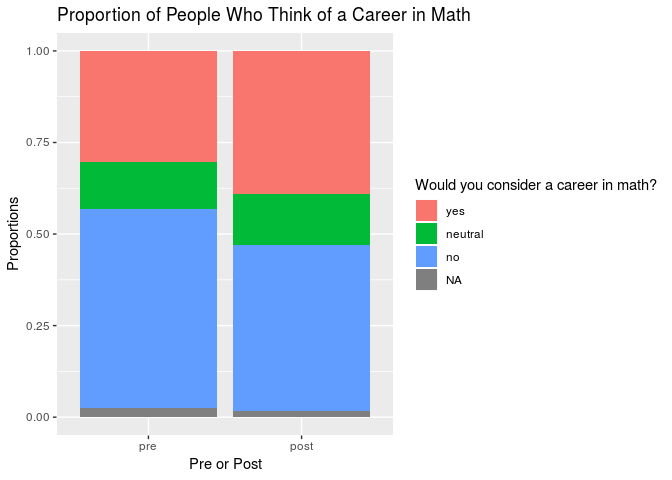

### By age group

``` r
empower_byage$math_career <- factor(empower_byage$math_career, levels = c("yes", "neutral", "no"))
empower_byage$pre_or_post <- factor(empower_byage$pre_or_post, levels = c("pre", "post"))
empower_byage$age_groups <- factor(empower_byage$age_groups, levels = c("younger", "older"))

ggplot(data = empower_byage) +
  geom_bar(mapping = aes(x = pre_or_post, 
                         fill = math_career), position = "fill") +
  facet_grid(~ age_groups) +
  labs(title = "Proportion of People Who Think of a Career in Math",
       x = "Pre or Post",
       y = "Proportions", 
       fill = "Career in math?")
```

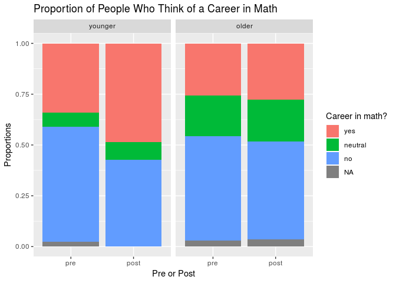

### By grade

``` r
empower_new$math_career <- factor(empower_new$math_career, levels = c("yes", "neutral", "no"))
empower_new$pre_or_post <- factor(empower_new$pre_or_post, levels = c("pre", "post"))

ggplot(data = empower_new) +
  geom_bar(mapping = aes(x = pre_or_post, 
                         fill = math_career), position = "fill") +
  facet_grid(~ grade) +
  labs(title = "Proportion of People Who Think of a Career in Math",
       x = "Pre or Post",
       y = "Proportions", 
       fill = "Career in math?")
```

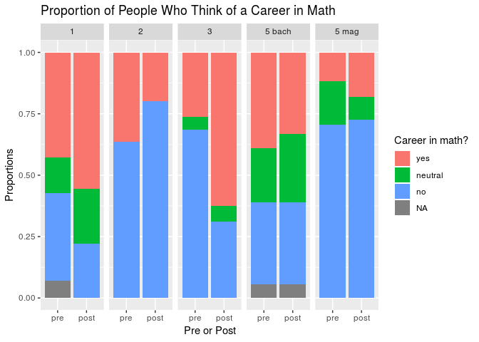

Good at math
------------

This question asks whether the girls believe they are good at math.

### All grades together

``` r
empower_new$good_at_math <- factor(empower_new$good_at_math, levels = c("yes", "neutral", "no"))

ggplot(data = empower_new) +
  geom_bar(mapping = aes(x = pre_or_post, 
                         fill = good_at_math), position = "fill") +
  labs(title = "Proportion of People Who Think They Are Good at Math",
       x = "Pre or Post",
       y = "Proportions", 
       fill = "Good at math?")
```

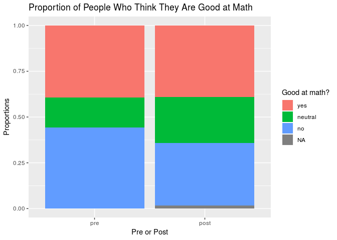

### By age group

``` r
empower_byage$good_at_math <- factor(empower_byage$good_at_math, levels = c("yes", "neutral", "no"))

ggplot(data = empower_byage) +
  geom_bar(mapping = aes(x = pre_or_post, 
                         fill = good_at_math), position = "fill") +
  facet_grid(~ age_groups) +
  labs(title = "Proportion of People Who Think They are Good at Math",
       x = "Pre or Post",
       y = "Proportions", 
       fill = "Good at math?")
```

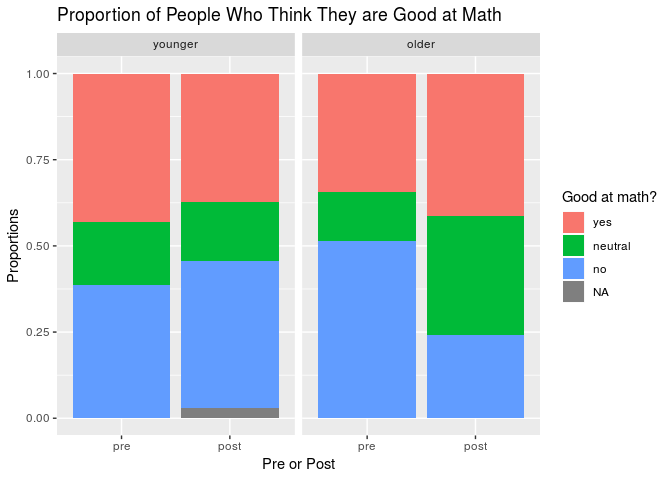

### By grade

``` r
ggplot(data = empower_new) +
  geom_bar(mapping = aes(x = pre_or_post, 
                         fill = good_at_math), position = "fill") +
  facet_grid(~ grade) +
 labs(title = "Proportion of People Who Think They are Good at Math",
       x = "Pre or Post",
       y = "Proportions", 
       fill = "Good at math?")
```

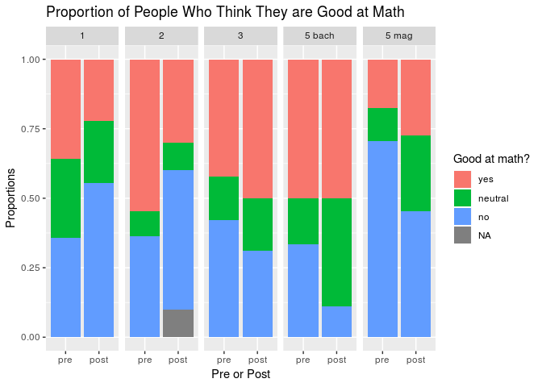

More math courses
-----------------

This question asks whether the girls would like the opportunity to take
more math courses.

### All groups together

``` r
empower_new$math_courses <- factor(empower_new$math_courses, levels = c("yes", "neutral", "no"))

ggplot(data = empower_new) +
  geom_bar(mapping = aes(x = pre_or_post, 
                         fill = math_courses), position = "fill") +
  labs(title = "Proportion of People Who Want to Take More Math Courses",
       x = "Pre or Post",
       y = "Proportions", 
       fill = "More math courses?")
```

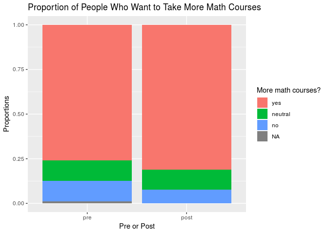

### By age group

``` r
empower_byage$math_courses <- factor(empower_byage$math_courses, levels = c("yes", "neutral", "no"))

ggplot(data = empower_byage) +
  geom_bar(mapping = aes(x = pre_or_post, 
                         fill = math_courses), position = "fill") +
  facet_grid(~ age_groups) +
  labs(title = "Proportion of People Who Want to Take More Math Courses",
       x = "Pre or Post",
       y = "Proportions", 
       fill = "More math courses?")
```

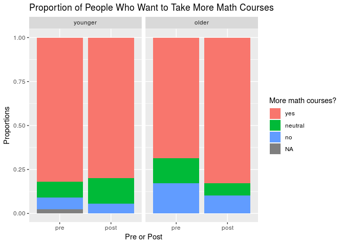

### By grade

``` r
empower_new$math_courses <- factor(empower_new$math_courses, levels = c("yes", "neutral", "no"))

ggplot(data = empower_new) +
  geom_bar(mapping = aes(x = pre_or_post, 
                         fill = math_courses), position = "fill") +
  facet_grid(~ grade) +
  labs(title = "Proportion of People Who Want to Take More Math Courses",
       x = "Pre or Post",
       y = "Proportions", 
       fill = "More math courses?")
```

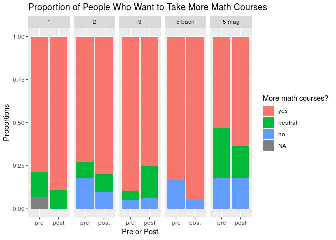

Science career
--------------

This question asks whether the girls would like to pursue a career
related to science.

### All groups together

``` r
empower_new$science_career <- factor(empower_new$science_career, levels = c("yes", "neutral", "no"))

ggplot(data = empower_new) +
  geom_bar(mapping = aes(x = pre_or_post, 
                         fill = science_career), position = "fill") +
  labs(title = "Proportion of People Who Think of a Career in Science",
       x = "Pre or Post",
       y = "Proportions", 
       fill = "Career in science?")
```


### By age group

``` r
empower_byage$science_career <- factor(empower_byage$science_career, levels = c("yes", "neutral", "no"))

ggplot(data = empower_byage) +
  geom_bar(mapping = aes(x = pre_or_post, 
                         fill = science_career), position = "fill") +
  facet_grid(~ age_groups) +
  labs(title = "Proportion of People Who Think of a Career in Science",
       x = "Pre or Post",
       y = "Proportions", 
       fill = "Career in science?")
```


### By grade

``` r
ggplot(data = empower_new) +
  geom_bar(mapping = aes(x = pre_or_post, 
                         fill = science_career), position = "fill") +
  facet_grid(~ grade) +
  labs(title = "Proportion of People Who Think of a Career in Science",
       x = "Pre or Post",
       y = "Proportions", 
       fill = "Career in science?")
```

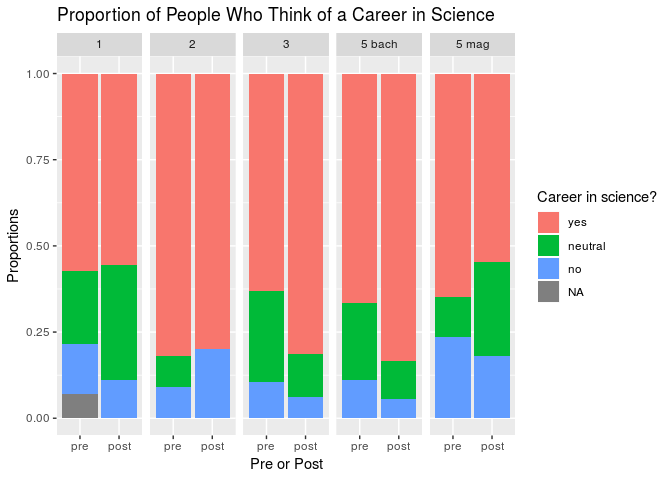

Good at science
---------------

This question asks whether the girls believe they are good at science.

### All groups together

``` r
empower_new$good_science <- factor(empower_new$science_career, levels = c("yes", "neutral", "no"))

ggplot(data = empower_new) +
  geom_bar(mapping = aes(x = pre_or_post, 
                         fill = science_career), position = "fill") +
  labs(title = "Proportion of People Who Think of a Career in Science",
       x = "Pre or Post",
       y = "Proportions", 
       fill = "Career in science?")
```

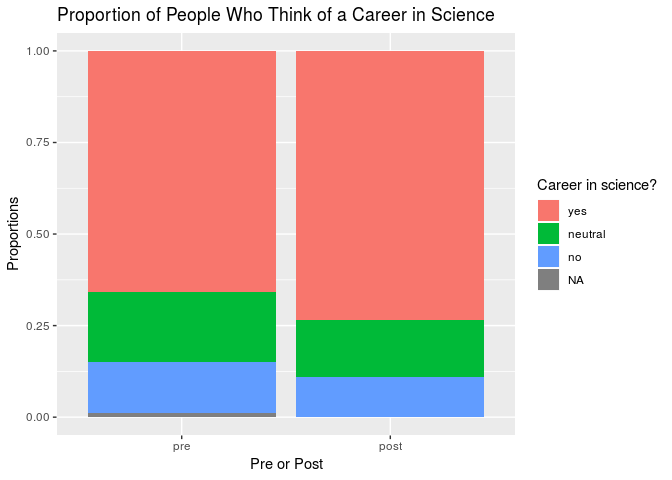

### By age group

``` r
empower_byage$science_career <- factor(empower_byage$science_career, levels = c("yes", "neutral", "no"))

ggplot(data = empower_byage) +
  geom_bar(mapping = aes(x = pre_or_post, 
                         fill = science_career), position = "fill") +
  facet_grid(~ age_groups) +
  labs(title = "Proportion of People Who Think of a Career in Science",
       x = "Pre or Post",
       y = "Proportions", 
       fill = "Career in science?")
```

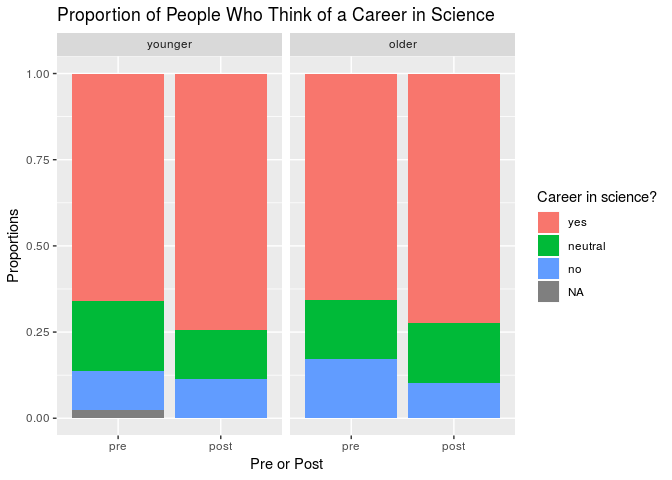

### By grade

``` r
ggplot(data = empower_new) +
  geom_bar(mapping = aes(x = pre_or_post, 
                         fill = science_career), position = "fill") +
  facet_grid(~ grade) +
  labs(title = "Proportion of People Who Think of a Career in Science",
       x = "Pre or Post",
       y = "Proportions", 
       fill = "Career in science?")
```


More science courses
--------------------

This question asks whether the girls would like the opportunity to take
more science courses.

### All groups together

``` r
empower_new$science_courses <- factor(empower_new$science_courses, levels = c("yes", "neutral", "no"))

ggplot(data = empower_new) +
  geom_bar(mapping = aes(x = pre_or_post, 
                         fill = science_courses), position = "fill") +
  labs(title = "Proportion of People Who Want to take More Science Courses",
       x = "Pre or Post",
       y = "Proportions", 
       fill = "More Science Courses?")
```

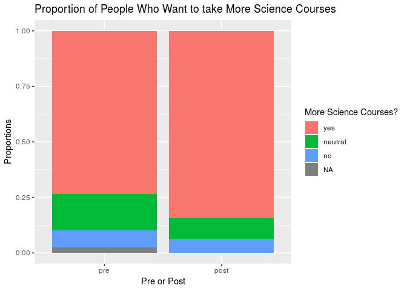

### By age group

``` r
empower_byage$science_courses <- factor(empower_byage$science_courses, levels = c("yes", "neutral", "no"))

ggplot(data = empower_byage) +
  geom_bar(mapping = aes(x = pre_or_post, 
                         fill = science_courses), position = "fill") +
  facet_grid(~ age_groups) +
  labs(title = "Proportion of People Who Want to take More Science Courses",
       x = "Pre or Post",
       y = "Proportions", 
       fill = "More Science Courses?")
```

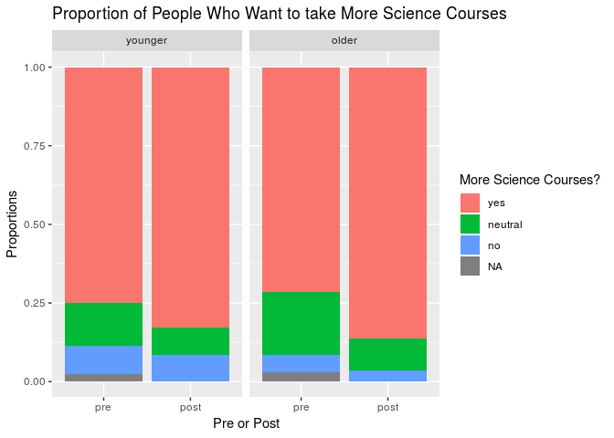

### By grade

``` r
ggplot(data = empower_new) +
  geom_bar(mapping = aes(x = pre_or_post, 
                         fill = science_courses), position = "fill") +
  facet_grid(~ grade) +
  labs(title = "Proportion of People Who Want to take More Science Courses",
       x = "Pre or Post",
       y = "Proportions", 
       fill = "More Science Courses?")
```

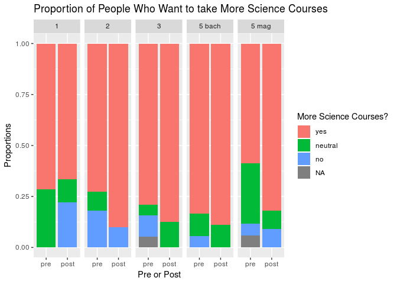

Science and math together to invent things
------------------------------------------

This question asks whether the girls agree with the statement that
knowing how to use math and science together will allow them to invent
useful things.

### All groups together

``` r
empower_new$mathscience_useful <- factor(empower_new$mathscience_useful, levels = c("yes", "neutral", "no"))

ggplot(data = empower_new) +
  geom_bar(mapping = aes(x = pre_or_post, 
                         fill = mathscience_useful), position = "fill") +
  labs(title = "Proportion of People Who Think They Can Invent",
       x = "Pre or Post",
       y = "Proportions", 
       fill = "Can invent?")
```

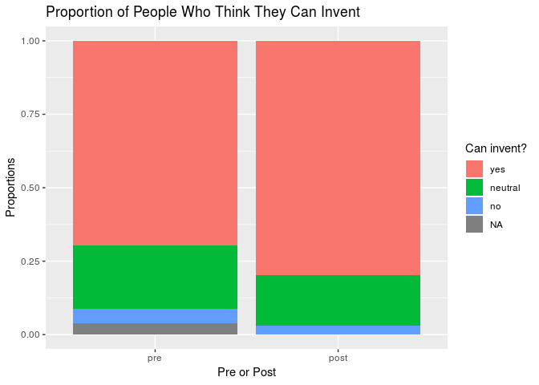

### By age group

``` r
empower_byage$mathscience_useful <- factor(empower_byage$mathscience_useful, levels = c("yes", "neutral", "no"))

ggplot(data = empower_byage) +
  geom_bar(mapping = aes(x = pre_or_post, 
                         fill = mathscience_useful), position = "fill") +
  facet_grid(~ age_groups) +
  labs(title = "Proportion of People Who Think They Can Invent",
       x = "Pre or Post",
       y = "Proportions", 
       fill = "Can invent?")
```

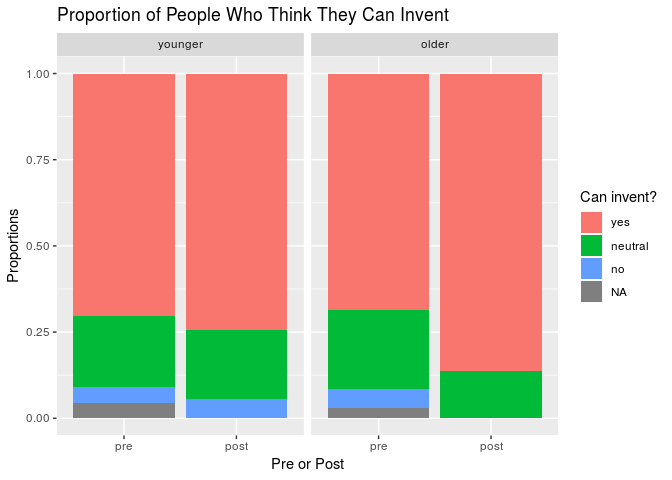

### By grade

``` r
ggplot(data = empower_new) +
  geom_bar(mapping = aes(x = pre_or_post, 
                         fill = science_courses), position = "fill") +
  facet_grid(~ grade) +
  labs(title = "Proportion of People Who Think They Can Invent",
       x = "Pre or Post",
       y = "Proportions", 
       fill = "Can invent?")
```

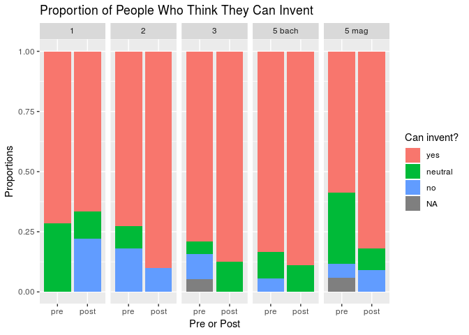

Success in engineering
----------------------

This question asks whether the girls think they could succeed at an
engineering-related career.

### All groups together

``` r
empower_new$success_engineering <- factor(empower_new$success_engineering, levels = c("yes", "neutral", "no"))

ggplot(data = empower_new) +
  geom_bar(mapping = aes(x = pre_or_post, 
                         fill = success_engineering), position = "fill") +
  labs(title = "Proportion of People Who Think They Can Succeed as Engineers",
       x = "Pre or Post",
       y = "Proportions", 
       fill = "Can succeed?")
```

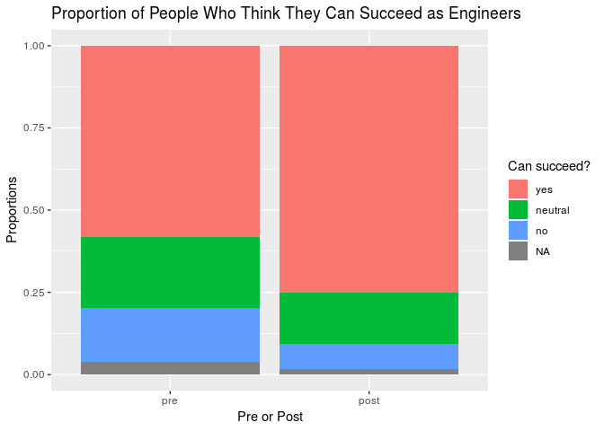

### By age group

``` r
empower_byage$success_engineering <- factor(empower_byage$success_engineering, levels = c("yes", "neutral", "no"))

ggplot(data = empower_byage) +
  geom_bar(mapping = aes(x = pre_or_post, 
                         fill = success_engineering), position = "fill") +
  facet_grid(~ age_groups) +
  labs(title = "Proportion of People Who Think They Can Succeed as Engineers",
       x = "Pre or Post",
       y = "Proportions", 
       fill = "Can succeed?")
```

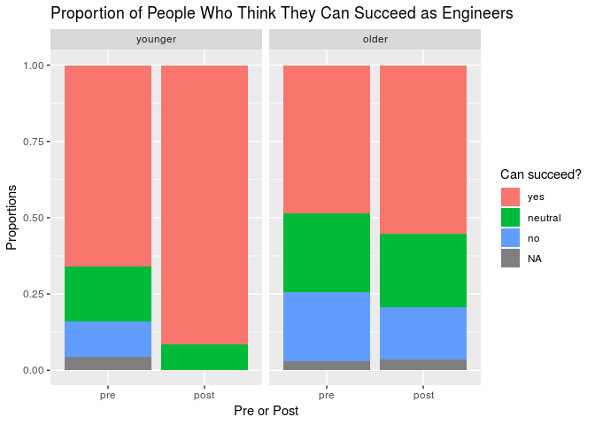

### By grade

``` r
ggplot(data = empower_new) +
  geom_bar(mapping = aes(x = pre_or_post, 
                         fill = success_engineering), position = "fill") +
  facet_grid(~ grade) +
  labs(title = "Proportion of People Who Think They Can Succeed as Engineers",
       x = "Pre or Post",
       y = "Proportions", 
       fill = "Can succeed?")
```

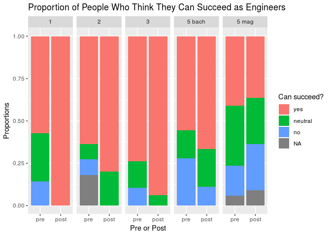

Courses in engineering
----------------------

This question asks whether the girls would like the opportunity to take
more science courses.

### All groups together

``` r
empower_new$opportunity_engineering <- factor(empower_new$opportunity_engineering, levels = c("yes", "neutral", "no"))

ggplot(data = empower_new) +
  geom_bar(mapping = aes(x = pre_or_post, 
                         fill = opportunity_engineering), position = "fill") +
  labs(title = "Proportion of People Who Want to Take More EGR Courses",
       x = "Pre or Post",
       y = "Proportions", 
       fill = "EGR courses?")
```

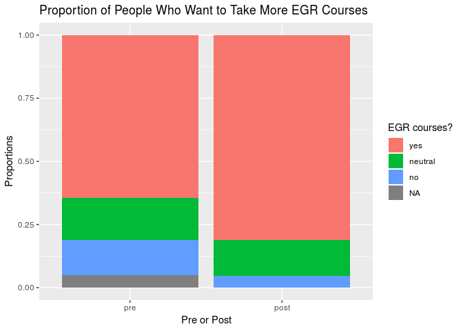

### By age group

``` r
empower_byage$opportunity_engineering <- factor(empower_byage$opportunity_engineering, levels = c("yes", "neutral", "no"))

ggplot(data = empower_byage) +
  geom_bar(mapping = aes(x = pre_or_post, 
                         fill = opportunity_engineering), position = "fill") +
  facet_grid(~ age_groups) +
  labs(title = "Proportion of People Who Want to Take More EGR Courses",
       x = "Pre or Post",
       y = "Proportions", 
       fill = "EGR Courses?")
```

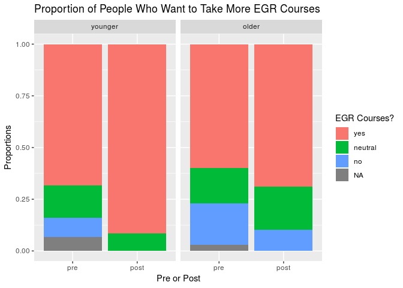

### By grade

``` r
ggplot(data = empower_new) +
  geom_bar(mapping = aes(x = pre_or_post, 
                         fill = opportunity_engineering), position = "fill") +
  facet_grid(~ grade) +
  labs(title = "Proportion of People Who Want to Take More EGR Courses",
       x = "Pre or Post",
       y = "Proportions", 
       fill = "EGR Courses?")
```

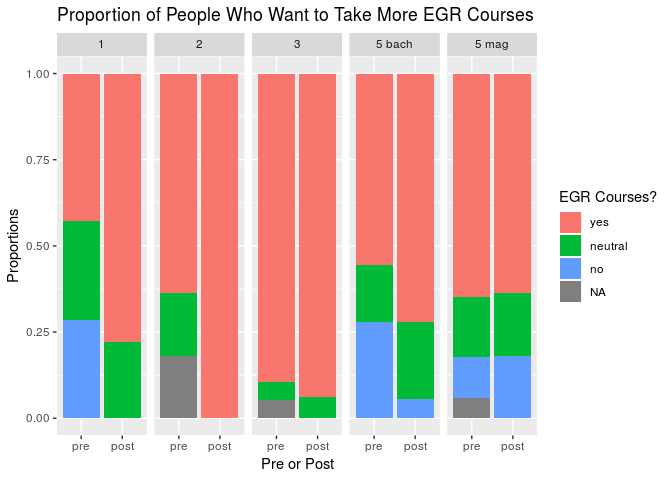

PRE Attitudes towards math
--------------------------

The next section finds the proportion of girls in each grade who
answered positively questions that related to math in the
pre-implementation survey.

### Grade 1

``` r
pre_empower_math1 <- empower_new %>%
  filter(grade == "1") %>%
  filter(pre_or_post == "pre")
pre_empower_math1$math <- paste(pre_empower_math1$math_career, pre_empower_math1$good_at_math, pre_empower_math1$higherlevel_math, pre_empower_math1$good_math_grades, pre_empower_math1$interesting_math, pre_empower_math1$future_math, pre_empower_math1$math_courses)

pre_math_prop1 <- sum(str_count(pre_empower_math1$math, "yes")) / (sum(str_count(pre_empower_math1$math, "no")) + sum(str_count(pre_empower_math1$math, "yes")))
pre_math_prop1
```

    ## [1] 0.7594937

### Grade 2

``` r
pre_empower_math2 <- empower_new %>%
  filter(grade == "2") %>%
  filter(pre_or_post == "pre")
pre_empower_math2$math <- paste(pre_empower_math2$math_career, pre_empower_math2$good_at_math, pre_empower_math2$higherlevel_math, pre_empower_math2$good_math_grades, pre_empower_math2$interesting_math, pre_empower_math2$future_math, pre_empower_math2$math_courses)

pre_math_prop2 <- sum(str_count(pre_empower_math2$math, "yes")) / (sum(str_count(pre_empower_math2$math, "no")) + sum(str_count(pre_empower_math2$math, "yes")))
pre_math_prop2
```

    ## [1] 0.7285714

### Grade 3

``` r
pre_empower_math3 <- empower_new %>%
  filter(grade == "3") %>%
  filter(pre_or_post == "pre")
pre_empower_math3$math <- paste(pre_empower_math3$math_career, pre_empower_math3$good_at_math, pre_empower_math3$higherlevel_math, pre_empower_math3$good_math_grades, pre_empower_math3$interesting_math, pre_empower_math3$future_math, pre_empower_math3$math_courses)

pre_math_prop3 <- sum(str_count(pre_empower_math3$math, "yes")) / (sum(str_count(pre_empower_math3$math, "no")) + sum(str_count(pre_empower_math3$math, "yes")))
pre_math_prop3
```

    ## [1] 0.7666667

### Grade 5 magisterio

``` r
pre_empower_math5m <- empower_new %>%
  filter(grade == "5 mag") %>%
  filter(pre_or_post == "pre")
pre_empower_math5m$math <- paste(pre_empower_math5m$math_career, pre_empower_math5m$good_at_math, pre_empower_math5m$higherlevel_math, pre_empower_math5m$good_math_grades, pre_empower_math5m$interesting_math, pre_empower_math5m$future_math, pre_empower_math5m$math_courses)

pre_math_prop5m <- sum(str_count(pre_empower_math5m$math, "yes")) / (sum(str_count(pre_empower_math5m$math, "no")) + sum(str_count(pre_empower_math5m$math, "yes")))
pre_math_prop5m
```

    ## [1] 0.4842105

### Grade 5 bachillerato

``` r
pre_empower_math5b <- empower_new %>%
  filter(grade == "5 bach") %>%
  filter(pre_or_post == "pre")
pre_empower_math5b$math <- paste(pre_empower_math5b$math_career, pre_empower_math5b$good_at_math, pre_empower_math5b$higherlevel_math, pre_empower_math5b$good_math_grades, pre_empower_math5b$interesting_math, pre_empower_math5b$future_math, pre_empower_math5b$math_courses)

pre_math_prop5b <- sum(str_count(pre_empower_math5b$math, "yes")) / (sum(str_count(pre_empower_math5b$math, "no")) + sum(str_count(pre_empower_math5b$math, "yes")))
pre_math_prop5b
```

    ## [1] 0.7884615

PRE Attitudes towards science
-----------------------------

The next section finds the proportion of girls in each grade who
answered positively questions that related to science in the
pre-implementation survey.

### Grade 1

``` r
pre_empower_science1 <- empower_new %>%
  filter(grade == "1") %>%
  filter(pre_or_post == "pre")
pre_empower_science1$science <- paste(pre_empower_science1$sure_science, pre_empower_science1$science_career, pre_empower_science1$science_outsideofschool, pre_empower_science1$science_pay, pre_empower_science1$science_job, pre_empower_science1$good_science, pre_empower_science1$higherlevel_science, pre_empower_science1$science_courses)

pre_science_prop1 <- sum(str_count(pre_empower_science1$science, "yes")) / (sum(str_count(pre_empower_science1$science, "no")) + sum(str_count(pre_empower_science1$science, "yes")))
pre_science_prop1
```

    ## [1] 0.8292683

### Grade 2

``` r
pre_empower_science2 <- empower_new %>%
  filter(grade == "2") %>%
  filter(pre_or_post == "pre")
pre_empower_science2$science <- paste(pre_empower_science2$sure_science, pre_empower_science2$science_career, pre_empower_science2$science_outsideofschool, pre_empower_science2$science_pay, pre_empower_science2$science_job, pre_empower_science2$good_science, pre_empower_science2$higherlevel_science, pre_empower_science2$science_courses)

pre_science_prop2 <- sum(str_count(pre_empower_science2$science, "yes")) / (sum(str_count(pre_empower_science2$science, "no")) + sum(str_count(pre_empower_science2$science, "yes")))
pre_science_prop2
```

    ## [1] 0.8108108

### Grade 3

``` r
pre_empower_science3 <- empower_new %>%
  filter(grade == "3") %>%
  filter(pre_or_post == "pre")
pre_empower_science3$science <- paste(pre_empower_science3$sure_science, pre_empower_science3$science_career, pre_empower_science3$science_outsideofschool, pre_empower_science3$science_pay, pre_empower_science3$science_job, pre_empower_science3$good_science, pre_empower_science3$higherlevel_science, pre_empower_science3$science_courses)

pre_science_prop3 <- sum(str_count(pre_empower_science3$science, "yes")) / (sum(str_count(pre_empower_science3$science, "no")) + sum(str_count(pre_empower_science3$science, "yes")))
pre_science_prop3
```

    ## [1] 0.8629032

### Grade 5 magisterio

``` r
pre_empower_science5m <- empower_new %>%
  filter(grade == "5 mag") %>%
  filter(pre_or_post == "pre")
pre_empower_science5m$science <- paste(pre_empower_science5m$sure_science, pre_empower_science5m$science_career, pre_empower_science5m$science_outsideofschool, pre_empower_science5m$science_pay, pre_empower_science5m$science_job, pre_empower_science5m$good_science, pre_empower_science5m$higherlevel_science, pre_empower_science5m$science_courses)

pre_science_prop5m <- sum(str_count(pre_empower_science5m$science, "yes")) / (sum(str_count(pre_empower_science5m$science, "no")) + sum(str_count(pre_empower_science5m$science, "yes")))
pre_science_prop5m
```

    ## [1] 0.8191489

### Grade 5 bachillerato

``` r
pre_empower_science5b <- empower_new %>%
  filter(grade == "5 bach") %>%
  filter(pre_or_post == "pre")
pre_empower_science5b$science <- paste(pre_empower_science5b$sure_science, pre_empower_science5b$science_career, pre_empower_science5b$science_outsideofschool, pre_empower_science5b$science_pay, pre_empower_science5b$science_job, pre_empower_science5b$good_science, pre_empower_science5b$higherlevel_science, pre_empower_science5b$science_courses)

pre_science_prop5b <- sum(str_count(pre_empower_science5b$science, "yes")) / (sum(str_count(pre_empower_science5b$science, "no")) + sum(str_count(pre_empower_science5b$science, "yes")))
pre_science_prop5b
```

    ## [1] 0.8780488

PRE Attitudes towards engineering
---------------------------------

The next section finds the proportion of girls in each grade who
answered positively questions that related to engineering in the
pre-implementation survey.

### Grade 1

``` r
pre_empower_egr1 <- empower_new %>%
  filter(grade == "1") %>%
  filter(pre_or_post == "pre")
pre_empower_egr1$egr <- paste(pre_empower_egr1$new_products, pre_empower_egr1$engineering_everyday, pre_empower_egr1$enjoy_building, pre_empower_egr1$interested_machines, pre_empower_egr1$career_design, pre_empower_egr1$curiosity_tech, pre_empower_egr1$future_innovation, pre_empower_egr1$mathscience_useful, pre_empower_egr1$success_engineering, pre_empower_egr1$i_can_build, pre_empower_egr1$opportunity_engineering)

pre_egr_prop1 <- sum(str_count(pre_empower_egr1$egr, "yes")) / (sum(str_count(pre_empower_egr1$egr, "no")) + sum(str_count(pre_empower_egr1$egr, "yes")))
pre_egr_prop1
```

    ## [1] 0.8429752

### Grade 2

``` r
pre_empower_egr2 <- empower_new %>%
  filter(grade == "2") %>%
  filter(pre_or_post == "pre")
pre_empower_egr2$egr <- paste(pre_empower_egr2$new_products, pre_empower_egr2$engineering_everyday, pre_empower_egr2$enjoy_building, pre_empower_egr2$interested_machines, pre_empower_egr2$career_design, pre_empower_egr2$curiosity_tech, pre_empower_egr2$future_innovation, pre_empower_egr2$mathscience_useful, pre_empower_egr2$success_engineering, pre_empower_egr2$i_can_build, pre_empower_egr2$opportunity_engineering)

pre_egr_prop2 <- sum(str_count(pre_empower_egr2$egr, "yes")) / (sum(str_count(pre_empower_egr2$egr, "no")) + sum(str_count(pre_empower_egr2$egr, "yes")))
pre_egr_prop2
```

    ## [1] 0.8791209

### Grade 3

``` r
pre_empower_egr3 <- empower_new %>%
  filter(grade == "3") %>%
  filter(pre_or_post == "pre")
pre_empower_egr3$egr <- paste(pre_empower_egr3$new_products, pre_empower_egr3$engineering_everyday, pre_empower_egr3$enjoy_building, pre_empower_egr3$interested_machines, pre_empower_egr3$career_design, pre_empower_egr3$curiosity_tech, pre_empower_egr3$future_innovation, pre_empower_egr3$mathscience_useful, pre_empower_egr3$success_engineering, pre_empower_egr3$i_can_build, pre_empower_egr3$opportunity_engineering)

pre_egr_prop3 <- sum(str_count(pre_empower_egr3$egr, "yes")) / (sum(str_count(pre_empower_egr3$egr, "no")) + sum(str_count(pre_empower_egr3$egr, "yes")))
pre_egr_prop3
```

    ## [1] 0.9086022

### Grade 5 magisterio

``` r
pre_empower_egr5m <- empower_new %>%
  filter(grade == "5 mag") %>%
  filter(pre_or_post == "pre")
pre_empower_egr5m$egr <- paste(pre_empower_egr5m$new_products, pre_empower_egr5m$engineering_everyday, pre_empower_egr5m$enjoy_building, pre_empower_egr5m$interested_machines, pre_empower_egr5m$career_design, pre_empower_egr5m$curiosity_tech, pre_empower_egr5m$future_innovation, pre_empower_egr5m$mathscience_useful, pre_empower_egr5m$success_engineering, pre_empower_egr5m$i_can_build, pre_empower_egr5m$opportunity_engineering)

pre_egr_prop5m <- sum(str_count(pre_empower_egr5m$egr, "yes")) / (sum(str_count(pre_empower_egr5m$egr, "no")) + sum(str_count(pre_empower_egr5m$egr, "yes")))
pre_egr_prop5m
```

    ## [1] 0.8818898

### Grade 5 bachillerato

``` r
pre_empower_egr5b <- empower_new %>%
  filter(grade == "5 bach") %>%
  filter(pre_or_post == "pre")
pre_empower_egr5b$egr <- paste(pre_empower_egr5b$new_products, pre_empower_egr5b$engineering_everyday, pre_empower_egr5b$enjoy_building, pre_empower_egr5b$interested_machines, pre_empower_egr5b$career_design, pre_empower_egr5b$curiosity_tech, pre_empower_egr5b$future_innovation, pre_empower_egr5b$mathscience_useful, pre_empower_egr5b$success_engineering, pre_empower_egr5b$i_can_build, pre_empower_egr5b$opportunity_engineering)

pre_egr_prop5b <- sum(str_count(pre_empower_egr5b$egr, "yes")) / (sum(str_count(pre_empower_egr5b$egr, "no")) + sum(str_count(pre_empower_egr5b$egr, "yes")))
pre_egr_prop5b
```

    ## [1] 0.8203593

``` r
avg_math_pre <- (pre_math_prop1 + pre_math_prop2 + pre_math_prop3 + pre_math_prop5m + pre_math_prop5b)/5
avg_science_pre <- (pre_science_prop1 + pre_science_prop2 + pre_science_prop3 + pre_science_prop5m + pre_science_prop5b)/5
avg_egr_pre <- (pre_egr_prop1 + pre_egr_prop2 + pre_egr_prop3 + pre_egr_prop5m + pre_egr_prop5b)/5
```

POST Attitudes towards math
---------------------------

The next section finds the proportion of girls in each grade who
answered positively questions that related to math in the
post-implementation survey.

### Grade 1

``` r
empower_math1 <- empower_new %>%
  filter(grade == "1") %>%
  filter(pre_or_post == "post")
empower_math1$math <- paste(empower_math1$math_career, empower_math1$good_at_math, empower_math1$higherlevel_math, empower_math1$good_math_grades, empower_math1$interesting_math, empower_math1$future_math, empower_math1$math_courses)

math_prop1 <- sum(str_count(empower_math1$math, "yes")) / (sum(str_count(empower_math1$math, "no")) + sum(str_count(empower_math1$math, "yes")))
math_prop1
```

    ## [1] 0.7407407

### Grade 2

``` r
empower_math2 <- empower_new %>%
  filter(grade == "2") %>%
  filter(pre_or_post == "post")
empower_math2$math <- paste(empower_math2$math_career, empower_math2$good_at_math, empower_math2$higherlevel_math, empower_math2$good_math_grades, empower_math2$interesting_math, empower_math2$future_math, empower_math2$math_courses)

math_prop2 <- sum(str_count(empower_math2$math, "yes")) / (sum(str_count(empower_math2$math, "no")) + sum(str_count(empower_math2$math, "yes")))
math_prop2
```

    ## [1] 0.6825397

### Grade 3

``` r
empower_math3 <- empower_new %>%
  filter(grade == "3") %>%
  filter(pre_or_post == "post")
empower_math3$math <- paste(empower_math3$math_career, empower_math3$good_at_math, empower_math3$higherlevel_math, empower_math3$good_math_grades, empower_math3$interesting_math, empower_math3$future_math, empower_math3$math_courses)

math_prop3 <- sum(str_count(empower_math3$math, "yes")) / (sum(str_count(empower_math3$math, "no")) + sum(str_count(empower_math3$math, "yes")))
math_prop3
```

    ## [1] 0.8510638

### Grade 5 magisterio

``` r
empower_math5m <- empower_new %>%
  filter(grade == "5 mag") %>%
  filter(pre_or_post == "post")
empower_math5m$math <- paste(empower_math5m$math_career, empower_math5m$good_at_math, empower_math5m$higherlevel_math, empower_math5m$good_math_grades, empower_math5m$interesting_math, empower_math5m$future_math, empower_math5m$math_courses)

math_prop5m <- sum(str_count(empower_math5m$math, "yes")) / (sum(str_count(empower_math5m$math, "no")) + sum(str_count(empower_math5m$math, "yes")))
math_prop5m
```

    ## [1] 0.5820896

### Grade 5 bachillerato

``` r
empower_math5b <- empower_new %>%
  filter(grade == "5 bach") %>%
  filter(pre_or_post == "post")
empower_math5b$math <- paste(empower_math5b$math_career, empower_math5b$good_at_math, empower_math5b$higherlevel_math, empower_math5b$good_math_grades, empower_math5b$interesting_math, empower_math5b$future_math, empower_math5b$math_courses)

math_prop5b <- sum(str_count(empower_math5b$math, "yes")) / (sum(str_count(empower_math5b$math, "no")) + sum(str_count(empower_math5b$math, "yes")))
math_prop5b
```

    ## [1] 0.8834951

POST Attitudes towards science
------------------------------

The next section finds the proportion of girls in each grade who
answered positively questions that related to science in the
post-implementation survey.

### Grade 1

``` r
empower_science1 <- empower_new %>%
  filter(grade == "1") %>%
  filter(pre_or_post == "post")
empower_science1$science <- paste(empower_science1$sure_science, empower_science1$science_career, empower_science1$science_outsideofschool, empower_science1$science_pay, empower_science1$science_job, empower_science1$good_science, empower_science1$higherlevel_science, empower_science1$science_courses)

science_prop1 <- sum(str_count(empower_science1$science, "yes")) / (sum(str_count(empower_science1$science, "no")) + sum(str_count(empower_science1$science, "yes")))
science_prop1
```

    ## [1] 0.7735849

### Grade 2

``` r
empower_science2 <- empower_new %>%
  filter(grade == "2") %>%
  filter(pre_or_post == "post")
empower_science2$science <- paste(empower_science2$sure_science, empower_science2$science_career, empower_science2$science_outsideofschool, empower_science2$science_pay, empower_science2$science_job, empower_science2$good_science, empower_science2$higherlevel_science, empower_science2$science_courses)

science_prop2 <- sum(str_count(empower_science2$science, "yes")) / (sum(str_count(empower_science2$science, "no")) + sum(str_count(empower_science2$science, "yes")))
science_prop2
```

    ## [1] 0.8450704

### Grade 3

``` r
empower_science3 <- empower_new %>%
  filter(grade == "3") %>%
  filter(pre_or_post == "post")
empower_science3$science <- paste(empower_science3$sure_science, empower_science3$science_career, empower_science3$science_outsideofschool, empower_science3$science_pay, empower_science3$science_job, empower_science3$good_science, empower_science3$higherlevel_science, empower_science3$science_courses)

science_prop3 <- sum(str_count(empower_science3$science, "yes")) / (sum(str_count(empower_science3$science, "no")) + sum(str_count(empower_science3$science, "yes")))
science_prop3
```

    ## [1] 0.9423077

### Grade 5 magisterio

``` r
empower_science5m <- empower_new %>%
  filter(grade == "5 mag") %>%
  filter(pre_or_post == "post")
empower_science5m$science <- paste(empower_science5m$sure_science, empower_science5m$science_career, empower_science5m$science_outsideofschool, empower_science5m$science_pay, empower_science5m$science_job, empower_science5m$good_science, empower_science5m$higherlevel_science, empower_science5m$science_courses)

science_prop5m <- sum(str_count(empower_science5m$science, "yes")) / (sum(str_count(empower_science5m$science, "no")) + sum(str_count(empower_science5m$science, "yes")))
science_prop5m
```

    ## [1] 0.8309859

### Grade 5 bachillerato

``` r
empower_science5b <- empower_new %>%
  filter(grade == "5 bach") %>%
  filter(pre_or_post == "post")
empower_science5b$science <- paste(empower_science5b$sure_science, empower_science5b$science_career, empower_science5b$science_outsideofschool, empower_science5b$science_pay, empower_science5b$science_job, empower_science5b$good_science, empower_science5b$higherlevel_science, empower_science5b$science_courses)

science_prop5b <- sum(str_count(empower_science5b$science, "yes")) / (sum(str_count(empower_science5b$science, "no")) + sum(str_count(empower_science5b$science, "yes")))
science_prop5b
```

    ## [1] 0.9344262

POST Attitudes towards engineering
----------------------------------

The next section finds the proportion of girls in each grade who
answered positively questions that related to engineering in the
post-implementation survey.

### Grade 1

``` r
empower_egr1 <- empower_new %>%
  filter(grade == "1") %>%
  filter(pre_or_post == "post")
empower_egr1$egr <- paste(empower_egr1$new_products, empower_egr1$engineering_everyday, empower_egr1$enjoy_building, empower_egr1$interested_machines, empower_egr1$career_design, empower_egr1$curiosity_tech, empower_egr1$future_innovation, empower_egr1$mathscience_useful, empower_egr1$success_engineering, empower_egr1$i_can_build, empower_egr1$opportunity_engineering)

egr_prop1 <- sum(str_count(empower_egr1$egr, "yes")) / (sum(str_count(empower_egr1$egr, "no")) + sum(str_count(empower_egr1$egr, "yes")))
egr_prop1
```

    ## [1] 0.9764706

### Grade 2

``` r
empower_egr2 <- empower_new %>%
  filter(grade == "2") %>%
  filter(pre_or_post == "post")
empower_egr2$egr <- paste(empower_egr2$new_products, empower_egr2$engineering_everyday, empower_egr2$enjoy_building, empower_egr2$interested_machines, empower_egr2$career_design, empower_egr2$curiosity_tech, empower_egr2$future_innovation, empower_egr2$mathscience_useful, empower_egr2$success_engineering, empower_egr2$i_can_build, empower_egr2$opportunity_engineering)

egr_prop2 <- sum(str_count(empower_egr2$egr, "yes")) / (sum(str_count(empower_egr2$egr, "no")) + sum(str_count(empower_egr2$egr, "yes")))
egr_prop2
```

    ## [1] 0.9375

### Grade 3

``` r
empower_egr3 <- empower_new %>%
  filter(grade == "3") %>%
  filter(pre_or_post == "post")
empower_egr3$egr <- paste(empower_egr3$new_products, empower_egr3$engineering_everyday, empower_egr3$enjoy_building, empower_egr3$interested_machines, empower_egr3$career_design, empower_egr3$curiosity_tech, empower_egr3$future_innovation, empower_egr3$mathscience_useful, empower_egr3$success_engineering, empower_egr3$i_can_build, empower_egr3$opportunity_engineering)

egr_prop3 <- sum(str_count(empower_egr3$egr, "yes")) / (sum(str_count(empower_egr3$egr, "no")) + sum(str_count(empower_egr3$egr, "yes")))
egr_prop3
```

    ## [1] 0.9677419

### Grade 5 magisterio

``` r
empower_egr5m <- empower_new %>%
  filter(grade == "5 mag") %>%
  filter(pre_or_post == "post")
empower_egr5m$egr <- paste(empower_egr5m$new_products, empower_egr5m$engineering_everyday, empower_egr5m$enjoy_building, empower_egr5m$interested_machines, empower_egr5m$career_design, empower_egr5m$curiosity_tech, empower_egr5m$future_innovation, empower_egr5m$mathscience_useful, empower_egr5m$success_engineering, empower_egr5m$i_can_build, empower_egr5m$opportunity_engineering)

egr_prop5m <- sum(str_count(empower_egr5m$egr, "yes")) / (sum(str_count(empower_egr5m$egr, "no")) + sum(str_count(empower_egr5m$egr, "yes")))
egr_prop5m
```

    ## [1] 0.8773585

### Grade 5 bachillerato

``` r
empower_egr5b <- empower_new %>%
  filter(grade == "5 bach") %>%
  filter(pre_or_post == "post")
empower_egr5b$egr <- paste(empower_egr5b$new_products, empower_egr5b$engineering_everyday, empower_egr5b$enjoy_building, empower_egr5b$interested_machines, empower_egr5b$career_design, empower_egr5b$curiosity_tech, empower_egr5b$future_innovation, empower_egr5b$mathscience_useful, empower_egr5b$success_engineering, empower_egr5b$i_can_build, empower_egr5b$opportunity_engineering)

egr_prop5b <- sum(str_count(empower_egr5b$egr, "yes")) / (sum(str_count(empower_egr5b$egr, "no")) + sum(str_count(empower_egr5b$egr, "yes")))
egr_prop5b
```

    ## [1] 0.9461078

``` r
avg_math <- (math_prop1 + math_prop2 + math_prop3 + math_prop5m + math_prop5b)/5
avg_science <- (science_prop1 + science_prop2 + science_prop3 + science_prop5m + science_prop5b)/5
avg_egr <- (egr_prop1 + egr_prop2 + egr_prop3 + egr_prop5m + egr_prop5b)/5
```

Attitudes towards STEM table
----------------------------

I put together a table with all the proportions of girls who responded
positively to math, science and engineering questions, per grade.

``` r
stem_attitudes <- data.frame("grade" = c("1", "2", "3", "5 mag", "5bach", "Average"), "math" = c(math_prop1, math_prop2, math_prop3, math_prop5m, math_prop5b, avg_math), "science" = c(science_prop1, science_prop2, science_prop3, science_prop5m, science_prop5b, avg_science), "egr" = c(egr_prop1, egr_prop2, egr_prop3, egr_prop5m, egr_prop5b, avg_egr))
stem_attitudes
```

    ##     grade      math   science       egr
    ## 1       1 0.7407407 0.7735849 0.9764706
    ## 2       2 0.6825397 0.8450704 0.9375000
    ## 3       3 0.8510638 0.9423077 0.9677419
    ## 4   5 mag 0.5820896 0.8309859 0.8773585
    ## 5   5bach 0.8834951 0.9344262 0.9461078
    ## 6 Average 0.7479858 0.8652750 0.9410358

``` r
stem <- data.frame("grade" = c("1", "2", "3", "5 mag", "5bach", "Average"), "prop" = c(pre_math_prop1, pre_math_prop2, pre_math_prop3, pre_math_prop5m, pre_math_prop5b, avg_math_pre, pre_science_prop1, pre_science_prop2, pre_science_prop3, pre_science_prop5m, pre_science_prop5b, avg_science_pre, pre_egr_prop1, pre_egr_prop2, pre_egr_prop3, pre_egr_prop5m, pre_egr_prop5b, avg_egr_pre, math_prop1, math_prop2, math_prop3, math_prop5m, math_prop5b, avg_math, science_prop1, science_prop2, science_prop3, science_prop5m, science_prop5b, avg_science, egr_prop1, egr_prop2, egr_prop3, egr_prop5b, egr_prop5m, avg_egr), "course" = c("math", "math", "math", "math", "math", "math", "science", "science", "science", "science", "science", "science", "egr", "egr", "egr", "egr", "egr", "egr", "math", "math", "math", "math", "math", "math", "science", "science", "science", "science", "science", "science", "egr", "egr", "egr", "egr", "egr", "egr"), "pre_post" = c("pre", "pre", "pre", "pre", "pre", "pre", "pre", "pre", "pre", "pre", "pre", "pre", "pre", "pre", "pre", "pre", "pre", "pre", "post", "post", "post", "post", "post", "post", "post", "post", "post", "post", "post", "post", "post", "post", "post", "post", "post", "post"))
stem
```

    ##      grade      prop  course pre_post
    ## 1        1 0.7594937    math      pre
    ## 2        2 0.7285714    math      pre
    ## 3        3 0.7666667    math      pre
    ## 4    5 mag 0.4842105    math      pre
    ## 5    5bach 0.7884615    math      pre
    ## 6  Average 0.7054808    math      pre
    ## 7        1 0.8292683 science      pre
    ## 8        2 0.8108108 science      pre
    ## 9        3 0.8629032 science      pre
    ## 10   5 mag 0.8191489 science      pre
    ## 11   5bach 0.8780488 science      pre
    ## 12 Average 0.8400360 science      pre
    ## 13       1 0.8429752     egr      pre
    ## 14       2 0.8791209     egr      pre
    ## 15       3 0.9086022     egr      pre
    ## 16   5 mag 0.8818898     egr      pre
    ## 17   5bach 0.8203593     egr      pre
    ## 18 Average 0.8665895     egr      pre
    ## 19       1 0.7407407    math     post
    ## 20       2 0.6825397    math     post
    ## 21       3 0.8510638    math     post
    ## 22   5 mag 0.5820896    math     post
    ## 23   5bach 0.8834951    math     post
    ## 24 Average 0.7479858    math     post
    ## 25       1 0.7735849 science     post
    ## 26       2 0.8450704 science     post
    ## 27       3 0.9423077 science     post
    ## 28   5 mag 0.8309859 science     post
    ## 29   5bach 0.9344262 science     post
    ## 30 Average 0.8652750 science     post
    ## 31       1 0.9764706     egr     post
    ## 32       2 0.9375000     egr     post
    ## 33       3 0.9677419     egr     post
    ## 34   5 mag 0.9461078     egr     post
    ## 35   5bach 0.8773585     egr     post
    ## 36 Average 0.9410358     egr     post

I visualized the chart in the following bar graph.

``` r
stem$course <- factor(stem$course, levels = c("math", "science", "egr"))
stem$pre_post <- factor(stem$pre_post, levels = c("pre", "post"))

ggplot(data=stem, aes(x=grade, y=prop, fill=course)) +
    geom_bar(stat="identity", position=position_dodge()) +
    facet_grid(~ pre_post) +
    labs(title = "Proportion of Students Who Feel Positively About STEM", 
         x = "Grade",
         y = "Proportion",
         fill = "Course")
```


Notes:
------

### Template for finding proportions

prop\_pre\_mathcareer &lt;- empower\_new %&gt;%
filter(!is.na(math\_career)) %&gt;% count(math\_career, pre\_or\_post)
%&gt;% group\_by(pre\_or\_post) %&gt;% mutate(perc = (n / sum(n))\*100)
%&gt;% select(math\_career, pre\_or\_post, perc) %&gt;%
filter(pre\_or\_post == “pre”) prop\_pre\_mathcareer

### Ideas

How predicted grades vary between subjects
