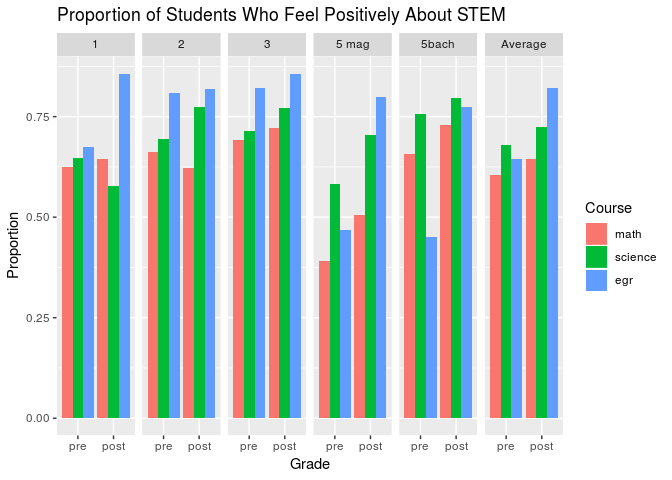
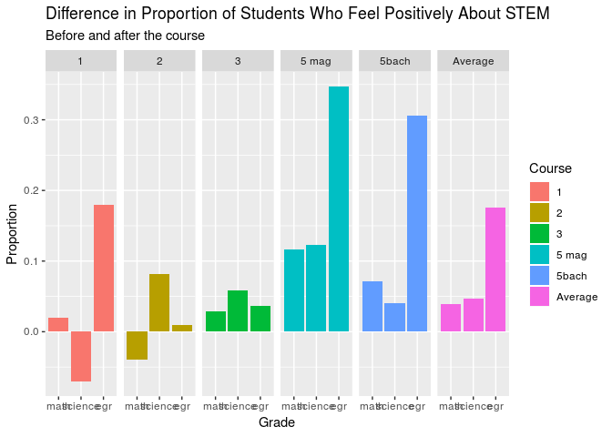

### Load packages

``` r
library(tidyverse)
library(broom)
library(infer)
library(ggplot2)
library(shiny)
```

### Background Information

This survey was conducted on 143 girls in an all-female boarding school
in Guatemala before and after a pair of Duke students conducted
STEM-focused courses. Grade 1 would be equivalent to 7th grade in the
American school system. We taught girls in grades 1, 2, and 3 the same
curriculum, and girls in grades 5 magisterio (mag) and 5 bachillerato
(bach) another curriculum. In 2017, the girls in 5 magisterio and 5
bachillerato took the curriculum that grades 1, 2, and 3 took in 2018.
The girls in 5 magisterio are on a program specifically to become school
teachers. The girls in 5 bachillerato usually pursue careers other than
teaching.

### Purpose

The purpose of the course is to give girls the chance to explore
STEM-related courses and help them realize that they are capable of
pursuing STEM-related careers, if they want to.

Thus, the purpose of the survey is to evaluate the girls’ attitudes
towards STEM and STEM-related careers before and after the course.

### A note for Professor Tackett

I feel like a have a lot of interesting data and visualizations, but I
am unsure about what direction to take the statistical research in order
to come to important conclusions about the curriculum.

I am thinking that some of the important takeaways could be observations
about how the program’s effect differs: - Between older and younger
girls (middle vs. high school) - Between different grade levels (more
specific than just saying younger vs. older) - Between girls who are on
the teaching-specific program (5 magisterio) vs. those who might have
time to decide on their career path (5 bach and grades 1-3) - Between
girls who took the course last year and those who did not

However, I am stuck on how to decide which of these paths to pursue.

Furthermore, the lab through which I am doing this investigation failed
to send me the Post-Implementation survey for 2017, so I only have the
Pre-Implementation survey for 2017. The survey in 2017 was much shorter.
However, we might be able to draw some comparisons between 2017 and
2018, once I get all the 2017 data.

Finally, how do I factor in things that were not directly addressed in
the survey? For example, at Flunch we talked about how the girls might
have felt inclined to answer the post-implementation survey more
positively because they liked their teachers, not necessarily because
they liked the subject.

### Load data

``` r
pre_empower <- read.csv("data/PRE_Empowerment.csv",
                    sep = ";")
post_empower <- read.csv("data/POST_Empowerment.csv",
                    sep = ";")
```

SECTION 1: ORGANIZING DATA
==========================

### Classifying and joining pre and post responses

``` r
pre_empower <- pre_empower %>%
  mutate(pre_or_post = "pre")
post_empower <- post_empower %>%
  mutate(pre_or_post = "post")
```

``` r
empower <- full_join(pre_empower, post_empower)
```

    ## Joining, by = c("grade", "city_birth", "parents_stem", "which_parent_stem", "parent_profession", "number_science_classes", "number_math_classes", "number_tech_classes", "number_egr_classes", "math_worst", "math_career", "not_enjoy_math", "good_at_math", "decentschool_badmath", "higherlevel_math", "good_math_grades", "interesting_math", "future_math", "math_courses", "sure_science", "science_career", "science_outsideofschool", "science_pay", "science_job", "good_science", "decentschool_badscience", "higherlevel_science", "science_courses", "new_products", "engineering_everyday", "enjoy_building", "interested_machines", "career_design", "curiosity_tech", "future_innovation", "mathscience_useful", "success_engineering", "i_can_build", "opportunity_engineering", "prediction_literature", "prediction_math", "prediction_science", "future_math_classes", "future_science_classes", "future_egr_classes", "college", "what_major", "why_not_college", "plan_after_school", "other_plan_afterschool", "frequency_learning_stem", "why_no_chances", "opportunities_women_stem", "reason_opportunities_stem", "contribute_community", "resolve_problems_community", "external_help", "leader_community", "contribute_community.1", "pre_or_post")

    ## Warning: Column `parent_profession` joining factors with different levels,
    ## coercing to character vector

    ## Warning: Column `math_courses` joining factors with different levels,
    ## coercing to character vector

    ## Warning: Column `science_job` joining factors with different levels,
    ## coercing to character vector

    ## Warning: Column `good_science` joining factors with different levels,
    ## coercing to character vector

    ## Warning: Column `new_products` joining factors with different levels,
    ## coercing to character vector

    ## Warning: Column `engineering_everyday` joining factors with different
    ## levels, coercing to character vector

    ## Warning: Column `enjoy_building` joining factors with different levels,
    ## coercing to character vector

    ## Warning: Column `curiosity_tech` joining factors with different levels,
    ## coercing to character vector

    ## Warning: Column `future_innovation` joining factors with different levels,
    ## coercing to character vector

    ## Warning: Column `mathscience_useful` joining factors with different levels,
    ## coercing to character vector

    ## Warning: Column `prediction_math` joining factors with different levels,
    ## coercing to character vector

    ## Warning: Column `college` joining factors with different levels, coercing
    ## to character vector

    ## Warning: Column `what_major` joining factors with different levels,
    ## coercing to character vector

    ## Warning: Column `why_not_college` joining factors with different levels,
    ## coercing to character vector

    ## Warning: Column `plan_after_school` joining factors with different levels,
    ## coercing to character vector

    ## Warning: Column `other_plan_afterschool` joining factors with different
    ## levels, coercing to character vector

    ## Warning: Column `why_no_chances` joining factors with different levels,
    ## coercing to character vector

    ## Warning: Column `opportunities_women_stem` joining factors with different
    ## levels, coercing to character vector

    ## Warning: Column `reason_opportunities_stem` joining factors with different
    ## levels, coercing to character vector

    ## Warning: Column `resolve_problems_community` joining factors with different
    ## levels, coercing to character vector

    ## Warning: Column `leader_community` joining factors with different levels,
    ## coercing to character vector

### Rank

``` r
empower$ID <- seq.int(nrow(empower))
```

### Changing responses from letters to words and characterizing them as “Positive” or “Negative”

To reduce the variability of the data, I joined the answers “Absolutely”
with “Yes” to define someone who feels positively about a certain
question. I joined “No” with “Absolutely Not” to define someone who
feels negatively about a certain question.

``` r
change_names <- function(naming){
naming %>%
  str_replace("A", "no") %>%
  str_replace("B", "no") %>%
  str_replace("C", "neutral") %>%
  str_replace("D", "yes") %>%
  str_replace("E", "yes")
}

change_names2 <- function(naming){
naming %>%
  str_replace("A", "very good") %>%
  str_replace("B", "okay") %>%
  str_replace("C", "bad")
}

change_names3 <- function(naming){
naming %>%
  str_replace("A", "yes") %>%
  str_replace("B", "no") %>%
  str_replace("C", "not sure")
}

empower$math_worst <- change_names(empower$math_worst)
empower$math_career <- change_names(empower$math_career)
empower$not_enjoy_math <- change_names(empower$not_enjoy_math)
empower$good_at_math <- change_names(empower$good_at_math)
empower$decentschool_badmath <- change_names(empower$decentschool_badmath)
empower$higherlevel_math <- change_names(empower$higherlevel_math)
empower$good_math_grades <- change_names(empower$good_math_grades)
empower$interesting_math <- change_names(empower$interesting_math)
empower$future_math <- change_names(empower$future_math)
empower$math_courses <- change_names(empower$math_courses)
empower$sure_science <- change_names(empower$sure_science)
empower$science_career <- change_names(empower$science_career)
empower$science_outsideofschool <- change_names(empower$science_outsideofschool)
empower$science_pay <- change_names(empower$science_pay)
empower$science_job <- change_names(empower$science_job)
empower$good_science <- change_names(empower$good_science)
empower$decentschool_badscience <- change_names(empower$decentschool_badscience)
empower$higherlevel_science <- change_names(empower$higherlevel_science)
empower$science_courses <- change_names(empower$science_courses)
empower$new_products <- change_names(empower$new_products)
empower$engineering_everyday <- change_names(empower$engineering_everyday)
empower$enjoy_building <- change_names(empower$enjoy_building)
empower$interested_machines <- change_names(empower$interested_machines)
empower$career_design <- change_names(empower$career_design)
empower$curiosity_tech <- change_names(empower$curiosity_tech)
empower$future_innovation <- change_names(empower$future_innovation)
empower$mathscience_useful <- change_names(empower$mathscience_useful)
empower$success_engineering <- change_names(empower$success_engineering)
empower$i_can_build <- change_names(empower$i_can_build)
empower$opportunity_engineering <- change_names(empower$opportunity_engineering)
empower$contribute_community <- change_names(empower$contribute_community)
empower$resolve_problems_community <- change_names(empower$resolve_problems_community)
empower$external_help <- change_names(empower$external_help)
empower$leader_community <- change_names(empower$leader_community)
empower$contribute_community.1 <- change_names(empower$contribute_community.1)

empower$prediction_literature <- change_names2(empower$prediction_literature)
empower$prediction_math <- change_names2(empower$prediction_math)
empower$prediction_science <- change_names2(empower$prediction_science)

empower$future_math_classes <- change_names3(empower$future_math_classes)
empower$future_science_classes <- change_names3(empower$future_science_classes)
empower$future_egr_classes <- change_names3(empower$future_egr_classes)
```

Selecting data
--------------

I excluded variables that showed extreme variance or are not relevant to
the study. For example, when they were asked whether their parents had
STEM-related careers (parents\_stem), many girls classified farming or
other agricultural/manual labor as STEM-related careers.

I created a new data set that looks at the grades by age group
(“Younger” vs. “Older”)

``` r
empower_new <- empower %>%
  select(-c(parents_stem, 
            which_parent_stem, 
            parent_profession, 
            number_science_classes, 
            number_math_classes, 
            number_tech_classes, 
            number_egr_classes))
empower_byage <- empower_new %>%
  mutate(age_groups = case_when(
    grade == "1" ~ "younger",
    grade == "2" ~ "younger",
    grade == "3" ~ "younger",
    grade == "5 bach" ~ "older",
    grade == "5 mag" ~ "older"
  ))
```

``` r
save(empower_new, file = "data/empower_new.RData")
save(empower_byage, file = "data/empower_byage.RData")
```

SECTION 2: PROPORTION OF GIRLS THAT RESPOND POSITIVELY TO STEM
==============================================================

PRE Attitudes towards math
--------------------------

This section finds the proportion of girls in each grade who answered
positively questions that related to math in the pre-implementation
survey.

### Grade 1

``` r
pre_empower_math1 <- empower_new %>%
  filter(grade == "1") %>%
  filter(pre_or_post == "pre")
pre_empower_math1$math <- paste(pre_empower_math1$math_career, pre_empower_math1$good_at_math, pre_empower_math1$higherlevel_math, pre_empower_math1$good_math_grades, pre_empower_math1$interesting_math, pre_empower_math1$future_math, pre_empower_math1$math_courses)

pre_math_prop1 <- sum(str_count(pre_empower_math1$math, "yes")) / (sum(str_count(pre_empower_math1$math, "no")) + sum(str_count(pre_empower_math1$math, "yes")))
pre_math_prop1
```

    ## [1] 0.7594937

### Grade 2

``` r
pre_empower_math2 <- empower_new %>%
  filter(grade == "2") %>%
  filter(pre_or_post == "pre")
pre_empower_math2$math <- paste(pre_empower_math2$math_career, pre_empower_math2$good_at_math, pre_empower_math2$higherlevel_math, pre_empower_math2$good_math_grades, pre_empower_math2$interesting_math, pre_empower_math2$future_math, pre_empower_math2$math_courses)

pre_math_prop2 <- sum(str_count(pre_empower_math2$math, "yes")) / (sum(str_count(pre_empower_math2$math, "no")) + sum(str_count(pre_empower_math2$math, "yes")))
pre_math_prop2
```

    ## [1] 0.7285714

### Grade 3

``` r
pre_empower_math3 <- empower_new %>%
  filter(grade == "3") %>%
  filter(pre_or_post == "pre")
pre_empower_math3$math <- paste(pre_empower_math3$math_career, pre_empower_math3$good_at_math, pre_empower_math3$higherlevel_math, pre_empower_math3$good_math_grades, pre_empower_math3$interesting_math, pre_empower_math3$future_math, pre_empower_math3$math_courses)

pre_math_prop3 <- sum(str_count(pre_empower_math3$math, "yes")) / (sum(str_count(pre_empower_math3$math, "no")) + sum(str_count(pre_empower_math3$math, "yes")))
pre_math_prop3
```

    ## [1] 0.7666667

### Grade 5 magisterio

``` r
pre_empower_math5m <- empower_new %>%
  filter(grade == "5 mag") %>%
  filter(pre_or_post == "pre")
pre_empower_math5m$math <- paste(pre_empower_math5m$math_career, pre_empower_math5m$good_at_math, pre_empower_math5m$higherlevel_math, pre_empower_math5m$good_math_grades, pre_empower_math5m$interesting_math, pre_empower_math5m$future_math, pre_empower_math5m$math_courses)

pre_math_prop5m <- sum(str_count(pre_empower_math5m$math, "yes")) / (sum(str_count(pre_empower_math5m$math, "no")) + sum(str_count(pre_empower_math5m$math, "yes")))
pre_math_prop5m
```

    ## [1] 0.4842105

### Grade 5 bachillerato

``` r
pre_empower_math5b <- empower_new %>%
  filter(grade == "5 bach") %>%
  filter(pre_or_post == "pre")
pre_empower_math5b$math <- paste(pre_empower_math5b$math_career, pre_empower_math5b$good_at_math, pre_empower_math5b$higherlevel_math, pre_empower_math5b$good_math_grades, pre_empower_math5b$interesting_math, pre_empower_math5b$future_math, pre_empower_math5b$math_courses)

pre_math_prop5b <- sum(str_count(pre_empower_math5b$math, "yes")) / (sum(str_count(pre_empower_math5b$math, "no")) + sum(str_count(pre_empower_math5b$math, "yes")))
pre_math_prop5b
```

    ## [1] 0.7884615

PRE Attitudes towards science
-----------------------------

The next section finds the proportion of girls in each grade who
answered positively questions that related to science in the
pre-implementation survey.

### Grade 1

``` r
pre_empower_science1 <- empower_new %>%
  filter(grade == "1") %>%
  filter(pre_or_post == "pre")
pre_empower_science1$science <- paste(pre_empower_science1$sure_science, pre_empower_science1$science_career, pre_empower_science1$science_outsideofschool, pre_empower_science1$science_pay, pre_empower_science1$science_job, pre_empower_science1$good_science, pre_empower_science1$higherlevel_science, pre_empower_science1$science_courses)

pre_science_prop1 <- sum(str_count(pre_empower_science1$science, "yes")) / (sum(str_count(pre_empower_science1$science, "no")) + sum(str_count(pre_empower_science1$science, "yes")))
pre_science_prop1
```

    ## [1] 0.8433735

### Grade 2

``` r
pre_empower_science2 <- empower_new %>%
  filter(grade == "2") %>%
  filter(pre_or_post == "pre")
pre_empower_science2$science <- paste(pre_empower_science2$sure_science, pre_empower_science2$science_career, pre_empower_science2$science_outsideofschool, pre_empower_science2$science_pay, pre_empower_science2$science_job, pre_empower_science2$good_science, pre_empower_science2$higherlevel_science, pre_empower_science2$science_courses)

pre_science_prop2 <- sum(str_count(pre_empower_science2$science, "yes")) / (sum(str_count(pre_empower_science2$science, "no")) + sum(str_count(pre_empower_science2$science, "yes")))
pre_science_prop2
```

    ## [1] 0.8133333

### Grade 3

``` r
pre_empower_science3 <- empower_new %>%
  filter(grade == "3") %>%
  filter(pre_or_post == "pre")
pre_empower_science3$science <- paste(pre_empower_science3$sure_science, pre_empower_science3$science_career, pre_empower_science3$science_outsideofschool, pre_empower_science3$science_pay, pre_empower_science3$science_job, pre_empower_science3$good_science, pre_empower_science3$higherlevel_science, pre_empower_science3$science_courses)

pre_science_prop3 <- sum(str_count(pre_empower_science3$science, "yes")) / (sum(str_count(pre_empower_science3$science, "no")) + sum(str_count(pre_empower_science3$science, "yes")))
pre_science_prop3
```

    ## [1] 0.8629032

### Grade 5 magisterio

``` r
pre_empower_science5m <- empower_new %>%
  filter(grade == "5 mag") %>%
  filter(pre_or_post == "pre")
pre_empower_science5m$science <- paste(pre_empower_science5m$sure_science, pre_empower_science5m$science_career, pre_empower_science5m$science_outsideofschool, pre_empower_science5m$science_pay, pre_empower_science5m$science_job, pre_empower_science5m$good_science, pre_empower_science5m$higherlevel_science, pre_empower_science5m$science_courses)

pre_science_prop5m <- sum(str_count(pre_empower_science5m$science, "yes")) / (sum(str_count(pre_empower_science5m$science, "no")) + sum(str_count(pre_empower_science5m$science, "yes")))
pre_science_prop5m
```

    ## [1] 0.8426966

### Grade 5 bachillerato

``` r
pre_empower_science5b <- empower_new %>%
  filter(grade == "5 bach") %>%
  filter(pre_or_post == "pre")
pre_empower_science5b$science <- paste(pre_empower_science5b$sure_science, pre_empower_science5b$science_career, pre_empower_science5b$science_outsideofschool, pre_empower_science5b$science_pay, pre_empower_science5b$science_job, pre_empower_science5b$good_science, pre_empower_science5b$higherlevel_science, pre_empower_science5b$science_courses)

pre_science_prop5b <- sum(str_count(pre_empower_science5b$science, "yes")) / (sum(str_count(pre_empower_science5b$science, "no")) + sum(str_count(pre_empower_science5b$science, "yes")))
pre_science_prop5b
```

    ## [1] 0.8861789

PRE Attitudes towards engineering
---------------------------------

The next section finds the proportion of girls in each grade who
answered positively questions that related to engineering in the
pre-implementation survey.

### Grade 1

``` r
pre_empower_egr1 <- empower_new %>%
  filter(grade == "1") %>%
  filter(pre_or_post == "pre")
pre_empower_egr1$egr <- paste(pre_empower_egr1$new_products, pre_empower_egr1$engineering_everyday, pre_empower_egr1$enjoy_building, pre_empower_egr1$interested_machines, pre_empower_egr1$career_design, pre_empower_egr1$curiosity_tech, pre_empower_egr1$future_innovation, pre_empower_egr1$mathscience_useful, pre_empower_egr1$success_engineering, pre_empower_egr1$i_can_build, pre_empower_egr1$opportunity_engineering)

pre_egr_prop1 <- sum(str_count(pre_empower_egr1$egr, "yes")) / (sum(str_count(pre_empower_egr1$egr, "no")) + sum(str_count(pre_empower_egr1$egr, "yes")))
pre_egr_prop1
```

    ## [1] 0.8429752

### Grade 2

``` r
pre_empower_egr2 <- empower_new %>%
  filter(grade == "2") %>%
  filter(pre_or_post == "pre")
pre_empower_egr2$egr <- paste(pre_empower_egr2$new_products, pre_empower_egr2$engineering_everyday, pre_empower_egr2$enjoy_building, pre_empower_egr2$interested_machines, pre_empower_egr2$career_design, pre_empower_egr2$curiosity_tech, pre_empower_egr2$future_innovation, pre_empower_egr2$mathscience_useful, pre_empower_egr2$success_engineering, pre_empower_egr2$i_can_build, pre_empower_egr2$opportunity_engineering)

pre_egr_prop2 <- sum(str_count(pre_empower_egr2$egr, "yes")) / (sum(str_count(pre_empower_egr2$egr, "no")) + sum(str_count(pre_empower_egr2$egr, "yes")))
pre_egr_prop2
```

    ## [1] 0.8791209

### Grade 3

``` r
pre_empower_egr3 <- empower_new %>%
  filter(grade == "3") %>%
  filter(pre_or_post == "pre")
pre_empower_egr3$egr <- paste(pre_empower_egr3$new_products, pre_empower_egr3$engineering_everyday, pre_empower_egr3$enjoy_building, pre_empower_egr3$interested_machines, pre_empower_egr3$career_design, pre_empower_egr3$curiosity_tech, pre_empower_egr3$future_innovation, pre_empower_egr3$mathscience_useful, pre_empower_egr3$success_engineering, pre_empower_egr3$i_can_build, pre_empower_egr3$opportunity_engineering)

pre_egr_prop3 <- sum(str_count(pre_empower_egr3$egr, "yes")) / (sum(str_count(pre_empower_egr3$egr, "no")) + sum(str_count(pre_empower_egr3$egr, "yes")))
pre_egr_prop3
```

    ## [1] 0.9086022

### Grade 5 magisterio

``` r
pre_empower_egr5m <- empower_new %>%
  filter(grade == "5 mag") %>%
  filter(pre_or_post == "pre")
pre_empower_egr5m$egr <- paste(pre_empower_egr5m$new_products, pre_empower_egr5m$engineering_everyday, pre_empower_egr5m$enjoy_building, pre_empower_egr5m$interested_machines, pre_empower_egr5m$career_design, pre_empower_egr5m$curiosity_tech, pre_empower_egr5m$future_innovation, pre_empower_egr5m$mathscience_useful, pre_empower_egr5m$success_engineering, pre_empower_egr5m$i_can_build, pre_empower_egr5m$opportunity_engineering)

pre_egr_prop5m <- sum(str_count(pre_empower_egr5m$egr, "yes")) / (sum(str_count(pre_empower_egr5m$egr, "no")) + sum(str_count(pre_empower_egr5m$egr, "yes")))
pre_egr_prop5m
```

    ## [1] 0.8818898

### Grade 5 bachillerato

``` r
pre_empower_egr5b <- empower_new %>%
  filter(grade == "5 bach") %>%
  filter(pre_or_post == "pre")
pre_empower_egr5b$egr <- paste(pre_empower_egr5b$new_products, pre_empower_egr5b$engineering_everyday, pre_empower_egr5b$enjoy_building, pre_empower_egr5b$interested_machines, pre_empower_egr5b$career_design, pre_empower_egr5b$curiosity_tech, pre_empower_egr5b$future_innovation, pre_empower_egr5b$mathscience_useful, pre_empower_egr5b$success_engineering, pre_empower_egr5b$i_can_build, pre_empower_egr5b$opportunity_engineering)

pre_egr_prop5b <- sum(str_count(pre_empower_egr5b$egr, "yes")) / (sum(str_count(pre_empower_egr5b$egr, "no")) + sum(str_count(pre_empower_egr5b$egr, "yes")))
pre_egr_prop5b
```

    ## [1] 0.8203593

``` r
avg_math_pre <- (pre_math_prop1 + pre_math_prop2 + pre_math_prop3 + pre_math_prop5m + pre_math_prop5b)/5
avg_science_pre <- (pre_science_prop1 + pre_science_prop2 + pre_science_prop3 + pre_science_prop5m + pre_science_prop5b)/5
avg_egr_pre <- (pre_egr_prop1 + pre_egr_prop2 + pre_egr_prop3 + pre_egr_prop5m + pre_egr_prop5b)/5
```

POST Attitudes towards math
---------------------------

The next section finds the proportion of girls in each grade who
answered positively questions that related to math in the
post-implementation survey.

### Grade 1

``` r
empower_math1 <- empower_new %>%
  filter(grade == "1") %>%
  filter(pre_or_post == "post")
empower_math1$math <- paste(empower_math1$math_career, empower_math1$good_at_math, empower_math1$higherlevel_math, empower_math1$good_math_grades, empower_math1$interesting_math, empower_math1$future_math, empower_math1$math_courses)

math_prop1 <- sum(str_count(empower_math1$math, "yes")) / (sum(str_count(empower_math1$math, "no")) + sum(str_count(empower_math1$math, "yes")))
math_prop1
```

    ## [1] 0.7407407

### Grade 2

``` r
empower_math2 <- empower_new %>%
  filter(grade == "2") %>%
  filter(pre_or_post == "post")
empower_math2$math <- paste(empower_math2$math_career, empower_math2$good_at_math, empower_math2$higherlevel_math, empower_math2$good_math_grades, empower_math2$interesting_math, empower_math2$future_math, empower_math2$math_courses)

math_prop2 <- sum(str_count(empower_math2$math, "yes")) / (sum(str_count(empower_math2$math, "no")) + sum(str_count(empower_math2$math, "yes")))
math_prop2
```

    ## [1] 0.6825397

### Grade 3

``` r
empower_math3 <- empower_new %>%
  filter(grade == "3") %>%
  filter(pre_or_post == "post")
empower_math3$math <- paste(empower_math3$math_career, empower_math3$good_at_math, empower_math3$higherlevel_math, empower_math3$good_math_grades, empower_math3$interesting_math, empower_math3$future_math, empower_math3$math_courses)

math_prop3 <- sum(str_count(empower_math3$math, "yes")) / (sum(str_count(empower_math3$math, "no")) + sum(str_count(empower_math3$math, "yes")))
math_prop3
```

    ## [1] 0.8510638

### Grade 5 magisterio

``` r
empower_math5m <- empower_new %>%
  filter(grade == "5 mag") %>%
  filter(pre_or_post == "post")
empower_math5m$math <- paste(empower_math5m$math_career, empower_math5m$good_at_math, empower_math5m$higherlevel_math, empower_math5m$good_math_grades, empower_math5m$interesting_math, empower_math5m$future_math, empower_math5m$math_courses)

math_prop5m <- sum(str_count(empower_math5m$math, "yes")) / (sum(str_count(empower_math5m$math, "no")) + sum(str_count(empower_math5m$math, "yes")))
math_prop5m
```

    ## [1] 0.5820896

### Grade 5 bachillerato

``` r
empower_math5b <- empower_new %>%
  filter(grade == "5 bach") %>%
  filter(pre_or_post == "post")
empower_math5b$math <- paste(empower_math5b$math_career, empower_math5b$good_at_math, empower_math5b$higherlevel_math, empower_math5b$good_math_grades, empower_math5b$interesting_math, empower_math5b$future_math, empower_math5b$math_courses)

math_prop5b <- sum(str_count(empower_math5b$math, "yes")) / (sum(str_count(empower_math5b$math, "no")) + sum(str_count(empower_math5b$math, "yes")))
math_prop5b
```

    ## [1] 0.8834951

POST Attitudes towards science
------------------------------

The next section finds the proportion of girls in each grade who
answered positively questions that related to science in the
post-implementation survey.

### Grade 1

``` r
empower_science1 <- empower_new %>%
  filter(grade == "1") %>%
  filter(pre_or_post == "post")
empower_science1$science <- paste(empower_science1$sure_science, empower_science1$science_career, empower_science1$science_outsideofschool, empower_science1$science_pay, empower_science1$science_job, empower_science1$good_science, empower_science1$higherlevel_science, empower_science1$science_courses)

science_prop1 <- sum(str_count(empower_science1$science, "yes")) / (sum(str_count(empower_science1$science, "no")) + sum(str_count(empower_science1$science, "yes")))
science_prop1
```

    ## [1] 0.7592593

### Grade 2

``` r
empower_science2 <- empower_new %>%
  filter(grade == "2") %>%
  filter(pre_or_post == "post")
empower_science2$science <- paste(empower_science2$sure_science, empower_science2$science_career, empower_science2$science_outsideofschool, empower_science2$science_pay, empower_science2$science_job, empower_science2$good_science, empower_science2$higherlevel_science, empower_science2$science_courses)

science_prop2 <- sum(str_count(empower_science2$science, "yes")) / (sum(str_count(empower_science2$science, "no")) + sum(str_count(empower_science2$science, "yes")))
science_prop2
```

    ## [1] 0.8732394

### Grade 3

``` r
empower_science3 <- empower_new %>%
  filter(grade == "3") %>%
  filter(pre_or_post == "post")
empower_science3$science <- paste(empower_science3$sure_science, empower_science3$science_career, empower_science3$science_outsideofschool, empower_science3$science_pay, empower_science3$science_job, empower_science3$good_science, empower_science3$higherlevel_science, empower_science3$science_courses)

science_prop3 <- sum(str_count(empower_science3$science, "yes")) / (sum(str_count(empower_science3$science, "no")) + sum(str_count(empower_science3$science, "yes")))
science_prop3
```

    ## [1] 0.9423077

### Grade 5 magisterio

``` r
empower_science5m <- empower_new %>%
  filter(grade == "5 mag") %>%
  filter(pre_or_post == "post")
empower_science5m$science <- paste(empower_science5m$sure_science, empower_science5m$science_career, empower_science5m$science_outsideofschool, empower_science5m$science_pay, empower_science5m$science_job, empower_science5m$good_science, empower_science5m$higherlevel_science, empower_science5m$science_courses)

science_prop5m <- sum(str_count(empower_science5m$science, "yes")) / (sum(str_count(empower_science5m$science, "no")) + sum(str_count(empower_science5m$science, "yes")))
science_prop5m
```

    ## [1] 0.8611111

### Grade 5 bachillerato

``` r
empower_science5b <- empower_new %>%
  filter(grade == "5 bach") %>%
  filter(pre_or_post == "post")
empower_science5b$science <- paste(empower_science5b$sure_science, empower_science5b$science_career, empower_science5b$science_outsideofschool, empower_science5b$science_pay, empower_science5b$science_job, empower_science5b$good_science, empower_science5b$higherlevel_science, empower_science5b$science_courses)

science_prop5b <- sum(str_count(empower_science5b$science, "yes")) / (sum(str_count(empower_science5b$science, "no")) + sum(str_count(empower_science5b$science, "yes")))
science_prop5b
```

    ## [1] 0.9344262

POST Attitudes towards engineering
----------------------------------

The next section finds the proportion of girls in each grade who
answered positively questions that related to engineering in the
post-implementation survey.

### Grade 1

``` r
empower_egr1 <- empower_new %>%
  filter(grade == "1") %>%
  filter(pre_or_post == "post")
empower_egr1$egr <- paste(empower_egr1$new_products, empower_egr1$engineering_everyday, empower_egr1$enjoy_building, empower_egr1$interested_machines, empower_egr1$career_design, empower_egr1$curiosity_tech, empower_egr1$future_innovation, empower_egr1$mathscience_useful, empower_egr1$success_engineering, empower_egr1$i_can_build, empower_egr1$opportunity_engineering)

egr_prop1 <- sum(str_count(empower_egr1$egr, "yes")) / (sum(str_count(empower_egr1$egr, "no")) + sum(str_count(empower_egr1$egr, "yes")))
egr_prop1
```

    ## [1] 0.9764706

### Grade 2

``` r
empower_egr2 <- empower_new %>%
  filter(grade == "2") %>%
  filter(pre_or_post == "post")
empower_egr2$egr <- paste(empower_egr2$new_products, empower_egr2$engineering_everyday, empower_egr2$enjoy_building, empower_egr2$interested_machines, empower_egr2$career_design, empower_egr2$curiosity_tech, empower_egr2$future_innovation, empower_egr2$mathscience_useful, empower_egr2$success_engineering, empower_egr2$i_can_build, empower_egr2$opportunity_engineering)

egr_prop2 <- sum(str_count(empower_egr2$egr, "yes")) / (sum(str_count(empower_egr2$egr, "no")) + sum(str_count(empower_egr2$egr, "yes")))
egr_prop2
```

    ## [1] 0.9375

### Grade 3

``` r
empower_egr3 <- empower_new %>%
  filter(grade == "3") %>%
  filter(pre_or_post == "post")
empower_egr3$egr <- paste(empower_egr3$new_products, empower_egr3$engineering_everyday, empower_egr3$enjoy_building, empower_egr3$interested_machines, empower_egr3$career_design, empower_egr3$curiosity_tech, empower_egr3$future_innovation, empower_egr3$mathscience_useful, empower_egr3$success_engineering, empower_egr3$i_can_build, empower_egr3$opportunity_engineering)

egr_prop3 <- sum(str_count(empower_egr3$egr, "yes")) / (sum(str_count(empower_egr3$egr, "no")) + sum(str_count(empower_egr3$egr, "yes")))
egr_prop3
```

    ## [1] 0.9677419

### Grade 5 magisterio

``` r
empower_egr5m <- empower_new %>%
  filter(grade == "5 mag") %>%
  filter(pre_or_post == "post")
empower_egr5m$egr <- paste(empower_egr5m$new_products, empower_egr5m$engineering_everyday, empower_egr5m$enjoy_building, empower_egr5m$interested_machines, empower_egr5m$career_design, empower_egr5m$curiosity_tech, empower_egr5m$future_innovation, empower_egr5m$mathscience_useful, empower_egr5m$success_engineering, empower_egr5m$i_can_build, empower_egr5m$opportunity_engineering)

egr_prop5m <- sum(str_count(empower_egr5m$egr, "yes")) / (sum(str_count(empower_egr5m$egr, "no")) + sum(str_count(empower_egr5m$egr, "yes")))
egr_prop5m
```

    ## [1] 0.8773585

### Grade 5 bachillerato

``` r
empower_egr5b <- empower_new %>%
  filter(grade == "5 bach") %>%
  filter(pre_or_post == "post")
empower_egr5b$egr <- paste(empower_egr5b$new_products, empower_egr5b$engineering_everyday, empower_egr5b$enjoy_building, empower_egr5b$interested_machines, empower_egr5b$career_design, empower_egr5b$curiosity_tech, empower_egr5b$future_innovation, empower_egr5b$mathscience_useful, empower_egr5b$success_engineering, empower_egr5b$i_can_build, empower_egr5b$opportunity_engineering)

egr_prop5b <- sum(str_count(empower_egr5b$egr, "yes")) / (sum(str_count(empower_egr5b$egr, "no")) + sum(str_count(empower_egr5b$egr, "yes")))
egr_prop5b
```

    ## [1] 0.9461078

``` r
avg_math <- (math_prop1 + math_prop2 + math_prop3 + math_prop5m + math_prop5b)/5
avg_science <- (science_prop1 + science_prop2 + science_prop3 + science_prop5m + science_prop5b)/5
avg_egr <- (egr_prop1 + egr_prop2 + egr_prop3 + egr_prop5m + egr_prop5b)/5
```

Attitudes towards STEM table
----------------------------

I put together a table with all the proportions of girls who responded
positively to math, science and engineering questions, per grade.

``` r
stem_attitudes <- data.frame("grade" = c("1", "2", "3", "5 mag", "5bach", "Average"), "math" = c(math_prop1, math_prop2, math_prop3, math_prop5m, math_prop5b, avg_math), "science" = c(science_prop1, science_prop2, science_prop3, science_prop5m, science_prop5b, avg_science), "egr" = c(egr_prop1, egr_prop2, egr_prop3, egr_prop5m, egr_prop5b, avg_egr))
```

``` r
stem <- data.frame("grade" = c("1", "2", "3", "5 mag", "5bach", "Average"), "prop" = c(pre_math_prop1, pre_math_prop2, pre_math_prop3, pre_math_prop5m, pre_math_prop5b, avg_math_pre, pre_science_prop1, pre_science_prop2, pre_science_prop3, pre_science_prop5m, pre_science_prop5b, avg_science_pre, pre_egr_prop1, pre_egr_prop2, pre_egr_prop3, pre_egr_prop5m, pre_egr_prop5b, avg_egr_pre, math_prop1, math_prop2, math_prop3, math_prop5m, math_prop5b, avg_math, science_prop1, science_prop2, science_prop3, science_prop5m, science_prop5b, avg_science, egr_prop1, egr_prop2, egr_prop3, egr_prop5b, egr_prop5m, avg_egr), "course" = c("math", "math", "math", "math", "math", "math", "science", "science", "science", "science", "science", "science", "egr", "egr", "egr", "egr", "egr", "egr", "math", "math", "math", "math", "math", "math", "science", "science", "science", "science", "science", "science", "egr", "egr", "egr", "egr", "egr", "egr"), "pre_post" = c("pre", "pre", "pre", "pre", "pre", "pre", "pre", "pre", "pre", "pre", "pre", "pre", "pre", "pre", "pre", "pre", "pre", "pre", "post", "post", "post", "post", "post", "post", "post", "post", "post", "post", "post", "post", "post", "post", "post", "post", "post", "post"))
stem
```

    ##      grade      prop  course pre_post
    ## 1        1 0.7594937    math      pre
    ## 2        2 0.7285714    math      pre
    ## 3        3 0.7666667    math      pre
    ## 4    5 mag 0.4842105    math      pre
    ## 5    5bach 0.7884615    math      pre
    ## 6  Average 0.7054808    math      pre
    ## 7        1 0.8433735 science      pre
    ## 8        2 0.8133333 science      pre
    ## 9        3 0.8629032 science      pre
    ## 10   5 mag 0.8426966 science      pre
    ## 11   5bach 0.8861789 science      pre
    ## 12 Average 0.8496971 science      pre
    ## 13       1 0.8429752     egr      pre
    ## 14       2 0.8791209     egr      pre
    ## 15       3 0.9086022     egr      pre
    ## 16   5 mag 0.8818898     egr      pre
    ## 17   5bach 0.8203593     egr      pre
    ## 18 Average 0.8665895     egr      pre
    ## 19       1 0.7407407    math     post
    ## 20       2 0.6825397    math     post
    ## 21       3 0.8510638    math     post
    ## 22   5 mag 0.5820896    math     post
    ## 23   5bach 0.8834951    math     post
    ## 24 Average 0.7479858    math     post
    ## 25       1 0.7592593 science     post
    ## 26       2 0.8732394 science     post
    ## 27       3 0.9423077 science     post
    ## 28   5 mag 0.8611111 science     post
    ## 29   5bach 0.9344262 science     post
    ## 30 Average 0.8740687 science     post
    ## 31       1 0.9764706     egr     post
    ## 32       2 0.9375000     egr     post
    ## 33       3 0.9677419     egr     post
    ## 34   5 mag 0.9461078     egr     post
    ## 35   5bach 0.8773585     egr     post
    ## 36 Average 0.9410358     egr     post

I visualized the chart in the following bar graph.

``` r
stem$course <- factor(stem$course, levels = c("math", "science", "egr"))
stem$pre_post <- factor(stem$pre_post, levels = c("pre", "post"))

  ggplot(data = stem, aes(x=pre_post, y=prop, fill=course)) +
    geom_bar(stat="identity", position=position_dodge()) +
    facet_grid(~ grade) +
    labs(title = "Proportion of Students Who Feel Positively About math", 
         x = "Grade",
         y = "Proportion",
         fill = "Course")
```



Then, I found the difference in proportions of girls who feel positively
about STEM.

``` r
stem_diffprop <- data.frame("grade" = c("1", "2", "3", "5 mag", "5bach", "Average"),  "diff_prop" = c(math_prop1-pre_math_prop1, math_prop2-pre_math_prop2, math_prop3-pre_math_prop3, math_prop5m-pre_math_prop5m, math_prop5b-pre_math_prop5b, avg_math-avg_math_pre,science_prop1-pre_science_prop1, science_prop2-pre_science_prop2, science_prop3-pre_science_prop3, science_prop5m-pre_science_prop5m, science_prop5b-pre_science_prop5b, avg_science-avg_science_pre, egr_prop1-pre_egr_prop1, egr_prop2-pre_egr_prop2, egr_prop3-pre_egr_prop3, egr_prop5b-pre_egr_prop5b, egr_prop5m-pre_egr_prop5m, avg_egr-avg_egr_pre), "course" = c("math", "math", "math", "math", "math", "math", "science", "science", "science", "science", "science", "science", "egr", "egr", "egr", "egr", "egr", "egr", "math", "math", "math", "math", "math", "math", "science", "science", "science", "science", "science", "science", "egr", "egr", "egr", "egr", "egr", "egr"))
stem_diffprop
```

    ##      grade    diff_prop  course
    ## 1        1 -0.018752930    math
    ## 2        2 -0.046031746    math
    ## 3        3  0.084397163    math
    ## 4    5 mag  0.097879026    math
    ## 5    5bach  0.095033607    math
    ## 6  Average  0.042505024    math
    ## 7        1 -0.084114235 science
    ## 8        2  0.059906103 science
    ## 9        3  0.079404467 science
    ## 10   5 mag  0.018414482 science
    ## 11   5bach  0.048247368 science
    ## 12 Average  0.024371637 science
    ## 13       1  0.133495382     egr
    ## 14       2  0.058379121     egr
    ## 15       3  0.059139785     egr
    ## 16   5 mag  0.125748503     egr
    ## 17   5bach -0.004531273     egr
    ## 18 Average  0.074446303     egr
    ## 19       1 -0.018752930    math
    ## 20       2 -0.046031746    math
    ## 21       3  0.084397163    math
    ## 22   5 mag  0.097879026    math
    ## 23   5bach  0.095033607    math
    ## 24 Average  0.042505024    math
    ## 25       1 -0.084114235 science
    ## 26       2  0.059906103 science
    ## 27       3  0.079404467 science
    ## 28   5 mag  0.018414482 science
    ## 29   5bach  0.048247368 science
    ## 30 Average  0.024371637 science
    ## 31       1  0.133495382     egr
    ## 32       2  0.058379121     egr
    ## 33       3  0.059139785     egr
    ## 34   5 mag  0.125748503     egr
    ## 35   5bach -0.004531273     egr
    ## 36 Average  0.074446303     egr

I visualized this difference in the following graph. I feel like this
should be at the crux of the investigation.

``` r
stem_diffprop$course <- factor(stem$course, levels = c("math", "science", "egr"))

  ggplot(data = stem_diffprop, aes(x=course, y=diff_prop, fill = grade)) +
    geom_bar(stat="identity", position=position_dodge()) +
    facet_grid(~ grade) +
    labs(title = "Difference in Proportion of Students Who Feel Positively About STEM", 
         subtitle = "Before and after the course",
         x = "Grade",
         y = "Proportion",
         fill = "Course")
```



SECTION 3: ANALYSIS BY QUESTION
===============================

More specifically, I analyzed what I found to be the 9 most important questions in the survey.
----------------------------------------------------------------------------------------------

### The graphs are repetitive, so I created a ShinyApp to keep them more organized. I don’t think I will actually include the following graphs in the analysis, but I used it to gauge the data initially and see how the girls’ answers differed by grade and age group.

I created three visualizations for each question: 1. Visualizes all the
girls’ answers together. 2. Separates the girls’ responses by age group
(Younger or Older) 3. Separates the girls’ responses by their grade

The following are the number of girls in each of the groups outlined
above.

All the girls:

``` r
empower_new %>%
  count()
```

    ## # A tibble: 1 x 1
    ##       n
    ##   <int>
    ## 1   143

By age group:

``` r
empower_byage %>%
  count(age_groups)
```

    ## # A tibble: 2 x 2
    ##   age_groups     n
    ##   <chr>      <int>
    ## 1 older         64
    ## 2 younger       79

By grade:

``` r
empower_new %>%
  count(grade)
```

    ## # A tibble: 5 x 2
    ##   grade      n
    ##   <fct>  <int>
    ## 1 1         23
    ## 2 2         21
    ## 3 3         35
    ## 4 5 bach    36
    ## 5 5 mag     28

``` r
# Define UI

ui <- fluidPage(
    
    # App title
    titlePanel("Questions"),
    
    # Sidebar layout with a input and output definitions
    sidebarLayout(
        
        # Inputs: Select variables to plot
        sidebarPanel(
            
            # Select variable for y-axis
            selectInput(inputId = "y", 
                        label = "Question",
                        choices = c("math_career", "good_at_math", 
                                    "math_courses", "science_career", 
                                    "good_science", "science_courses",
                                    "mathscience_useful", "success_engineering",
                                    "opportunity_engineering"), 
                        selected = "math_career"),
            
            # Select variable for x-axis
            selectInput(inputId = "x", 
                        label = "Group",
                        choices = c("all_together", "age_groups", "grade"), 
                        selected = "all_together")
        ),
        
        # Output: Show graph
        mainPanel(
            plotOutput(outputId = "graph1"), 
            textOutput(outputId = "influential")
        )
    )
)

# Define server function --------------------------------------------
server <- function(input, output) 
    
    #Top Graph
    output$graph1 <- renderPlot({
        if(input$y == "math_career" && input$x == "all_together"){
            empower_new$math_career <- factor(empower_new$math_career, levels = c("yes", "neutral", "no"))
            empower_new$pre_or_post <- factor(empower_new$pre_or_post, levels = c("pre", "post"))
            ggplot(data = empower_new) +
                geom_bar(mapping = aes(x = pre_or_post, 
                                       fill = math_career), position = "fill") +
                labs(title = "Proportion of People Who Think of a Career in Math",
                     x = "Pre or Post",
                     y = "Proportions", 
                     fill = "Would you consider a career in math?")
        }
        else if(input$y == "math_career" && input$x == "age_groups"){
            empower_byage$math_career <- factor(empower_byage$math_career, levels = c("yes", "neutral", "no"))
            empower_byage$pre_or_post <- factor(empower_byage$pre_or_post, levels = c("pre", "post"))
            empower_byage$age_groups <- factor(empower_byage$age_groups, levels = c("younger", "older"))
            ggplot(data = empower_byage) +
                geom_bar(mapping = aes(x = pre_or_post, 
                                       fill = math_career), position = "fill") +
                facet_grid(~ age_groups) +
                labs(title = "Proportion of People Who Think of a Career in Math",
                     x = "Pre or Post",
                     y = "Proportions", 
                     fill = "Career in math?")
        }
        else if(input$y == "math_career" && input$x == "grade"){
            empower_new$math_career <- factor(empower_new$math_career, levels = c("yes", "neutral", "no"))
            empower_new$pre_or_post <- factor(empower_new$pre_or_post, levels = c("pre", "post"))
            ggplot(data = empower_new) +
                geom_bar(mapping = aes(x = pre_or_post, 
                                       fill = math_career), position = "fill") +
                facet_grid(~ grade) +
                labs(title = "Proportion of People Who Think of a Career in Math",
                     x = "Pre or Post",
                     y = "Proportions", 
                     fill = "Career in math?")
        }
        else if(input$y == "good_at_math" && input$x == "all_together"){
            empower_new$good_at_math <- factor(empower_new$good_at_math, levels = c("yes", "neutral", "no"))
            empower_new$pre_or_post <- factor(empower_new$pre_or_post, levels = c("pre", "post"))
            ggplot(data = empower_new) +
                geom_bar(mapping = aes(x = pre_or_post, 
                                    fill = good_at_math), position = "fill") +
                labs(title = "Proportion of People Who Think They Are Good at Math",
                    x = "Pre or Post",
                    y = "Proportions", 
                    fill = "Good at math?")
        }
        else if(input$y == "good_at_math" && input$x == "age_groups"){
            empower_byage$good_at_math <- factor(empower_byage$good_at_math, levels = c("yes", "neutral", "no"))
            empower_byage$pre_or_post <- factor(empower_byage$pre_or_post, levels = c("pre", "post"))
            ggplot(data = empower_byage) +
                geom_bar(mapping = aes(x = pre_or_post, 
                                       fill = good_at_math), position = "fill") +
                facet_grid(~ age_groups) +
                labs(title = "Proportion of People Who Think They are Good at Math",
                     x = "Pre or Post",
                     y = "Proportions", 
                     fill = "Good at math?")
        }
        else if(input$y == "good_at_math" && input$x == "grade"){
            empower_new$good_at_math <- factor(empower_new$good_at_math, levels = c("yes", "neutral", "no"))
            empower_new$pre_or_post <- factor(empower_new$pre_or_post, levels = c("pre", "post"))
            ggplot(data = empower_new) +
                geom_bar(mapping = aes(x = pre_or_post, 
                                       fill = good_at_math), position = "fill") +
                facet_grid(~ grade) +
                labs(title = "Proportion of People Who Think They are Good at Math",
                     x = "Pre or Post",
                     y = "Proportions", 
                     fill = "Good at math?")    
        }
        else if(input$y == "math_courses" && input$x == "all_together"){
            empower_new$math_courses <- factor(empower_new$math_courses, levels = c("yes", "neutral", "no"))
            empower_new$pre_or_post <- factor(empower_new$pre_or_post, levels = c("pre", "post"))  
                ggplot(data = empower_new) +
                geom_bar(mapping = aes(x = pre_or_post, 
                                       fill = math_courses), position = "fill") +
                labs(title = "Proportion of People Who Want to Take More Math Courses",
                     x = "Pre or Post",
                     y = "Proportions", 
                     fill = "More math courses?")
        }
        
        else if(input$y == "math_courses" && input$x == "age_groups"){
            empower_byage$math_courses <- factor(empower_byage$math_courses, levels = c("yes", "neutral", "no"))
            empower_byage$pre_or_post <- factor(empower_byage$pre_or_post, levels = c("pre", "post")) 
               ggplot(data = empower_byage) +
                 geom_bar(mapping = aes(x = pre_or_post, 
                                       fill = math_courses), position = "fill") +
                facet_grid(~ age_groups) +
                labs(title = "Proportion of People Who Want to Take More Math Courses",
                     x = "Pre or Post",
                     y = "Proportions", 
                     fill = "More math courses?")
        }
        else if(input$y == "math_courses" && input$x == "grade"){
            empower_new$math_courses <- factor(empower_new$math_courses, levels = c("yes", "neutral", "no"))
            empower_new$pre_or_post <- factor(empower_new$pre_or_post, levels = c("pre", "post"))
                geom_bar(mapping = aes(x = pre_or_post, 
                                       fill = math_courses), position = "fill") +
                facet_grid(~ grade) +
                labs(title = "Proportion of People Who Want to Take More Math Courses",
                     x = "Pre or Post",
                     y = "Proportions", 
                     fill = "More math courses?")
        }
        else if(input$y == "science_career" && input$x == "all_together"){
            empower_new$science_career <- factor(empower_new$science_career, levels = c("yes", "neutral", "no"))
            empower_new$pre_or_post <- factor(empower_new$pre_or_post, levels = c("pre", "post"))                
            ggplot(data = empower_new) +
                geom_bar(mapping = aes(x = pre_or_post, 
                                       fill = science_career), position = "fill") +
                labs(title = "Proportion of People Who Think of a Career in Science",
                     x = "Pre or Post",
                     y = "Proportions", 
                     fill = "Career in science?")
        }
        else if(input$y == "science_career" && input$x == "age_groups"){
            empower_byage$science_career <- factor(empower_byage$science_career, levels = c("yes", "neutral", "no"))
            empower_byage$pre_or_post <- factor(empower_byage$pre_or_post, levels = c("pre", "post"))                 
            ggplot(data = empower_byage) +
                geom_bar(mapping = aes(x = pre_or_post, 
                                       fill = science_career), position = "fill") +
                facet_grid(~ age_groups) +
                labs(title = "Proportion of People Who Think of a Career in Science",
                     x = "Pre or Post",
                     y = "Proportions", 
                     fill = "Career in science?")
        }
        else if(input$y == "science_career" && input$x == "grade"){
            empower_new$science_career <- factor(empower_new$science_career, levels = c("yes", "neutral", "no"))
            empower_new$pre_or_post <- factor(empower_new$pre_or_post, levels = c("pre", "post")) 
            ggplot(data = empower_new) +
                geom_bar(mapping = aes(x = pre_or_post, 
                                       fill = science_career), position = "fill") +
                facet_grid(~ grade) +
                labs(title = "Proportion of People Who Think of a Career in Science",
                     x = "Pre or Post",
                     y = "Proportions", 
                     fill = "Career in science?")
        }
        else if(input$y == "good_science" && input$x == "all_together"){
            empower_new$good_science <- factor(empower_new$good_science, levels = c("yes", "neutral", "no"))
            empower_new$pre_or_post <- factor(empower_new$pre_or_post, levels = c("pre", "post"))              
            ggplot(data = empower_new) +
                geom_bar(mapping = aes(x = pre_or_post, 
                                       fill = good_science), position = "fill") +
                labs(title = "Proportion of People Who Think They are Good at Science",
                     x = "Pre or Post",
                     y = "Proportions", 
                     fill = "Good at science?")
        }
        else if(input$y == "good_science" && input$x == "age_groups"){
            empower_byage$good_science <- factor(empower_byage$good_science, levels = c("yes", "neutral", "no"))
            empower_byage$pre_or_post <- factor(empower_byage$pre_or_post, levels = c("pre", "post"))     
            ggplot(data = empower_byage) +
                geom_bar(mapping = aes(x = pre_or_post, 
                                       fill = good_science), position = "fill") +
                facet_grid(~ age_groups) +
                labs(title = "Proportion of People Who Think They are Good at Science",
                     x = "Pre or Post",
                     y = "Proportions", 
                     fill = "Good at science?")
        }
        else if(input$y == "good_science" && input$x == "grade"){
            empower_new$good_science <- factor(empower_new$good_science, levels = c("yes", "neutral", "no"))
            empower_new$pre_or_post <- factor(empower_new$pre_or_post, levels = c("pre", "post")) 
            ggplot(data = empower_new) +
                geom_bar(mapping = aes(x = pre_or_post, 
                                       fill = good_science), position = "fill") +
                facet_grid(~ grade) +
                labs(title = "Proportion of People Who Think They are Good at Science",
                     x = "Pre or Post",
                     y = "Proportions", 
                     fill = "Good at Science?")
        }
        else if(input$y == "science_courses" && input$x == "all_together"){
            empower_new$science_courses <- factor(empower_new$science_courses, levels = c("yes", "neutral", "no"))
            empower_new$pre_or_post <- factor(empower_new$pre_or_post, levels = c("pre", "post")) 
            empower_new$science_courses <- factor(empower_new$science_courses, levels = c("yes", "neutral", "no"))
            ggplot(data = empower_new) +
                geom_bar(mapping = aes(x = pre_or_post, 
                                       fill = science_courses), position = "fill") +
                labs(title = "Proportion of People Who Want to take More Science Courses",
                     x = "Pre or Post",
                     y = "Proportions", 
                     fill = "More Science Courses?")
        }
        else if(input$y == "science_courses" && input$x == "age_groups"){
            empower_byage$science_courses <- factor(empower_byage$science_courses, levels = c("yes", "neutral", "no"))
            empower_byage$pre_or_post <- factor(empower_byage$pre_or_post, levels = c("pre", "post"))     
                ggplot(data = empower_byage) +
                geom_bar(mapping = aes(x = pre_or_post, 
                                       fill = science_courses), position = "fill") +
                facet_grid(~ age_groups) +
                labs(title = "Proportion of People Who Want to take More Science Courses",
                     x = "Pre or Post",
                     y = "Proportions", 
                     fill = "More Science Courses?")
        }
        else if(input$y == "science_courses" && input$x == "grade"){
            empower_new$science_courses <- factor(empower_new$science_courses, levels = c("yes", "neutral", "no"))
            empower_new$pre_or_post <- factor(empower_new$pre_or_post, levels = c("pre", "post")) 
            ggplot(data = empower_new) +
                geom_bar(mapping = aes(x = pre_or_post, 
                                       fill = science_courses), position = "fill") +
                facet_grid(~ grade) +
                labs(title = "Proportion of People Who Want to take More Science Courses",
                     x = "Pre or Post",
                     y = "Proportions", 
                     fill = "More Science Courses?")
        }
        else if(input$y == "mathscience_useful" && input$x == "all_together"){
            empower_new$mathscience_useful <- factor(empower_new$mathscience_useful, levels = c("yes", "neutral", "no"))
            empower_new$pre_or_post <- factor(empower_new$pre_or_post, levels = c("pre", "post")) 
            empower_new$mathscience_useful <- factor(empower_new$mathscience_useful, levels = c("yes", "neutral", "no"))
            ggplot(data = empower_new) +
                geom_bar(mapping = aes(x = pre_or_post, 
                                       fill = mathscience_useful), position = "fill") +
                labs(title = "Proportion of People Who Think They Can Invent",
                     x = "Pre or Post",
                     y = "Proportions", 
                     fill = "Can invent?")
        }
        else if(input$y == "mathscience_useful" && input$x == "age_groups"){
            empower_byage$mathscience_useful <- factor(empower_byage$mathscience_useful, levels = c("yes", "neutral", "no"))
            empower_byage$pre_or_post <- factor(empower_byage$pre_or_post, levels = c("pre", "post"))            
            ggplot(data = empower_byage) +
                geom_bar(mapping = aes(x = pre_or_post, 
                                       fill = mathscience_useful), position = "fill") +
                facet_grid(~ age_groups) +
                labs(title = "Proportion of People Who Think They Can Invent",
                     x = "Pre or Post",
                     y = "Proportions", 
                     fill = "Can invent?")
        }
        else if(input$y == "mathscience_useful" && input$x == "grade"){
            empower_new$mathscience_useful <- factor(empower_new$mathscience_useful, levels = c("yes", "neutral", "no"))
            empower_new$pre_or_post <- factor(empower_new$pre_or_post, levels = c("pre", "post")) 
            ggplot(data = empower_new) +
                geom_bar(mapping = aes(x = pre_or_post, 
                                       fill = mathscience_useful), position = "fill") +
                facet_grid(~ grade) +
                labs(title = "Proportion of People Who Think They Can Invent",
                     x = "Pre or Post",
                     y = "Proportions", 
                     fill = "Can invent?")
        }
        else if(input$y == "success_engineering" && input$x == "all_together"){
            empower_new$success_engineering <- factor(empower_new$success_engineering, levels = c("yes", "neutral", "no"))
            empower_new$pre_or_post <- factor(empower_new$pre_or_post, levels = c("pre", "post"))             
            ggplot(data = empower_new) +
                geom_bar(mapping = aes(x = pre_or_post, 
                                       fill = success_engineering), position = "fill") +
                labs(title = "Proportion of People Who Think They Can Succeed as Engineers",
                     x = "Pre or Post",
                     y = "Proportions", 
                     fill = "Can succeed?")
        }
        else if(input$y == "success_engineering" && input$x == "age_groups"){
            empower_byage$success_engineering <- factor(empower_byage$success_engineering, levels = c("yes", "neutral", "no"))
            empower_byage$pre_or_post <- factor(empower_byage$pre_or_post, levels = c("pre", "post"))            
            ggplot(data = empower_byage) +
                geom_bar(mapping = aes(x = pre_or_post, 
                                       fill = success_engineering), position = "fill") +
                facet_grid(~ age_groups) +
                labs(title = "Proportion of People Who Think They Can Succeed as Engineers",
                     x = "Pre or Post",
                     y = "Proportions", 
                     fill = "Can succeed?")
        }
        else if(input$y == "success_engineering" && input$x == "grade"){
            empower_new$success_engineering <- factor(empower_new$success_engineering, levels = c("yes", "neutral", "no"))
            empower_new$pre_or_post <- factor(empower_new$pre_or_post, levels = c("pre", "post")) 
            ggplot(data = empower_new) +
                geom_bar(mapping = aes(x = pre_or_post, 
                                       fill = success_engineering), position = "fill") +
                facet_grid(~ grade) +
                labs(title = "Proportion of People Who Think They Can Succeed as Engineers",
                     x = "Pre or Post",
                     y = "Proportions", 
                     fill = "Can succeed?")
    }
        else if(input$y == "opportunity_engineering" && input$x == "all_together"){
            empower_new$opportunity_engineering <- factor(empower_new$opportunity_engineering, levels = c("yes", "neutral", "no"))
            empower_new$pre_or_post <- factor(empower_new$pre_or_post, levels = c("pre", "post"))             
            ggplot(data = empower_new) +
                geom_bar(mapping = aes(x = pre_or_post, 
                                       fill = opportunity_engineering), position = "fill") +
                labs(title = "Proportion of People Who Want to Take More EGR Courses",
                     x = "Pre or Post",
                     y = "Proportions", 
                     fill = "EGR courses?")
        }
        else if(input$y == "opportunity_engineering" && input$x == "age_groups"){
            empower_byage$opportunity_engineering <- factor(empower_byage$opportunity_engineering, levels = c("yes", "neutral", "no"))
            empower_byage$pre_or_post <- factor(empower_byage$pre_or_post, levels = c("pre", "post"))            
            ggplot(data = empower_byage) +
                geom_bar(mapping = aes(x = pre_or_post, 
                                       fill = opportunity_engineering), position = "fill") +
                facet_grid(~ age_groups) +
                labs(title = "Proportion of People Who Want to Take More EGR Courses",
                     x = "Pre or Post",
                     y = "Proportions", 
                     fill = "EGR Courses?")
        }
        else if(input$y == "opportunity_engineering" && input$x == "grade"){
            empower_new$opportunity_engineering <- factor(empower_new$opportunity_engineering, levels = c("yes", "neutral", "no"))
            empower_new$pre_or_post <- factor(empower_new$pre_or_post, levels = c("pre", "post")) 
            ggplot(data = empower_new) +
                geom_bar(mapping = aes(x = pre_or_post, 
                                       fill = opportunity_engineering), position = "fill") +
                facet_grid(~ grade) +
                labs(title = "Proportion of People Who Want to Take More EGR Courses",
                     x = "Pre or Post",
                     y = "Proportions", 
                     fill = "EGR Courses?")
        }
    }
            )
    

# Create the Shiny app object ---------------------------------------
shinyApp(ui = ui, server = server)
```

<!--html_preserve-->
Shiny applications not supported in static R Markdown documents

<!--/html_preserve-->
Personal Notes:
---------------

### Template for finding proportions

prop\_pre\_mathcareer &lt;- empower\_new %&gt;%
filter(!is.na(math\_career)) %&gt;% count(math\_career, pre\_or\_post)
%&gt;% group\_by(pre\_or\_post) %&gt;% mutate(perc = (n / sum(n))\*100)
%&gt;% select(math\_career, pre\_or\_post, perc) %&gt;%
filter(pre\_or\_post == “pre”) prop\_pre\_mathcareer

### Ideas

How predicted grades vary between subjects
