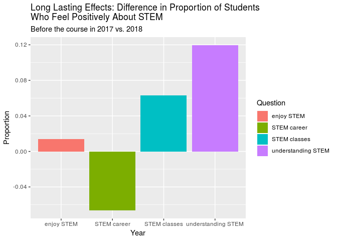

### Load packages

``` r
library(tidyverse)
library(ggplot2)
library(shiny)
library(infer)
```

### Background Information

This survey was conducted on 143 girls in an all-female boarding school
in Guatemala before and after a pair of Duke students conducted
STEM-focused courses. Grade 1 would be equivalent to 7th grade in the
American school system. We taught girls in grades 1, 2, and 3 the same
curriculum, and girls in grades 5 magisterio (mag) and 5 bachillerato
(bach) another curriculum. In 2017, the girls in 5 magisterio and 5
bachillerato took the curriculum that grades 1, 2, and 3 took in 2018.
The girls in 5 magisterio are on a program specifically to become school
teachers. The girls in 5 bachillerato usually pursue careers other than
teaching.

### Purpose

The purpose of the course is to give girls the chance to explore
STEM-related courses and help them realize that they are capable of
pursuing STEM-related careers, if they want to.

Thus, the purpose of the survey is to evaluate the girls’ attitudes
towards STEM and STEM-related careers before and after the course.

### A note for Professor Tackett

I feel like a have a lot of interesting data and visualizations, but I
am unsure about what direction to take the statistical research in order
to come to important conclusions about the curriculum.

I am thinking that some of the important takeaways could be observations
about how the program’s effect differs: - Between older and younger
girls (middle vs. high school) - Between different grade levels (more
specific than just saying younger vs. older) - Between girls who are on
the teaching-specific program (5 magisterio) vs. those who might have
time to decide on their career path (5 bach and grades 1-3) - Between
girls who took the course last year and those who did not

However, I am stuck on how to decide which of these paths to pursue.

Furthermore, the lab through which I am doing this investigation failed
to send me the Post-Implementation survey for 2017, so I only have the
Pre-Implementation survey for 2017. The survey in 2017 was much shorter.
However, we might be able to draw some comparisons between 2017 and
2018, once I get all the 2017 data.

Finally, how do I factor in things that were not directly addressed in
the survey? For example, at Flunch we talked about how the girls might
have felt inclined to answer the post-implementation survey more
positively because they liked their teachers, not necessarily because
they liked the subject.

### Load data

``` r
pre_empower <- read.csv("data/PRE_Empowerment.csv",
                    sep = ";")
post_empower <- read.csv("data/POST_Empowerment.csv",
                    sep = ";")
pre_empower2017 <- read.csv("data/2017_Empower.csv",
                    sep = ";")
```

SECTION 1: ORGANIZING DATA
==========================

### Classifying and joining pre and post responses

``` r
pre_empower <- pre_empower %>%
  mutate(pre_or_post = "pre") %>%
  mutate(year = "2018")
post_empower <- post_empower %>%
  mutate(pre_or_post = "post") %>%
  mutate(year = "2018")
pre_empower2017 <- pre_empower2017 %>%
  mutate(pre_or_post = "pre") %>%
  mutate(year = "2017")
```

``` r
empower <- full_join(pre_empower, post_empower)
```

    ## Joining, by = c("grade", "city_birth", "parents_stem", "which_parent_stem", "parent_profession", "number_science_classes", "number_math_classes", "number_tech_classes", "number_egr_classes", "math_worst", "math_career", "not_enjoy_math", "good_at_math", "decentschool_badmath", "higherlevel_math", "good_math_grades", "interesting_math", "future_math", "math_courses", "sure_science", "science_career", "science_outsideofschool", "science_pay", "science_job", "good_science", "decentschool_badscience", "higherlevel_science", "science_courses", "new_products", "engineering_everyday", "enjoy_building", "interested_machines", "career_design", "curiosity_tech", "future_innovation", "mathscience_useful", "success_engineering", "i_can_build", "opportunity_engineering", "prediction_literature", "prediction_math", "prediction_science", "future_math_classes", "future_science_classes", "future_egr_classes", "college", "what_major", "why_not_college", "plan_after_school", "other_plan_afterschool", "frequency_learning_stem", "why_no_chances", "opportunities_women_stem", "reason_opportunities_stem", "contribute_community", "resolve_problems_community", "external_help", "leader_community", "contribute_community.1", "pre_or_post", "year")

    ## Warning: Column `parent_profession` joining factors with different levels,
    ## coercing to character vector

    ## Warning: Column `math_courses` joining factors with different levels,
    ## coercing to character vector

    ## Warning: Column `science_job` joining factors with different levels,
    ## coercing to character vector

    ## Warning: Column `good_science` joining factors with different levels,
    ## coercing to character vector

    ## Warning: Column `new_products` joining factors with different levels,
    ## coercing to character vector

    ## Warning: Column `engineering_everyday` joining factors with different
    ## levels, coercing to character vector

    ## Warning: Column `enjoy_building` joining factors with different levels,
    ## coercing to character vector

    ## Warning: Column `curiosity_tech` joining factors with different levels,
    ## coercing to character vector

    ## Warning: Column `future_innovation` joining factors with different levels,
    ## coercing to character vector

    ## Warning: Column `mathscience_useful` joining factors with different levels,
    ## coercing to character vector

    ## Warning: Column `prediction_math` joining factors with different levels,
    ## coercing to character vector

    ## Warning: Column `college` joining factors with different levels, coercing
    ## to character vector

    ## Warning: Column `what_major` joining factors with different levels,
    ## coercing to character vector

    ## Warning: Column `why_not_college` joining factors with different levels,
    ## coercing to character vector

    ## Warning: Column `plan_after_school` joining factors with different levels,
    ## coercing to character vector

    ## Warning: Column `other_plan_afterschool` joining factors with different
    ## levels, coercing to character vector

    ## Warning: Column `why_no_chances` joining factors with different levels,
    ## coercing to character vector

    ## Warning: Column `opportunities_women_stem` joining factors with different
    ## levels, coercing to character vector

    ## Warning: Column `reason_opportunities_stem` joining factors with different
    ## levels, coercing to character vector

    ## Warning: Column `resolve_problems_community` joining factors with different
    ## levels, coercing to character vector

    ## Warning: Column `leader_community` joining factors with different levels,
    ## coercing to character vector

### Rank

``` r
empower$ID <- seq.int(nrow(empower))
```

### Changing responses from letters to words and characterizing them as “Positive” or “Negative”

To reduce the variability of the data, I joined the answers “Absolutely”
with “Yes” to define someone who feels positively about a certain
question. I joined “No” with “Absolutely Not” to define someone who
feels negatively about a certain question.

``` r
change_names <- function(naming){
naming %>%
  str_replace("A", "no") %>%
  str_replace("B", "no") %>%
  str_replace("C", "neutral") %>%
  str_replace("D", "yes") %>%
  str_replace("E", "yes")
}

change_names2 <- function(naming){
naming %>%
  str_replace("A", "very good") %>%
  str_replace("B", "okay") %>%
  str_replace("C", "bad")
}

change_names3 <- function(naming){
naming %>%
  str_replace("A", "yes") %>%
  str_replace("B", "no") %>%
  str_replace("C", "not sure")
}

empower$math_worst <- change_names(empower$math_worst)
empower$math_career <- change_names(empower$math_career)
empower$not_enjoy_math <- change_names(empower$not_enjoy_math)
empower$good_at_math <- change_names(empower$good_at_math)
empower$decentschool_badmath <- change_names(empower$decentschool_badmath)
empower$higherlevel_math <- change_names(empower$higherlevel_math)
empower$good_math_grades <- change_names(empower$good_math_grades)
empower$interesting_math <- change_names(empower$interesting_math)
empower$future_math <- change_names(empower$future_math)
empower$math_courses <- change_names(empower$math_courses)
empower$sure_science <- change_names(empower$sure_science)
empower$science_career <- change_names(empower$science_career)
empower$science_outsideofschool <- change_names(empower$science_outsideofschool)
empower$science_pay <- change_names(empower$science_pay)
empower$science_job <- change_names(empower$science_job)
empower$good_science <- change_names(empower$good_science)
empower$decentschool_badscience <- change_names(empower$decentschool_badscience)
empower$higherlevel_science <- change_names(empower$higherlevel_science)
empower$science_courses <- change_names(empower$science_courses)
empower$new_products <- change_names(empower$new_products)
empower$engineering_everyday <- change_names(empower$engineering_everyday)
empower$enjoy_building <- change_names(empower$enjoy_building)
empower$interested_machines <- change_names(empower$interested_machines)
empower$career_design <- change_names(empower$career_design)
empower$curiosity_tech <- change_names(empower$curiosity_tech)
empower$future_innovation <- change_names(empower$future_innovation)
empower$mathscience_useful <- change_names(empower$mathscience_useful)
empower$success_engineering <- change_names(empower$success_engineering)
empower$i_can_build <- change_names(empower$i_can_build)
empower$opportunity_engineering <- change_names(empower$opportunity_engineering)
empower$contribute_community <- change_names(empower$contribute_community)
empower$resolve_problems_community <- change_names(empower$resolve_problems_community)
empower$external_help <- change_names(empower$external_help)
empower$leader_community <- change_names(empower$leader_community)
empower$contribute_community.1 <- change_names(empower$contribute_community.1)

empower$prediction_literature <- change_names2(empower$prediction_literature)
empower$prediction_math <- change_names2(empower$prediction_math)
empower$prediction_science <- change_names2(empower$prediction_science)

empower$future_math_classes <- change_names3(empower$future_math_classes)
empower$future_science_classes <- change_names3(empower$future_science_classes)
empower$future_egr_classes <- change_names3(empower$future_egr_classes)
```

Selecting data
--------------

I excluded variables that showed extreme variance or are not relevant to
the study. For example, when they were asked whether their parents had
STEM-related careers (parents\_stem), many girls classified farming or
other agricultural/manual labor as STEM-related careers.

I created a new data set that looks at the grades by age group
(“Younger” vs. “Older”)

``` r
empower_new <- empower %>%
  select(-c(parents_stem, 
            which_parent_stem, 
            parent_profession, 
            number_science_classes, 
            number_math_classes, 
            number_tech_classes, 
            number_egr_classes))
empower_byage <- empower_new %>%
  mutate(age_groups = case_when(
    grade == "1" ~ "younger",
    grade == "2" ~ "younger",
    grade == "3" ~ "younger",
    grade == "5 bach" ~ "older",
    grade == "5 mag" ~ "older"
  ))
```

``` r
save(empower_new, file = "data/empower_new.RData")
save(empower_byage, file = "data/empower_byage.RData")
```

SECTION 2: PROPORTION OF GIRLS THAT RESPOND POSITIVELY TO STEM
==============================================================

PRE Attitudes towards math
--------------------------

This section finds the proportion of girls in each grade who answered
positively questions that related to math in the pre-implementation
survey.

### Grade 1

``` r
pre_empower_math1 <- empower_new %>%
  filter(grade == "1") %>%
  filter(pre_or_post == "pre")
pre_empower_math1$math <- paste(pre_empower_math1$math_career, pre_empower_math1$good_at_math, pre_empower_math1$higherlevel_math, pre_empower_math1$good_math_grades, pre_empower_math1$interesting_math, pre_empower_math1$future_math, pre_empower_math1$math_courses)

pre_math_prop1 <- sum(str_count(pre_empower_math1$math, "yes")) / (sum(str_count(pre_empower_math1$math, "no")) + sum(str_count(pre_empower_math1$math, "yes")) +sum(str_count(pre_empower_math1$math, "neutral")))
pre_math_prop1
```

    ## [1] 0.625

### Grade 2

``` r
pre_empower_math2 <- empower_new %>%
  filter(grade == "2") %>%
  filter(pre_or_post == "pre")
pre_empower_math2$math <- paste(pre_empower_math2$math_career, pre_empower_math2$good_at_math, pre_empower_math2$higherlevel_math, pre_empower_math2$good_math_grades, pre_empower_math2$interesting_math, pre_empower_math2$future_math, pre_empower_math2$math_courses)

pre_math_prop2 <- sum(str_count(pre_empower_math2$math, "yes")) / (sum(str_count(pre_empower_math2$math, "no")) + sum(str_count(pre_empower_math2$math, "yes")) + sum(str_count(pre_empower_math2$math, "neutral")))
pre_math_prop2
```

    ## [1] 0.6623377

### Grade 3

``` r
pre_empower_math3 <- empower_new %>%
  filter(grade == "3") %>%
  filter(pre_or_post == "pre")
pre_empower_math3$math <- paste(pre_empower_math3$math_career, pre_empower_math3$good_at_math, pre_empower_math3$higherlevel_math, pre_empower_math3$good_math_grades, pre_empower_math3$interesting_math, pre_empower_math3$future_math, pre_empower_math3$math_courses)

pre_math_prop3 <- sum(str_count(pre_empower_math3$math, "yes")) / (sum(str_count(pre_empower_math3$math, "no")) + sum(str_count(pre_empower_math3$math, "yes")) + sum(str_count(pre_empower_math3$math, "neutral")))
pre_math_prop3
```

    ## [1] 0.6917293

### Grade 5 magisterio

``` r
pre_empower_math5m <- empower_new %>%
  filter(grade == "5 mag") %>%
  filter(pre_or_post == "pre")
pre_empower_math5m$math <- paste(pre_empower_math5m$math_career, pre_empower_math5m$good_at_math, pre_empower_math5m$higherlevel_math, pre_empower_math5m$good_math_grades, pre_empower_math5m$interesting_math, pre_empower_math5m$future_math, pre_empower_math5m$math_courses)

pre_math_prop5m <- sum(str_count(pre_empower_math5m$math, "yes")) / (sum(str_count(pre_empower_math5m$math, "no")) + sum(str_count(pre_empower_math5m$math, "yes")) + sum(str_count(pre_empower_math5m$math, "neutral")))
pre_math_prop5m
```

    ## [1] 0.3898305

### Grade 5 bachillerato

``` r
pre_empower_math5b <- empower_new %>%
  filter(grade == "5 bach") %>%
  filter(pre_or_post == "pre")
pre_empower_math5b$math <- paste(pre_empower_math5b$math_career, pre_empower_math5b$good_at_math, pre_empower_math5b$higherlevel_math, pre_empower_math5b$good_math_grades, pre_empower_math5b$interesting_math, pre_empower_math5b$future_math, pre_empower_math5b$math_courses)

pre_math_prop5b <- sum(str_count(pre_empower_math5b$math, "yes")) / (sum(str_count(pre_empower_math5b$math, "no")) + sum(str_count(pre_empower_math5b$math, "yes")) + sum(str_count(pre_empower_math5b$math, "neutral")))
pre_math_prop5b
```

    ## [1] 0.656

PRE Attitudes towards science
-----------------------------

The next section finds the proportion of girls in each grade who
answered positively questions that related to science in the
pre-implementation survey.

### Grade 1

``` r
pre_empower_science1 <- empower_new %>%
  filter(grade == "1") %>%
  filter(pre_or_post == "pre")
pre_empower_science1$science <- paste(pre_empower_science1$sure_science, pre_empower_science1$science_career, pre_empower_science1$science_outsideofschool, pre_empower_science1$science_pay, pre_empower_science1$science_job, pre_empower_science1$good_science, pre_empower_science1$higherlevel_science, pre_empower_science1$science_courses)

pre_science_prop1 <- sum(str_count(pre_empower_science1$science, "yes")) / (sum(str_count(pre_empower_science1$science, "no")) + sum(str_count(pre_empower_science1$science, "yes")) + sum(str_count(pre_empower_science1$science, "neutral")))
pre_science_prop1
```

    ## [1] 0.6481481

### Grade 2

``` r
pre_empower_science2 <- empower_new %>%
  filter(grade == "2") %>%
  filter(pre_or_post == "pre")
pre_empower_science2$science <- paste(pre_empower_science2$sure_science, pre_empower_science2$science_career, pre_empower_science2$science_outsideofschool, pre_empower_science2$science_pay, pre_empower_science2$science_job, pre_empower_science2$good_science, pre_empower_science2$higherlevel_science, pre_empower_science2$science_courses)

pre_science_prop2 <- sum(str_count(pre_empower_science2$science, "yes")) / (sum(str_count(pre_empower_science2$science, "no")) + sum(str_count(pre_empower_science2$science, "yes")) + sum(str_count(pre_empower_science2$science, "neutral")))
pre_science_prop2
```

    ## [1] 0.6931818

### Grade 3

``` r
pre_empower_science3 <- empower_new %>%
  filter(grade == "3") %>%
  filter(pre_or_post == "pre")
pre_empower_science3$science <- paste(pre_empower_science3$sure_science, pre_empower_science3$science_career, pre_empower_science3$science_outsideofschool, pre_empower_science3$science_pay, pre_empower_science3$science_job, pre_empower_science3$good_science, pre_empower_science3$higherlevel_science, pre_empower_science3$science_courses)

pre_science_prop3 <- sum(str_count(pre_empower_science3$science, "yes")) / (sum(str_count(pre_empower_science3$science, "no")) + sum(str_count(pre_empower_science3$science, "yes")) + sum(str_count(pre_empower_science3$science, "neutral")))
pre_science_prop3
```

    ## [1] 0.7133333

### Grade 5 magisterio

``` r
pre_empower_science5m <- empower_new %>%
  filter(grade == "5 mag") %>%
  filter(pre_or_post == "pre")
pre_empower_science5m$science <- paste(pre_empower_science5m$sure_science, pre_empower_science5m$science_career, pre_empower_science5m$science_outsideofschool, pre_empower_science5m$science_pay, pre_empower_science5m$science_job, pre_empower_science5m$good_science, pre_empower_science5m$higherlevel_science, pre_empower_science5m$science_courses)

pre_science_prop5m <- sum(str_count(pre_empower_science5m$science, "yes")) / (sum(str_count(pre_empower_science5m$science, "no")) + sum(str_count(pre_empower_science5m$science, "yes")) +sum(str_count(pre_empower_science5m$science, "neutral")))
pre_science_prop5m
```

    ## [1] 0.5813953

### Grade 5 bachillerato

``` r
pre_empower_science5b <- empower_new %>%
  filter(grade == "5 bach") %>%
  filter(pre_or_post == "pre")
pre_empower_science5b$science <- paste(pre_empower_science5b$sure_science, pre_empower_science5b$science_career, pre_empower_science5b$science_outsideofschool, pre_empower_science5b$science_pay, pre_empower_science5b$science_job, pre_empower_science5b$good_science, pre_empower_science5b$higherlevel_science, pre_empower_science5b$science_courses)

pre_science_prop5b <- sum(str_count(pre_empower_science5b$science, "yes")) / (sum(str_count(pre_empower_science5b$science, "no")) + sum(str_count(pre_empower_science5b$science, "yes")) + sum(str_count(pre_empower_science5b$science, "neutral")))
pre_science_prop5b
```

    ## [1] 0.7569444

PRE Attitudes towards engineering
---------------------------------

The next section finds the proportion of girls in each grade who
answered positively questions that related to engineering in the
pre-implementation survey.

### Grade 1

``` r
pre_empower_egr1 <- empower_new %>%
  filter(grade == "1") %>%
  filter(pre_or_post == "pre")
pre_empower_egr1$egr <- paste(pre_empower_egr1$new_products, pre_empower_egr1$engineering_everyday, pre_empower_egr1$enjoy_building, pre_empower_egr1$interested_machines, pre_empower_egr1$career_design, pre_empower_egr1$curiosity_tech, pre_empower_egr1$future_innovation, pre_empower_egr1$mathscience_useful, pre_empower_egr1$success_engineering, pre_empower_egr1$i_can_build, pre_empower_egr1$opportunity_engineering)

pre_egr_prop1 <- sum(str_count(pre_empower_egr1$egr, "yes")) / (sum(str_count(pre_empower_egr1$egr, "no")) + sum(str_count(pre_empower_egr1$egr, "yes")) + sum(str_count(pre_empower_egr1$egr, "neutral")))
pre_egr_prop1
```

    ## [1] 0.6754967

### Grade 2

``` r
pre_empower_egr2 <- empower_new %>%
  filter(grade == "2") %>%
  filter(pre_or_post == "pre")
pre_empower_egr2$egr <- paste(pre_empower_egr2$new_products, pre_empower_egr2$engineering_everyday, pre_empower_egr2$enjoy_building, pre_empower_egr2$interested_machines, pre_empower_egr2$career_design, pre_empower_egr2$curiosity_tech, pre_empower_egr2$future_innovation, pre_empower_egr2$mathscience_useful, pre_empower_egr2$success_engineering, pre_empower_egr2$i_can_build, pre_empower_egr2$opportunity_engineering)

pre_egr_prop2 <- sum(str_count(pre_empower_egr2$egr, "yes")) / (sum(str_count(pre_empower_egr2$egr, "no")) + sum(str_count(pre_empower_egr2$egr, "yes")) + sum(str_count(pre_empower_egr2$egr, "neutral")))
pre_egr_prop2
```

    ## [1] 0.8080808

### Grade 3

``` r
pre_empower_egr3 <- empower_new %>%
  filter(grade == "3") %>%
  filter(pre_or_post == "pre")
pre_empower_egr3$egr <- paste(pre_empower_egr3$new_products, pre_empower_egr3$engineering_everyday, pre_empower_egr3$enjoy_building, pre_empower_egr3$interested_machines, pre_empower_egr3$career_design, pre_empower_egr3$curiosity_tech, pre_empower_egr3$future_innovation, pre_empower_egr3$mathscience_useful, pre_empower_egr3$success_engineering, pre_empower_egr3$i_can_build, pre_empower_egr3$opportunity_engineering)

pre_egr_prop3 <- sum(str_count(pre_empower_egr3$egr, "yes")) / (sum(str_count(pre_empower_egr3$egr, "no")) + sum(str_count(pre_empower_egr3$egr, "yes")) + sum(str_count(pre_empower_egr3$egr, "neutral")))
pre_egr_prop3
```

    ## [1] 0.8203883

### Grade 5 magisterio

``` r
pre_empower_egr5m <- empower_new %>%
  filter(grade == "5 mag") %>%
  filter(pre_or_post == "pre")
pre_empower_egr5m$egr <- paste(pre_empower_egr5m$new_products, pre_empower_egr5m$engineering_everyday, pre_empower_egr5m$enjoy_building, pre_empower_egr5m$interested_machines, pre_empower_egr5m$career_design, pre_empower_egr5m$curiosity_tech, pre_empower_egr5m$future_innovation, pre_empower_egr5m$mathscience_useful, pre_empower_egr5m$success_engineering, pre_empower_egr5m$i_can_build, pre_empower_egr5m$opportunity_engineering)

pre_egr_prop5m <- sum(str_count(pre_empower_egr5m$egr, "yes")) / (sum(str_count(pre_empower_egr5m$egr, "no")) + sum(str_count(pre_empower_egr5m$egr, "yes")) +
                                                              sum(str_count(pre_empower_egr5m$egr, "yes")))
pre_egr_prop5m
```

    ## [1] 0.4686192

### Grade 5 bachillerato

``` r
pre_empower_egr5b <- empower_new %>%
  filter(grade == "5 bach") %>%
  filter(pre_or_post == "pre")
pre_empower_egr5b$egr <- paste(pre_empower_egr5b$new_products, pre_empower_egr5b$engineering_everyday, pre_empower_egr5b$enjoy_building, pre_empower_egr5b$interested_machines, pre_empower_egr5b$career_design, pre_empower_egr5b$curiosity_tech, pre_empower_egr5b$future_innovation, pre_empower_egr5b$mathscience_useful, pre_empower_egr5b$success_engineering, pre_empower_egr5b$i_can_build, pre_empower_egr5b$opportunity_engineering)

pre_egr_prop5b <- sum(str_count(pre_empower_egr5b$egr, "yes")) / (sum(str_count(pre_empower_egr5b$egr, "no")) + sum(str_count(pre_empower_egr5b$egr, "yes")) +
                                                                    sum(str_count(pre_empower_egr5b$egr, "yes")))
pre_egr_prop5b
```

    ## [1] 0.4506579

``` r
avg_math_pre <- (pre_math_prop1 + pre_math_prop2 + pre_math_prop3 + pre_math_prop5m + pre_math_prop5b)/5
avg_science_pre <- (pre_science_prop1 + pre_science_prop2 + pre_science_prop3 + pre_science_prop5m + pre_science_prop5b)/5
avg_egr_pre <- (pre_egr_prop1 + pre_egr_prop2 + pre_egr_prop3 + pre_egr_prop5m + pre_egr_prop5b)/5
```

POST Attitudes towards math
---------------------------

The next section finds the proportion of girls in each grade who
answered positively questions that related to math in the
post-implementation survey.

### Grade 1

``` r
empower_math1 <- empower_new %>%
  filter(grade == "1") %>%
  filter(pre_or_post == "post")
empower_math1$math <- paste(empower_math1$math_career, empower_math1$good_at_math, empower_math1$higherlevel_math, empower_math1$good_math_grades, empower_math1$interesting_math, empower_math1$future_math, empower_math1$math_courses)

math_prop1 <- sum(str_count(empower_math1$math, "yes")) / (sum(str_count(empower_math1$math, "no")) + sum(str_count(empower_math1$math, "yes")) + sum(str_count(empower_math1$math, "neutral")))
math_prop1
```

    ## [1] 0.6451613

### Grade 2

``` r
empower_math2 <- empower_new %>%
  filter(grade == "2") %>%
  filter(pre_or_post == "post")
empower_math2$math <- paste(empower_math2$math_career, empower_math2$good_at_math, empower_math2$higherlevel_math, empower_math2$good_math_grades, empower_math2$interesting_math, empower_math2$future_math, empower_math2$math_courses)

math_prop2 <- sum(str_count(empower_math2$math, "yes")) / (sum(str_count(empower_math2$math, "no")) + sum(str_count(empower_math2$math, "yes")) + sum(str_count(empower_math2$math, "neutral")))
math_prop2
```

    ## [1] 0.6231884

### Grade 3

``` r
empower_math3 <- empower_new %>%
  filter(grade == "3") %>%
  filter(pre_or_post == "post")
empower_math3$math <- paste(empower_math3$math_career, empower_math3$good_at_math, empower_math3$higherlevel_math, empower_math3$good_math_grades, empower_math3$interesting_math, empower_math3$future_math, empower_math3$math_courses)

math_prop3 <- sum(str_count(empower_math3$math, "yes")) / (sum(str_count(empower_math3$math, "no")) + sum(str_count(empower_math3$math, "yes")) + sum(str_count(empower_math3$math, "neutral")))
math_prop3
```

    ## [1] 0.7207207

### Grade 5 magisterio

``` r
empower_math5m <- empower_new %>%
  filter(grade == "5 mag") %>%
  filter(pre_or_post == "post")
empower_math5m$math <- paste(empower_math5m$math_career, empower_math5m$good_at_math, empower_math5m$higherlevel_math, empower_math5m$good_math_grades, empower_math5m$interesting_math, empower_math5m$future_math, empower_math5m$math_courses)

math_prop5m <- sum(str_count(empower_math5m$math, "yes")) / (sum(str_count(empower_math5m$math, "no")) + sum(str_count(empower_math5m$math, "yes")) + sum(str_count(empower_math5m$math, "neutral")))
math_prop5m
```

    ## [1] 0.5064935

### Grade 5 bachillerato

``` r
empower_math5b <- empower_new %>%
  filter(grade == "5 bach") %>%
  filter(pre_or_post == "post")
empower_math5b$math <- paste(empower_math5b$math_career, empower_math5b$good_at_math, empower_math5b$higherlevel_math, empower_math5b$good_math_grades, empower_math5b$interesting_math, empower_math5b$future_math, empower_math5b$math_courses)

math_prop5b <- sum(str_count(empower_math5b$math, "yes")) / (sum(str_count(empower_math5b$math, "no")) + sum(str_count(empower_math5b$math, "yes")) + sum(str_count(empower_math5b$math, "neutral")))
math_prop5b
```

    ## [1] 0.728

POST Attitudes towards science
------------------------------

The next section finds the proportion of girls in each grade who
answered positively questions that related to science in the
post-implementation survey.

### Grade 1

``` r
empower_science1 <- empower_new %>%
  filter(grade == "1") %>%
  filter(pre_or_post == "post")
empower_science1$science <- paste(empower_science1$sure_science, empower_science1$science_career, empower_science1$science_outsideofschool, empower_science1$science_pay, empower_science1$science_job, empower_science1$good_science, empower_science1$higherlevel_science, empower_science1$science_courses)

science_prop1 <- sum(str_count(empower_science1$science, "yes")) / (sum(str_count(empower_science1$science, "no")) + sum(str_count(empower_science1$science, "yes")) + sum(str_count(empower_science1$science, "neutral")))
science_prop1
```

    ## [1] 0.5774648

### Grade 2

``` r
empower_science2 <- empower_new %>%
  filter(grade == "2") %>%
  filter(pre_or_post == "post")
empower_science2$science <- paste(empower_science2$sure_science, empower_science2$science_career, empower_science2$science_outsideofschool, empower_science2$science_pay, empower_science2$science_job, empower_science2$good_science, empower_science2$higherlevel_science, empower_science2$science_courses)

science_prop2 <- sum(str_count(empower_science2$science, "yes")) / (sum(str_count(empower_science2$science, "no")) + sum(str_count(empower_science2$science, "yes")) + sum(str_count(empower_science2$science, "neutral")))
science_prop2
```

    ## [1] 0.775

### Grade 3

``` r
empower_science3 <- empower_new %>%
  filter(grade == "3") %>%
  filter(pre_or_post == "post")
empower_science3$science <- paste(empower_science3$sure_science, empower_science3$science_career, empower_science3$science_outsideofschool, empower_science3$science_pay, empower_science3$science_job, empower_science3$good_science, empower_science3$higherlevel_science, empower_science3$science_courses)

science_prop3 <- sum(str_count(empower_science3$science, "yes")) / (sum(str_count(empower_science3$science, "no")) + sum(str_count(empower_science3$science, "yes")) + sum(str_count(empower_science3$science, "neutral")))
science_prop3
```

    ## [1] 0.7716535

### Grade 5 magisterio

``` r
empower_science5m <- empower_new %>%
  filter(grade == "5 mag") %>%
  filter(pre_or_post == "post")
empower_science5m$science <- paste(empower_science5m$sure_science, empower_science5m$science_career, empower_science5m$science_outsideofschool, empower_science5m$science_pay, empower_science5m$science_job, empower_science5m$good_science, empower_science5m$higherlevel_science, empower_science5m$science_courses)

science_prop5m <- sum(str_count(empower_science5m$science, "yes")) / (sum(str_count(empower_science5m$science, "no")) + sum(str_count(empower_science5m$science, "yes")) + sum(str_count(empower_science5m$science, "neutral")))
science_prop5m
```

    ## [1] 0.7045455

### Grade 5 bachillerato

``` r
empower_science5b <- empower_new %>%
  filter(grade == "5 bach") %>%
  filter(pre_or_post == "post")
empower_science5b$science <- paste(empower_science5b$sure_science, empower_science5b$science_career, empower_science5b$science_outsideofschool, empower_science5b$science_pay, empower_science5b$science_job, empower_science5b$good_science, empower_science5b$higherlevel_science, empower_science5b$science_courses)

science_prop5b <- sum(str_count(empower_science5b$science, "yes")) / (sum(str_count(empower_science5b$science, "no")) + sum(str_count(empower_science5b$science, "yes")) + sum(str_count(empower_science5b$science, "neutral")))
science_prop5b
```

    ## [1] 0.7972028

POST Attitudes towards engineering
----------------------------------

The next section finds the proportion of girls in each grade who
answered positively questions that related to engineering in the
post-implementation survey.

### Grade 1

``` r
empower_egr1 <- empower_new %>%
  filter(grade == "1") %>%
  filter(pre_or_post == "post")
empower_egr1$egr <- paste(empower_egr1$new_products, empower_egr1$engineering_everyday, empower_egr1$enjoy_building, empower_egr1$interested_machines, empower_egr1$career_design, empower_egr1$curiosity_tech, empower_egr1$future_innovation, empower_egr1$mathscience_useful, empower_egr1$success_engineering, empower_egr1$i_can_build, empower_egr1$opportunity_engineering)

egr_prop1 <- sum(str_count(empower_egr1$egr, "yes")) / (sum(str_count(empower_egr1$egr, "no")) + sum(str_count(empower_egr1$egr, "yes")) + sum(str_count(empower_egr1$egr, "neutral")))
egr_prop1
```

    ## [1] 0.8556701

### Grade 2

``` r
empower_egr2 <- empower_new %>%
  filter(grade == "2") %>%
  filter(pre_or_post == "post")
empower_egr2$egr <- paste(empower_egr2$new_products, empower_egr2$engineering_everyday, empower_egr2$enjoy_building, empower_egr2$interested_machines, empower_egr2$career_design, empower_egr2$curiosity_tech, empower_egr2$future_innovation, empower_egr2$mathscience_useful, empower_egr2$success_engineering, empower_egr2$i_can_build, empower_egr2$opportunity_engineering)

egr_prop2 <- sum(str_count(empower_egr2$egr, "yes")) / (sum(str_count(empower_egr2$egr, "no")) + sum(str_count(empower_egr2$egr, "yes")) + sum(str_count(empower_egr2$egr, "neutral")))
egr_prop2
```

    ## [1] 0.8181818

### Grade 3

``` r
empower_egr3 <- empower_new %>%
  filter(grade == "3") %>%
  filter(pre_or_post == "post")
empower_egr3$egr <- paste(empower_egr3$new_products, empower_egr3$engineering_everyday, empower_egr3$enjoy_building, empower_egr3$interested_machines, empower_egr3$career_design, empower_egr3$curiosity_tech, empower_egr3$future_innovation, empower_egr3$mathscience_useful, empower_egr3$success_engineering, empower_egr3$i_can_build, empower_egr3$opportunity_engineering)

egr_prop3 <- sum(str_count(empower_egr3$egr, "yes")) / (sum(str_count(empower_egr3$egr, "no")) + sum(str_count(empower_egr3$egr, "yes")) + sum(str_count(empower_egr3$egr, "neutral")))
egr_prop3
```

    ## [1] 0.8571429

### Grade 5 magisterio

``` r
empower_egr5m <- empower_new %>%
  filter(grade == "5 mag") %>%
  filter(pre_or_post == "post")
empower_egr5m$egr <- paste(empower_egr5m$new_products, empower_egr5m$engineering_everyday, empower_egr5m$enjoy_building, empower_egr5m$interested_machines, empower_egr5m$career_design, empower_egr5m$curiosity_tech, empower_egr5m$future_innovation, empower_egr5m$mathscience_useful, empower_egr5m$success_engineering, empower_egr5m$i_can_build, empower_egr5m$opportunity_engineering)

egr_prop5m <- sum(str_count(empower_egr5m$egr, "yes")) / (sum(str_count(empower_egr5m$egr, "no")) + sum(str_count(empower_egr5m$egr, "yes")) + sum(str_count(empower_egr5m$egr, "neutral")))
egr_prop5m
```

    ## [1] 0.775

### Grade 5 bachillerato

``` r
empower_egr5b <- empower_new %>%
  filter(grade == "5 bach") %>%
  filter(pre_or_post == "post")
empower_egr5b$egr <- paste(empower_egr5b$new_products, empower_egr5b$engineering_everyday, empower_egr5b$enjoy_building, empower_egr5b$interested_machines, empower_egr5b$career_design, empower_egr5b$curiosity_tech, empower_egr5b$future_innovation, empower_egr5b$mathscience_useful, empower_egr5b$success_engineering, empower_egr5b$i_can_build, empower_egr5b$opportunity_engineering)

egr_prop5b <- sum(str_count(empower_egr5b$egr, "yes")) / (sum(str_count(empower_egr5b$egr, "no")) + sum(str_count(empower_egr5b$egr, "yes")) + sum(str_count(empower_egr5b$egr, "neutral")))
egr_prop5b
```

    ## [1] 0.7979798

``` r
avg_math <- (math_prop1 + math_prop2 + math_prop3 + math_prop5m + math_prop5b)/5
avg_science <- (science_prop1 + science_prop2 + science_prop3 + science_prop5m + science_prop5b)/5
avg_egr <- (egr_prop1 + egr_prop2 + egr_prop3 + egr_prop5m + egr_prop5b)/5
```

Attitudes towards STEM table
----------------------------

I put together a table with all the proportions of girls who responded
positively to math, science and engineering questions, per grade.

``` r
stem_attitudes <- data.frame("grade" = c("1", "2", "3", "5 mag", "5bach", "Average"), "math" = c(math_prop1, math_prop2, math_prop3, math_prop5m, math_prop5b, avg_math), "science" = c(science_prop1, science_prop2, science_prop3, science_prop5m, science_prop5b, avg_science), "egr" = c(egr_prop1, egr_prop2, egr_prop3, egr_prop5m, egr_prop5b, avg_egr))
```

``` r
stem <- data.frame("grade" = c("1", "2", "3", "5 mag", "5bach", "Average"), "prop" = c(pre_math_prop1, pre_math_prop2, pre_math_prop3, pre_math_prop5m, pre_math_prop5b, avg_math_pre, pre_science_prop1, pre_science_prop2, pre_science_prop3, pre_science_prop5m, pre_science_prop5b, avg_science_pre, pre_egr_prop1, pre_egr_prop2, pre_egr_prop3, pre_egr_prop5m, pre_egr_prop5b, avg_egr_pre, math_prop1, math_prop2, math_prop3, math_prop5m, math_prop5b, avg_math, science_prop1, science_prop2, science_prop3, science_prop5m, science_prop5b, avg_science, egr_prop1, egr_prop2, egr_prop3, egr_prop5b, egr_prop5m, avg_egr), "course" = c("math", "math", "math", "math", "math", "math", "science", "science", "science", "science", "science", "science", "egr", "egr", "egr", "egr", "egr", "egr", "math", "math", "math", "math", "math", "math", "science", "science", "science", "science", "science", "science", "egr", "egr", "egr", "egr", "egr", "egr"), "pre_post" = c("pre", "pre", "pre", "pre", "pre", "pre", "pre", "pre", "pre", "pre", "pre", "pre", "pre", "pre", "pre", "pre", "pre", "pre", "post", "post", "post", "post", "post", "post", "post", "post", "post", "post", "post", "post", "post", "post", "post", "post", "post", "post"))
stem
```

    ##      grade      prop  course pre_post
    ## 1        1 0.6250000    math      pre
    ## 2        2 0.6623377    math      pre
    ## 3        3 0.6917293    math      pre
    ## 4    5 mag 0.3898305    math      pre
    ## 5    5bach 0.6560000    math      pre
    ## 6  Average 0.6049795    math      pre
    ## 7        1 0.6481481 science      pre
    ## 8        2 0.6931818 science      pre
    ## 9        3 0.7133333 science      pre
    ## 10   5 mag 0.5813953 science      pre
    ## 11   5bach 0.7569444 science      pre
    ## 12 Average 0.6786006 science      pre
    ## 13       1 0.6754967     egr      pre
    ## 14       2 0.8080808     egr      pre
    ## 15       3 0.8203883     egr      pre
    ## 16   5 mag 0.4686192     egr      pre
    ## 17   5bach 0.4506579     egr      pre
    ## 18 Average 0.6446486     egr      pre
    ## 19       1 0.6451613    math     post
    ## 20       2 0.6231884    math     post
    ## 21       3 0.7207207    math     post
    ## 22   5 mag 0.5064935    math     post
    ## 23   5bach 0.7280000    math     post
    ## 24 Average 0.6447128    math     post
    ## 25       1 0.5774648 science     post
    ## 26       2 0.7750000 science     post
    ## 27       3 0.7716535 science     post
    ## 28   5 mag 0.7045455 science     post
    ## 29   5bach 0.7972028 science     post
    ## 30 Average 0.7251733 science     post
    ## 31       1 0.8556701     egr     post
    ## 32       2 0.8181818     egr     post
    ## 33       3 0.8571429     egr     post
    ## 34   5 mag 0.7979798     egr     post
    ## 35   5bach 0.7750000     egr     post
    ## 36 Average 0.8207949     egr     post

I visualized the chart in the following bar graph.

``` r
stem$course <- factor(stem$course, levels = c("math", "science", "egr"))
stem$pre_post <- factor(stem$pre_post, levels = c("pre", "post"))

  ggplot(data = stem, aes(x=pre_post, y=prop, fill=course)) +
    geom_bar(stat="identity", position=position_dodge()) +
    facet_grid(~ grade) +
    labs(title = "Proportion of Students Who Feel Positively About STEM", 
         x = "Grade",
         y = "Proportion",
         fill = "Course")
```


Then, I found the difference in proportions of girls who feel positively
about STEM.

``` r
stem_diffprop <- data.frame("grade" = c("1", "2", "3", "5 mag", "5bach", "Average"),  "diff_prop" = c(math_prop1-pre_math_prop1, math_prop2-pre_math_prop2, math_prop3-pre_math_prop3, math_prop5m-pre_math_prop5m, math_prop5b-pre_math_prop5b, avg_math-avg_math_pre,science_prop1-pre_science_prop1, science_prop2-pre_science_prop2, science_prop3-pre_science_prop3, science_prop5m-pre_science_prop5m, science_prop5b-pre_science_prop5b, avg_science-avg_science_pre, egr_prop1-pre_egr_prop1, egr_prop2-pre_egr_prop2, egr_prop3-pre_egr_prop3, egr_prop5b-pre_egr_prop5b, egr_prop5m-pre_egr_prop5m, avg_egr-avg_egr_pre), "course" = c("math", "math", "math", "math", "math", "math", "science", "science", "science", "science", "science", "science", "egr", "egr", "egr", "egr", "egr", "egr", "math", "math", "math", "math", "math", "math", "science", "science", "science", "science", "science", "science", "egr", "egr", "egr", "egr", "egr", "egr"))
stem_diffprop
```

    ##      grade   diff_prop  course
    ## 1        1  0.02016129    math
    ## 2        2 -0.03914926    math
    ## 3        3  0.02899140    math
    ## 4    5 mag  0.11666300    math
    ## 5    5bach  0.07200000    math
    ## 6  Average  0.03973329    math
    ## 7        1 -0.07068336 science
    ## 8        2  0.08181818 science
    ## 9        3  0.05832021 science
    ## 10   5 mag  0.12315011 science
    ## 11   5bach  0.04025835 science
    ## 12 Average  0.04657270 science
    ## 13       1  0.18017341     egr
    ## 14       2  0.01010101     egr
    ## 15       3  0.03675451     egr
    ## 16   5 mag  0.34732190     egr
    ## 17   5bach  0.30638075     egr
    ## 18 Average  0.17614632     egr
    ## 19       1  0.02016129    math
    ## 20       2 -0.03914926    math
    ## 21       3  0.02899140    math
    ## 22   5 mag  0.11666300    math
    ## 23   5bach  0.07200000    math
    ## 24 Average  0.03973329    math
    ## 25       1 -0.07068336 science
    ## 26       2  0.08181818 science
    ## 27       3  0.05832021 science
    ## 28   5 mag  0.12315011 science
    ## 29   5bach  0.04025835 science
    ## 30 Average  0.04657270 science
    ## 31       1  0.18017341     egr
    ## 32       2  0.01010101     egr
    ## 33       3  0.03675451     egr
    ## 34   5 mag  0.34732190     egr
    ## 35   5bach  0.30638075     egr
    ## 36 Average  0.17614632     egr

I visualized this difference in the following graph. I feel like this
should be at the crux of the investigation.

``` r
stem_diffprop$course <- factor(stem$course, levels = c("math", "science", "egr"))

  ggplot(data = stem_diffprop, aes(x=course, y=diff_prop, fill = grade)) +
    geom_bar(stat="identity", position=position_dodge()) +
    facet_grid(~ grade) +
    labs(title = "Difference in Proportion of Students Who Feel Positively About STEM", 
         subtitle = "Before and after the course",
         x = "Grade",
         y = "Proportion",
         fill = "Course")
```


Simulation-Based Inference
--------------------------

### Distribution of Proportions of Girls Who Feel Positively About STEM

``` r
stem_new <- stem %>%
  filter(grade != "Average")
ggplot(data = stem_new) +
  geom_histogram(aes(x = prop), binwidth = 0.1) +
  labs(title = "Distribution of Proportions of Girls Who Feel Positively About STEM", x = "Proportions of Girls Who Feel Positively About STEM", y = "Frequency")
```


### Confidence Interval

``` r
set.seed(2019)
boot_diffprepost <- stem_new %>%
  specify(response = prop, explanatory = pre_post) %>%
  generate(reps = 1000, type = "bootstrap") %>%
  calculate(stat = "diff in means", order = c("post", "pre"))
```

``` r
ggplot(data = boot_diffprepost, 
       mapping = aes(x = stat)) +
  geom_histogram() +
  labs(title = "Bootstrap Distribution of Difference in Proportions", subtitle = "Of Girls Who Feel Positively About STEM Before and After the Implementation of Empower", x = "Difference in Proportions", y = "Frequency") +
    geom_vline(xintercept = 0.005072689, color = "red") +
  geom_vline(xintercept = 0.1702555, color = "red")
```

    ## `stat_bin()` using `bins = 30`. Pick better value with `binwidth`.


``` r
boot_diffprepost %>%
  summarize(lower_bound = quantile(stat, 0.025),
            upper_bound = quantile(stat, 0.975))
```

    ## # A tibble: 1 x 2
    ##   lower_bound upper_bound
    ##         <dbl>       <dbl>
    ## 1     0.00507       0.170

We are 95% confident that the proportion of girls who feel positively
about STEM is 0.005072689 to 0.1702555 higher after the implementation
of Empower.

### Permutation

``` r
mean <- stem_new %>%
  group_by(pre_post) %>%
  summarize(mean = mean(prop)) %>%
  mutate(diff(mean)) %>%
  filter(pre_post == "pre") %>%
  select(-pre_post, -mean) %>%
  pull()
```

``` r
set.seed(2019)
permute <- stem_new %>%
  specify(response = prop, explanatory = pre_post) %>%
  hypothesize(null = "independence") %>%
  generate(reps = 1000, type = "permute") %>%
  calculate(stat = "diff in means", order = c("post", "pre"))
```

Null hypothesis: There is no difference in the mean proportion of girls
who feel positively about STEM before and after the implementation of
Empower

``` r
ggplot(data = permute, 
       mapping = aes(x = stat)) +
  geom_histogram() +
  labs(title = "Permute Distribution of Difference in Mean Proportions", subtitle = "Of Girls Who Feel Positively About STEM Before and After the Implementation of Empower", x = "Difference in Mean Proportions", y = "Frequency") +
  geom_vline(xintercept = -mean, color = "red") +
  geom_vline(xintercept = mean, color = "red")
```

    ## `stat_bin()` using `bins = 30`. Pick better value with `binwidth`.


``` r
permute %>%
  filter(stat <= -mean) %>%
  summarise((p_value = n()/1000) * 2)
```

    ## # A tibble: 1 x 1
    ##   `(p_value = n()/1000) * 2`
    ##                        <dbl>
    ## 1                       0.04

The p-value of 0.04 is less than the significance level alpha = 0.05.
Therefore, we reject the null hypothesis that there is no difference in
the mean proportion of girls who feel positively about STEM before and
after the implementation of Empower, in favor of the alternative
hypothesis that there is a statistically significant difference in their
attitudes towards STEM.

SECTION 3: ANALYSIS BY QUESTION
===============================

More specifically, I analyzed what I found to be the 9 most important questions in the survey.
----------------------------------------------------------------------------------------------

### The graphs are repetitive, so I created a ShinyApp to keep them more organized. I don’t think I will actually include the following graphs in the analysis, but I used it to gauge the data initially and see how the girls’ answers differed by grade and age group.

I created three visualizations for each question: 1. Visualizes all the
girls’ answers together. 2. Separates the girls’ responses by age group
(Younger or Older) 3. Separates the girls’ responses by their grade

The following are the number of girls in each of the groups outlined
above.

All the girls:

``` r
empower_new %>%
  count()
```

    ## # A tibble: 1 x 1
    ##       n
    ##   <int>
    ## 1   143

By age group:

``` r
empower_byage %>%
  count(age_groups)
```

    ## # A tibble: 2 x 2
    ##   age_groups     n
    ##   <chr>      <int>
    ## 1 older         64
    ## 2 younger       79

By grade:

``` r
empower_new %>%
  count(grade)
```

    ## # A tibble: 5 x 2
    ##   grade      n
    ##   <fct>  <int>
    ## 1 1         23
    ## 2 2         21
    ## 3 3         35
    ## 4 5 bach    36
    ## 5 5 mag     28

Pre 2017 vs. Pre 2018 Analysis
==============================

Renaming the 2017 answers
-------------------------

``` r
change_names <- function(naming){
naming %>%
  str_replace("1", "no") %>%
  str_replace("2", "no") %>%
  str_replace("3", "neutral") %>%
  str_replace("4", "yes") %>%
  str_replace("5", "yes")
}

pre_empower2017$understanding_stem <- change_names(pre_empower2017$understanding_stem)
pre_empower2017$enjoy_stem <- change_names(pre_empower2017$enjoy_stem)
pre_empower2017$interest_stem_classes <- change_names(pre_empower2017$interest_stem_classes)
pre_empower2017$interest_stem_career <- change_names(pre_empower2017$interest_stem_career)
```

### Finding proportions of positive answers for each question 2017

``` r
understanding <- pre_empower2017 %>%
  filter(!is.na(understanding_stem)) 

understanding <- sum(str_count(understanding$understanding_stem, "yes")) / (sum(str_count(understanding$understanding_stem, "no")) + sum(str_count(understanding$understanding_stem, "yes")) + sum(str_count(understanding$understanding_stem, "neutral")))
understanding
```

    ## [1] 0.4153846

``` r
enjoy <- pre_empower2017 %>%
  filter(!is.na(enjoy_stem)) 

enjoy <- sum(str_count(enjoy$enjoy_stem, "yes")) / (sum(str_count(enjoy$enjoy_stem, "no")) + sum(str_count(enjoy$enjoy_stem, "yes")) + sum(str_count(enjoy$enjoy_stem, "neutral")))
enjoy
```

    ## [1] 0.5692308

``` r
interest_classes <- pre_empower2017 %>%
  filter(!is.na(interest_stem_classes)) 

interest_classes <- sum(str_count(interest_classes$interest_stem_classes, "yes")) / (sum(str_count(interest_classes$interest_stem_classes, "no")) + sum(str_count(interest_classes$interest_stem_classes, "yes")) + sum(str_count(interest_classes$interest_stem_classes, "neutral")))
interest_classes
```

    ## [1] 0.6716418

``` r
interest_career <- pre_empower2017 %>%
  filter(!is.na(interest_stem_classes)) 

interest_career <- sum(str_count(interest_career$interest_stem_classes, "yes")) / (sum(str_count(interest_career$interest_stem_classes, "no")) + sum(str_count(interest_career$interest_stem_classes, "yes")) + sum(str_count(interest_career$interest_stem_classes, "neutral")))
interest_career
```

    ## [1] 0.6716418

Joining answers by same categories as 2017 in the 2018 data and finding proportions of positive answers
-------------------------------------------------------------------------------------------------------

``` r
pre <- empower_new %>%
  filter(pre_or_post == "pre")
pre$careers <- paste(pre$math_career, pre$science_career, pre$future_innovation)

pre_careers_prop <- sum(str_count(pre$careers, "yes")) / (sum(str_count(pre$careers, "no")) + sum(str_count(pre$careers, "yes")) + sum(str_count(pre$careers, "neutral")))
pre_careers_prop
```

    ## [1] 0.6052632

``` r
pre$understanding <- paste(pre$good_at_math, pre$good_science, pre$i_can_build)

pre_understanding_prop <- sum(str_count(pre$understanding, "yes")) / (sum(str_count(pre$understanding, "no")) + sum(str_count(pre$understanding, "yes")) + sum(str_count(pre$understanding, "neutral")))
pre_understanding_prop
```

    ## [1] 0.5347826

``` r
pre$enjoy <- paste(pre$higherlevel_math, pre$higherlevel_science, pre$enjoy_building)

pre_enjoy_prop <- sum(str_count(pre$enjoy, "yes")) / (sum(str_count(pre$enjoy, "no")) + sum(str_count(pre$enjoy, "yes")) + sum(str_count(pre$enjoy, "neutral")))
pre_enjoy_prop
```

    ## [1] 0.5833333

``` r
pre$classes <- paste(pre$math_courses, pre$science_courses, pre$opportunity_engineering)

pre_classes_prop <- sum(str_count(pre$classes, "yes")) / (sum(str_count(pre$classes, "no")) + sum(str_count(pre$classes, "yes")) + sum(str_count(pre$classes, "neutral")))
pre_classes_prop
```

    ## [1] 0.7347826

``` r
years_comparison <- data.frame("category" = c("understanding STEM", "enjoy STEM", "STEM classes", "STEM career"), "prop" = c(understanding, enjoy, interest_classes, interest_career, pre_understanding_prop, pre_enjoy_prop, pre_classes_prop, pre_careers_prop), "year" = c("2017", "2017", "2017", "2017", "2018", "2018", "2018", "2018"))
```

``` r
ggplot(data = years_comparison, aes(x=year, y=prop, fill=category)) +
    geom_bar(stat="identity", position=position_dodge()) +
    facet_grid(~ category) +
    labs(title = "Long Lasting Effects: Proportion of Students 
Who Feel Positively About STEM", 
         subtitle = "Before the course in 2017 vs. 2018",
         x = "Year",
         y = "Proportion",
         fill = "Question")
```


``` r
pre_diffprop <- data.frame("question" = c("enjoy STEM", "STEM career", "STEM classes", "understanding STEM"),  "diff_prop" = c(pre_understanding_prop-understanding, pre_enjoy_prop-enjoy, pre_classes_prop-interest_classes, pre_careers_prop-interest_career))
pre_diffprop
```

    ##             question   diff_prop
    ## 1         enjoy STEM  0.11939799
    ## 2        STEM career  0.01410256
    ## 3       STEM classes  0.06314082
    ## 4 understanding STEM -0.06637863

``` r
ggplot(data = pre_diffprop, aes(x=question, y=diff_prop, fill=question)) +
    geom_bar(stat="identity", position=position_dodge()) +
    labs(title = "Long Lasting Effects: Difference in Proportion of Students 
Who Feel Positively About STEM", 
         subtitle = "Before the course in 2017 vs. 2018", 
         x = "Year",
         y = "Proportion",
         fill = "Question")
```



How much they like their teachers
---------------------------------

``` r
pre_interestingmath <- empower %>%
  filter(pre_or_post == "pre")
pre_interestingmath <- sum(str_count(pre_interestingmath$interesting_math, "yes")) / (sum(str_count(pre_interestingmath$interesting_math, "no")) + sum(str_count(pre_interestingmath$interesting_math, "yes")) + sum(str_count(pre_interestingmath$interesting_math, "neutral")))

post_interestingmath <- empower %>%
  filter(pre_or_post == "post")
post_interestingmath <- sum(str_count(post_interestingmath$interesting_math, "yes")) / (sum(str_count(post_interestingmath$interesting_math, "no")) + sum(str_count(post_interestingmath$interesting_math, "yes")) + sum(str_count(post_interestingmath$interesting_math, "neutral")))

pre_mathcourses <- empower %>%
  filter(pre_or_post == "pre") 
pre_mathcourses <- pre_mathcourses %>%
  filter(!is.na(math_courses))
pre_mathcourses <- sum(str_count(pre_mathcourses$math_courses, "yes"))/ (sum(str_count(pre_mathcourses$math_courses, "no")) + sum(str_count(pre_mathcourses$math_courses, "yes")) + sum(str_count(pre_mathcourses$math_courses, "neutral")))

post_mathcourses <- empower %>%
  filter(pre_or_post == "post")
post_mathcourses <- sum(str_count(post_mathcourses$math_courses, "yes")) / (sum(str_count(post_mathcourses$math_courses, "no")) + sum(str_count(post_mathcourses$math_courses, "yes")) + sum(str_count(post_mathcourses$math_courses, "neutral")))

teachers <- data.frame("pre_post" = c("pre", "post", "pre", "post"),  "prop" = c(pre_interestingmath, post_interestingmath, pre_mathcourses, post_mathcourses), "interesting" = c("interesting", "interesting", "courses", "courses"))
teachers
```

    ##   pre_post      prop interesting
    ## 1      pre 0.8481013 interesting
    ## 2     post 0.8906250 interesting
    ## 3      pre 0.7692308     courses
    ## 4     post 0.8125000     courses

``` r
teachers$pre_post <- factor(teachers$pre_post, levels = c("pre", "post", "egr"))

  ggplot(data = teachers, aes(x=pre_post, y=prop, fill=interesting)) +
    geom_bar(stat="identity", position=position_dodge()) +
    facet_grid(~ interesting) +
    labs(title = "Proportion of Students Who Responded",
         subtitle = "that they find STEM interesting vs. would take more STEM courses",
         x = "Pre or Post",
         y = "Proportion",
         fill = "Course")
```


Personal Notes:
---------------

### Template for finding proportions

prop\_pre\_mathcareer &lt;- empower\_new %&gt;%
filter(!is.na(math\_career)) %&gt;% count(math\_career, pre\_or\_post)
%&gt;% group\_by(pre\_or\_post) %&gt;% mutate(perc = (n / sum(n))\*100)
%&gt;% select(math\_career, pre\_or\_post, perc) %&gt;%
filter(pre\_or\_post == “pre”) prop\_pre\_mathcareer

### Ideas

How predicted grades vary between subjects
